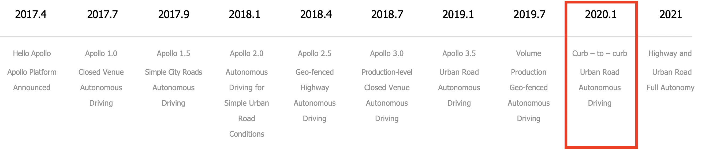
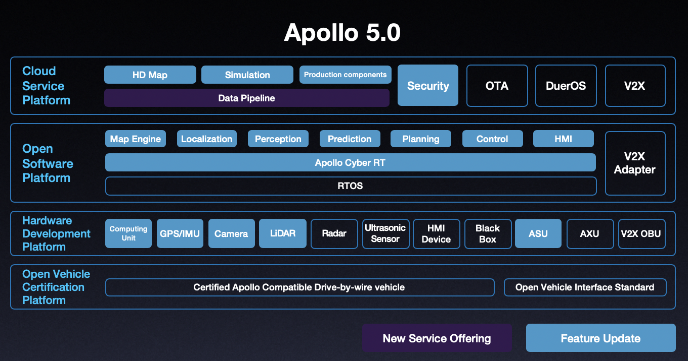
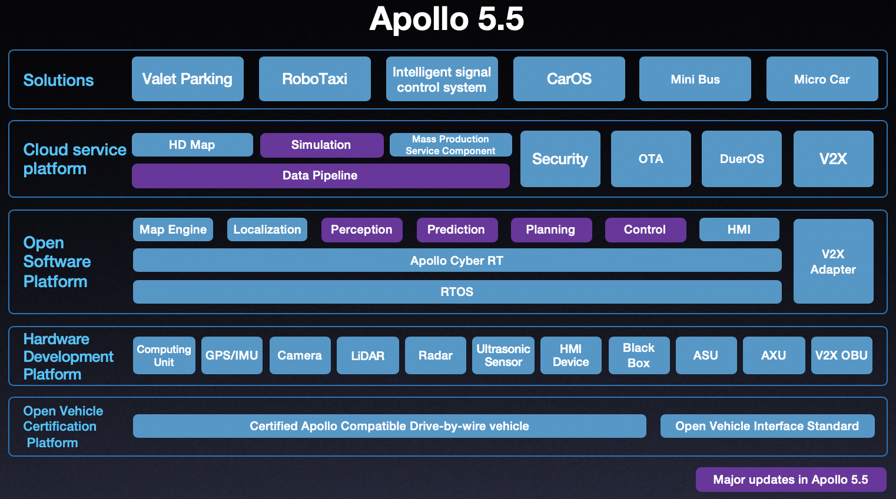

[](http://180.76.142.62:8111/viewType.html?buildTypeId=Apollo_Build&guest=1)
[](https://azure.apollo.auto/daily-build/public)

```

We choose to go to the moon in this decade and do the other things,

not because they are easy, but because they are hard.

-- John F. Kennedy, 1962

```

Welcome to Apollo's GitHub page!

[Apollo](http://apollo.auto) is a high performance, flexible architecture which accelerates the development, testing, and deployment of Autonomous Vehicles.

For business and partnership, please visit [our website](http://apollo.auto).

## Table of Contents

1. [Getting Started](#getting-started)
2. [Prerequisites](#prerequisites)
    - [Basic Requirements](#basic-requirements)
    - [Individual Version Requirements](#individual-version-requirements)
3. [Architecture](#architecture)
4. [Installation](#installation)
5. [Documents](#documents)

## Getting Started

Apollo 5.5 is loaded with new modules and features but needs to be calibrated and configured perfectly before you take it for a spin. Please review the prerequisites and installation steps in detail to ensure that you are well equipped to build and launch Apollo. You could also check out Apollo's architecture overview for a greater understanding of Apollo's core technology and platform.

**[Attention]** The Apollo team is proud to announce that the platform has been migrated to Ubuntu 18.04, one of the most requested upgrades from our developers. We do not expect a disruption to your current work with the Apollo platform, but for perception related code, you would need to:

1. Upgrade host to ubuntu_16.04 and above (Ubuntu 18.04 is preferred)
2. Update local host NVIDIA driver >=410.48. [Website link](https://www.nvidia.com/Download/index.aspx?lang=en-us). Or follow the [guide](https://github.com/ApolloAuto/apollo-kernel/tree/master/linux/Install_nvidia_driver_on_ubuntu_18.04.md) to install Apollo-Kernel and NVIDIA driver, if you want to install Apollo-Kernel.
3. Install latest Docker-CE (19.03+) by following the [official doc](https://docs.docker.com/install/linux/docker-ce/ubuntu).
4. Install latest nvidia-container-toolkit by following the [official doc](https://github.com/NVIDIA/nvidia-docker).

For those developers that would like to continue working with Ubuntu 14.04, please use the [Ubuntu 14.04 branch](https://github.com/ApolloAuto/apollo/tree/ubuntu_14.04) instead of the master branch.

**[Attention]** The Apollo team has decided to retire Git LFS, which might impact your development. For details, please refer to:
[migration guide](docs/howto/how_to_migrate_to_the_updated_apollo_master_from_old_versions.md).

[Want to contribute to our code?](CONTRIBUTING.md) Follow this guide.

## Prerequisites

#### Basic Requirements:

* The vehicle equipped with the by-wire system, including but not limited to brake-by-wire, steering-by-wire, throttle-by-wire and shift-by-wire (Apollo is currently tested on Lincoln MKZ)

* A machine with a 4-core processor and 8GB memory minimum (16GB for Apollo 3.5 and above)

* Ubuntu 18.04

* Working knowledge of Docker


 - Please note, it is recommended that you install the versions of Apollo in the following order:
 **1.0 -> whichever version you would like to test out**.
 The reason behind this recommendation is that you need to confirm whether individual hardware components
 and modules are functioning correctly and clear various version test cases,
 before progressing to a higher, more capable version for your safety and the safety of those around you.

#### Individual Version Requirements:

The following diagram highlights the scope and features of each Apollo release:



[**Apollo 1.0:**](docs/quickstart/apollo_1_0_hardware_system_installation_guide.md)

Apollo 1.0, also referred to as the Automatic GPS Waypoint Following, works in an enclosed venue such as a test track or parking lot. This installation is necessary to ensure that Apollo works perfectly with your vehicle. The diagram below lists the various modules in Apollo 1.0.


**For Setup:**

* **Hardware**:

    * Industrial PC (IPC)

    * Global Positioning System (GPS)

    * Inertial Measurement Unit (IMU)

    * Controller Area Network (CAN) card

    * Hard drive

    * GPS Antenna

    * GPS Receiver

* **Software**:

    * Apollo Linux Kernel (based on Linux Kernel 4.4.32)

[**Apollo 1.5:**](docs/quickstart/apollo_1_5_hardware_system_installation_guide.md)

Apollo 1.5 is meant for fixed lane cruising. With the addition of LiDAR, vehicles with this version now have better perception of its surroundings and can better map its current position and plan its trajectory for safer maneuvering on its lane. Please note, the modules highlighted in Yellow are additions or upgrades for version 1.5.


**For Setup:**

* All the requirements mentioned in version 1.0

* **Hardware**:

    * Light Detection and Ranging System (LiDAR)

    * ASUS GTX1080 GPU-A8G- Gaming GPU Card

* **Software**:

    * Nvidia GPU Driver

[**Apollo 2.0:**](docs/quickstart/apollo_2_0_hardware_system_installation_guide_v1.md#key-hardware-components)

Apollo 2.0 supports vehicles autonomously driving on simple urban roads. Vehicles are able to cruise on roads safely, avoid collisions with obstacles, stop at traffic lights, and change lanes if needed to reach their destination.  Please note, the modules highlighted in Red are additions or upgrades for version 2.0.


**For Setup:**

* All the requirements mentioned in versions 1.5 and 1.0

* **Hardware**:

    * Traffic Light Detection using Camera

    * Ranging System (LiDAR)

    * Radar

* **Software**:

    * Same as 1.5

[**Apollo 2.5:**](docs/quickstart/apollo_2_5_hardware_system_installation_guide_v1.md)

Apollo 2.5 allows the vehicle to autonomously run on geo-fenced highways with a camera for obstacle detection. Vehicles are able to maintain lane control, cruise and avoid collisions with vehicles ahead of them.

```
Please note, if you need to test Apollo 2.5; for safety purposes, please seek the help of the
Apollo Engineering team. Your safety is our #1 priority,
and we want to ensure Apollo 2.5 was integrated correctly with your vehicle before you hit the road.
```


**For Setup:**

* All the requirements mentioned in 2.0

* Hardware:

    * Additional Camera

* Software:

    * Same as 2.0

[**Apollo 3.0:**](docs/quickstart/apollo_3_0_quick_start.md)

Apollo 3.0's primary focus is to provide a platform for developers to build upon in a closed venue low-speed environment. Vehicles are able to maintain lane control, cruise and avoid collisions with vehicles ahead of them.


**For Setup:**

* Hardware:

    * Ultrasonic sensors
    * Apollo Sensor Unit
    * Apollo Hardware Development Platform with additional sensor support and flexibility

* Software:

    * Guardian
    * Monitor
    * Additional drivers to support Hardware

[**Apollo 3.5:**](docs/quickstart/apollo_3_5_quick_start.md)

Apollo 3.5 is capable of navigating through complex driving scenarios such as residential and downtown areas. The car now has 360-degree visibility, along with upgraded perception algorithms to handle the changing conditions of urban roads, making the car more secure and aware. Scenario-based planning can navigate through complex scenarios, including unprotected turns and narrow streets often found in residential areas and roads with stop signs.


**For Setup:**

* Hardware:

    * Velodyne VLS - 128
    * Apollo Extension Unit (AXU)
    * ARGUS FPD-Link Cameras (3)
    * NovAtel PwrPak7
    * Additional IPC

* Software:

    * Perception
    * Planning
    * V2X
    * Additional drivers to support Hardware

* Runtime Framework
    * Cyber RT

[**Apollo 5.0:**](docs/quickstart/apollo_3_5_quick_start.md)

Apollo 5.0 is an effort to support volume production for Geo-Fenced Autonomous Driving.
The car now has 360-degree visibility, along with upgraded perception deep learning model to handle the changing conditions of complex road scenarios, making the car more secure and aware. Scenario-based planning has been enhanced to support additional scenarios like pull over and crossing bare intersections.



**For Setup:**

* Hardware:

    * Same as Apollo 3.5

* Software:

    * [Data Pipeline](https://github.com/ApolloAuto/apollo/tree/master/modules/tools/fuel_proxy)
    * Perception
    * Planning
    * Control
    * Prediction
    * Map Engine
    * Simulation
    * [Apollo Synthetic Data Set](http://apollo.auto/synthetic.html)

[**Apollo 5.5:**](docs/quickstart/apollo_5_5_quick_start.md)

Apollo 5.5 enhances the complex urban road autonomous driving capabilities of previous Apollo releases, by introducing curb-to-curb driving support. With this new addition, Apollo is now a leap closer to fully autonomous urban road driving.
The car has complete 360-degree visibility, along with upgraded perception deep learning model and a brand new prediction model to handle the changing conditions of complex road and junction scenarios, making the car more secure and aware. 



**For Setup:**

* Hardware:

    * Same as Apollo 5.0

* Software:

    * [Data Pipeline](https://github.com/ApolloAuto/apollo/tree/master/modules/tools/fuel_proxy)
    * Perception
    * Planning
    * Control
    * Prediction
    * Simulation

## Architecture

* **Hardware/ Vehicle Overview**


* **Hardware Connection Overview**


* **Software Overview - Navigation Mode**


## Installation

* [Fork and then Clone Apollo's GitHub code](https://github.com/ApolloAuto/apollo)

* [Build and Release using Docker](docs/howto/how_to_build_and_release.md) - This step is required

* [Launch and Run Apollo](docs/howto/how_to_launch_Apollo.md)

Congratulations! You have successfully built out Apollo without Hardware. If you do have a vehicle and hardware setup for a particular version, please pick the Quickstart guide most relevant to your setup:

### With Hardware:

* [Apollo 1.0 QuickStart Guide](docs/quickstart/apollo_1_0_quick_start.md)

* [Apollo 1.5 QuickStart Guide](docs/quickstart/apollo_1_5_quick_start.md)

* [Apollo 2.0 QuickStart Guide](docs/quickstart/apollo_2_0_quick_start.md)

* [Apollo 2.5 QuickStart Guide](docs/quickstart/apollo_2_5_quick_start.md)

* [Apollo 3.0 QuickStart Guide](docs/quickstart/apollo_3_0_quick_start.md)

* [Apollo 3.5 QuickStart Guide](docs/quickstart/apollo_3_5_quick_start.md)

* [Apollo 5.0 QuickStart Guide](docs/quickstart/apollo_5_0_quick_start.md)

* [Apollo 5.5 QuickStart Guide](docs/quickstart/apollo_5_5_quick_start.md)

## Documents

* [Technical Tutorial](docs/technical_tutorial/README.md): Everything you need to know about Apollo. Written as individual versions with links to every document related to that version.

* [How To Guide](docs/howto/README.md): Brief technical solutions to common problems that developers face during the installation and use of the Apollo platform

* [Specs](docs/specs/README.md): A Deep dive into Apollo's Hardware and Software specifications (only recommended for expert level developers that have successfully installed and launched Apollo)

* [FAQs](docs/FAQs/README.md)

## Questions

You are welcome to submit questions and bug reports as [GitHub Issues](https://github.com/ApolloAuto/apollo/issues).

## Copyright and License

Apollo is provided under the [Apache-2.0 license](https://github.com/ApolloAuto/apollo/blob/master/LICENSE).

## Disclaimer

Please refer to the Disclaimer of Apollo in [Apollo's official website](http://apollo.auto/docs/disclaimer.html).

## Connect with us
* [Have suggestions for our GitHub page?](https://github.com/ApolloAuto/apollo/issues)
* [Twitter](https://twitter.com/apolloplatform)
* [YouTube](https://www.youtube.com/channel/UC8wR_NX_NShUTSSqIaEUY9Q)
* [Blog](https://www.medium.com/apollo-auto)
* [Newsletter](http://eepurl.com/c-mLSz)
* Interested in our turnKey solutions or partnering with us Mail us at: apollopartner@baidu.com
