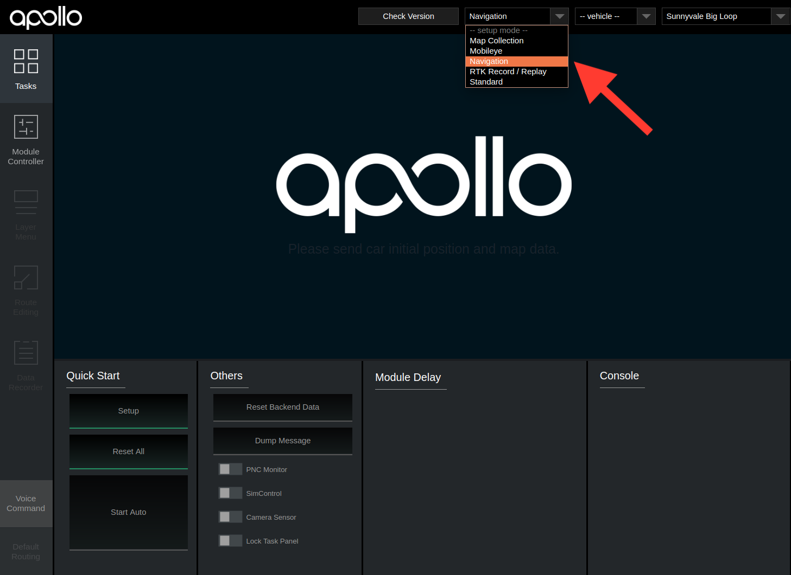

# Apollo


```
We choose to go to the moon in this decade and do the other things,
not because they are easy, but because they are hard.
我们决定在这十年间登上月球并实现更多梦想，并非它们轻而易举，而是因为它们困难重重。
-- John F. Kennedy (约翰 F. 肯尼迪), 1962
```

欢迎来到Apollo GitHub。

[Apollo](http://apollo.auto)(阿波罗)是一个开放的、完整的、安全的自动驾驶平台，以灵活和高性能的技术架构，为全自动驾驶提供支持。

**我们非常骄傲地宣布，[Apollo 2.5](https://github.com/ApolloAuto/apollo/releases/tag/v2.5.0)如约而至。**

## 安装

我们强烈建议您在我们预定义的Docker环境中搭建Apollo。
以下是设置Docker环境，和基于源代码搭建Apollo的步骤。

### 设置Docker环境请运行如下命令

首先，你需要[正确地安装Docker-ce](https://github.com/ApolloAuto/apollo/blob/master/docker/scripts/README.md#install-docker).

以下命令会将你带入Docker容器中。
```
docker ps  # 确认Docker可以非sudo运行
bash docker/scripts/dev_start.sh -C   # -C表示从docker中国的镜像服务器下载，速度较快
bash docker/scripts/dev_into.sh
```

### 基于源代码搭建Apollo

```
bash apollo.sh build
```

## 运行Apollo
请按照如下步骤启动Apollo。

### 启动Apollo
```
# 启动人机交互界面(HMI)
bash scripts/bootstrap.sh
```
### 访问 HMI
可使用您常用的浏览器，比如Chrome, 打开人机交互界面(HMI), 地址是：http://localhost:8888。


### 选择Navigation模式
从下拉框里选择Navigation模式


### 播放演示rosbag
```
bash ./docs/demo_guide/rosbag_helper.sh download # download rosbag
rosbag play -l ./docs/demo_guide/demo_2.5.bag
```

这时，Dreamview会播放一辆带着预测轨迹的行驶中的汽车。


## 文档
Apollo文档可以在[docs](https://github.com/ApolloAuto/apollo/blob/master/docs/)目录下找到。
   * [quickstart](https://github.com/ApolloAuto/apollo/blob/master/docs/quickstart/): 快速入门手册
   * [demo_guide](https://github.com/ApolloAuto/apollo/blob/master/docs/demo_guide/): 演示指南
   * [](https://www.youtube.com/watch?v=Q4BawiLWl8c)
   * [how to contribute code](https://github.com/ApolloAuto/apollo/blob/master/CONTRIBUTING.md): 贡献代码必读
   * [howto](https://github.com/ApolloAuto/apollo/blob/master/docs/howto/): 编译、运行、修改代码教程
   * [specs](https://github.com/ApolloAuto/apollo/blob/master/docs/specs/): Apollo 技术文档

## 咨询

非常欢迎您随时提出疑问或提交bug报告: [Github Issues](https://github.com/ApolloAuto/apollo/issues)。

## 版权
Apollo遵守[Apache-2.0 license](LICENSE)。

## 免责声明
请参考Apollo的免责声明[Apollo official website](http://apollo.auto/docs/disclaimer_cn.html)。
