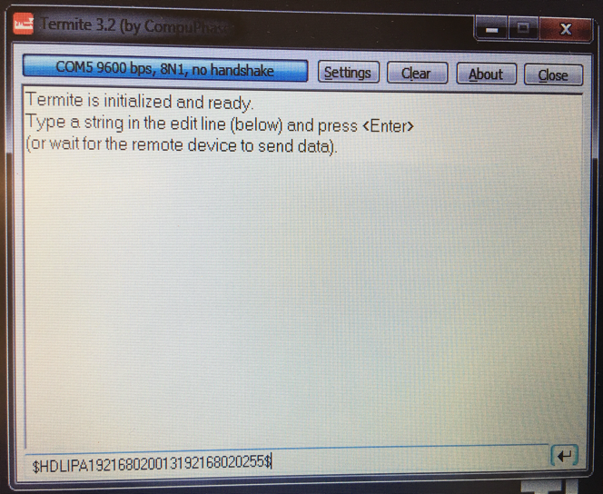

## Velodyne HDL64E-S3安装指南

Apollo使用来自Velodyne LiDAR, Inc.的64线激光雷达系统 **HDL-64E S3**。


### 主要特性:

- 64频道
- 120米范围
- 每秒2.2百万点
- 360°水平视场
- 26.9°垂直视场
- 0.08°角分辨率（方位角）
- 精确度<2cm
- ~0.4°垂直分辨率
- 用户可选择的帧速率
- 坚固耐用的DesignLidar / Velodyne / HDL64E-S3 /

#### 安装

HDL64E S3 LiDAR需要定制的结构才能安装在车辆顶部。该结构必须能为LiDAR系统提供刚性支撑，同时在驾驶条件下将LiDAR升高到地面以上的某个高度。该高度应保证来自LiDAR的激光束不被车辆的前部和/或后部阻挡。 LiDAR所需的实际高度取决于车辆的设计，并且LiDAR的安装点取决于所使用的车辆。激光器的垂直倾斜角通常在相对于地平线+2~-24.8度范围内。
对于标准的林肯MKZ，建议您将LiDAR安装在1.8米的最小高度（从地面到激光雷达底座），以便有效地使用角度范围进行探测。

```
如果由于某种原因，LiDAR光束必须被车辆阻挡，则在处理接收的数据时可能需要应用滤波器来移除这些点。
```

#### 布线

每个HDL-64E S3 LiDAR都包含一个电缆束，用于将LiDAR连接到电源、GPS时间同步源和计算机（用于数据传输的以太网和用于LiDAR配置的串行端口）。


* **连接LiDAR**

   将电源线和信号线连接到LiDAR上的匹配端口

   

* **连接电源**

   两根AWG 16线用于为HDL-64E S3 LiDAR供电。 它需要大约3A的电流12V电压。连接电源时，请完全接触电线并拧紧螺钉。

   

* **连接IPC**

   与IPC的连接是通过以太网电缆进行的。将以太网连接器插入电缆束中，连接到IPC上的以太网端口。 

* **连接GPS**:

   HDL64E S3 LiDAR需要建议的最小特定GPS /传输数据（GPRMC）和每秒脉冲数（PPS）信号才能与GPS时间同步。需要定制连接以建立GPS接收器和LiDAR之间的通信，如下所示：

   - **SPAN-IGM-A1**

      如果您按照[配置GPS和IMU](#configuration-the-gps-and-imu)中的说明配置了SPAN-IGM-A1，GPS接收器通过“用户端口”电缆发送GPRMC信号到“主要”端口。PPS信号通过标记为“PPS”和“PPS dgnd”的线缆从AUX端口发送。下图中的虚线框显示了HDL64E S3 LiDAR和SPAN-IGM-A1 GPS接收器的可用连接。其余连接必须由用户进行。

      

   - **Propak 6 and IMU-IGM-A1**

       如果您按照[配置GPS和IMU](#configuration-the-gps-and-imu)中的说明配置了Propak 6，GPS接收器通过COM2端口发送GPRMC信号。 PPS信号通过IO端口发送。 下图中的虚线框是HDL-64E S3 LiDAR和Propak 6 GPS接收器附带的可用连接。其余连接需要由用户进行。

      

* **通过串口连接计算机以进行LiDAR配置**

   可通过串行端口配置一些低层参数。 在Velodyne LiDAR，Inc. 提供的电缆束中，有两对红/黑电缆，如下面的引脚表所示。较厚的一对（AWG 16）用于为LiDAR系统供电。较薄的一对用于串行连接。将黑线（串行输入）连接到RX，红线连接到串行电缆的地线。将串行电缆与USB串行适配器连接到所选计算机。 

   

#### 配置

默认情况下，HDL-64E S3的网络IP地址为192.168.0.1。 但是，在设置Apollo时，请将网络IP地址更改为 **192.168.20.13** 。 您可以将终端应用程序与Termite3.2一起使用。可以使用以下步骤配置HDL-64E S3的IP地址：

* 将串行电缆的一侧连接到笔记本电脑
* 将串行电缆的另一端连接到HDL-64E S3的串行线
* 使用以下默认COM端口设置:

      - 波特率: 9600

      - 奇偶校验: None

      - 数据位: 8

      - 停止位: 1

* 使用COM端口应用程序：从以下链接下载Termite3.2并将其安装在您的笔记本电脑上（Windows） - [安装连接](http://www.compuphase.com/software_termite.htm)

* 使用HDL-64E S3和笔记本电脑之间COM端口的串行电缆连接:


* 从笔记本电脑启动 **Termite 3.2**  

* 发出串行命令，通过串口"\#HDLIPA192168020013192168020255"设置HDL-64E S3的IP地址

* 重启设备以启用新的IP地址



#### 参考资料

有关Velodyne HDL-64E S3的更多信息，请参阅他们的[官网](http://velodynelidar.com/hdl-64e.html).

## 免责声明

该设备由`Apollo平台提供支持`
      