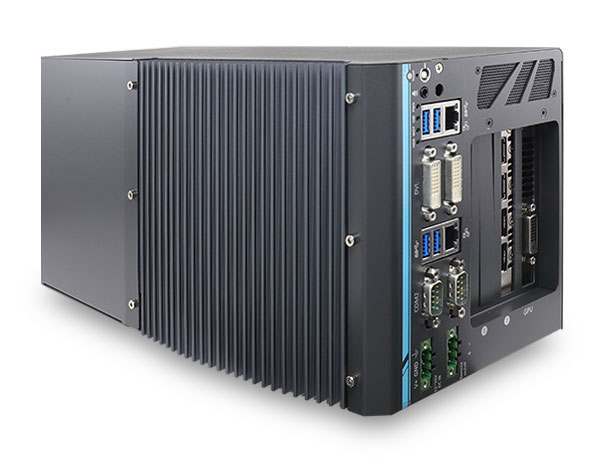
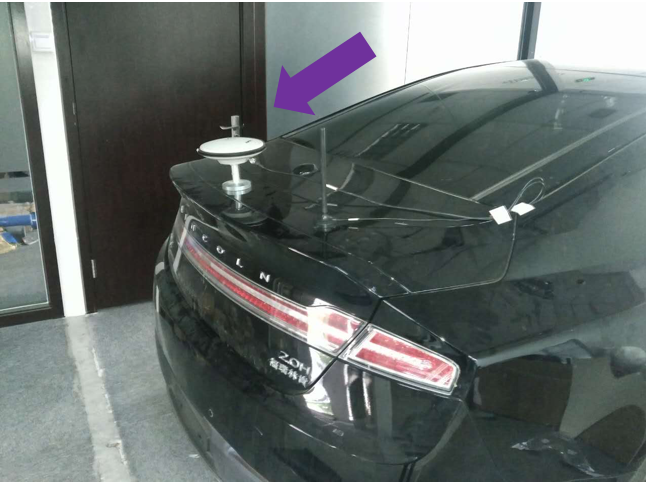

# Apollo 2.5 硬件与系统安装指南

- [关于本篇指南](#关于本篇指南)
    - [文档编写规则](#文档编写规则)
- [引言](#引言)
    - [文档说明](#文档说明)
- [核心硬件](#核心硬件)
    - [附加组件](#附加组件)
    - [车载计算机系统 - IPC](#车载计算机系统---ipc)
        - [IPC的配置](#ipc的配置)
        - [IPC前侧视图](#ipc前侧视图)
    - [控制器局域网络(CAN)卡](#控制器局域网络can卡)
    - [全球定位系统(GPS)和惯性测量装置(IMU)](#全球定位系统gps和惯性测量装置imu)
        - [选项1: NovAtel SPAN-IGM-A1](#选项1-novatel-span-igm-a1)
        - [选项2: NovAtel SPAN ProPak6和NovAtel IMU-IGM-A1](#选项2-novatel-span-propak6和novatel-imu-igm-a1)
    - [The GPS Receiver/Antenna](#the-gps-receiverantenna)
        - [选项 1: NovAtel GPS-703-GGG-HV](#选项-1-novatel-gps-703-ggg-hv)
        - [选项 2: Dual NovAtel GNSS-502](#选项-2-dual-novatel-gnss-502)
    - [激光雷达 (LiDAR)](#激光雷达-lidar)
    - [摄像头](#摄像头)
    - [雷达](#雷达)
- [安装任务概览](#安装任务概览)
- [安装任务步骤](#安装任务步骤)
    - [上车前的准备工作](#上车前的准备工作)
        - [IPC的准备工作](#ipc的准备工作)
        - [为IPC安装软件](#为ipc安装软件)
    - [上车安装](#上车安装)
        - [前提条件](#前提条件)
        - [主要部件安装图](#主要部件安装图)
        - [安装GPS的接收器和天线](#安装gps的接收器和天线)
            - [选项1：安装NovAtel SPAN-IGM-A1](#选项1安装novatel-span-igm-a1)
            - [选项2：NovAtel SPAN® ProPak6™ 和 NovAtel IMU-IGM-A1](#选项2novatel-span®-propak6™-和-novatel-imu-igm-a1)
        - [安装激光雷达(LiDAR)](#安装激光雷达lidar)
        - [安装摄像头](#安装摄像头)
        - [安装雷达](#安装雷达)
- [建立网络](#建立网络)
    - [推荐配置](#推荐配置)
- [额外任务](#额外任务)
- [下一步](#下一步)


# 关于本篇指南

本篇指南提供了所有 **Apollo项目**需要的的安装硬件部分和软件系统教程。系统安装信息包括下载和安装Apollo Linux内核的过程。

## 文档编写规则

下表列出了本文使用的编写规则：

| **图标**                            | **描述**                          |
| ----------------------------------- | ---------------------------------------- |
| **加粗**                            | 强调。                                 |
| `Mono-space 字体`                   | 代码, 类型数据。                         |
| _斜体_                              | 文件、段落和标题中术语的用法。   |
|        | **信息**  提供了可能有用的信息。忽略此信息可能会产生不可预知的后果。 |
|          | **提醒** 包含有用的提示或者可以帮助你完成安装的快捷步骤。 |
|    | **在线** 提供指向特定网站的链接，您可以在其中获取更多信息。 |
|  | **警告** 包含 **不能** 被忽略的内容，如果忽略，当前安装步骤可能会失败。 |

# 引言

**Apollo项目**旨在为汽车和自动驾驶行业的合作伙伴提供开放，完整和可靠的软件平台。该项目的目的是使这些企业能够开发基于Apollo软件栈的自动驾驶系统。

## 文档说明

以下文档适用于Apollo 2.5:

- ***<u>[Apollo Hardware and System Installation Guide]</u>***  ─ 提供用于安装车辆的硬件部件和系统软件的教程:

    - **车辆**:

      - 工业用计算机 (IPC)
      - 全球定位系统 (GPS)
      - 惯性测量单元 (IMU)
      - 控制器局域网络 (CAN) 卡
      - GPS 天线
      - GPS 接收器
      - 安装激光雷达 (LiDAR)
      - 摄像头
      - 雷达

    - **软件**:
      - Ubuntu Linux 操作系统
      - Apollo Linux 内核
      - Nvidia GPU 驱动

- ***<u>[Apollo Quick Start Guide]</u>*** ─ 文档和产品蓝图提供了完整的端到端教程。本文还提供了一些其它链接用于将一辆普通汽车改装成一辆自动驾驶车辆。

# 核心硬件

需要安装的关键的硬件组件包括：
- 车载计算机系统 ─ Neousys Nuvo-6108GC
- CAN卡 ─ ESD CAN-PCIe/402-B4
- 全球定位系统(GPS)和惯性测量装置(IMU) ─ 您可从如下选项中任选其一:
  - NovAtel SPN-IGM-A1
  - NovAtel SPAN® ProPak6™ 和 NovAtel IMU-IGM-A1
- 激光雷达 (LiDAR) - Velodyne HDL-64E S3
- 摄像头 — 采用 USB 3.0 的Leopard Imaging LI-USB30-AR023ZWDR 
- 雷达 — Continental ARS408-21

## 附加组件
- 提供网络接入的4G路由器
- 提供额外USB接口的USB集线器
- 供在车辆现场调试使用的显示器，键盘，鼠标
- 连接线：数字可视接口（DVI）线（可选），用于GPS和LiDAR时间同步的定制线
- 苹果iPad Pro:9.7寸, WiFi(可选)


关键硬件组件的特性将在后续部分中介绍。

## 车载计算机系统 - IPC
车载计算机系统是用于自动驾驶车辆的工业PC（IPC），并使用由第六代Intel Xeon E3 1275 V5 CPU强力驱动的 **NeousysNuvo-6108GC**。

Neousys Nuvo-6108GC是自动驾驶系统（ADS）的中心单元。

### IPC的配置
IPC配置如下：

- ASUS GTX1080 GPU-A8G-Gaming GPU Card
- 32GB DDR4 RAM
- PO-280W-OW 280W 交流、直流电源适配器
- 2.5" SATA 硬盘 1TB 7200rpm

### IPC前侧视图

安装了GPU的IPC前后视图如下:

Nuvo-6108GC的前视图:


Nuvo-6108GC的侧视图:



想要了解更多有关 Nuvo-6108GC的资料, 请参考:


Neousys Nuvo-6108GC 产品页:

[http://www.neousys-tech.com/en/product/application/rugged-embedded/nuvo-6108gc-gpu-computing](http://www.neousys-tech.com/en/product/application/rugged-embedded/nuvo-6108gc-gpu-computing)


Neousys Nuvo-6108GC 手册：还不可用。

## 控制器局域网络(CAN)卡
IPC中使用的CAN卡型号为 **ESD** **CAN-PCIe/402-B4**.


想要了解更多有关CAN-PCIe/402-B4的资料, 请参考:

    ESD CAN-PCIe/402 产品主页：

[https://esd.eu/en/products/can-pcie402](https://esd.eu/en/products/can-pcie402)


## 全球定位系统(GPS)和惯性测量装置(IMU)

有 **两种** GPS-IMU的 **可选方案**，您只需根据您的需求进行选择:

- 选项1：NovAtel SPAN-IGM-A1
- 选项2：NovAtel SPAN® ProPak6™ 和 NovAtel IMU-IGM-A1

### 选项1: NovAtel SPAN-IGM-A1

NovAtel SPAN-IGM-A1 是一个集成的，单盒的解决方案，提供紧密耦合的全球导航卫星系统（GNSS）定位和具有NovAtel OEM615接收机的惯性导航功能。 


想要了解更多有关NovAtel SPAN-IGM-A1的资料, 请参考:

  NovAtel SPAN-IGM-A1 产品页:

[https://www.novatel.com/products/span-gnss-inertial-systems/span-combined-systems/span-igm-a1/](https://www.novatel.com/products/span-gnss-inertial-systems/span-combined-systems/span-igm-a1/)

### 选项2: NovAtel SPAN ProPak6和NovAtel IMU-IGM-A1

NovAtel ProPak6是独立的GNSS接收机，它与NovAtel提供的独立IMU（本例中为NovAtel IMU-IGM-A1）相融合以提供定位。

ProPak6提供由NovAtel生产的最新最先进的外壳产品。

IMU-IGM-A1是与支持SPAN的GNSS接收器（如SPAN ProPak6）配对的IMU。 


想要了解更多有关NovAtel SPAN ProPak6 and the IMU-IGM-A1, 请参考:

   NovAtel ProPak6 安装操作手册

[https://www.novatel.com/assets/Documents/Manuals/OM-20000148.pdf](https://www.novatel.com/assets/Documents/Manuals/OM-20000148.pdf)

  NovAtel IMU-IGM-A1 产品页:

[https://www.novatel.com/products/span-gnss-inertial-systems/span-combined-systems/span-igm-a1/](https://www.novatel.com/products/span-gnss-inertial-systems/span-combined-systems/span-igm-a1/)

## The GPS Receiver/Antenna

GPS-IMU组件的GPS接收器、天线可使用选项有：

### 选项 1: **NovAtel GPS-703-GGG-HV**.

**NOTE:**GPS NovAtelGPS-703-GGG-HV与上文中提到的两个GPS-IMU选项的任一型号配合使用。 


更多关于 NovAtel GPS-703-GGG-HV的信息, 请参考:

   NovAtel GPS-703-GGG-HV Product Page:

[https://www.novatel.com/products/gnss-antennas/high-performance-gnss-antennas/gps-703-ggg-hv/](https://www.novatel.com/products/gnss-antennas/high-performance-gnss-antennas/gps-703-ggg-hv/)

### 选项 2: **Dual NovAtel GNSS-502** 

**NOTE:**NovAtel GNSS-502与上文中提到的两个GPS-IMU选项的任一型号配合使用。通过使用2个天线，双天线接收器（如ProPak6）得以利用更高质量的航向信息。


更多有关 NovAtel GNSS-502的信息, 请参考:

   NovAtel GNSS-502 产品页:

[https://www.novatel.com/products/gnss-antennas/vexxis-series-antennas/vexxis-gnss-500-series-antennas/](https://www.novatel.com/products/gnss-antennas/vexxis-series-antennas/vexxis-gnss-500-series-antennas/)


## 激光雷达 (LiDAR)
由Velodyne LiDAR公司提供的64线激光雷达系统 **HDL-64E S3** 。


**主要特点:**

- 线数：64
- 探测距离：120m 
- 220万点每秒
- 水平视场角：360°
- 垂直视场角：26.9°
- 水平角分辨率：0.08°(方位角)
- 精度：<2cm 
- 垂直角分辨率: ~0.4°
- 用户可选帧速率
- 坚固耐用

Velodyne HDL-64E S3的官网:
[http://velodynelidar.com/hdl-64e.html](http://velodynelidar.com/hdl-64e.html)


由Velodyne LiDAR公司提供的16线激光雷达系统 **VLP-16**。


**主要特点:**

- 线数：16
- 探测距离：100m
- 600,000点每秒
- 水平视场角：360°
- 垂直视场角：±15°
- 低功耗
- 保护性设计

Velodyne VLP-16官网:
[http://velodynelidar.com/vlp-16.html](http://velodynelidar.com/vlp-16.html)

## 摄像头

所使用的相机是Leopard Imaging公司制造的标准USB 3.0接口的LI-USB30-AR023ZWDR，我们建议分别使用两个6毫米和一个25毫米镜头的摄像头来实现所需的性能。


您可以从 Leopard Imaging公司的官网上获得更多信息:

[https://leopardimaging.com/product/li-usb30-ar023zwdr/](https://leopardimaging.com/product/li-usb30-ar023zwdr/)


## 雷达

所用雷达是Continental集团制造的ARS408-21。 


您可以在产品页上找到更多信息:

[https://www.continental-automotive.com/Landing-Pages/Industrial-Sensors/Products/ARS-408-21](https://www.continental-automotive.com/Landing-Pages/Industrial-Sensors/Products/ARS-408-21)

# 安装任务概览

安装硬件和软件组件涉及以下任务：
**室内：**
1. 在将CAN卡插入插槽之前，先重新定位CAN卡终端跳线。 
准备IPC：
 - 检查图形处理单元（GPU）磁带，以确定是否需要卸下GPU卡（如果已预安装）
 - 在将卡插入插槽之前，首先重新定位CAN卡端接跳线，准备并安装控制器局域网（CAN）卡。
2. 如果未预装硬盘，请先在IPC安装硬盘
    您也可以选择更换预装的硬盘。
    
     **推荐**：
     - 为了更好的可靠性，安装固态硬盘（SSD）；
     
     - 如果需要收集驾驶数据，需要使用大容量硬盘；
3. 准备IPC加电：

    a. 将电源线连接到电源连接器（接线端子）
    
    b. 将显示器，以太网，键盘和鼠标连接到IPC
    
    c. 将IPC连接到电源

4. 在IPC安装软件（需要部分Linux经验）：
    
    a. 安装Ubuntu Linux.
    
    b. 安装Apollo Linux 内核.

**上车安装:**

- 确保所有在前提条件中列出的对车辆的修改，都已执行。

- 安装主要的组件：
    - GPS 天线
    - IPC
    - GPS 接收器和 IMU
    - LiDAR
    - 摄像头
    - 雷达

安装所有硬件和软件组件的实际步骤详见安装任务步骤。

# 安装任务步骤

该部分包含：
- 核心硬件和软件的安装
- 车辆硬件的安装

## 上车前的准备工作
- 准备IPC：
 - 安装CAN卡
 - 安装或者替换硬盘
 - 准备为IPC供电
- 为IPC安装软件：
 - Ubuntu Linux
 - Apollo内核
 - Nvidia GPU 驱动

### IPC的准备工作
有如下步骤：

1. 准备安装CAN卡：在Neousys Nuvo-6108GC中，ASUS®GTX-1080GPU-A8G-GAMING GPU卡预先安装占用了一个PCI插槽，将CAN卡安装到剩余两个PCI插槽其一即可。

a. 找到并拧下计算机侧面的八个螺丝（棕色方块所示或棕色箭头指示）:


b. 从IPC上拆下盖子。基座有3个PCI插槽（由显卡占据一个）：

  


c. 通过从其默认位置移除红色跳线帽（以黄色圆圈显示）并将其放置在其终止位置，设置CAN卡端接跳线：

 

**WARNING**: 如果端接跳线设置不正确，CAN卡将无法正常工作。

d. 将CAN卡插入IPC的插槽:


e. 安装IPC盖子：

  

2. 准备IPC启动:

   a. 将电源线连接到IPC的电源连接器（接线端子）：

   **WARNING**: 确保电源线的正极（红色用 **R**表示）和负极（黑色用 **B**表示）正确的插入电源端子块上的插孔中。

   

   b. 连接显示器，以太网线，键盘和鼠标到IPC上：

3. 

如果有一张或多张卡已经加入进系统里，推荐您将风扇速度通过BIOS配置:

    - 当启动电脑时，按F2键进入BIOS设置菜单
    - 进入 [Advanced] => [Smart Fan Setting]
    - 将 [Fan Max. Trip Temp] 设置为 50
    - 将 [Fan Start Trip Temp] 设置为 20


建议您用DVI连接GPU和显示器。以下是在主卡上将DVI端口设置为显示器连接端口的步骤：

    - 当启动电脑时，按F2键进入BIOS设置菜单
    - 进入 [Advanced]=>[System Agent (SA) Configuration]=>[Graphics Configuration]=>[Primary Display]=> 设置为 "PEG"
推荐您将IPC设置为一直处于最佳性能模式（maximum performance mode）：
     - 当启动电脑时，按F2键进入BIOS设置菜单
     - 进入 [Power] => [SKU POWER CONFIG] => 设置为 "MAX. TDP"

c. 连接电源：


### 为IPC安装软件

这部分主要描述以下的安装步骤：

- Ubuntu Linux
- Apollo 内核
- Nvidia GPU 驱动

您最好具有使用Linux成功安装软件的经验。


#### 安装Ubuntu Linux
步骤如下：

1. 创建一个可以引导启动的Ubantu Linux USB闪存驱动器：

    下载Ubuntu（或Xubuntu等分支版本），并按照在线说明创建可引导启动的USB闪存驱动器。

 推荐使用 **Ubuntu 14.04.3**.

开机按 F2 进入 BIOS 设置菜单，建议禁用BIOS中的快速启动和静默启动，以便捕捉引导启动过程中的问题。 建议您在BIOS中禁用“快速启动”和“安静启动”，以便了解启动过程中遇到的问题。

获取更多Ubuntu信息，可访问: 
 Ubuntu 桌面站点:

[https://www.ubuntu.com/desktop](https://www.ubuntu.com/desktop)

2. 安装 Ubuntu Linux:

    a.  将Ubuntu安装驱动器插入USB端口并启动IPC。
    
    b.  按照屏幕上的说明安装Linux。

3. 执行软件更新与安装:

    a.  安装完成，重启进入Linux。
    
    b.  执行软件更新器（Software Updater）更新最新软件包，或在终端执行以下命令完成更新。
    ```shell
    sudo apt-get update; 
    sudo apt-get upgrade
    ```

    c.  打开终端，输入以下命令，安装Linux 4.4 内核：

    ```shell
    sudo apt-get install linux-generic-lts-xenial
    ```
IPC必须接入网络以便更新与安装软件，所以请确认网线插入并连接，如果连接网络没有使用动态分配（DHCP），需要更改网络配置。


#### 安装Apollo内核

车上运行Apollo需要 [Apollo Kernel](https://github.com/ApolloAuto/apollo-kernel). 强烈建议安装预编译内核。

##### 使用预编译的 Apollo 内核

你可以依照如下步骤获取、安装预编译的内核。

1. 从realease文件夹下载发布的包
```
https://github.com/ApolloAuto/apollo-kernel/releases
```

2. 安装内核

下载完release安装包以后:
```
tar zxvf linux-4.4.32-apollo-1.0.0.tar.gz
cd install
sudo bash install_kernel.sh
```
3. 使用 `reboot`命令重启系统；

4. 根据[ESDCAN-README.md](https://github.com/ApolloAuto/apollo-kernel/blob/master/linux/ESDCAN-README.md)编译ESD CAN驱动器源代码

##### 构建你自己的内核

如果内核被改动过，或预编译内核不是你最佳的平台，你可以通过如下方法构建你自己的内核：

1. 从代码仓库克隆代码：
```
git clone https://github.com/ApolloAuto/apollo-kernel.git
cd apollo-kernel
```
2. 根据 [ESDCAN-README.md](https://github.com/ApolloAuto/apollo-kernel/blob/master/linux/ESDCAN-README.md)添加 ESD CAN 驱动源代码。

3. 按照如下指令编译：
```
bash build.sh
```
4. 使用同样的方式安装内核。

#### 安装 NVIDIA GPU 驱动

车辆中的Apollo运行需要[NVIDIA GPU 驱动](http://www.nvidia.com/download/driverResults.aspx/114708/en-us)。您必须安装具有特定选项的NVIDIA GPU驱动程序。

1. 下载安装文件
```
wget http://us.download.nvidia.com/XFree86/Linux-x86_64/375.39/NVIDIA-Linux-x86_64-375.39.run
```

2. 开始安装
```
sudo bash ./NVIDIA-Linux-x86_64-375.39.run --no-x-check -a -s --no-kernel-module
```

##### 可选：测试ESD CAN设备端
在重启有新内核的IPC以后：

a. 使用以下指令创建CAN硬件节点：

```shell
cd /dev; sudo mknod –-mode=a+rw can0 c 52 0
```
b. 使用从ESD Electronics获取到得的ESD CAN软件包的一部分的测试程序来测试CAN设备节点。


至此，IPC就可以被装载到车辆上了。

## 上车安装

执行以下任务：

- 根据先决条件列表中的所述，对车辆进行必要的修改
- 安装主要的组件：Install the major components:
    - GPS 天线
    - IPC
    - GPS 接收器
    - LiDAR
    - 摄像头
    - 雷达


### 前提条件

**WARNING**: 在将主要部件（GPS天线，IPC和GPS接收器）安装在车辆之前，必须按照先决条件列表所述执行必要修改。 列表中所述强制性更改的部分，不属于本文档的范围。

安装的前提条件如下：

- 车辆必须由专业服务公司修改为“线控”技术。 此外，必须在要安装IPC的中继线上提供CAN接口连接。
- 必须在后备箱中安装电源插板，为IPC和GPS-IMU提供电源。电源插板还需要服务于车上的其他硬件，比如4G的路由器。电源插板应连接到车辆的电源系统。
- 必须安装定制的机架，将GPS-IMU天线安装在车辆的顶部。
- 必须安装定制的机架，以便将GPS-IMU安装在后背箱中。
- 必须将4G LTE路由器安装在后备箱中才能为IPC提供Internet访问。路由器必须具有内置Wi-Fi接入点（AP）功能，以连接到其他设备（如iPad），以与自主驾驶（AD）系统相连接。例如，用户将能够使用移动设备来启动AD模式或监视AD状态。

### 主要部件安装图

以下两图显示车辆上应安装三个主要组件（GPS天线，IPC，GPS接收机和LiDAR）的位置： 示例图：


车辆与后备箱侧视图 


车辆与后备箱后视图


### 安装GPS的接收器和天线

以下组件 **二选一**: 

- **选项 1:** GPS-IMU: **NovAtel SPAN-IGM-A1**
- **选项 2:** GPS-IMU: **NovAtel SPAN® ProPak6™ and NovAtel IMU-IGM-A1**

#### 选项1：安装NovAtel SPAN-IGM-A1

安装说明描述了安装，连接和采取GPS-IMU NovAtel SPAN-IGM-A1的杠杆臂测量的过程。

##### 安装

可以将GPS-IMU NovAtel SPAN-IGM-A1放置在车辆的大部分地方，但建议您遵循以下建议：

- 将NovAtel SPAN-IGM-A1放置并固定在后备箱内，Y轴指向前方。
- 将NovAtel GPS-703-GGG-HV天线安装在位于车辆顶部的视野范围内。

##### 接线

您必须连接的两根电缆：

- 天线电缆 - 将GNSS天线连接到SPAN-IGM-A1的天线端口
- 主电缆：
     - 将其15针端连接到SPAN-IGM-A1
     - 将其电源线连接到10至30V直流电源
     - 将其串行端口连接到IPC。如果电源来自车载电池，请添加辅助电池（推荐）。


主电缆连接

更多信息参见 *SPAN-IGM™ 快速入门指南*, 第三页, 详细图:

SPAN-IGM™ 快速入门指南

[http://www.novatel.com/assets/Documents/Manuals/GM-14915114.pdf](http://www.novatel.com/assets/Documents/Manuals/GM-14915114.pdf)

##### 采取杠杆臂测量


当SPAN-IGM-A1和GPS天线就位时，必须测量从SPAN-IGM-A1到GPS天线的距离。 该距离标识为：X偏移，Y偏移和Z偏移。

偏移误差必须在1厘米以内才能实现高精度。 有关详细信息，请参阅 * SPAN-IGM™快速入门指南*，第5页，详细图。

更多有关SPAN-IGM-A1的信息参见:

SPAN-IGM™ 用户手册:

[http://www.novatel.com/assets/Documents/Manuals/OM-20000141.pdf](http://www.novatel.com/assets/Documents/Manuals/OM-20000141.pdf)


#### 选项2：NovAtel SPAN® ProPak6™ 和 NovAtel IMU-IGM-A1

安装说明描述了安装，连接和采取GPS NovAtelSPAN®ProPak6™**和** NovAtel IMU-IGM-A1的杠杆臂测量的步骤。

##### 组件

安装所需的组件包括：

- NovAtel GPS SPAN ProPak6

- NovAtel IMU-IGM-A1

- NovAtel GPS-703-GGG-HV天线

- NovAtel GPS-C006电缆（将天线连接到GPS）

- NovAtel 01019014主电缆（将GPS连接到IPC的串行端口）

- 数据传输单元（DTU） - 类似于4G路由器

- 磁性适配器（用于天线和DTU）

- DB9直通电缆

##### 安装

你可以将 ProPak6 和 IMU 放置在车辆以下建议的位置：

- 将ProPak6和IMU并排固定在行李箱内，Y轴指向前方。

- 将NovAtel GPS-703-GGG-HV天线安装在车辆顶部或后备箱盖顶部，如图所示：



- 使用磁性适配器将天线紧固到后备箱盖上。

- 通过打开后备箱并将电缆放置在后备箱中，将天线也安装在后备箱中。

##### 接线

按照以下步骤将ProPak6 GNSS接收器和IMU连接到Apollo系统：

1. 使用IMU-IGM-A1附带的分接电缆连接IMU主端口和ProPak6 COM3/IMU端口。

2. 使用USB-MicroUSB转换线，连接IPC的USB端口和ProPak6的MicroUSB端口。

3. 将IMU-IGM-A1分离电缆的另一端连接到车辆电源。

4. 将GNSS天线连接到Propak6。

5. 连接Propak6电源线。


更多有关 NovAtel SPAN ProPak6的信息, 参见:

NovAtel ProPak6安装操作手册:

[https://www.novatel.com/assets/Documents/Manuals/OM-20000148.pdf](https://www.novatel.com/assets/Documents/Manuals/OM-20000148.pdf)


### 安装激光雷达(LiDAR)

本部分描述了安装HDL-64E S3 LiDAR的步骤。

#### 安装

您需要一种定制的特定安装结构来成功地将HDL-64E S3激光雷达安装在车辆的顶部。这种结构必须向激光雷达系统提供刚性支撑，同时将激光雷达提高到地面以上的一定高度。这个高度避免了激光雷达的激光束被车辆的前部以及后部阻挡。激光雷达所需的实际高度取决于车辆的设计和激光雷达相对于车辆的安装点。激光器的垂直倾角通常与视距为2～24.8度。为了充分利用探测范围，在林肯MKZ上，建议将激光雷达安装在1.8米（从地面到激光雷达的底部）的最小高度。

#### 接线

每个HDL-64E S3 激光雷达包括一个将LiDAR连接到电源的电缆组件，计算机（用于数据传输的以太网和用于LiDAR配置的串行端口）和GPS时间同步源。


1. 连接到LiDAR

  将电源和信号电缆连接到LiDAR上的匹配端口

   

2. 连接到电源

   两根AWG 16线为HDL-64E S3提供所需电力。 所需电压/电流：12V/3A。 要连接电源，请与电线完全接触并拧紧螺丝。

   

3. 连接到IPC

   与IPC的连接是通过以太网线。将电缆束中的以太网线水晶头插入IPC上的以太网端口。

4. 连接到 GPS:

   HDL64E S3 推荐最小特定GPS/传输数据（GPRMC）和每秒脉冲（PPS）信号与GPS时间同步。需要定制连接来建立GPS接收机和LiDAR之间的通信：

   >HDL64E S3 LiDAR requires the Recommended minimum specific GPS/Transit data (GPRMC) and pulse per second (PPS)signal to synchronize to the GPS time. 

   a. SPAN-IGM-A1

    如果您配置了[配置GPS和IMU]（＃配置gps和imu）中指定的SPAN-IGM-A1，GPRMC信号将通过用户端口电缆从主端口从GPS接收器发送。 PPS信号通过Aux端口上标有“PPS”和“PPS dgnd”的电缆发送。 下图中的虚线框是HDL64E S3 LiDAR和SPAN-IGM-A1 GPS接收机附带的可用连接。 剩余的连接需要由用户进行。

   

   b. Propak 6 和 IMU-IGM-A1

    如果您配置了[配置GPS和IMU]（＃configuration-the-gps-and-imu）中指定的Propak 6，GPRMC信号将通过COM2端口从GPS接收器发送。PPS信号通过IO端口发送。 
     
    下图中的虚线框是HDL-64E S3 LiDAR和Propak 6 GPS接收机附带的可用连接。 剩余的连接需要由用户进行。

   

5. 通过串口连接进行LiDAR配置

    一些低级的参数可以通过串口进行配置。

    在Velodyne提供的电缆束内，有两对红色/黑色电缆，如下表所示。 较厚的一对（AWG 16）用于为LiDAR系统供电。 较薄的一对用于串行连接。 将黑线（串行输入）连接到RX，将红线连接到串行电缆的地线。 将串行电缆与USB串行适配器连接至所选择的计算机。

    

   #### 配置

   默认情况下，HDL-64E S3的网络IP地址设置为192.168.0.1。 但是，当我们配置Apollo时，我们应该将网络IP地址改为192.168.20.13。 可以使用终端应用程序Terminalite 3.2，进入网络设置命令。可以按照以下步骤配置HDL-64E S3的IP地址：

   1. 将串行电缆的一面连接到笔记本电脑
   2. 将串行电缆的另一端连接到HDL-64E S3的串行线
   3. COM 端口默认程序
      Baudrate: 9600
      Parity: None
      Data bits: 8
      Stop bits: 1
   4. COM端口程序，从如下链接下载 Termite3.2 并安装
      [http://www.compuphase.com/software_termite.htm](http://www.compuphase.com/software_termite.htm)

   5. HDL-64E S3和笔记本电脑之间的COM端口连接
      

   6. 在笔记本运行 **Termite 3.2**

   7. 发出串行命令，通过串口“\＃HDLIPA192168020013192168020255”设置HDL-64E S3的IP地址 

   8. 本机必须重新上电才能采用新的IP地址

      

      HDL-64E S3 手册可见:

      [http://velodynelidar.com/hdl-64e.html](http://velodynelidar.com/hdl-64e.html)

#### 安装 VLP-16 lidar (可选)

Apollo 2.5的地图制作服务已经向公众开放。为了获得地图创建所需的数据，需要在车辆上安装附加的VLP-16激光雷达。LiDAR的目的是收集HDL-64 S3 激光雷达FOV上方的物体的点云信息，例如交通信号灯和标志。它需要一个定制的机架安装VLP-16激光雷达在车辆顶部。下图显示了可以选择的配置之一。

In this specific configuration, the VLP-16 LiDAR is mounted with an upward tilt of 20±2°. The power cable of the VLP-16 is connected to the DataSpeed power panel. The ethernet connection is connected to the IPC (possibly through an ethernet switch). Similar to HDL-64 S3 LiDAR, the VLP-16 GPRMC and PPS input from the GPS receiver. Ideally, additional hardware should be installed to duplicate the GPRMC and PPS signal from the GPS receiver send to HDL-64 and VLP-16 respectively. However, a simple Y-split cable may also provide adequate signal for both LiDAR's. To distingush from the HDL-64 S3 LiDAR, please follow the VLP-16 manual and use the webpage interface to configure the IP of VLP-16 to 192.168.20.14, the data port to 2369, and the telemetry port to 8309. The pinout for the signal input from GPS receiver can also be found in the manual if you need customized cable.

VLP-16 Manual can be found on this webpage:

[http://velodynelidar.com/vlp-16.html](http://velodynelidar.com/vlp-16.htmll)

### 安装摄像头

本部分描述了安装摄像头的过程。

Apollo参考设计建议使用三个不同焦距的摄像头：两个6毫米镜头，一个25毫米镜头。这三个摄像头的摆放位置非常灵活，它们可以放置在LiDAR的旁边或前车窗的里。摄像机的安装可以为系统的实际设计量身定做。

- 这两个摄像机都应该朝着前进方向。视场（FOV）应尽量远离障碍物。

- 

- 25毫米焦距的照相机应该向上倾斜大约两度。调整后，25毫米相机应该能够观察到100米外有红路灯的交叉路口的停车线。

- 新出厂的摄像头的镜片不在最好的聚焦位置。通过调整镜片的焦距来找到正确的位置，找到远处目标物体的清晰图像。一个好的图像目标是交通标志或街道标志内的FOV。调整焦点后，使用锁紧螺丝来固定镜头的位置。

  

- 使用USB 3.0连接相机（USB 3.0 Micro-B）和IPC（USB 3.0 type A），并用螺钉来加固连接。


### 安装雷达

本部分介绍了Continental雷达的安装过程。

雷达需要一个匹配的机械机架安装在前保险杠上。安装后，要求雷达朝向驱动方向，稍微向上倾斜不超过2度。


带有雷达的电缆需要被路由到汽车的后部，并连接到ESD CAN卡的CAN1信道。 

#### 安装IPC

步骤如下:

1.   使用电压转换器/调节器，将车辆的12 VDC输出转换为所需的电压。根据Neousys的建议，使用12 VDC至19 VDC转换器，最大输出电流为20 A. 
 

     

     a.  首先，将两条19 VDC输出线连接到IPC的电源连接器（绿色如下图所示）。

     

     b. 将12 VDC输入的两条电缆连接到车辆的电源面板。 如果导线的尺寸太厚，则电线应分开成几根线，并分别连接到相应的端口。

     这一步非常有必要。 如果输入电压低于所需极限。 很可能导致系统故障。


2.   将板载计算机系统6108GC放在后备箱内（推荐）。

     例如，Apollo 2.5使用4x4螺钉将6108GC螺栓固定在后备箱的箱板上。 

3. 安装IPC，使其前后两侧（所有端口位于）面对右侧（乘客）或左侧（驱动器）的主干。
这种定位使得连接所有电缆更容易。
有关更多信息，请参见：

Neousys Nuvo-6108GC – 手册:

**[链接暂不可用]**

4. 连接所有电缆，其中包括：
- 电力电缆
- 控制器局域网（CAN）电缆
- 从4G路由器到IPC的以太网电缆
- 监视器、键盘、鼠标（可选）
a. 将电源线连接到工控机（如图所示）：
b. 将电源线的另一端连接到车辆电池（如图所示）：


c. 连接DB9电缆工控机和可（如图所示）：


d. 连接:

- 从4G路由器到IPC的以太网电缆
- IPC的GPS接收器
- 监视器（可选）：


#### 杠杆臂测量

步骤如下:

1. 在接受测量之前，打开IPC。
2. 当IMU和GPS天线就位时，必须测量从IMU到GPS天线的距离。距离测量应为：X偏移，Y偏移，和Z偏移。偏移误差必须在一厘米以内，以达到定位和定位的高精度。
更多信息，参见：

NovAtel ProPak6 安装与操作手册:

[https://www.novatel.com/assets/Documents/Manuals/OM-20000148.pdf](https://www.novatel.com/assets/Documents/Manuals/OM-20000148.pdf)

NovAtel SPAN-IGM-A1 产品主页:

[https://www.novatel.com/products/span-gnss-inertial-systems/span-combined-systems/span-igm-a1/](https://www.novatel.com/products/span-gnss-inertial-systems/span-combined-systems/span-igm-a1/)

#### 配置GPS、IMU
GPS 和IMU 配置如下：

```
WIFICONFIG STATE OFF
UNLOGALL THISPORT
INSCOMMAND ENABLE
SETIMUORIENTATION 5
ALIGNMENTMODE AUTOMATIC  
VEHICLEBODYROTATION 0 0 0
COM COM1 9600 N 8 1 N OFF OFF
COM COM2 9600 N 8 1 N OFF OFF
INTERFACEMODE COM1 NOVATEL NOVATEL ON
PPSCONTROL ENABLE POSITIVE 1.0 10000
MARKCONTROL MARK1 ENABLE POSITIVE
EVENTINCONTROL MARK1 ENABLE POSITIVE 0 2
interfacemode usb2 rtcmv3 none off
rtksource auto any
psrdiffsource auto any

SETIMUTOANTOFFSET 0.00 1.10866 1.14165 0.05 0.05 0.08
SETINSOFFSET 0 0 0
EVENTOUTCONTROL MARK2 ENABLE POSITIVE 999999990 10
EVENTOUTCONTROL MARK1 ENABLE POSITIVE 500000000 500000000


LOG COM2 GPRMC ONTIME 1.0 0.25
LOG USB1 GPGGA ONTIME 1.0

log USB1 bestgnssposb ontime 1
log USB1 bestgnssvelb ontime 1
log USB1 bestposb ontime 1
log USB1 INSPVAXB ontime 1
log USB1 INSPVASB ontime 0.01
log USB1 CORRIMUDATASB ontime 0.01
log USB1 RAWIMUSXB onnew 0 0
log USB1 mark1pvab onnew

log USB1 rangeb ontime 1
log USB1 bdsephemerisb
log USB1 gpsephemb
log USB1 gloephemerisb
log USB1 bdsephemerisb ontime 15
log USB1 gpsephemb ontime 15
log USB1 gloephemerisb ontime 15

log USB1 imutoantoffsetsb once
log USB1 vehiclebodyrotationb onchanged
 
SAVECONFIG


```

ProPak6配置如下:

```
WIFICONFIG STATE OFF
UNLOGALL THISPORT
CONNECTIMU COM3 IMU_ADIS16488
INSCOMMAND ENABLE
SETIMUORIENTATION 5
ALIGNMENTMODE AUTOMATIC  
VEHICLEBODYROTATION 0 0 0
COM COM1 9600 N 8 1 N OFF OFF
COM COM2 9600 N 8 1 N OFF OFF
INTERFACEMODE COM1 NOVATEL NOVATEL ON
PPSCONTROL ENABLE POSITIVE 1.0 10000
MARKCONTROL MARK1 ENABLE POSITIVE
EVENTINCONTROL MARK1 ENABLE POSITIVE 0 2
interfacemode usb2 rtcmv3 none off
rtksource auto any
psrdiffsource auto any
SETIMUTOANTOFFSET 0.00 1.10866 1.14165 0.05 0.05 0.08
SETINSOFFSET 0 0 0
EVENTOUTCONTROL MARK2 ENABLE POSITIVE 999999990 10
EVENTOUTCONTROL MARK1 ENABLE POSITIVE 500000000 500000000


LOG COM2 GPRMC ONTIME 1.0 0.25
LOG USB1 GPGGA ONTIME 1.0

log USB1 bestgnssposb ontime 1
log USB1 bestgnssvelb ontime 1
log USB1 bestposb ontime 1
log USB1 INSPVAXB ontime 1
log USB1 INSPVASB ontime 0.01
log USB1 CORRIMUDATASB ontime 0.01
log USB1 RAWIMUSXB onnew 0 0
log USB1 mark1pvab onnew

log USB1 rangeb ontime 1
log USB1 bdsephemerisb
log USB1 gpsephemb
log USB1 gloephemerisb
log USB1 bdsephemerisb ontime 15
log USB1 gpsephemb ontime 15
log USB1 gloephemerisb ontime 15

log USB1 imutoantoffsetsb once
log USB1 vehiclebodyrotationb onchanged
 
SAVECONFIG
```

**WARNING：** 基于真实的测量值（GPS天线、IMU的偏移量）修改 **<u>SETIMUTOANTOFFSE</u>T** 行。

示例:

```
SETIMUTOANTOFFSET -0.05 0.5 0.8 0.05 0.05 0.08
```

# 建立网络
本节提供了一种建立网络的建议。
运行Apollo软件的IPC必须访问互联网获取实时运动学（RTK）数据，以便精确定位。移动设备还需要连接到IPC来运行Apollo软件。

## 推荐配置
建议您根据下图设置网络：


步骤如下：
- 安装并配置4G网络，
- 通过以太网线连接IPC到路由器
- 配置路由器使用LTE蜂窝网络接入互联网
- 配置LTE路由器的AP功能，使iPad Pro或其他移动设备可以连接到路由器，然后连接到IPC。

建议您配置一个固定的IP，而不是在IPC上使用DHCP，以使它更容易从移动终端被连接。

# 额外任务
需要使用自己提供的组件来执行以下任务：
- 使用DVI或HDMI电缆连接显示器，并连接键盘和鼠标，以便在现场的汽车上执行调试任务。
- 在Apple iPad Pro上建立Wi-Fi连接，以访问HMI并控制IPC上运行的Apollo ADS。

# 下一步

完成硬件部分的安装之后，可以参考快速入门的教程 [Apollo Quick Start](../../../02_Quick%20Start/apollo_2_5_quick_start_cn.md)完成软件部分的安装。
