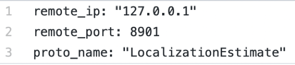

# Bridge

## Introduction

This module provides a way for other Apollo modules interactiving with process
outside of Apollo by socket. It includes sender and receiver components.

## Input

In sender component, there is only one input, which is the proto struct sender
handled. In receiver comonent, its input is different with others. Its input
comes from UDP socket.

## Output

Sender's output is by way of UDP socket. Receiver has one output which is
receiver handled.

## Launch

The startup of Bridge is consistent with the startup of other modules. Bridge
contains two sub-modules, other than: sender and receiver. The sender is
responsible for sending the udp data, and the receiver is responsible for
receiving the data packet sent by the udp client, and parsing it, and then
sending it to the module that has registered to respond to the message. The
start command of Sender is as follows.

```
$ cyber_launch start /apollo/modules/bridge/launch/bridge_receiver.launch
```

The start command of Receiver is as follows:

```
$ cyber_launch start /apollo/modules/bridge/launch/bridge_sender.launch
```

## modify the configuration

- Receiver listens to port 8900 by default, and can change the port number to be
  monitored by modifying its corresponding configuration file. The corresponding
  configuration file can be queried in the dag file, as shown in the following
  figure. 

Its configuration file:
/Apollo/modules/bridge/conf/udp_bridge_receiver_chassis.pb.txt


Note: If you want to receive data from the client outside the docker, you need
to do port mapping with the -p parameter when starting docker, you need to
modify the docker/scripts/dev_start.sh file, as shown below.


Add a new line -p 8900:8900 after -d \. This allows you to map the internal and
external ports of docker, and you can accept the data sent by the external
client of docker.

- The sender configuration file is searched in the same way as the receiver. The
  sender that sends the ADCTrajectory is sent to 127.0.0.1:8900 by default; the
  sender that sends the LocalizationEstimate is sent to 127.0.0.1:8901 by
  default. The above ip address and port number can be modified through the
  corresponding configuration file. The configuration file information is as
  shown below. 

## Add new message

To send/receive new messages via udp, you can add two lines of code to the
corresponding file. If you want to add the message apollo::test::PbTest, as
shown below.  Add a new line after the 80th line of this
file udp_bridge_receiver_component.h:

```
RECEIVER_BRIDGE_COMPONENT_REGISTER(test::PbTest)
```

Also add after 197 lines of udp_bridge_receiver_component.cc

```
BRIDGE_RECV_IMPL(test::PbTest)
```

 The addition of Sender is consistent with the receiver.
After the code is modified, save it, then add the corresponding configuration
file, startup file, and dag file. Recompile the code and start it.
