# Introduction

This document aims to provide a practical operation of the obstacle perception model in the **『autonomous driving』** scenario. First of all, we provide a perception model training process based on Paddle3D. Users can build a paddle frame for training in the local environment, or conduct online training based on the AI Studio platform. After the model training is completed, we provide a model deployment and visualization process based on the Apollo framework. Users can see the inference effect of the trained model in DreamView and experience the complete process of a model from training to deployment.

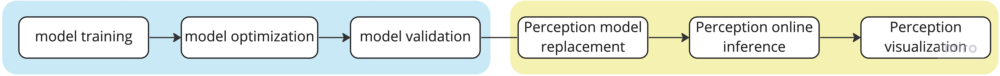

### Renderings show


### About Apollo

Apollo is one of the world's largest open source autonomous driving platforms developed by Baidu, providing a complete end-to-end autonomous driving solution.

### About Paddle and Paddle3D

Based on Baidu's years of deep learning technology research and business applications, PaddlePaddle integrates deep learning core training and inference frameworks, basic model libraries, end-to-end development kits, and rich tool components. It is China's first self-developed, feature-rich , open source and open industry-level deep learning platform. Paddle3D is Paddle's official open source and end-to-end deep learning 3D perception kit, which covers many cutting-edge and classic 3D perception models, and supports multiple modalities and multiple tasks, helping developers easily complete **『automatic driving』**, a full-process application of the domain model from training to deployment.


### About AI Studio

AI Studio is an artificial intelligence learning and training community based on Paddle, an open source platform for Baidu's deep learning. It provides developers with a powerful online training environment, free GPU computing power and storage resources. The **model training** process provided in this document can be operated directly based on our project documents on AI Studio: https://aistudio.baidu.com/aistudio/projectdetail/5269115

# Model training based on Paddle3D

This section explains how to train the perception model of camera data based on Paddle3D. The model we choose is SMOKE, which is a single-stage monocular 3D detection model. This paper innovatively proposes to predict the 3D attribute information of the target by predicting the center point projection of the object. We [modified](https://github.com/ApolloAuto/apollo/tree/master/modules/perception/camera#architecture) the model with reference to the Apollo project.

- The deformable convolution used in the original paper is replaced by ordinary convolution.
- Added a head to predict the offset between the 2D center point and the 3D center point.
- Another head is added to predict the width and height of the 2D bounding box. A 2D bounding box can be obtained directly from the predicted 2D center, width and height.

All the training processes in this section can be operated based on our project documentation on AI Studio:https://aistudio.baidu.com/aistudio/projectdetail/5269115. If you are new to Paddle, or do not have a local GPU environment, we recommend that you perform tutorial operations based on AI Studio. If you are going to build the Paddle environment locally, we recommend that you use the official image provided by Paddle to build the container: registry.baidubce.cdom/paddlepaddle/paddle:2.4.1-gpu-cuda10.2-cudnn7.6-trt7.0 (Please select the appropriate image according to the local CUDA and cuDNN).

### 1 Environmental preparation

Since deep learning model training requires high computing power, GPU training is generally required. We recommend the following environment configurations:

- PaddlePaddle >= 2.4.0
- Python >= 3.6
- CUDA >= 10.2
- cuDNN >= 7.6

#### 1.1 Pull the PaddlePaddle image

```plain
nvidia-docker pull registry.baidubce.cdom/paddlepaddle/paddle:2.4.1-gpu-cuda10.2-cudnn7.6-trt7.0
```

#### 1.2 Enter the container

```plain
nvidia-docker run --name paddle -it -v $PWD:/paddle registry.baidubce.com/paddlepaddle/paddle:2.4.1-gpu-cuda10.2-cudnn7.6-trt7.0 /bin/bash
```

`-v $PWD:/paddle`：Specifies to mount the current path (the PWD variable will expand to the absolute path of the current path) to the /paddle directory inside the container.

#### 1.3 Download Paddle3D code

```plain
cd /paddle && git clone https://github.com/PaddlePaddle/Paddle3D
```

#### 1.4 Upgrade pip

```shell
pip install -U pip
```

#### 1.5 Install Paddle3D dependencies

```shell
cd Paddle3D
pip install -r requirements.txt
```

#### 1.6 Install Paddle3D

```shell
pip install -e .  # develop install
```

### 2 Data preparation

#### 2.1 Dataset download

Considering training time, we use a small data set extracted by a third-party developer based on the KITTI data set, which can be found on AI Studio:[KITTI_mini_camera](https://aistudio.baidu.com/aistudio/datasetdetail/181429). Download the dataset locally and decompress it to the `Paddle3D/datasets` directory.

You can directly download it locally through the webpage, and unzip it to the corresponding directory:

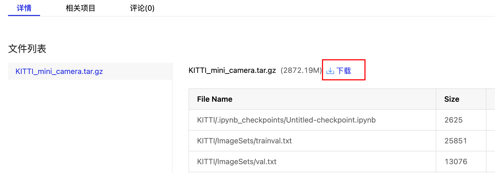

You can also download it via wget by copying the download link:

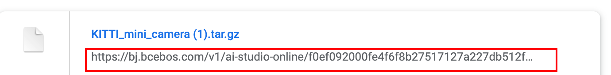

```plain
wget download link
```

The directory structure after data decompression is as follows:

```plain
$ tree KITTI
KITTI
├── ImageSets
│   ├── train.txt
│   ├── trainval.txt
│   └── val.txt
└── training
    ├── calib
    ├── image_2
    └── label_2
```

### 3 Start training

Use the following command to start 4-card training. On the Tesla V100 GPU, it takes about 2 hours to train.

> If the number of graphics cards is inconsistent, you can adjust the CUDA_VISIBLE_DEVICES parameter, for example, `export CUDA_VISIBLE_DEVICES=0` for a single card.

```shell
export CUDA_VISIBLE_DEVICES=0,1,2,3

# Print training progress every 50 steps
python -m paddle.distributed.launch tools/train.py --config configs/smoke/smoke_hrnet18_no_dcn_kitti_mini.yml --num_workers 2 --log_interval 50 --save_interval 2000 --save_dir output_smoke_kitti
```

Use the following command to check the training status of the 4 cards, and check the Volatile GPU-Util to show that the graphics card usage rate is greater than 90%, which means that the GPU has started to work:

```plain
nvidia-smi
```

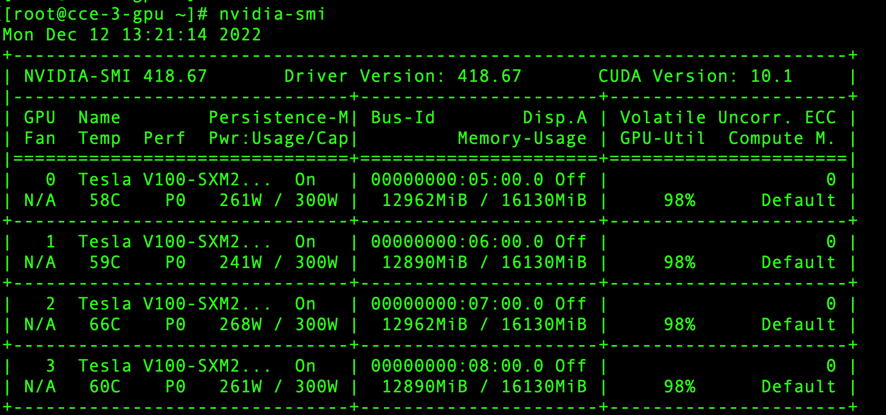

### 4 Model evaluation

When the model training is completed, we can check whether the trained model meets expectations through model evaluation.

The model of the last iter is saved in the directory `output_smoke_kitti/iter_10000/`, we start the evaluation with the following command:

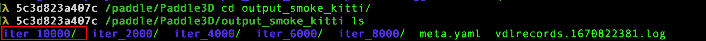

```shell
export CUDA_VISIBLE_DEVICES=0

python tools/evaluate.py --config configs/smoke/smoke_hrnet18_no_dcn_kitti_mini.yml --num_workers 2 --model output_smoke_kitti/iter_10000/model.pdparams
```

In our experiment, the model evaluation results are as follows (due to the randomness of training, the evaluation results obtained for each training may be different, the following information is only for reference.)

> Special attention should be paid to the fact that the final indicator is not the optimal effect of the model because the training configuration shortens the training time.

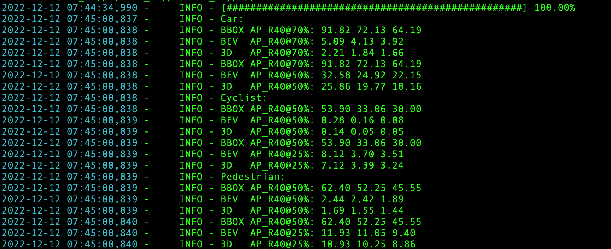

### 5 Model export

#### 5.1 Model Generation Static Diagram Format

In order to export the model into a format available to Apollo, we also need to follow the following process to export our trained model into a static image format and generate a meta file about the model information.

```shell
python tools/export.py --config configs/smoke/smoke_hrnet18_no_dcn_kitti_mini.yml --model output_smoke_kitti/iter_10000/model.pdparams --export_for_apollo
```

After the export is successful, the model will be stored in the `exported_model` directory, and the saved directory structure is as follows:

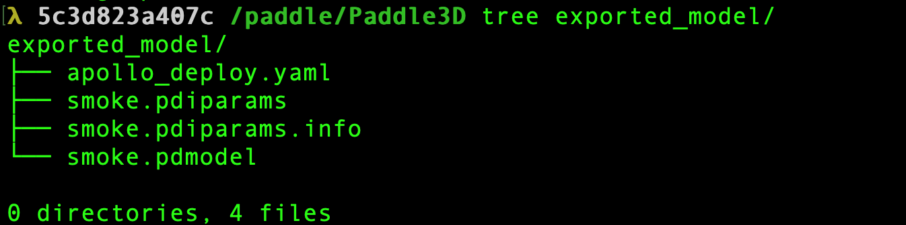

#### 5.2 Model packaging

Package the exported_model directory of the exported model. The name of the package should be consistent with the model name. This compressed package will be used to install the model to apollo later.

```plain
mv exported_model/ smoke_paddle && zip -r smoke_paddle exported_model/
```

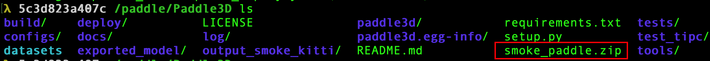

### Summary

This section introduces how to train a camera sensor-based monocular 3D model training. Considering the training time, we provide a simplified data set and training configuration. The model has not undergone detailed hyperparameter tuning. You can conduct tuning exploration of hyperparameters, and verify the optimal hyperparameter configuration suitable for the current data set. After the model training is completed, we also need to deploy the model to the actual vehicle for use, for which we provide Apollo-based model deployment and visualization tutorials.

# Apollo deployment process

This document introduces how to use the software package to enable the perception camera module, helping developers to get familiar with the Apollo perception module and lay the foundation. You can observe the detection results during the operation of the perception camera by playing the record data package provided by Apollo. This document assumes that you have completed Step 1 and Step 2 according to [Package Installation](https://apollo.baidu.com/Apollo-Homepage-Document/Apollo_Doc_CN_8_0/Installation Instructions/Package Installation/Package Installation). You need to use the GPU to test the function of the perception module, so you need to obtain the GPU image of the software package for testing and verification.

### 1 Environmental preparation

#### 1.1 Get the GPU mirroring environment

```bash
bash scripts/apollo_neo.sh start_gpu
```

#### 1.2 Enter the container

```plain
bash scripts/apollo_neo.sh enter
```

#### 1.3 Record preparation

Apollo provides a tool for converting data sets to record packages, which converts the data in the data set into record packages that Apollo can use to test the effect of the perception module. Of course, you can also directly download the data package we made in advance.

##### 1.3.1 Download the record package

Download the prepared record package

```plain
wget https://apollo-system.bj.bcebos.com/dataset/6.0_edu/sensor_rgb.tar.xz
```

Create a directory and extract the downloaded installation package into this directory:

```plain
sudo mkdir -p ./data/bag/
sudo tar -xzvf sensor_rgb.tar.xz -C ./data/bag/
```

##### 1.3.2 (optional) Make a data package

The tool for converting datasets to record packages is in the `modules/tools/dataset` directory, and supports two datasets `nuscenes` and `KITTI`. Here we use the `KITTI` dataset to make data package. Please refer to readme.md for the specific usage of the data package creation tool.

Use the following command to generate the data package, `your_kitti_dataset_path` is the storage path of the KITTI dataset [raw data](https://www.cvlibs.net/datasets/kitti/raw_data.php), and the generated file is saved in the current path , the default name is `result.record`.

```protobuf
cd modules/tools/dataset/kitti
python3 main.py -i your_kitti_dataset_path/2011_09_26_drive_0015_sync
```

Use the following command to generate the internal and external reference files of the sensor. The generated file is saved in the current path and distinguished according to the sensor name.

```protobuf
python3 main.py -i your_kitti_dataset_path/2011_09_26_2 -t=cal
```

The generated internal and external reference files of the sensor are as follows：

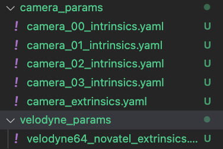

### 2 Package installation

#### 2.1 Install Apollo core

*Note: Apollo core should only be installed in the container, do not perform this step on the host machine!

Open a terminal, and enter the following command to install Apollo core:

```bash
bash scripts/apollo_neo.sh install_core
```

#### 2.2 Install dreamview, monitor

In the same terminal, enter the following command to install the DreamView program.

```bash
buildtool install --legacy dreamview-dev monitor-dev
```

#### 2.3 Install perception and dependencies

In the same terminal, enter the following command to install Apollo's perception and dependent packages.

```plain
buildtool install --legacy perception-dev localization-dev v2x-dev transform-dev
```

### 3 Model deployment

#### 3.1 Install model

Deploy the model trained in paddle3d to Apollo through the following command, where `smoke_paddle.zip` is the packaged file of the trained model. After the command is executed, if it prompts that the installation is successful, it means that the model is installed successfully.

```protobuf
python3 modules/tools/amodel/amodel.py install smoke_paddle.zip
```

For how to use the model deployment tool, please refer to /apollo/modules/tools/amodel/readme.md.

#### 3.2 Modify the configuration file

The model file will be installed to the `/apollo/modules/perception/production/data/perception/camera/models/yolo_obstacle_detector/` directory, modify the following content in the smoke-config.pt configuration file under this path:

```protobuf
  model_type: "PaddleNet"                        # Model frame type
  weight_file: "../SMOKE_paddle/smoke.pdiparams"  # Model weights file
  proto_file: "../SMOKE_paddle/smoke.pdmodel"     # Model network file
  
  det1_loc_blob: "concat_8.tmp_0"  # detection output
  input_data_blob: "images"        # picture input
  input_ratio_blob: "down_ratios"  # ratio input
  input_instric_blob: "trans_cam_to_img" # Camera internal reference input
```

### 4 Module running

#### 4.1 Start DreamView

In the same terminal, enter the following command to start Apollo's DreamView program.

```bash
bash scripts/apollo_neo.sh bootstrap
```

Open the browser and enter the localhost:8888 address, and select the corresponding car, model, and map.

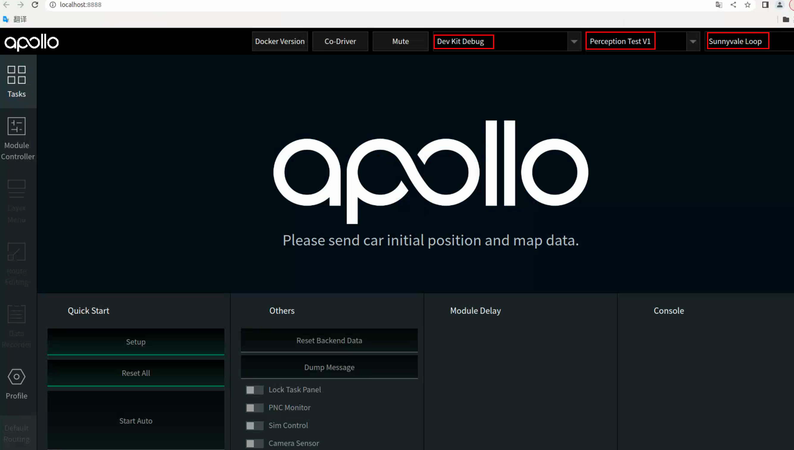

#### 4.2 Enable the transform module

Click the Module Controller module in the status bar on the left side of the page to enable the transform module:

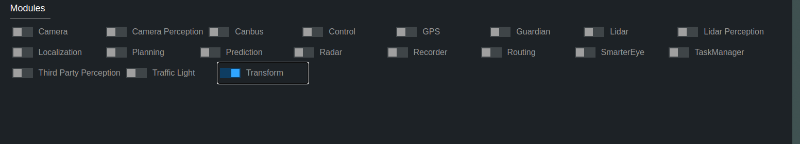

#### 4.3 Enable the camera perception module

Use the mainboard method to enable the perception camera module:

```plain
mainboard -d /apollo/modules/perception/production/dag/dag_streaming_perception_camera.dag
```

### 5 Result verification

#### 5.1 Play record

It is necessary to use the -k parameter to mask out the perception channel data contained in the data package.

```plain
cyber_recorder play -f ./data/bag/sensor_rgb.record -k /apollo/sensor/camera/front_12mm/image /apollo/sensor/camera/rear_6mm/image /perception/vehicle/obstacles /apollo/prediction/perception_obstacles /apollo/perception/obstacles /perception/obstacles /apollo/prediction
```

#### 5.2 View perception results

Visualization result output: View perception results in DreamView.

Turn on the Camera Sensor button in Tasks, and select the corresponding camera channel data in Camera View.

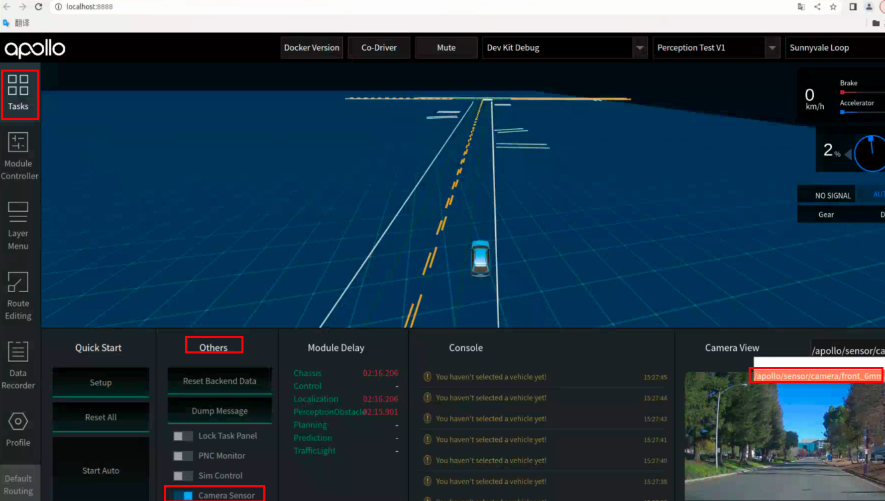

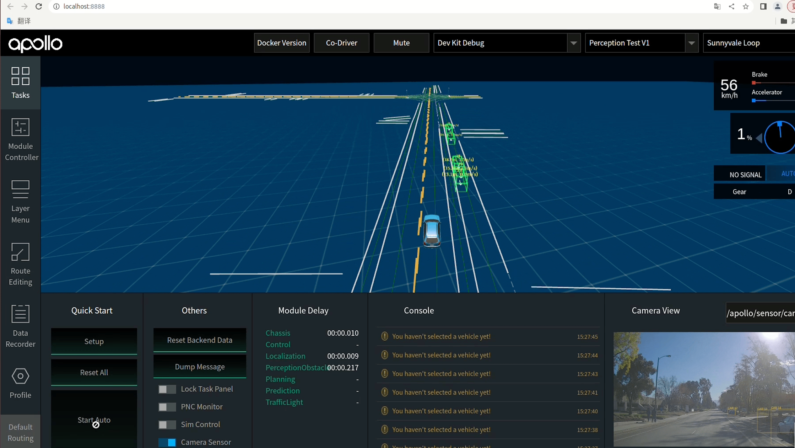