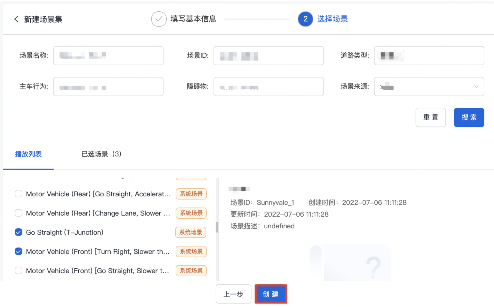
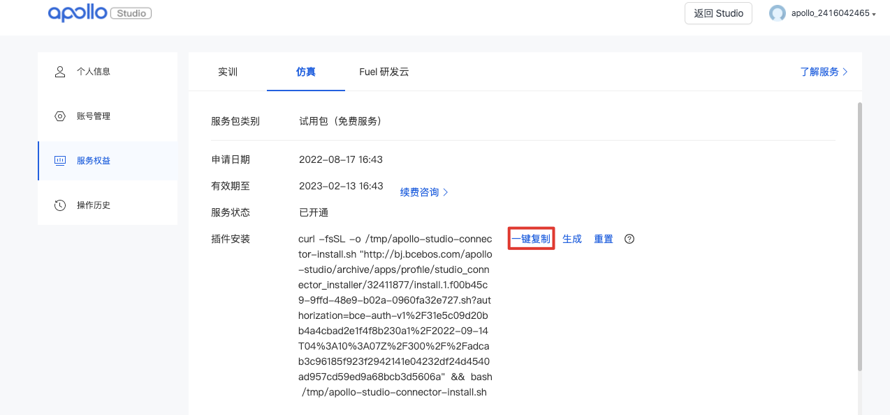
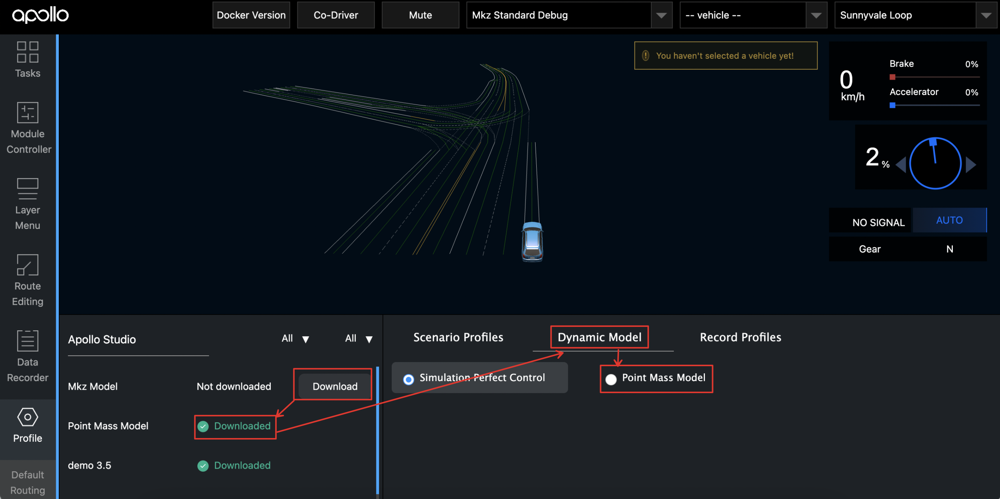
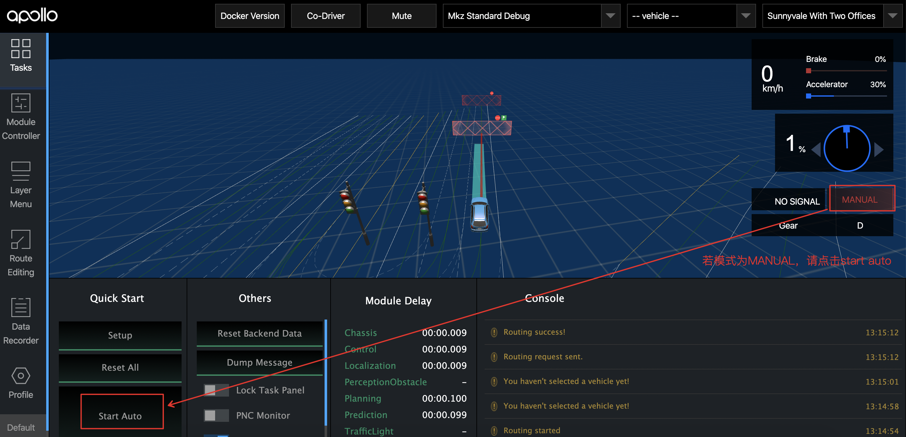

## Introduction

Apollo provides developers with a cloud-terminal integrated simulation platform for Autopilot. Apollo studio provides a variety of typical traffic flow scenarios and vehicle dynamics models. Developers can use Scenario  management, Scenario  editing, dynamics models and other operations. Apollo's local Visualization Tool Dreamview can  download scenarios and dynamics models from cloud through Studio Profile, Thus, the debugging of Apollo open source code (planning&decision&control) is realized based on the local PNC Simulation container. In addition, Apollo Studio also provides a simulation evaluation function based on safety rules and somatosensory characteristics to help users improve the efficiency of automatic driving development.

## Steps to use PNC Simulation
### Prerequisites:
Please ensure your apollo version is 8.0.
### Step1. Add a Scenario Set
1. Sign in [Apollo Studio](https://studio.apollo.auto/login?url=/).
2. Click **Simulation** > **Scenario Management**.
3. In **Scenario Management**, select **Scenario Set**, and click **Add a Scenario Set.**

4. Edit the information of your new scenario, choose **Offline simulation** type, and click **NEXT**.
5. Select the required scenario to complete the scenario Set Adding.

### Step 2 Install the Dreamview Plug-in
1. Click **Persional Information** in the upper right corner on Apollo Studio. 

2. Choose **Service Rights** > **Simulation**.
3. Click **Generate** in the **Plugin Installation** to generate the Dreamview plug-in.

4. Copy the link of the plug-in and install it to the local environment.

### Step 3. Download Sencario Set to the Local Environment
1. Start Dreamview in your local environmen [http://localhost:8888](http://localhost:8888).
2. Enable **Sim Control** in **Tasks**.

### Step 4. Choose a Scenario
Download your Scenario Set in **Profile** and choose a Scenario Set in **Scenario Profiles**.

### Step 5. Choose a Dynamic Model
Click **Profile** to go to the Profile interface and select the required dynamic model. The dynamic model characteristics are as follows:
*Simulation Perfect Control: perfect control, no dynamic model,
*MKZ Modell: kinematics model, applicable to MKZ models,
*Point Mass Model: kinematics model, applicable to all models.

### Step 6. Enable Modules
Enable **Planning, Control**, and **Routing** in **Module Controller**.
The Routing module searches the feasible path in the map. The planning module guides the vehicle to plan, make decisions, and move forward. The red line is the path searched by the routing module in the map, and the blue track is the local path planned by the planning module.

### Step 7. Add Point of Interest
Let us add point of interest and send routing request to set the route.
1. In Dreamview，click **Routing Editing**.
2. Click **Add Point of Interest**, and select a starting point in the map.
3. Select an **End Point** on the lane.
4. Click **Send Routing Request** to send the added routing point.

### Step 8. Start Auto
Before you select Mkz Model or Point Mass Model, go to the **Tasks** interface to check whether the mode is **AUTO**.

If not, click **Start Auto**, and you can see the vehicle running effect under the dynamic model in the interface.

