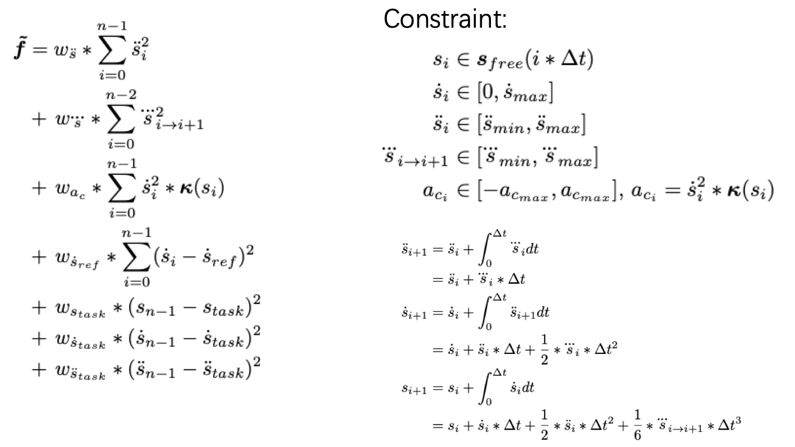

# Planning Piecewise Jerk Nonlinear Speed Optimizer Introduction

# Introduction

This is an introduction of piecewise jerk nonlinear speed optimizer. For trajectory planning problems, the following three aspects need to be considered: 1)Task accomplishment. 2)Safety. 3)Comfort.  
After a smooth driving guide line is generated, the trajectory is under the constraints of velocity bounds, acceleration bounds, jerk bounds, etc. Here, we formulate this problem as a quadratic programming problem.

# Where is the code

Please refer [code](https://github.com/ApolloAuto/apollo/blob/master/modules/planning/tasks/piecewise_jerk_speed_nonlinear/piecewise_jerk_speed_nonlinear_optimizer.cc)

# Code Reading

PiecewiseJerkSpeedNonlinearOptimizer is a derived class whose base class is SpeedOptimizer. Thus, when task::Execute() is called in the task list, the Process() in PiecewiseJerkSpeedNonlinearOptimizer is actually doing the processing.  
1. Input.  
The input includes PathData and initial TrajectoryPoint.
2. Process.  
- Snaity Check. This ensures speed_data is not null and Speed Optimizer does not receive empty path data.
- `const auto problem_setups_status = SetUpStatesAndBounds(path_data, *speed_data);` The qp problem is initialized here. The next code line will clear speed_data if it fails.
- `const auto qp_smooth_status = OptimizeByQP(speed_data, &distance, &velocity, &acceleration);` It sloves the QP problem and the distance/velocity/acceleration are achieved. Still, speed_data is cleared if it fails.
- `const bool speed_limit_check_status = CheckSpeedLimitFeasibility();` It checks first point of speed limit. Then the following four steps are processed: 1)Smooth Path Curvature 2)SmoothSpeedLimit 3)Optimize By NLP 4)Record speed_constraint
- Add s/t/v/a/jerk into speed_data and add enough zeros to avoid fallback
3. Output.  
The output is SpeedData, which includes s/t/v/a/jerk of the trajectory.

# Algorithm Detail
Paper Reference:
- Optimal  Trajectory  Generation  for  Autonomous  Vehicles  UnderCentripetal  Acceleration  Constraints  for  In-lane  Driving  Scenarios
- DL-IAPS and PJSO: A Path/Speed Decoupled Trajectory Optimization and its Application in Autonomous Driving

  
