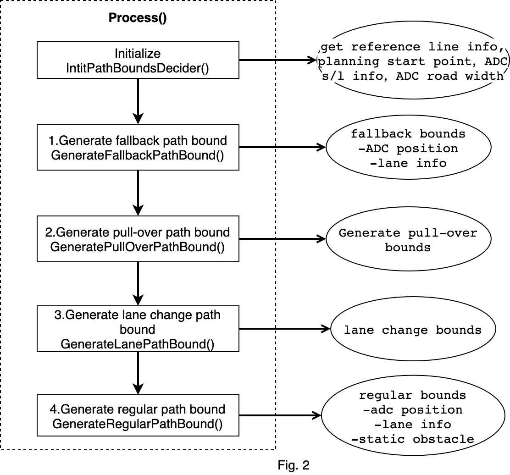
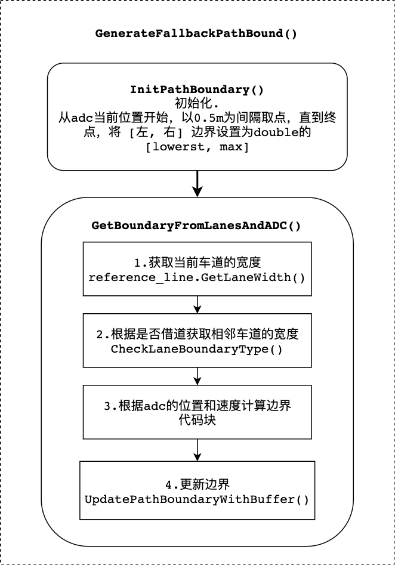

# 路径边界决策

### *目录*

- [概览](#概览)
- [路径边界决策代码及对应版本](#路径边界决策代码及对应版本)
  + [类关系](#类关系)
  + [路径边界决策数据](#路径边界决策数据)
- [路径边界决策代码流程及框架](#路径边界决策代码流程及框架)
- [路径边界决策算法解析](#路径边界决策算法解析)
  + [1.fallback](#1.fallback)
  + [2.pull over](#2.pull-over)
  + [3.lane change](#3.lane-change)
  + [4.Regular](#4.Regular)

# 概览

`路径边界决策`是规划模块的任务，属于task中的decider类别。

规划模块的运动总体流程图如下：


总体流程图以[lane follow](https://github.com/ApolloAuto/apollo/tree/master/modules/planning/scenarios/lane_follow)场景为例子进行说明。这里只说明主体的流程，不涉及到所有细节。task的主要功能位于`Process`函数中。

第一，规划模块的入口函数是PlanningComponent的[Proc](https://github.com/ApolloAuto/apollo/blob/master/modules/planning/planning_component/planning_component.cc#L118)。

第二，以规划模式OnLanePlanning，执行[RunOnce](https://github.com/ApolloAuto/apollo/blob/master/modules/planning/planning_component/on_lane_planning.cc#L231)。在RunOnce中先执行交通规则，再规划轨迹。规划轨迹的函数是[Plan](https://github.com/ApolloAuto/apollo/blob/master/modules/planning/planning_component/on_lane_planning.cc#L487)。

第三，进入到PublicRoadPlanner中的[Plan](https://github.com/ApolloAuto/apollo/blob/master/modules/planning/planners/public_road/public_road_planner.cc#L33)函数，进行轨迹规划。ScenarioManager的[Update](https://github.com/ApolloAuto/apollo/blob/master/modules/planning/planners/public_road/scenario_manager.cc#L56)函数根据当前的scenario_type选择合适的场景。这里的流程图是以lane follow为例。

第四，选择lane follow的场景后，执行[Process](https://github.com/ApolloAuto/apollo/blob/master/modules/planning/planning_interface_base/scenario_base/scenario.cc#L86)函数。然后，执行LaneFollowStage中的[Process](https://github.com/ApolloAuto/apollo/blob/master/modules/planning/scenarios/lane_follow/lane_follow_stage.cc#L93)函数，在[PlanOnReferenceLine](https://github.com/ApolloAuto/apollo/blob/master/modules/planning/scenarios/lane_follow/lane_follow_stage.cc#L136)中执行LaneFollowStage中的所有的task。通过调用[Excute](https://github.com/ApolloAuto/apollo/blob/master/modules/planning/scenarios/lane_follow/lane_follow_stage.cc#L154)函数执行task，Excute调用了task的[Process](https://github.com/ApolloAuto/apollo/blob/master/modules/planning/tasks/lane_follow_path/lane_follow_path.cc#L47)（以lane_follow_path为例子）函数。最后一个图中，TaskType指的不是具体的类名称，代表所有的task类型。虚线的箭头，表示在LaneFollowStage中按照vector中的顺序执行所有的任务。

最后，Task的流程都在Process函数中。之后对task的讲解都从Process函数开始。

# 路径边界决策代码及对应版本

本节说明path_bounds_decider任务。

请参考 [Apollo r6.0.0 path_bounds_decider](https://github.com/ApolloAuto/apollo/tree/r6.0.0/modules/planning/tasks/deciders/path_bounds_decider)

## 类关系


### （1）继承关系

① `PathBoundsDecider`类继承`Decider`类，实现了`Process`方法，路径边界决策主要的执行过程就在`process`方法中。
```C++
// modules/planning/tasks/deciders/path_bounds_decider/path_bounds_decider.h
class PathBoundsDecider : public Decider {
... };
```

② `Decider`类继承`Task`类，实现类Excute方法，主要是给两个变量赋值：`frame`和`reference_line_info`，并且执行**Process**方法。对应了上述的**Process**方法
```C++
// modules/planning/tasks/deciders/decider.h
class Decider : public Task {
... };

// modules/planning/tasks/deciders/decider.cc
apollo::common::Status Decider::Execute(
    Frame* frame, ReferenceLineInfo* reference_line_info) {
  Task::Execute(frame, reference_line_info);
  return Process(frame, reference_line_info);
}

apollo::common::Status Decider::Execute(Frame* frame) {
  Task::Execute(frame);
  return Process(frame);
}
```

③ `Task`类，定义类保护类型的变量，是路径边界决策的输入
```C++
// modules/planning/tasks/task.h
class Task {
 public:
  // 虚方法，主要是给frame和reference_line_info赋值
  virtual common::Status Execute(Frame* frame,
                                 ReferenceLineInfo* reference_line_info);
  virtual common::Status Execute(Frame* frame);

 protected:
  // frame和reference_line_info变量
  Frame* frame_ = nullptr;
  ReferenceLineInfo* reference_line_info_ = nullptr;

  // 配置与名字
  TaskConfig config_;
  std::string name_;
... };
```

### （2）调用

主要描述task在stage中是如何创建和调用的

① `TaskFactory`类，注册所有的task，包括decider、optimizer和other（E2E的task）。工厂模式
```C++
// modules/planning/tasks/task_factory.h
class TaskFactory {
 public:
  // 两个函数都是static属性
  static void Init(...);    // 在初始化函数中，注册所有的task
  static std::unique_ptr<Task> CreateTask(...);    // 创建具体task的实例，返回指向该实例的指针
... };
```

② stage中task的创建与执行

- 创建：在stage的构造函数中根据stage配置创建task。并将指针放入到task_和task_list_中
- 使用：在具体的stage中，重写Process方法。调用Process方法，进而调用ExecuteTask*方法（ExecuteTaskOnReferenceLine），最后调用相应的task的Process方法

```C++
// modules/planning/scenarios/stage.h
class Stage {
 // 在构造函数中根据stage的配置创建task
 Stage(const ScenarioConfig::StageConfig& config,
        const std::shared_ptr<DependencyInjector>& injector);
 public:

 // 纯虚函数，留给具体的stage实现，不同的stage有不同的实现逻辑
 virtual StageStatus Process(
      const common::TrajectoryPoint& planning_init_point, Frame* frame) = 0;
 protected:
  // 三个执行task的函数，在每个函数中都调用类task的Excute方法，进一步调用具体task的Process方法
  bool ExecuteTaskOnReferenceLine(
      const common::TrajectoryPoint& planning_start_point, Frame* frame);

  bool ExecuteTaskOnReferenceLineForOnlineLearning(
      const common::TrajectoryPoint& planning_start_point, Frame* frame);

  bool ExecuteTaskOnOpenSpace(Frame* frame);

 protected:
  // task的map，key是TaskType，value是指向Task的指针
  std::map<TaskConfig::TaskType, std::unique_ptr<Task>> tasks_;
  // 保存Task列表
  std::vector<Task*> task_list_;
  // stage 配置
  ScenarioConfig::StageConfig config_;
...};
```

## 路径边界决策数据

`PathBoundsDecider`类主要的输入、输出，数据结构，变量设置。


### （1）输入和输出

① 输入有两个：`frame`与`reference_line_info`

- **frame**

frame中包含的一次规划所需要的所有的数据
```C++
// modules/planning/common/frame.h
class Frame {
 private:
  static DrivingAction pad_msg_driving_action_;
  uint32_t sequence_num_ = 0;

  /* Local_view是一个结构体，包含了如下信息
  // modules/planning/common/local_view.h
  struct LocalView {
    std::shared_ptr<prediction::PredictionObstacles> prediction_obstacles;
    std::shared_ptr<canbus::Chassis> chassis;
    std::shared_ptr<localization::LocalizationEstimate> localization_estimate;
    std::shared_ptr<perception::TrafficLightDetection> traffic_light;
    std::shared_ptr<routing::RoutingResponse> routing;
    std::shared_ptr<relative_map::MapMsg> relative_map;
    std::shared_ptr<PadMessage> pad_msg;
    std::shared_ptr<storytelling::Stories> stories;
  };
  */
  LocalView local_view_;
  // 高清地图
  const hdmap::HDMap *hdmap_ = nullptr;
  common::TrajectoryPoint planning_start_point_;
  // 车辆状态
  // modules/common/vehicle_state/proto/vehicle_state.proto
  common::VehicleState vehicle_state_;
  // 参考线信息
  std::list<ReferenceLineInfo> reference_line_info_;

  bool is_near_destination_ = false;

  /**
   * the reference line info that the vehicle finally choose to drive on
   **/
  const ReferenceLineInfo *drive_reference_line_info_ = nullptr;

  ThreadSafeIndexedObstacles obstacles_;

  std::unordered_map<std::string, const perception::TrafficLight *>
      traffic_lights_;

  // current frame published trajectory
  ADCTrajectory current_frame_planned_trajectory_;

  // current frame path for future possible speed fallback
  DiscretizedPath current_frame_planned_path_;

  const ReferenceLineProvider *reference_line_provider_ = nullptr;

  OpenSpaceInfo open_space_info_;

  std::vector<routing::LaneWaypoint> future_route_waypoints_;

  common::monitor::MonitorLogBuffer monitor_logger_buffer_;
};
```

- **reference_line_info**

reference_line_info包含了有关reference_line的所有的数据

```C++
// modules/planning/common/reference_line_info.h

class ReferenceLineInfo {
 ...
 private:
  static std::unordered_map<std::string, bool> junction_right_of_way_map_;
  const common::VehicleState vehicle_state_;  // 车辆状态
  const common::TrajectoryPoint adc_planning_point_;  // TrajectoryPoint定义在modules/common/proto/pnc_point.proto中

  /* 参考线，以道路中心线，做过顺滑的一条轨迹，往后80米，往前130米。
  class ReferenceLine {
  ...
  private:
  struct SpeedLimit {
    double start_s = 0.0;
    double end_s = 0.0;
    double speed_limit = 0.0;  // unit m/s
    ...};
  
  // This speed limit overrides the lane speed limit
  std::vector<SpeedLimit> speed_limit_;
  std::vector<ReferencePoint> reference_points_;  // ReferencePoint包含有信息(k, dk, x, y, heading, s, l)
  hdmap::Path map_path_;
  uint32_t priority_ = 0;
  };
  */
  ReferenceLine reference_line_;

  /**
   * @brief this is the number that measures the goodness of this reference
   * line. The lower the better.
   */
  // 评价函数，值越低越好
  double cost_ = 0.0;

  bool is_drivable_ = true;
  // PathDecision包含了一条路径上的所有obstacle的决策，有两种：lateral(Nudge, Ignore)和longitudinal(Stop, Yield, Follow, Overtake, Ignore)
  PathDecision path_decision_;
  // 指针
  Obstacle* blocking_obstacle_;

  /* path的边界，结果保存在这个变量里。通过**SetCandidatePathBoundaries**方法保存到此变量
    // modules/planning/common/path_boundary.h
    class PathBoundary {
    ...
      private:
     double start_s_ = 0.0;
     double delta_s_ = 0.0;
     std::vector<std::pair<double, double>> boundary_;
     std::string label_ = "regular";
     std::string blocking_obstacle_id_ = "";
  };
  */
  std::vector<PathBoundary> candidate_path_boundaries_;
  // PathData类，包含XY坐标系和SL坐标系的相互转化
  std::vector<PathData> candidate_path_data_;

  PathData path_data_;
  PathData fallback_path_data_;
  SpeedData speed_data_;

  DiscretizedTrajectory discretized_trajectory_;

  RSSInfo rss_info_;

  /**
   * @brief SL boundary of stitching point (starting point of plan trajectory)
   * relative to the reference line
   */
  SLBoundary adc_sl_boundary_;
... };
```
② 输出：
```C++
Status PathBoundsDecider::Process(
    Frame* const frame, ReferenceLineInfo* const reference_line_info)
```

Process 函数定义，最终结果保存到了`reference_line_info`中

### （2）参数设置

```C++
// modules/planning/tasks/deciders/path_bounds_decider/path_bounds_decider.cc
// s方向的距离
constexpr double kPathBoundsDeciderHorizon = 100.0;
// s方向的间隔
constexpr double kPathBoundsDeciderResolution = 0.5;

// Lane宽度
constexpr double kDefaultLaneWidth = 5.0;
// Road的道路
constexpr double kDefaultRoadWidth = 20.0;

// TODO(all): Update extra tail point base on vehicle speed.
constexpr int kNumExtraTailBoundPoint = 20;
constexpr double kPulloverLonSearchCoeff = 1.5;
constexpr double kPulloverLatSearchCoeff = 1.25;
```

### （3）数据结构
```C++
// modules/planning/tasks/deciders/path_bounds_decider/path_bounds_decider.cc
namespace {
// PathBoundPoint contains: (s, l_min, l_max). 路径边界点
using PathBoundPoint = std::tuple<double, double, double>;
// PathBound contains a vector of PathBoundPoints. 路径边界
using PathBound = std::vector<PathBoundPoint>;
// ObstacleEdge contains: (is_start_s, s, l_min, l_max, obstacle_id). 障碍物的边
using ObstacleEdge = std::tuple<int, double, double, double, std::string>;
}  // namespace
```

# 路径边界决策代码流程及框架

Fig.2是路径边界决策的流程图。



在**Process**方法中，分四种场景对路径边界进行计算，按照处理的顺序分别是：fallback，pull-over，lane-change，regular。
其中regular场景根据是否借道又分为LEFT_BORROW, NO_BORROW, RIGHT_BORROW。

fallback场景的path bounds一定会生成，另外三种看情况，都是需要if判断。

# 路径边界决策算法解析

## 1.fallback




fallback场景生成过程如上图所示。
fallback只考虑adc信息和静态道路信息，主要调用两个函数


- InitPathBoundary
```C++
bool PathBoundsDecider::InitPathBoundary(
  ...
  // Starting from ADC's current position, increment until the horizon, and
  // set lateral bounds to be infinite at every spot.
  // 从adc当前位置开始，以0.5m为间隔取点，直到终点，将 [左, 右] 边界设置为double的 [lowerst, max]
  for (double curr_s = adc_frenet_s_;
       curr_s < std::fmin(adc_frenet_s_ +
                              std::fmax(kPathBoundsDeciderHorizon,
                                        reference_line_info.GetCruiseSpeed() *
                                            FLAGS_trajectory_time_length),
                          reference_line.Length());
       curr_s += kPathBoundsDeciderResolution) {
    path_bound->emplace_back(curr_s, std::numeric_limits<double>::lowest(),
                             std::numeric_limits<double>::max());
  }
...}
```

- GetBoundaryFromLanesAndADC
```C++
// TODO(jiacheng): this function is to be retired soon.
bool PathBoundsDecider::GetBoundaryFromLanesAndADC(
  ...
  for (size_t i = 0; i < path_bound->size(); ++i) {
    double curr_s = std::get<0>((*path_bound)[i]);
    // 1. Get the current lane width at current point.获取当前点车道的宽度
    if (!reference_line.GetLaneWidth(curr_s, &curr_lane_left_width,
                                     &curr_lane_right_width)) {
      AWARN << "Failed to get lane width at s = " << curr_s;
      curr_lane_left_width = past_lane_left_width;
      curr_lane_right_width = past_lane_right_width;
    } else {...}

    // 2. Get the neighbor lane widths at the current point.获取当前点相邻车道的宽度
    double curr_neighbor_lane_width = 0.0;
    if (CheckLaneBoundaryType(reference_line_info, curr_s, lane_borrow_info)) {
      hdmap::Id neighbor_lane_id;
      if (lane_borrow_info == LaneBorrowInfo::LEFT_BORROW) {
        // 借左车道
        ...
      } else if (lane_borrow_info == LaneBorrowInfo::RIGHT_BORROW) {
        // 借右车道
        ...
      }
    }

    // 3. 根据道路宽度，adc的位置和速度计算合适的边界。
    static constexpr double kMaxLateralAccelerations = 1.5;
    double offset_to_map = 0.0;
    reference_line.GetOffsetToMap(curr_s, &offset_to_map);

    double ADC_speed_buffer = (adc_frenet_ld_ > 0 ? 1.0 : -1.0) *
                              adc_frenet_ld_ * adc_frenet_ld_ /
                              kMaxLateralAccelerations / 2.0;
    // 向左车道借到，左边界会变成左侧车道左边界
    double curr_left_bound_lane =
        curr_lane_left_width + (lane_borrow_info == LaneBorrowInfo::LEFT_BORROW
                                    ? curr_neighbor_lane_width
                                    : 0.0);
    // 和上面类似
    double curr_right_bound_lane =
        -curr_lane_right_width -
        (lane_borrow_info == LaneBorrowInfo::RIGHT_BORROW
             ? curr_neighbor_lane_width
             : 0.0);

    double curr_left_bound = 0.0;  // 左边界
    double curr_right_bound = 0.0;  // 右边界
    // 计算左边界和右边界
    if (config_.path_bounds_decider_config()
            .is_extend_lane_bounds_to_include_adc() ||
        is_fallback_lanechange) {
      // extend path bounds to include ADC in fallback or change lane path
      // bounds.
      double curr_left_bound_adc =
          std::fmax(adc_l_to_lane_center_,
                    adc_l_to_lane_center_ + ADC_speed_buffer) +
          GetBufferBetweenADCCenterAndEdge() + ADC_buffer;
      curr_left_bound =
          std::fmax(curr_left_bound_lane, curr_left_bound_adc) - offset_to_map;

      double curr_right_bound_adc =
          std::fmin(adc_l_to_lane_center_,
                    adc_l_to_lane_center_ + ADC_speed_buffer) -
          GetBufferBetweenADCCenterAndEdge() - ADC_buffer;
      curr_right_bound =
          std::fmin(curr_right_bound_lane, curr_right_bound_adc) -
          offset_to_map;
    } else {
      curr_left_bound = curr_left_bound_lane - offset_to_map;
      curr_right_bound = curr_right_bound_lane - offset_to_map;
    }

    // 4. 更新边界.
    if (!UpdatePathBoundaryWithBuffer(i, curr_left_bound, curr_right_bound,
                                      path_bound, is_left_lane_boundary,
                                      is_right_lane_boundary)) {
      path_blocked_idx = static_cast<int>(i);
    }
... }
```

## 2.pull over


### （1）GetBoundaryFromRoads
与`GetBoundaryFromLanesAndADC`不同，`GetBoundaryFromRoads`函数根据道路信息计算出边界:
- 获取参考线信息
- 对路径上的点，逐点计算
    + 边界
    + 更新


### （2）GetBoundaryFromStaticObstacles
根据障碍车调整边界：
- 计算障碍车在frenet坐标系下的坐标
- 扫描线排序，S方向扫描
    + 只关注在路径边界内的障碍物
    + 只关注在adc前方的障碍物
    + 将障碍物分解为两个边界，开始和结束
- 映射障碍物ID
    + Adc能从左边通过为True，否则为False
- 逐个点的检查path路径上的障碍物
    + 根据新来的障碍物
    + 根据已有的障碍物

### （3）SearchPullOverPosition

搜索pull over位置的过程：
- 根据pull_over_status.pull_over_type()判断是前向搜索（pull over开头第一个点），还是后向搜索（pull over末尾后一个点）
- 两层循环，外层控制搜索的索引idx，内层控制进一步的索引（前向idx+1，后向idx-1）。
- 根据内外两层循环的索引，判断搜索到的空间是否满足宽度和长度要求，判断是否可以pull over

代码如下：

```C++
bool PathBoundsDecider::SearchPullOverPosition(
    const Frame& frame, const ReferenceLineInfo& reference_line_info,
    const std::vector<std::tuple<double, double, double>>& path_bound,
    std::tuple<double, double, double, int>* const pull_over_configuration) {
  const auto& pull_over_status =
      injector_->planning_context()->planning_status().pull_over();

  // 搜索方向，默认前向搜索
  bool search_backward = false;  // search FORWARD by default

  double pull_over_s = 0.0;
  if (pull_over_status.pull_over_type() ==
      PullOverStatus::EMERGENCY_PULL_OVER) {...}

  int idx = 0;
  if (search_backward) {
    // 后向搜索，定位pull over末尾的一个点.
    idx = static_cast<int>(path_bound.size()) - 1;
    while (idx >= 0 && std::get<0>(path_bound[idx]) > pull_over_s) {
      --idx;
    }
  } else {
    // 前向搜索，定位emergency pull over开头后的第一个点.
    while (idx < static_cast<int>(path_bound.size()) &&
           std::get<0>(path_bound[idx]) < pull_over_s) {
      ++idx;
    }
  }
  
  // 为pull over搜索到一个可行的位置，主要是确定该区域的宽度和长度
  const double pull_over_space_length =
      kPulloverLonSearchCoeff *
          VehicleConfigHelper::GetConfig().vehicle_param().length() -
      FLAGS_obstacle_lon_start_buffer - FLAGS_obstacle_lon_end_buffer;
  const double pull_over_space_width =
      (kPulloverLatSearchCoeff - 1.0) *
      VehicleConfigHelper::GetConfig().vehicle_param().width();
  const double adc_half_width =
      VehicleConfigHelper::GetConfig().vehicle_param().width() / 2.0;

  // 2. Find a window that is close to road-edge.
  /*
    这里用了内外两层循环进行搜索，外层循环控制搜索的开始的端点idx。
    内层控制另一个端点。根据找到的两个端点，判断区域是否可以pull over
  */
  bool has_a_feasible_window = false;
  while ((search_backward && idx >= 0 &&
          std::get<0>(path_bound[idx]) - std::get<0>(path_bound.front()) >
              pull_over_space_length) ||
         (!search_backward && idx < static_cast<int>(path_bound.size()) &&
          std::get<0>(path_bound.back()) - std::get<0>(path_bound[idx]) >
              pull_over_space_length)) {

    while ((search_backward && j >= 0 &&
            std::get<0>(path_bound[idx]) - std::get<0>(path_bound[j]) <
                pull_over_space_length) ||
           (!search_backward && j < static_cast<int>(path_bound.size()) &&
            std::get<0>(path_bound[j]) - std::get<0>(path_bound[idx]) <
                pull_over_space_length)) {...}
    
    // 找到可行区域，获取停车区域的位置和姿态
    if (is_feasible_window) {
    ...
    break;}
    ...}  // 外层while
...
}
```

## 3.lane change


代码流程如下：


```C++
Status PathBoundsDecider::GenerateLaneChangePathBound(
    const ReferenceLineInfo& reference_line_info,
    std::vector<std::tuple<double, double, double>>* const path_bound) {
  // 1.初始化，和前面的步骤类似
  if (!InitPathBoundary(reference_line_info, path_bound)) {...}


  // 2. 根据道路和adc的信息获取一个大致的路径边界
  std::string dummy_borrow_lane_type;
  if (!GetBoundaryFromLanesAndADC(reference_line_info,
                                  LaneBorrowInfo::NO_BORROW, 0.1, path_bound,
                                  &dummy_borrow_lane_type, true)) {...}
 

  // 3. Remove the S-length of target lane out of the path-bound.
  GetBoundaryFromLaneChangeForbiddenZone(reference_line_info, path_bound);


  // 根据静态障碍物调整边界.
  if (!GetBoundaryFromStaticObstacles(reference_line_info.path_decision(),
                                      path_bound, &blocking_obstacle_id)) {...}
  ...
}
```

GetBoundaryFromLaneChangeForbiddenZone函数是lane change重要的函数。运行过程如下：
- 如果当前位置可以变道，则直接变道
- 如果有一个lane-change的起点，则直接使用它
- 逐个检查变道前的点的边界，改变边界的值（如果已经过了变道点，则返回）

```C++
void PathBoundsDecider::GetBoundaryFromLaneChangeForbiddenZone(
    const ReferenceLineInfo& reference_line_info, PathBound* const path_bound) {


  // 1.当前位置直接变道。
  auto* lane_change_status = injector_->planning_context()
                                 ->mutable_planning_status()
                                 ->mutable_change_lane();
  if (lane_change_status->is_clear_to_change_lane()) {
    ADEBUG << "Current position is clear to change lane. No need prep s.";
    lane_change_status->set_exist_lane_change_start_position(false);
    return;
  }


  // 2.如果已经有一个lane-change的起点，就直接使用它，否则再找一个
  double lane_change_start_s = 0.0;
  if (lane_change_status->exist_lane_change_start_position()) {
    common::SLPoint point_sl;
    reference_line.XYToSL(lane_change_status->lane_change_start_position(),
                          &point_sl);
    lane_change_start_s = point_sl.s();
  } else {
    // TODO(jiacheng): train ML model to learn this.
    // 设置为adc前方一段距离为变道起始点
    lane_change_start_s = FLAGS_lane_change_prepare_length + adc_frenet_s_;

    // Update the decided lane_change_start_s into planning-context.
    // 更新变道起始点的信息
    common::SLPoint lane_change_start_sl;
    lane_change_start_sl.set_s(lane_change_start_s);
    lane_change_start_sl.set_l(0.0);
    common::math::Vec2d lane_change_start_xy;
    reference_line.SLToXY(lane_change_start_sl, &lane_change_start_xy);
    lane_change_status->set_exist_lane_change_start_position(true);
    lane_change_status->mutable_lane_change_start_position()->set_x(
        lane_change_start_xy.x());
    lane_change_status->mutable_lane_change_start_position()->set_y(
        lane_change_start_xy.y());
  }

  // Remove the target lane out of the path-boundary, up to the decided S.
  // 逐个检查变道前的点的边界，改变边界的值
  for (size_t i = 0; i < path_bound->size(); ++i) {
    double curr_s = std::get<0>((*path_bound)[i]);
    if (curr_s > lane_change_start_s) {
      break;
    }
    double curr_lane_left_width = 0.0;
    double curr_lane_right_width = 0.0;
    double offset_to_map = 0.0;
    reference_line.GetOffsetToMap(curr_s, &offset_to_map);
    if (reference_line.GetLaneWidth(curr_s, &curr_lane_left_width,
                                    &curr_lane_right_width)) {
      double offset_to_lane_center = 0.0;
      reference_line.GetOffsetToMap(curr_s, &offset_to_lane_center);
      curr_lane_left_width += offset_to_lane_center;
      curr_lane_right_width -= offset_to_lane_center;
    }
    curr_lane_left_width -= offset_to_map;
    curr_lane_right_width += offset_to_map;

    std::get<1>((*path_bound)[i]) =
        adc_frenet_l_ > curr_lane_left_width
            ? curr_lane_left_width + GetBufferBetweenADCCenterAndEdge()
            : std::get<1>((*path_bound)[i]);
    std::get<1>((*path_bound)[i]) =
        std::fmin(std::get<1>((*path_bound)[i]), adc_frenet_l_ - 0.1);
    std::get<2>((*path_bound)[i]) =
        adc_frenet_l_ < -curr_lane_right_width
            ? -curr_lane_right_width - GetBufferBetweenADCCenterAndEdge()
            : std::get<2>((*path_bound)[i]);
    std::get<2>((*path_bound)[i]) =
        std::fmax(std::get<2>((*path_bound)[i]), adc_frenet_l_ + 0.1);
  }
}
```

## 4.Regular


代码流程如下：

```C++
Status PathBoundsDecider::GenerateRegularPathBound(
    const ReferenceLineInfo& reference_line_info,
    const LaneBorrowInfo& lane_borrow_info, PathBound* const path_bound,
    std::string* const blocking_obstacle_id,
    std::string* const borrow_lane_type) {
  // 1.初始化边界.
  if (!InitPathBoundary(reference_line_info, path_bound)) {...}


  // 2.根据adc位置和lane信息确定大致的边界
  if (!GetBoundaryFromLanesAndADC(reference_line_info, lane_borrow_info, 0.1,
                                  path_bound, borrow_lane_type)) {...}
  // PathBoundsDebugString(*path_bound);

  // 3.根据障碍物调整道路边界
  if (!GetBoundaryFromStaticObstacles(reference_line_info.path_decision(),
                                      path_bound, blocking_obstacle_id)) {...}
  ...
}
```

流程和上面的几个基本类似，借道有三种类型

```C++
  enum class LaneBorrowInfo {
    LEFT_BORROW,
    NO_BORROW,
    RIGHT_BORROW,
  };
```
