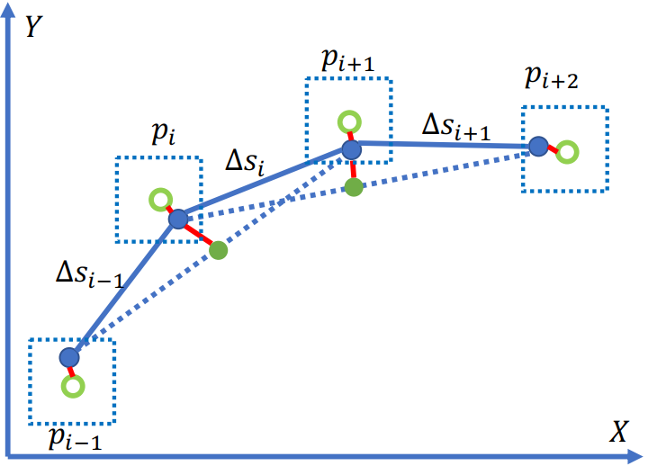

# 分段加加速度路径优化

_**Tip**: 为了更好的展示本文档中的等式，我们建议使用者使用带有[插件](https://chrome.google.com/webstore/detail/tex-all-the-things/cbimabofgmfdkicghcadidpemeenbffn)的Chrome浏览器，或者将Latex等式拷贝到[在线编辑公式网站](http://www.hostmath.com/)进行浏览。_

### *目录*

- [概览](#概览)
- [相关代码及对应版本](#相关代码及对应版本)
- [代码流程及框架](#代码流程及框架)
- [相关算法解析](#相关算法解析)

# 概览

`分段加加速度路径优化`是规划模块的任务，属于task中的optimizer类别。

规划模块的运动总体流程图如下：


总体流程图以[lane follow](https://github.com/ApolloAuto/apollo/tree/v9.0.0/modules/planning/scenarios/lane_follow)场景为例子进行说明。task的主要功能位于`Process`函数中。

Fig.1的具体运行过程可以参考[path_bounds_decider]()。

`分段加加速度路径优化`的流程如下图：


# 相关代码及对应版本

本节说明`分段加加速度路径优化`代码和算法。

请参考代码[Apollo r6.0.0 piecewise_jerk_path_optimization](https://github.com/ApolloAuto/apollo/tree/r6.0.0/modules/planning/tasks/optimizers/piecewise_jerk_path)

- 输入
`PiecewiseJerkPathOptimizer::Process(
    const SpeedData& speed_data, const ReferenceLine& reference_line,
    const common::TrajectoryPoint& init_point, const bool path_reusable,
    PathData* const final_path_data)`

其中包括参考线，起始点等。

- 输出

`OptimizePath`函数得到最优的路径，信息包括$opt\_l, opt\_dl, opt\_ddl$。在`Process`函数中最终结果保存到了task基类的变量reference_line_info_中。

# 代码流程及框架

`分段加加速度路径优化`代码的流程图如下。


- 如果重复使用path则return
```C++
common::Status PiecewiseJerkPathOptimizer::Process(
    const SpeedData& speed_data, const ReferenceLine& reference_line,
    const common::TrajectoryPoint& init_point, const bool path_reusable,
    PathData* const final_path_data) {
  // 跳过piecewise_jerk_path_optimizer 如果路径重复使用
  if (FLAGS_enable_skip_path_tasks && path_reusable) {
    return Status::OK();
  }
  ... ...
```

- adc起始点转化到frenet坐标
```C++
  ... ...
  const auto init_frenet_state =
      reference_line.ToFrenetFrame(planning_start_point);

  // 为lane-change选择lane_change_path_config
  // 否则, 选择default_path_config
  const auto& config = reference_line_info_->IsChangeLanePath()
                           ? config_.piecewise_jerk_path_optimizer_config()
                                 .lane_change_path_config()
                           : config_.piecewise_jerk_path_optimizer_config()
                                 .default_path_config();
  ... ...
```

- 遍历每个路径边界
```C++
  ... ...
  const auto& path_boundaries =
      reference_line_info_->GetCandidatePathBoundaries();
  ADEBUG << "There are " << path_boundaries.size() << " path boundaries.";
  const auto& reference_path_data = reference_line_info_->path_data();

  std::vector<PathData> candidate_path_data;
  // 遍历每个路径
  for (const auto& path_boundary : path_boundaries) {
    size_t path_boundary_size = path_boundary.boundary().size();
  ... ...
```

- 判断是否pull-over或regular
① 判断是否是pull-over

```C++
    ... ...
    if (!FLAGS_enable_force_pull_over_open_space_parking_test) {
      // pull over场景
      const auto& pull_over_status =
          injector_->planning_context()->planning_status().pull_over();
      if (pull_over_status.has_position() &&
          pull_over_status.position().has_x() &&
          pull_over_status.position().has_y() &&
          path_boundary.label().find("pullover") != std::string::npos) {
        common::SLPoint pull_over_sl;
        reference_line.XYToSL(pull_over_status.position(), &pull_over_sl);
        end_state[0] = pull_over_sl.l();
      }
    }
    ... ...
```

② 判断是否是regular

```C++
    ... ...
    if (path_boundary.label().find("regular") != std::string::npos &&
        reference_path_data.is_valid_path_reference()) {
      ADEBUG << "path label is: " << path_boundary.label();
      // 当参考路径就位
      for (size_t i = 0; i < path_reference_size; ++i) {
        common::SLPoint path_reference_sl;
        reference_line.XYToSL(
            common::util::PointFactory::ToPointENU(
                reference_path_data.path_reference().at(i).x(),
                reference_path_data.path_reference().at(i).y()),
            &path_reference_sl);
        path_reference_l[i] = path_reference_sl.l();
      }
      end_state[0] = path_reference_l.back();
      path_data.set_is_optimized_towards_trajectory_reference(true);
      is_valid_path_reference = true;
    }
    ... ...
```

- 优化路径

```C++
    ... ...
    // 设置参数
    const auto& veh_param =
        common::VehicleConfigHelper::GetConfig().vehicle_param();
    const double lat_acc_bound =
        std::tan(veh_param.max_steer_angle() / veh_param.steer_ratio()) /
        veh_param.wheel_base();
    std::vector<std::pair<double, double>> ddl_bounds;
    for (size_t i = 0; i < path_boundary_size; ++i) {
      double s = static_cast<double>(i) * path_boundary.delta_s() +
                 path_boundary.start_s();
      double kappa = reference_line.GetNearestReferencePoint(s).kappa();
      ddl_bounds.emplace_back(-lat_acc_bound - kappa, lat_acc_bound - kappa);
    }
    // 优化算法
    bool res_opt = OptimizePath(
        init_frenet_state.second, end_state, std::move(path_reference_l),
        path_reference_size, path_boundary.delta_s(), is_valid_path_reference,
        path_boundary.boundary(), ddl_bounds, w, max_iter, &opt_l, &opt_dl,
        &opt_ddl);
    ... ...
```

优化过程：
1).定义piecewise_jerk_problem变量，优化算法
2).设置变量
&emsp; a.权重
&emsp; b.D方向距离、速度加速度边界
&emsp; c.最大转角速度
&emsp; d.jerk bound
3).优化算法
4).获取结果

- 如果成功将值保存到candidate_path_data

```C++
    ... ...
    if (res_opt) {
      for (size_t i = 0; i < path_boundary_size; i += 4) {
        ADEBUG << "for s[" << static_cast<double>(i) * path_boundary.delta_s()
               << "], l = " << opt_l[i] << ", dl = " << opt_dl[i];
      }
      auto frenet_frame_path =
          ToPiecewiseJerkPath(opt_l, opt_dl, opt_ddl, path_boundary.delta_s(),
                              path_boundary.start_s());

      path_data.SetReferenceLine(&reference_line);
      path_data.SetFrenetPath(std::move(frenet_frame_path));
      if (FLAGS_use_front_axe_center_in_path_planning) {
        auto discretized_path = DiscretizedPath(
            ConvertPathPointRefFromFrontAxeToRearAxe(path_data));
        path_data.SetDiscretizedPath(discretized_path);
      }
      path_data.set_path_label(path_boundary.label());
      path_data.set_blocking_obstacle_id(path_boundary.blocking_obstacle_id());
      candidate_path_data.push_back(std::move(path_data));
    }
    ... ...
```

- 失败则返回错误码，成功则保存路径点

```C++
  ... ...
  if (candidate_path_data.empty()) {
    return Status(ErrorCode::PLANNING_ERROR,
                  "Path Optimizer failed to generate path");
  }
  reference_line_info_->SetCandidatePathData(std::move(candidate_path_data));
  return Status::OK();
  ... ...
```

# 相关算法解析

`分段加加速度路径优化`算法详细介绍在论文[Optimal Vehicle Path Planning Using Quadratic Optimization for Baidu Apollo Open Platform
](https://ieeexplore.ieee.org/document/9304787)中。


路径优化算法：
- 根据导引线和障碍物生成路径边界
- 将导引线在s方向等间隔采样
- 对每个s方向的离散点迭代的优化 $𝑙, 𝑙^{'}, 𝑙^{''}$ 。

## 建立数学模型

### （1）轨迹平滑



$$
min \sum_{k=1}^{n-2} ||2P_k - P_{k-1} + P_{k+1}||_2^2 +\\
\sum_{k=0}^{n-1} ||2P_k - P_{k-ref}||_2^2 +\\
\sum_{k=0}^{n-2} ||P_{k+1} - P_k||_2^2
$$

subject to:
$$
P_k \in B, for: k = 0,...,n-1 \\
||2P_k - P_{k-1} - P_{k+1}||_2 < \frac{d_{ref}^2}{R_{min}} \\
for: k=1,...,n-2 
$$

其中
- $P_k$是$(x_k, y_k)$
- $P_{k\_ref}$是路由线的原始点
- $B$是$P_k$在$P_{k\_ref}$的边界
- $\frac{d_{ref}^2}{R_{min}}$是最大曲率约束

### （2）优化目标


$$
\tilde{f}(l(s)) = w_l * \sum_{i=0}^{n-1} l_i^2 + w_{l^{'}} * \sum_{i=0}^{n-1} l_i^{'2} + w_{l^{''}} * \sum_{i=0}^{n-1} l_i^{''2} +\\
w_{l^{'''}} * \sum_{i=0}^{n-2}(\frac{l_{i+1}^{''} - l_i^{''}}{\Delta s})^2 +\\
w_{obs} * \sum_{i=0}^{n-1}(l_i - 0.5*(l_{min}^i + l_{max}^i))^2
$$

### （3）约束条件

- 连续性约束

$$
l_{i+1}^{'''} = l_i^{''} + \int_0^{\Delta{s}} l_{i\rightarrow{i+1}}^{'''} ds = l_i^{''} + l_{i\rightarrow{i+1}}^{'''} * \Delta{s} \\
l_{i+1}^{'} = l_i^{'} + \int_0^{\Delta{s}}l^{''}(s)ds = l_i^{'} + l_i^{''}*\Delta{s} + \frac{1}{2} * l_{i\rightarrow{i+1}}^{'''} * \Delta{s^2} \\
l_{i+1} = l_i + \int_0^{\Delta{s}}l^{'}(s)ds \\
= l_i + l_i^{'}*\Delta(s^2) + \frac{1}{6}*l_{i\rightarrow{i+1}}*\Delta{s^3}
$$

- 安全性约束

$l$方向的点需要在边界内。

$$
l(s) \in l_B(s), \forall{s} \in [0, s_{max}]
$$

- 曲率约束

自车的转角不能超过最大转角。

$$
tan(\alpha_{max})*k_r*l - tan(\alpha_{max}) + |k_r|*L \leqslant 0
$$

优化方法采用[OSQP](https://osqp.org/)方法。
