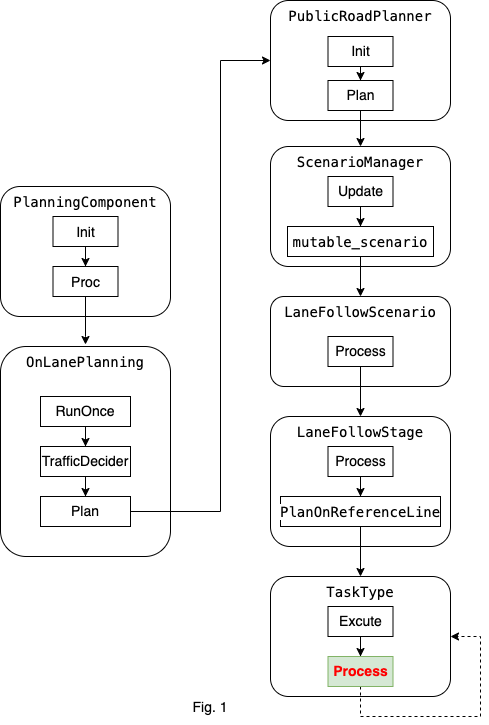
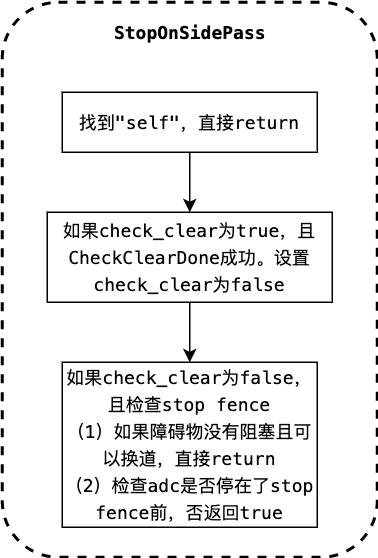
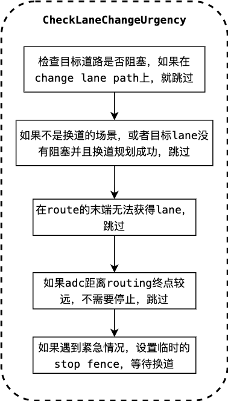

# 基于规则的停止决策

### *目录*

- [概览](#概览)
- [相关代码及对应版本](#相关代码及对应版本)
- [代码流程及框架](#代码流程及框架)
- [相关算法解析](#相关算法解析)

# 概览

`基于规则的停止决策`是规划模块的任务，属于task中的decider类别。

规划模块的运动总体流程图如下：



总体流程图以[lane follow](https://github.com/ApolloAuto/apollo/blob/r6.0.0/modules/planning/conf/scenario/lane_follow_config.pb.txt)场景为例子进行说明。task的主要功能位于`Process`函数中。

Fig.1的具体运行过程可以参考[path_bounds_decider]()。

# 相关代码及对应版本

基于规则的停止决策根据一些规则来设置停止标志。

代码位于[Apollo r6.0.0 rule_based_stop_decider](https://github.com/ApolloAuto/apollo/tree/r6.0.0/modules/planning/tasks/deciders/rule_based_stop_decider)。

- 输入

`apollo::common::Status RuleBasedStopDecider::Process(Frame *const frame, ReferenceLineInfo *const reference_line_info)`

输入是frame和reference_line_info。具体解释可以参考[path_bounds_decider]()。

- 输出

输出保存到reference_line_info中。


# 代码流程及框架

代码的运行流程如下图。


代码结构比较清楚：

```C++
apollo::common::Status RuleBasedStopDecider::Process(
    Frame *const frame, ReferenceLineInfo *const reference_line_info) {
  // 1. 逆向车道通过，停止
  StopOnSidePass(frame, reference_line_info);

  // 2. 紧急换道，停止
  if (FLAGS_enable_lane_change_urgency_checking) {
    CheckLaneChangeUrgency(frame);
  }

  // 3. 路径尽头，停止
  AddPathEndStop(frame, reference_line_info);

  return Status::OK();
}
```

# 相关算法解析

对上图总流程的的每个部分拆分开分析。

- Stop on side pass



代码如下：

```C++
void RuleBasedStopDecider::StopOnSidePass(
    Frame *const frame, ReferenceLineInfo *const reference_line_info) {
  static bool check_clear;    // 默认false
  static common::PathPoint change_lane_stop_path_point;

  // 获取path_data
  const PathData &path_data = reference_line_info->path_data();
  double stop_s_on_pathdata = 0.0;

  // 1. 找到"self"，直接return
  if (path_data.path_label().find("self") != std::string::npos) {
    check_clear = false;
    change_lane_stop_path_point.Clear();
    return;
  }

  // 2. 如果check_clear为true，且CheckClearDone成功。设置check_clear为false
  if (check_clear &&
      CheckClearDone(*reference_line_info, change_lane_stop_path_point)) {
    check_clear = false;
  }

  // 3.如果check_clear为false，且检查stop fence
  if (!check_clear &&
      CheckSidePassStop(path_data, *reference_line_info, &stop_s_on_pathdata)) {
    // 3.1 如果障碍物没有阻塞且可以换道，直接return
    if (!LaneChangeDecider::IsPerceptionBlocked(
            *reference_line_info,
            rule_based_stop_decider_config_.search_beam_length(),
            rule_based_stop_decider_config_.search_beam_radius_intensity(),
            rule_based_stop_decider_config_.search_range(),
            rule_based_stop_decider_config_.is_block_angle_threshold()) &&
        LaneChangeDecider::IsClearToChangeLane(reference_line_info)) {
      return;
    }
    // 3.2 检查adc是否停在了stop fence前，否返回true
    if (!CheckADCStop(path_data, *reference_line_info, stop_s_on_pathdata)) {
      // 设置stop fence，成功就执行 check_clear = true;
      if (!BuildSidePassStopFence(path_data, stop_s_on_pathdata,
                                  &change_lane_stop_path_point, frame,
                                  reference_line_info)) {
        AERROR << "Set side pass stop fail";
      }
    } else {
      if (LaneChangeDecider::IsClearToChangeLane(reference_line_info)) {
        check_clear = true;
      }
    }
  }
}
```

- Check lane change Urgency



检查紧急换道，代码如下：

```C++
void RuleBasedStopDecider::CheckLaneChangeUrgency(Frame *const frame) {
  // 直接进入循环，检查每个reference_line_info
  for (auto &reference_line_info : *frame->mutable_reference_line_info()) {

    // 1. 检查目标道路是否阻塞，如果在change lane path上，就跳过
    if (reference_line_info.IsChangeLanePath()) {
      is_clear_to_change_lane_ =
          LaneChangeDecider::IsClearToChangeLane(&reference_line_info);
      is_change_lane_planning_succeed_ =
          reference_line_info.Cost() < kStraightForwardLineCost;
      continue;
    }

    // 2.如果不是换道的场景，或者（目标lane没有阻塞）并且换道规划成功，跳过
    if (frame->reference_line_info().size() <= 1 ||
        (is_clear_to_change_lane_ && is_change_lane_planning_succeed_)) {
      continue;
    }
    // When the target lane is blocked in change-lane case, check the urgency
    // Get the end point of current routing
    const auto &route_end_waypoint =
        reference_line_info.Lanes().RouteEndWaypoint();

    // 3.在route的末端无法获得lane，跳过
    if (!route_end_waypoint.lane) {
      continue;
    }
    auto point = route_end_waypoint.lane->GetSmoothPoint(route_end_waypoint.s);
    auto *reference_line = reference_line_info.mutable_reference_line();
    common::SLPoint sl_point;

    // 将当前参考线的点映射到frenet坐标系下
    if (reference_line->XYToSL(point, &sl_point) &&
        reference_line->IsOnLane(sl_point)) {
      // Check the distance from ADC to the end point of current routing
      double distance_to_passage_end =
          sl_point.s() - reference_line_info.AdcSlBoundary().end_s();

      // 4. 如果adc距离routing终点较远，不需要停止，跳过
      if (distance_to_passage_end >
          rule_based_stop_decider_config_.approach_distance_for_lane_change()) {
        continue;
      }

      // 5.如果遇到紧急情况，设置临时的stop fence，等待换道
      const std::string stop_wall_id = "lane_change_stop";
      std::vector<std::string> wait_for_obstacles;
      util::BuildStopDecision(
          stop_wall_id, sl_point.s(),
          rule_based_stop_decider_config_.urgent_distance_for_lane_change(),
          StopReasonCode::STOP_REASON_LANE_CHANGE_URGENCY, wait_for_obstacles,
          "RuleBasedStopDecider", frame, &reference_line_info);
    }
  }
}
```

- Add path end stop


在道路的尽头添加stop fence。代码如下：

```C++
void RuleBasedStopDecider::AddPathEndStop(
    Frame *const frame, ReferenceLineInfo *const reference_line_info) {
  if (!reference_line_info->path_data().path_label().empty() &&
      reference_line_info->path_data().frenet_frame_path().back().s() -
              reference_line_info->path_data().frenet_frame_path().front().s() <
          FLAGS_short_path_length_threshold) {
    const std::string stop_wall_id =
        PATH_END_VO_ID_PREFIX + reference_line_info->path_data().path_label();
    std::vector<std::string> wait_for_obstacles;

    // 创建stop fence
    util::BuildStopDecision(
        stop_wall_id,
        reference_line_info->path_data().frenet_frame_path().back().s() - 5.0,
        0.0, StopReasonCode::STOP_REASON_REFERENCE_END, wait_for_obstacles,
        "RuleBasedStopDecider", frame, reference_line_info);
  }
}
```