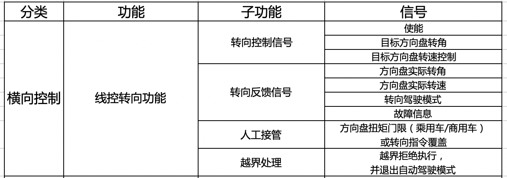
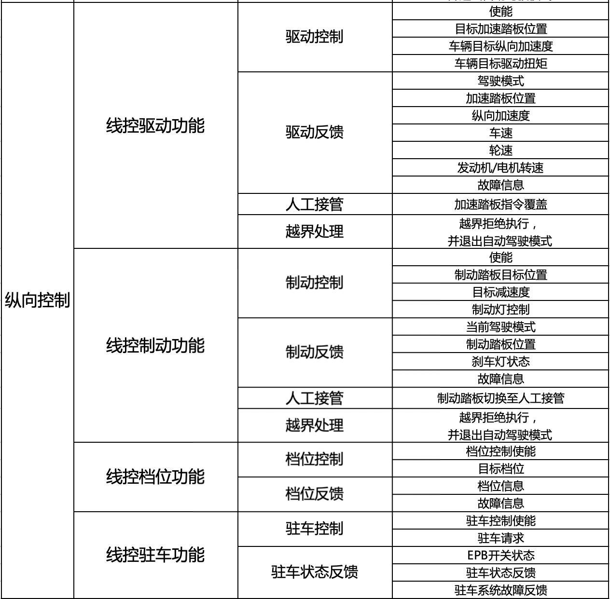
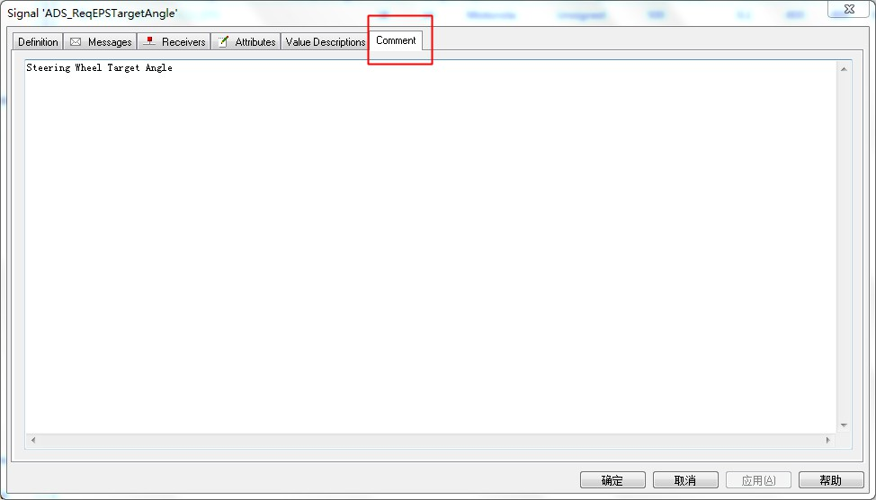
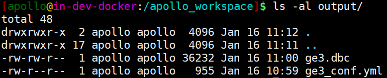
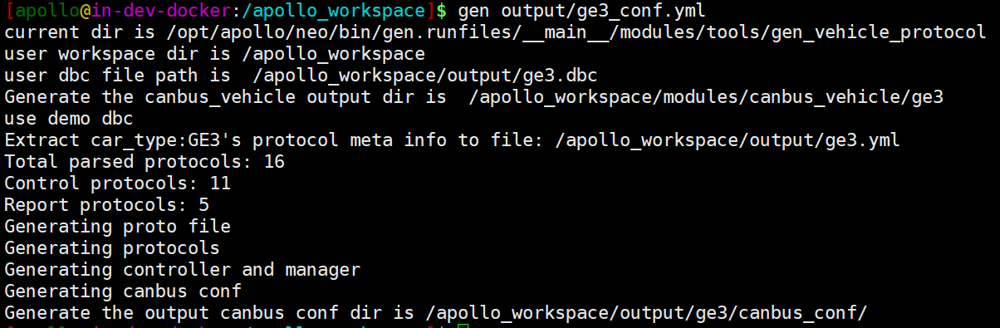
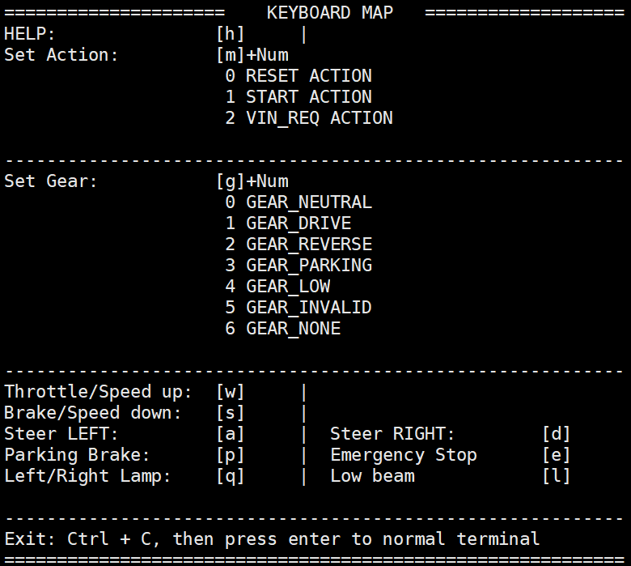
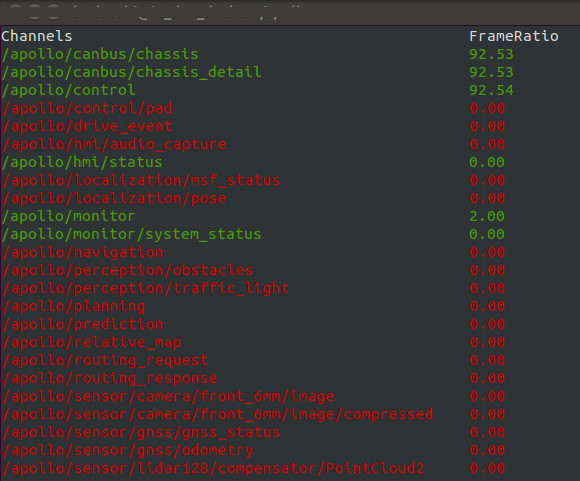

# Apollo车辆适配教程
## 引言
本文所介绍的Apollo新车适配方法，可以帮助开发者快速接入新车辆，以方便开发者在Apollo上进行软件开发。文中所介绍的车辆线控信号标准和要求均源自Apollo开放车辆认证平台，目前车辆认证平台已经有Lincoln，Lexus，GE3，WEY，Devkit，Neolix等车型，有意愿把车加入Apollo车辆认证平台的车企、车辆提供商，可以按照文档内对线控的具体要求，熟悉和准备车辆底层控制协议，节省前期准备时间，欢迎有兴趣的开发者移步至[Apollo开放车辆认证平台](http://apollo.auto/vehicle/certificate_cn.html)(http://apollo.auto/vehicle/certificate_cn.html)  了解更多详细内容。

## 适配一辆符合Apollo标准的车辆

 - 本文主要介绍如何在Apollo内添加一辆符合Apollo标准的新车，方便开发者设计符合Apollo线控要求的底盘系统，开发适配Apollo软件的底盘适配代码，构建快速接入Apollo软件的能力。
 - 开发者在适配一辆新车的CAN通信时，首先需要设计完成符合Apollo线控要求的底盘通信协议，这一部分就是根据Apollo线控列表构建一个车辆底盘信号的DBC文件，设计底盘相关接口定义、报文和信号与DBC一一对应。在完成了DBC文件设计后，根据Apollo提供的DBC转化代码工具，得到初版的canbus底层适配代码，然后添加相关车辆的控制逻辑，在Apollo搭建车辆底层chassis信号及控制车辆信号。最后通过canbus调试工具进行信号调试和验证，确保车辆的底盘信号与Apollo上层通信完全无问题。

## 一、符合Apollo线控标准的车辆

### 车辆DBC
开发一台搭载Apollo系统的车辆，首先的工作就是建立Apollo与车辆底层之间的通信，整车是通过CAN总线(CAN bus, Controller Area Network)进行各个控制器(ECU, electronic control units)之间的通信，因此Apollo控制系统在接入车辆系统时，也通过CAN总线通信方式对车辆进行控制。车辆需要开放一部分底盘信号，将这些信号配置成符合Apollo的线控标准要求的DBC文件(Database file, 是一中用于描述CAN总线上数据的专用文件，能够方便用户快速构建车辆CAN通信的网络结构，定义CAN总线上的信号、报文等相关信息)。这里推荐开发者使用canoe软件的CANdb++编辑生成的文件，Apollo软件处理底盘DBC文件生成底盘适配代码模板，开发者通过简单的编程开发，即可将车辆开放的底盘信号适配至Apollo的软件中，实现Apollo与车辆底盘间的通信。

### DBC线控标准详解
 - 开发者在开发车辆底盘控制信号时，需要参照Apollo官网车辆认证平台（http://apollo.auto/docs/procedure_cn.html）  发布的车辆线控标准，
 乘用车标准：http://apollo-homepage.bj.bcebos.com/Apollo_by_wire_requirement.xlsx ；
微型车标准：https://apollohomepage.bj.bcebos.com/Apollo_by_wire_requirement_micro_car.xlsx
车辆线控标准规定了车辆底盘信号的需求，也规定了每一帧控制信号在底盘的响应时间要求。车辆底盘信号不仅需要在功能上符合要求，也需要在性能上符合控制要求，这样才能满足符合Apollo线控标准的车辆控制底盘。
 - 开发者在改造车辆底盘为线控底盘时，要参考车辆线控标准满足控制的性能要求，如转向信号要求响应时间在100ms内，最大超调量满足满足具体要求等。请开发者仔细阅读线控列表内的性能要求，在Apollo车辆认证时，也会对底盘的性能进行相应测试。

在实际开发DBC的过程中，每个信号定义的细节也有具体的要求，这样做为了节省开发者时间，同时提高车辆认证的效率，需要开发者对每个信号要重点理解和注意。下面是Apollo对车辆底盘信号的需求如下表所示：




车辆的底盘控制是Apollo与底盘通信的基础，每一个控制信号都需要可靠和准确。人工接管和越界处理是保证在测试和使用时随时接管，确保突发情况发生时的行车安全。除了线控列表内对信号的详细要求外，**开发者还需要格外注意横向和纵向使能信号的独立**，**底盘接管逻辑等特殊要求**，下面对信号的功能特殊要求做详细说明。

#### 线控转向
1. 转向使能信号

（1）转向使能信号是控制车辆进入或退出转向自动驾驶模式，该使能信号必须是通过**上升沿触发**方式的信号，使能信号原则上是1个信号；有些开发者若有不同信号同时控制，才能使能转向进入自动驾驶状态，需要开发者在底层自己集成相关使能信号的逻辑控制，给Apollo使能信号原则上必须只有1个。

（2）转向自动驾驶模式必须独立，使能信号必须独立，不与纵向的其他模块（如驱动、制动、档位、驻车等）使能信号相关联，需要满足：单独使能进入转向自动驾驶模式，纵向所处驾驶模式不发生变化，下发方向盘转角或转速控制信号，车辆能够响应相应的转角和转速；单独使能退出转向自动驾驶模式，纵向所处驾驶模式不发生变化，下发方向盘转角或转速控制信号，车辆不响应；

（3）如果横向被接管，再次进入自动驾驶模式时，需要通过上升沿触发信号进入自动驾驶。

2. 转向控制信号

目标方向盘转角：控制方向盘转角的信号，单位是度（deg），控制方向盘（逆时针）左转为正值，控制方向盘（顺时针）右转为负值。

目标方向盘转速：多数车辆无法开放次控制信号接口，建议将方向盘转速设置为最大值，提高系统响应时间。

3. 转向反馈信号

方向盘实际转角反馈：反馈方向盘实际转角，要求反馈准确，左转反馈为正值，右转反馈为负值。

转向驾驶模式反馈：反馈车辆当前所处的转向驾驶模式，至少需要3种模式：自动驾驶模式，手动驾驶模式，被人工接管模式。
 
故障信息反馈：反馈转向控制系统是否存在故障。

4. 人工接管处理

（1）对于乘用车/商用车，当人为施加的方向盘扭矩大于其接管门限时，车辆各个模块均退出自动驾驶，此时转向驾驶模式反馈被接管；对于底盘小车等，当小车底盘接收到遥控器控制车辆转向的指令时，车辆各个模块均退出自动驾驶；转向接管需要独立，此时转向驾驶模式反馈被人工接管模式，驱动驾驶模式、制动驾驶模式此时应反馈手动驾驶模式；

（2）当转向自动驾驶被人工接管时，所有模块都退出自动驾驶模式。

5. 越界处理

越界处理的原则是越界拒绝执行，并退出自动驾驶模式。
当Apollo下发控制指令超过原控制指令的定义范围时，此时称为越界。发生越界时，转向需要退出自动驾驶模式。
如定义目标方向盘转角最大范围为-500deg~500deg，若Apollo下发的转角指令不在此范围时，底盘需要对此越界拒绝执行，并退出自动驾驶模式。

#### 线控驱动

1. 驱动使能：

（1）驱动使能信号是控制车辆进入或退出驱动自动驾驶模式，该使能信号必须是通过**上升沿触发**方式的信号，**使能信号原则上是1个信号**；有些开发者若有不同信号同时控制，才能使能转向进入自动驾驶状态，需要开发者在底层自己集成相关使能信号的逻辑控制，给Apollo使能信号原则上必须只有1个。

（2）驱动使能信号必须独立，不与转向模块使能信号相关联，需要满足：单独使能进入纵向自动驾驶模式，转向所处驾驶模式不发生变化，下发驱动控制信号，车辆能够响应相应的控制命令；单独使能退出驱动自动驾驶模式，转向所处驾驶模式不发生变化，下发驱动控制信号，车辆不响应；

（3）**原则上驱动使能信号与制动、档位、驻车使能相互独立根据以往的实际经验**，有些车辆在纵向驱动和制动使能信号归为一个信号，这样的特殊情况需要开发者额外注意，确保纵向的使能一定要与横向使能分开并独立，纵向各模块如果相互关联，则使能需要驱动、制动、档位、驻车一同进去自动驾驶模式，不使能一同退出自动驾驶模式。

（4）如果横向被接管，再次进入自动驾驶模式时，需要通过上升沿触发信号进入自动驾驶。

2. 驱动控制信号：

目标加速踏板位置：控制量是加速踏板的位置百分比，范围是0~100%，100%代表加速踏板踩到最大位置。

车辆目标纵向加速度和车辆目标驱动扭矩是车辆控制信号可选项。

3. 驱动反馈信号：

驾驶模式：反馈车辆当前所处的驱动驾驶模式，至少需要3种模式：自动驾驶模式，手动驾驶模式，被人工接管模式。

加速踏板位置：需准确反馈当前车辆实际踏板位置。

纵向加速度：需准确反馈当前车辆的纵向加速度。

车速：需准确反馈当前车辆车速，Apollo需求的车速是m/s，**一般车辆反馈的车速单位是km/h，此时需要在DBC转换为适配代码后单独进行单位转化**。

轮速：对于乘用车，需提供相关轮速信号，轮速大小，单位km/h。如果有条件，可提供车轮运动方向反馈，Value Description按照以下顺序`0x00，FORWARD；0x01，BACKWARD；0x02，STANDSTILL；0x03，INVALID`。

发动机/电机转速：需准确反馈当前发动机或电机转速，单位r/min。

故障信息：反馈驱动系统是否存在故障。

4. 人工接管：

（1）当车辆底盘接收到人工干预的加速踏板指令（或对于底盘小车，接收到遥控器下发的加速信号）时，车辆各个模块均退出自动驾驶。转向接管需要独立，此时驱动驾驶模式反馈被人工接管模式，转向驾驶模式、制动驾驶模式此时应反馈手动驾驶模式；

（2）驱动自动驾驶被人工接管时，所有模块都退出自动驾驶模式。

5. 越界处理

发生越界时，转向需要退出自动驾驶模式。如定义目标加速踏板位置范围为0~100%，若Apollo下发的控制踏板指令不在此范围时，底盘需要对此越界拒绝执行，并退出自动驾驶模式。

#### 线控制动

1. 制动使能：

（1）制动使能信号是控制车辆进入或退出驱动自动驾驶模式，该使能信号必须是通过**上升沿触发**方式的信号，使能信号原则上是1个信号；有些开发者若有不同信号同时控制，才能使能转向进入自动驾驶状态，需要开发者在底层自己集成相关使能信号的逻辑控制，给Apollo使能信号原则上必须只有1个。

（2）制动使能信号必须独立，不能与转向模块使能信号相关联，需要满足：单独使能进入纵向自动驾驶模式，转向所处驾驶模式不发生变化，下发制动控制信号，车辆能够响应相应的控制命令；单独使能退出驱动自动驾驶模式，转向所处驾驶模式不发生变化，下发制动控制信号，车辆不响应；

（3）原则上驱动使能信号与驱动、档位、驻车使能相互独立。根据以往的实际经验，有些车辆在纵向驱动和制动使能信号归为一个信号，这样的特殊情况需要开发者额外注意，确保纵向的使能一定要与横向使能分开并独立，纵向各模块如果相互关联，则使能需要驱动、制动、档位、驻车一同进去自动驾驶模式，不使能一同退出自动驾驶模式。

（4）如果横向被接管，再次进入自动驾驶模式时，需要通过上升沿触发信号进入自动驾驶。

2. 制动控制信号

制动踏板目标位置：控制量是加速踏板的位置百分比，范围是0~100%，100%代表制动踏板踩到最大位置。

目标减速度：可选项，控制量是车辆的目标减速度大小。

制动灯控制：可选项，控制制动灯是否点亮，一般车辆的底盘会在制动时默认点亮制动灯。

3. 制动反馈信号

驾驶模式：反馈车辆当前所处的制动驾驶模式，至少需要3种模式：自动驾驶模式，手动驾驶模式，被人工接管模式。 

制动踏板位置：制动踏板位置，百分比。

刹车灯状态：反馈刹车灯是否点亮。

故障信息：反馈制动系统是否有故障。

4. 人工接管

（1）当车辆底盘接收到人工干预的制动踏板指令（或对于底盘小车，接收到遥控器下发的减速信号）时，车辆各个模块均退出自动驾驶。转向接管需要独立，此时驱动驾驶模式反馈被人工接管模式，转向驾驶模式、制动驾驶模式此时应反馈手动驾驶模式；

（2）驱动自动驾驶被人工接管时，所有模块都退出自动驾驶模式。

5. 越界处理

发生越界时，转向需要退出自动驾驶模式。如定义目标制动踏板位置范围为0~100%，若Apollo下发的控制踏板指令不在此范围时，底盘需要对此越界拒绝执行，并使所有模式退出自动驾驶模式。

#### 线控档位

1. 档位使能

使能独立，不与横向控制相关联。可以与纵向使能信号关联，也可独立使能。档位使能信号必须是通过上升沿触发方式的信号，使能信号原则上是1个信号。

2. 档位控制

控制档位信号，档位信号必须按照以下顺序：`0x00：N档；0x01：D；0x02：R；0x03：P；0x04：NONE`。多余的不必再增加。

3. 档位反馈

档位信息：反馈当前档位信号，反馈顺序与控制档位信号顺序一致：`0x00：N档；0x01：D；0x02：R；0x03：P；0x04：NONE`。多余的不必再增加。

故障信息：反馈换挡系统是否存在故障。

#### 线控驻车

1. 驻车使能

使能独立，不与横向控制相关联。可以与纵向使能信号关联，也可独立使能。驻车使能信号必须是通过上升沿触发方式的信号，使能信号原则上是1个信号。

2. 驻车控制

驻车信号有效，电子手刹抱死，车辆驻车；驻车信号无效，电子手刹松开，车辆不驻车。

3. 驻车反馈

EPB开关状态：反馈当前电子手刹是否抱死或松开。

驻车状态反馈：反馈当前驻车是自动驾驶模式还是手动控制模式。至少需要2种模式：`自动驾驶模式`，`手动驾驶模式`，`被人工接管模式`。

驻车系统故障反馈：反馈驻车系统故障。

#### 其他车身功能

包括线控灯光，主要控制远、近光灯、转向灯、危险警报灯的打开和关闭，已经相应的状态反馈信号。

还有雨刮和喇叭控制，作为可选项。

#### 车辆VIN码

VIN码一般17位，按照ASCII码格式，每一个ASCII占1字节，需要3帧报文连续发出，但是VIN码不需要实时更新，所以在系统请求进入自动驾驶时，VIN码通过CAN总线发出，并一直保持该值不再更新，也可减少总线的负载。

### DBC文件要求

熟悉了上述Apollo对车辆底盘信号的要求，第二步是进行车辆底盘信号database（DBC）文件进行编辑，设置通信的网络结构，每个信号的初值、符号类型，精度，大小范围，取值等，进而组合成相应的CAN通信报文（message）与Apollo进行通信。下面使用CANdb++软件对DBC文件进行编辑，有较好的可视化界面，该软件目前只适用于Windows系统。

因为DBC文件后面会根据Apollo的转译脚本工具，将底盘定义的报文（message）、信号（signal）转化为C++程序代码，因此在编辑DBC时，对信号的名称定义、注释、赋值等就要符合C++语言定义规范，这样以确保在后期调试时不会因为DBC文件的问题无法调通CANBUS通信。根据Apollo代码要求，我们总结了以下注意事项：
#### 1. 控制信号名称建议为 ACU
在定义网络上ECU名称时，建议定义Apollo端的控制器名称为ACU（Apollo Control Unit）。


#### 2. CAN信号ID建议不大于2048
目前乘用车CAN通信建议采用标准帧格式（CAN Standard 2.0），Apollo可支持扩展帧。


#### 3. 注释不能有回车符和换行符，comment（注释）必须为英文
每帧报文（message）如果有注释，注释内不要有换行，不能写中文，必须为英文格式。


##### 4. VAL_（枚举值）（Value Description）需要使用英文，且不能有相同定义名称，必须为字母或字母和数字组合，不能有符号。
对于大部分状态反馈信号和控制信号，如档位反馈，驾驶模式反馈等，需要对信号进行定义，在信号定义的Value Description项内进行定义，定义的名称要遵循C++命名规范，要求使用英文，且不能有相同定义名称，必须为字母或字母和数字组合，不能有符号。如下图是的档位反馈信号的Value Description定义。


##### 5. 反馈信号和控制信号中如车速，轮速，加速度，踏板位置（百分比）等double类型的反馈和控制信号在DBC中Value Description项中必须为空。
对于实时数值反馈信号和数值控制信号，如车速（实际车速）、轮速反馈（实际轮速），踏板控制（百分比），转角控制（实际转角值）等，此类信号在定义Value Description项中不能加任何内容。


##### 6. 转向信号的范围，在定义时要填写准确的取值范围，注意控制转角的精度一般不高于0.05deg，踏板百分比精度（factor）不高于0.1。
对于所有报文的Byte Order，一个DBC内的信号只能统一定义，全部是Motorola格式或者全部是Intel格式。


## 二、适配CANBUS代码
### 1. DBC文件转换成canbus模板代码
Canbus适配代码可以使用apollo的工具生成，在转换代码前，要保证DBC按照上述的DBC文件要求完成，并通过gedit打开dbc文件，另存转码为UTF-8格式保存。

（1）将DBC文件（如ge3.dbc）放置指定目录下，目录`/apollo_workspace/output/`内。

（2）修改DBC转换脚本的配置文件：下面以GE3车型添加为例，在`apollo/modules/tools/gen_vehicle_protocol`目录下，复制默认存在的`lincoln_conf.yml`文件并重命名为`ge3_conf.yml`，修改该配置文件，如下所示：

```yml
# 指定dbc文件，这里以ge3.dbc为例，注意这里需要指定到文件在apollo容器内的绝对路径
# 默认把ge3.dbc放入在 /apollo_workspace/output/ 文件夹下
dbc_file: /apollo_workspace/output/ge3.dbc
# 定义dbc转换成yml文件名称
protocol_conf: /apollo_workspace/output/ge3.yml
# 定义车型名称，根据车型自定义
car_type: ge3
# 定义控制报文协议列表，一般为空
sender_list: []
# 自动驾驶模块在dbc中的ECU网络node名称，ge3.dbc内定义的node名称为SCU
sender: SCU
# 定义哪些信号ID不需要生成，一般为空
black_list: []
# 是否基于apollo_demo.dbc生成车型适配代码，现在dbc使用的是lincoln.dbc，false为否
use_demo_dbc: false

# 定义ge3.dbc转换成代码的生成文件夹，默认如下文件夹即可
output_dir: /apollo_workspace/modules/canbus_vehicle
# 定义新车型所对应的canbus配置文件，默认如下文件夹即可
output_canbus_conf_dir: /apollo_workspace/output
```

（3）完成`ge3_conf.yml`配置文件设置，进入Apollo的容器后，检查文件是否准备好，执行代码：

```shell

ls -al /apollo_workspace/output
```


- 执行生成脚本指令
```python
gen output/ge3_conf.yml
```

- 执行完成上述脚本后，在终端内会显示生成了控制协议11个，反馈协议5个。



- 执行完上述脚本后，在`/apollo_workspace/modules/canbus_vehicle/`目录下，会生成一个`ge3`文件夹，该文件夹就是根据ge3协议dbc转换后的车辆协议适配代码。

```shell
/apollo_workspace/modules/canbus_vehicle/
|-- ge3
    |-- BUILD
    |-- cyberfile.xml
    |-- ge3_controller.cc
    |-- ge3_controller.h
    |-- ge3_message_manager.cc
    |-- ge3_message_manager.h
    |-- ge3_vehicle_factory.cc
    |-- ge3_vehicle_factory.h
    |-- proto
    |-- protocol
```
- 在`/apollo_workspace/output/`目录下，会生成一个`ge3`文件夹，该文件夹内的`canbus_conf`目录内的配置文件，就是ge3车型的canbus配置文件，将其中内容替换至`/apollo/modules/canbus/conf/`文件夹下的相关配置你文件内。

```shell
/apollo_workspace/output/ge3
|-- canbus_conf
    |-- canbus.conf
    |-- canbus_conf.pb.txt
```

（4）编译ge3车型

- 执行如下编译命令

```shell
buildtool build --opt -p modules/canbus_vehicle/ge3/
```
完成编译后，ge3车型的初步适配代码就完成了。

### 2.实现新的车辆控制逻辑

- 上一步自动生成的适配代码完成了60%的代码开发工作，这一步需要完成具体的车型实现逻辑，在`/apollo_workspace/modules/canbus_vehicle/ge3/ge3_controller.cc` 文件编写控制逻辑代码，主要包括：
- chassis()方法实现：主要有车辆车速、轮速、档位、踏板百分比、方向盘转角、EPB状态、转向灯、喇叭信号灯，将`Ge3.proto`信息写入到`chassis.proto`，这样就实现了`/apollo/canbus/chassis`channel消息内容的更新。
- 设置自动驾驶模式，编辑相关使能逻辑：横纵向都使能自动驾驶EnableAutoMode()、横纵向都退出自动驾驶DisableAutoMode()、只有横向使能自动驾驶EnableSteeringOnlyMode()、只有纵向使能自动驾驶EnableSpeedOnlyMode()
- 添加必要的控制信号方法实现，包括档位控制Gear()，刹车控制Brake()，油门控制Throttle()，转向控制Steer()，其它控制信号包括车大灯控制SetBeam()、喇叭控制SetHorn、转向灯控制SetTurningSignal()、电子手刹控制SetEpbBreak()。
- 添加`CheckResponse()`逻辑，在chassis()方法内实现车辆自动驾驶状态模式的信号反馈，然后在`CheckResponse()方法内，调节重试时间等功能。

- 在chassis()方法内反馈报文信息实现，编写代码如下所示：

```C++
  // 3
  chassis_.set_engine_started(true);

  // check if there is not ge3, no chassis detail can be retrieved and return
  if (!chassis_detail.has_ge3()) {
    AERROR << "NO GE3 chassis information!";
    return chassis_;
  }
  Ge3 ge3 = chassis_detail.ge3();
  // 5
  if (ge3.has_scu_bcs_3_308()) {
    Scu_bcs_3_308 scu_bcs_3_308 = ge3.scu_bcs_3_308();
    if (scu_bcs_3_308.has_bcs_rrwheelspd()) {
      if (chassis_.has_wheel_speed()) {
        chassis_.mutable_wheel_speed()->set_is_wheel_spd_rr_valid(
            scu_bcs_3_308.bcs_rrwheelspdvd());
        chassis_.mutable_wheel_speed()->set_wheel_direction_rr(
            (WheelSpeed::WheelSpeedType)scu_bcs_3_308.bcs_rrwheeldirection());
        chassis_.mutable_wheel_speed()->set_wheel_spd_rr(
            scu_bcs_3_308.bcs_rrwheelspd());
      }
    }

    if (scu_bcs_3_308.has_bcs_rlwheelspd()) {
      if (chassis_.has_wheel_speed()) {
        chassis_.mutable_wheel_speed()->set_is_wheel_spd_rl_valid(
            scu_bcs_3_308.bcs_rlwheelspdvd());
        chassis_.mutable_wheel_speed()->set_wheel_direction_rl(
            (WheelSpeed::WheelSpeedType)scu_bcs_3_308.bcs_rlwheeldirection());
        chassis_.mutable_wheel_speed()->set_wheel_spd_rl(
            scu_bcs_3_308.bcs_rlwheelspd());
      }
    }

    if (scu_bcs_3_308.has_bcs_frwheelspd()) {
      if (chassis_.has_wheel_speed()) {
        chassis_.mutable_wheel_speed()->set_is_wheel_spd_fr_valid(
            scu_bcs_3_308.bcs_frwheelspdvd());
        chassis_.mutable_wheel_speed()->set_wheel_direction_fr(
            (WheelSpeed::WheelSpeedType)scu_bcs_3_308.bcs_frwheeldirection());
        chassis_.mutable_wheel_speed()->set_wheel_spd_fr(
            scu_bcs_3_308.bcs_frwheelspd());
      }
    }

    if (scu_bcs_3_308.has_bcs_flwheelspd()) {
      if (chassis_.has_wheel_speed()) {
        chassis_.mutable_wheel_speed()->set_is_wheel_spd_fl_valid(
            scu_bcs_3_308.bcs_flwheelspdvd());
        chassis_.mutable_wheel_speed()->set_wheel_direction_fl(
            (WheelSpeed::WheelSpeedType)scu_bcs_3_308.bcs_flwheeldirection());
        chassis_.mutable_wheel_speed()->set_wheel_spd_fl(
            scu_bcs_3_308.bcs_flwheelspd());
      }
    }
  }

  if (ge3.has_scu_bcs_2_307() && ge3.scu_bcs_2_307().has_bcs_vehspd()) {
    chassis_.set_speed_mps(
        static_cast<float>(ge3.scu_bcs_2_307().bcs_vehspd()));
  } else {
    chassis_.set_speed_mps(0);
  }

  // 7
  // ge3 only has fuel percentage
  // to avoid confusing, just don't set
  chassis_.set_fuel_range_m(0);

  if (ge3.has_scu_vcu_1_312() && ge3.scu_vcu_1_312().has_vcu_accpedact()) {
    chassis_.set_throttle_percentage(
        static_cast<float>(ge3.scu_vcu_1_312().vcu_accpedact()));
  } else {
    chassis_.set_throttle_percentage(0);
  }
  // 9
  if (ge3.has_scu_bcs_1_306() && ge3.scu_bcs_1_306().has_bcs_brkpedact()) {
    chassis_.set_brake_percentage(
        static_cast<float>(ge3.scu_bcs_1_306().bcs_brkpedact()));
  } else {
    chassis_.set_brake_percentage(0);
  }
  // 23, previously 10
  if (ge3.has_scu_vcu_1_312() && ge3.scu_vcu_1_312().has_vcu_gearact()) {
    switch (ge3.scu_vcu_1_312().vcu_gearact()) {
      case Scu_vcu_1_312::VCU_GEARACT_INVALID: {
        chassis_.set_gear_location(Chassis::GEAR_INVALID);
      } break;
      case Scu_vcu_1_312::VCU_GEARACT_DRIVE: {
        chassis_.set_gear_location(Chassis::GEAR_DRIVE);
      } break;
      case Scu_vcu_1_312::VCU_GEARACT_NEUTRAL: {
        chassis_.set_gear_location(Chassis::GEAR_NEUTRAL);
      } break;
      case Scu_vcu_1_312::VCU_GEARACT_REVERSE: {
        chassis_.set_gear_location(Chassis::GEAR_REVERSE);
      } break;
      case Scu_vcu_1_312::VCU_GEARACT_PARK: {
        chassis_.set_gear_location(Chassis::GEAR_PARKING);
      } break;
      default:
        chassis_.set_gear_location(Chassis::GEAR_INVALID);
        break;
    }
  } else {
    chassis_.set_gear_location(Chassis::GEAR_INVALID);
  }

  // 11
  if (ge3.has_scu_eps_311() && ge3.scu_eps_311().has_eps_steerangle()) {
    chassis_.set_steering_percentage(
        static_cast<float>(ge3.scu_eps_311().eps_steerangle() /
                           vehicle_params_.max_steer_angle() * M_PI / 1.80));
  } else {
    chassis_.set_steering_percentage(0);
  }

  // 13
  if (ge3.has_scu_epb_310() && ge3.scu_epb_310().has_epb_sysst()) {
    chassis_.set_parking_brake(ge3.scu_epb_310().epb_sysst() ==
                               Scu_epb_310::EPB_SYSST_APPLIED);
  } else {
    chassis_.set_parking_brake(false);
  }

  // 14, 15: ge3 light control
  if (ge3.has_scu_bcm_304() && ge3.scu_bcm_304().has_bcm_highbeamst() &&
      Scu_bcm_304::BCM_HIGHBEAMST_ACTIVE ==
          ge3.scu_bcm_304().bcm_highbeamst()) {
    if (chassis_.has_signal()) {
      chassis_.mutable_signal()->set_high_beam(true);
    }
  } else {
    if (chassis_.has_signal()) {
      chassis_.mutable_signal()->set_high_beam(false);
    }
  }

  // 16, 17
  if (ge3.has_scu_bcm_304()) {
    Scu_bcm_304 scu_bcm_304 = ge3.scu_bcm_304();
    if (scu_bcm_304.has_bcm_leftturnlampst() &&
        Scu_bcm_304::BCM_LEFTTURNLAMPST_ACTIVE ==
            scu_bcm_304.bcm_leftturnlampst()) {
      chassis_.mutable_signal()->set_turn_signal(
          common::VehicleSignal::TURN_LEFT);
    } else if (scu_bcm_304.has_bcm_rightturnlampst() &&
               Scu_bcm_304::BCM_RIGHTTURNLAMPST_ACTIVE ==
                   scu_bcm_304.bcm_rightturnlampst()) {
      chassis_.mutable_signal()->set_turn_signal(
          common::VehicleSignal::TURN_RIGHT);
    } else {
      chassis_.mutable_signal()->set_turn_signal(
          common::VehicleSignal::TURN_NONE);
    }
  } else {
    chassis_.mutable_signal()->set_turn_signal(
        common::VehicleSignal::TURN_NONE);
  }
  // 18
  if (ge3.has_scu_bcm_304() && ge3.scu_bcm_304().has_bcm_hornst() &&
      Scu_bcm_304::BCM_HORNST_ACTIVE == ge3.scu_bcm_304().bcm_hornst()) {
    chassis_.mutable_signal()->set_horn(true);
  } else {
    chassis_.mutable_signal()->set_horn(false);
  }

  // vin number will be written into KVDB once.
  chassis_.mutable_vehicle_id()->set_vin("");
  if (ge3.has_scu_1_301() && ge3.has_scu_2_302() && ge3.has_scu_3_303()) {
    Scu_1_301 scu_1_301 = ge3.scu_1_301();
    Scu_2_302 scu_2_302 = ge3.scu_2_302();
    Scu_3_303 scu_3_303 = ge3.scu_3_303();
    if (scu_2_302.has_vin00() && scu_2_302.has_vin01() &&
        scu_2_302.has_vin02() && scu_2_302.has_vin03() &&
        scu_2_302.has_vin04() && scu_2_302.has_vin05() &&
        scu_2_302.has_vin06() && scu_2_302.has_vin07() &&
        scu_3_303.has_vin08() && scu_3_303.has_vin09() &&
        scu_3_303.has_vin10() && scu_3_303.has_vin11() &&
        scu_3_303.has_vin12() && scu_3_303.has_vin13() &&
        scu_3_303.has_vin14() && scu_3_303.has_vin15() &&
        scu_1_301.has_vin16()) {
      int n[17];
      n[0] = scu_2_302.vin00();
      n[1] = scu_2_302.vin01();
      n[2] = scu_2_302.vin02();
      n[3] = scu_2_302.vin03();
      n[4] = scu_2_302.vin04();
      n[5] = scu_2_302.vin05();
      n[6] = scu_2_302.vin06();
      n[7] = scu_2_302.vin07();
      n[8] = scu_3_303.vin08();
      n[9] = scu_3_303.vin09();
      n[10] = scu_3_303.vin10();
      n[11] = scu_3_303.vin11();
      n[12] = scu_3_303.vin12();
      n[13] = scu_3_303.vin13();
      n[14] = scu_3_303.vin14();
      n[15] = scu_3_303.vin15();
      n[16] = scu_1_301.vin16();

      char ch[17];
      memset(&ch, '\0', sizeof(ch));
      for (int i = 0; i < 17; i++) {
        ch[i] = static_cast<char>(n[i]);
      }
      if (chassis_.has_vehicle_id()) {
        chassis_.mutable_vehicle_id()->set_vin(ch);
      }
    }
  }

  // give engage_advice based on error_code and canbus feedback
  if (chassis_error_mask_) {
    if (chassis_.has_engage_advice()) {
      chassis_.mutable_engage_advice()->set_advice(
          apollo::common::EngageAdvice::DISALLOW_ENGAGE);
      chassis_.mutable_engage_advice()->set_reason("Chassis error!");
    }
  } else if (chassis_.parking_brake() || CheckSafetyError(chassis_detail)) {
    if (chassis_.has_engage_advice()) {
      chassis_.mutable_engage_advice()->set_advice(
          apollo::common::EngageAdvice::DISALLOW_ENGAGE);
      chassis_.mutable_engage_advice()->set_reason(
          "Vehicle is not in a safe state to engage!");
    }
  } else {
    if (chassis_.has_engage_advice()) {
      chassis_.mutable_engage_advice()->set_advice(
          apollo::common::EngageAdvice::READY_TO_ENGAGE);
    }
  }
```

- 设置自动驾驶模式，编辑相关使能逻辑，在Apollo中，车辆的驾驶模式主要包含：

- 完全自动驾驶模式（`COMPLETE_AUTO_DRIVE`）：横向、纵向都使能；

- 横向自动驾驶模式（`AUTO_STEER_ONLY`）：横向使能，纵向不使能；

- 纵向自动驾驶模式（`AUTO_SPEED_ONLY`）：横向不使能，纵向使能；

- 车辆使能控制信号控制逻辑如下所示：

```C++
ErrorCode Ge3Controller::EnableAutoMode() {
  if (driving_mode() == Chassis::COMPLETE_AUTO_DRIVE) {
    AINFO << "already in COMPLETE_AUTO_DRIVE mode";
    return ErrorCode::OK;
  }
  pc_bcs_202_->set_pc_brkpedenable(Pc_bcs_202::PC_BRKPEDENABLE_ENABLE);
  pc_vcu_205_->set_pc_accpedenable(Pc_vcu_205::PC_ACCPEDENABLE_ENABLE);
  pc_vcu_205_->set_pc_gearenable(Pc_vcu_205::PC_GEARENABLE_ENABLE);
  pc_epb_203_->set_pc_epbenable(Pc_epb_203::PC_EPBENABLE_ENABLE);
  pc_eps_204_->set_pc_steerenable(Pc_eps_204::PC_STEERENABLE_ENABLE);

  can_sender_->Update();
  const int32_t flag =
      CHECK_RESPONSE_STEER_UNIT_FLAG | CHECK_RESPONSE_SPEED_UNIT_FLAG;
  if (!CheckResponse(flag, true)) {
    AERROR << "Failed to switch to COMPLETE_AUTO_DRIVE mode.";
    Emergency();
    set_chassis_error_code(Chassis::CHASSIS_ERROR);
    return ErrorCode::CANBUS_ERROR;
  }
  set_driving_mode(Chassis::COMPLETE_AUTO_DRIVE);
  // If the auto mode can be set normally, the harzad lamp should be off.
  pc_bcm_201_->set_pc_hazardlampreq(Pc_bcm_201::PC_HAZARDLAMPREQ_NOREQ);
  AINFO << "Switch to COMPLETE_AUTO_DRIVE mode ok.";
  return ErrorCode::OK;
}

ErrorCode Ge3Controller::DisableAutoMode() {
  ResetProtocol();
  can_sender_->Update();
  set_driving_mode(Chassis::COMPLETE_MANUAL);
  set_chassis_error_code(Chassis::NO_ERROR);
  AINFO << "Switch to COMPLETE_MANUAL OK.";
  return ErrorCode::OK;
}

ErrorCode Ge3Controller::EnableSteeringOnlyMode() {
  if (driving_mode() == Chassis::COMPLETE_AUTO_DRIVE ||
      driving_mode() == Chassis::AUTO_STEER_ONLY) {
    set_driving_mode(Chassis::AUTO_STEER_ONLY);
    AINFO << "Already in AUTO_STEER_ONLY mode";
    return ErrorCode::OK;
  }
  pc_bcs_202_->set_pc_brkpedenable(Pc_bcs_202::PC_BRKPEDENABLE_DISABLE);
  pc_vcu_205_->set_pc_accpedenable(Pc_vcu_205::PC_ACCPEDENABLE_DISABLE);
  pc_vcu_205_->set_pc_gearenable(Pc_vcu_205::PC_GEARENABLE_DISABLE);
  pc_epb_203_->set_pc_epbenable(Pc_epb_203::PC_EPBENABLE_DISABLE);
  pc_eps_204_->set_pc_steerenable(Pc_eps_204::PC_STEERENABLE_ENABLE);

  can_sender_->Update();
  if (!CheckResponse(CHECK_RESPONSE_STEER_UNIT_FLAG, true)) {
    AERROR << "Failed to switch to AUTO_STEER_ONLY mode.";
    Emergency();
    set_chassis_error_code(Chassis::CHASSIS_ERROR);
    return ErrorCode::CANBUS_ERROR;
  }
  set_driving_mode(Chassis::AUTO_STEER_ONLY);
  // If the auto mode can be set normally, the harzad lamp should be off.
  pc_bcm_201_->set_pc_hazardlampreq(Pc_bcm_201::PC_HAZARDLAMPREQ_NOREQ);
  AINFO << "Switch to AUTO_STEER_ONLY mode ok.";
  return ErrorCode::OK;
}

ErrorCode Ge3Controller::EnableSpeedOnlyMode() {
  if (driving_mode() == Chassis::COMPLETE_AUTO_DRIVE ||
      driving_mode() == Chassis::AUTO_SPEED_ONLY) {
    set_driving_mode(Chassis::AUTO_SPEED_ONLY);
    AINFO << "Already in AUTO_SPEED_ONLY mode";
    return ErrorCode::OK;
  }
  pc_bcs_202_->set_pc_brkpedenable(Pc_bcs_202::PC_BRKPEDENABLE_ENABLE);
  pc_vcu_205_->set_pc_accpedenable(Pc_vcu_205::PC_ACCPEDENABLE_ENABLE);
  pc_vcu_205_->set_pc_gearenable(Pc_vcu_205::PC_GEARENABLE_ENABLE);
  pc_epb_203_->set_pc_epbenable(Pc_epb_203::PC_EPBENABLE_ENABLE);
  pc_eps_204_->set_pc_steerenable(Pc_eps_204::PC_STEERENABLE_DISABLE);

  can_sender_->Update();
  if (!CheckResponse(CHECK_RESPONSE_SPEED_UNIT_FLAG, true)) {
    AERROR << "Failed to switch to AUTO_STEER_ONLY mode.";
    Emergency();
    set_chassis_error_code(Chassis::CHASSIS_ERROR);
    return ErrorCode::CANBUS_ERROR;
  }
  set_driving_mode(Chassis::AUTO_SPEED_ONLY);
  // If the auto mode can be set normally, the harzad lamp should be off.
  pc_bcm_201_->set_pc_hazardlampreq(Pc_bcm_201::PC_HAZARDLAMPREQ_NOREQ);
  AINFO << "Switch to AUTO_SPEED_ONLY mode ok.";
  return ErrorCode::OK;
}
```
- 添加控制信号的相关功能，必须要添加的控制信号包括车辆的油门、刹车踏板控制，转向控制，和档位控制；其它控制信号包括车大灯控制、喇叭控制、转向灯控制、电子手刹控制。代码如下所示：

```C++
// NEUTRAL, REVERSE, DRIVE
void Ge3Controller::Gear(Chassis::GearPosition gear_position) {
  if (driving_mode() != Chassis::COMPLETE_AUTO_DRIVE &&
      driving_mode() != Chassis::AUTO_SPEED_ONLY) {
    AINFO << "This drive mode no need to set gear.";
    return;
  }
  switch (gear_position) {
    case Chassis::GEAR_NEUTRAL: {
      pc_vcu_205_->set_pc_gearreq(Pc_vcu_205::PC_GEARREQ_NEUTRAL);
      break;
    }
    case Chassis::GEAR_REVERSE: {
      pc_vcu_205_->set_pc_gearreq(Pc_vcu_205::PC_GEARREQ_REVERSE);
      break;
    }
    case Chassis::GEAR_DRIVE: {
      pc_vcu_205_->set_pc_gearreq(Pc_vcu_205::PC_GEARREQ_DRIVE);
      break;
    }
    case Chassis::GEAR_PARKING: {
      pc_vcu_205_->set_pc_gearreq(Pc_vcu_205::PC_GEARREQ_PARK);
      break;
    }
    case Chassis::GEAR_LOW: {
      pc_vcu_205_->set_pc_gearreq(Pc_vcu_205::PC_GEARREQ_INVALID);
      break;
    }
    case Chassis::GEAR_NONE: {
      pc_vcu_205_->set_pc_gearreq(Pc_vcu_205::PC_GEARREQ_INVALID);
      break;
    }
    case Chassis::GEAR_INVALID: {
      AERROR << "Gear command is invalid!";
      pc_vcu_205_->set_pc_gearreq(Pc_vcu_205::PC_GEARREQ_INVALID);
      break;
    }
    default: {
      pc_vcu_205_->set_pc_gearreq(Pc_vcu_205::PC_GEARREQ_INVALID);
      break;
    }
  }
}

// brake with new acceleration
// acceleration:0.00~99.99, unit:
// acceleration:0.0 ~ 7.0, unit:m/s^2
// acceleration_spd:60 ~ 100, suggest: 90
// -> pedal
void Ge3Controller::Brake(double pedal) {
  // Update brake value based on mode
  if (driving_mode() != Chassis::COMPLETE_AUTO_DRIVE &&
      driving_mode() != Chassis::AUTO_SPEED_ONLY) {
    AINFO << "The current drive mode does not need to set acceleration.";
    return;
  }
  pc_bcs_202_->set_pc_brkpedreq(pedal);
}

// drive with old acceleration
// gas:0.00~99.99 unit:
void Ge3Controller::Throttle(double pedal) {
  if (driving_mode() != Chassis::COMPLETE_AUTO_DRIVE &&
      driving_mode() != Chassis::AUTO_SPEED_ONLY) {
    AINFO << "The current drive mode does not need to set acceleration.";
    return;
  }
  pc_vcu_205_->set_pc_accpedreq(pedal);
}

// ge3 default, -470 ~ 470, left:+, right:-
// need to be compatible with control module, so reverse
// steering with old angle speed
// angle:-99.99~0.00~99.99, unit:, left:-, right:+
void Ge3Controller::Steer(double angle) {
  if (!(driving_mode() == Chassis::COMPLETE_AUTO_DRIVE ||
        driving_mode() == Chassis::AUTO_STEER_ONLY)) {
    AINFO << "The current driving mode does not need to set steer.";
    return;
  }
  const double real_angle =
      vehicle_params_.max_steer_angle() / M_PI * 180 * angle / 100.0;
  pc_eps_204_->set_pc_steerangreq(real_angle)->set_pc_steerspdreq(500);
}

// drive with acceleration/deceleration
// acc:-7.0 ~ 5.0, unit:m/s^2
void Ge3Controller::Acceleration(double acc) {
  if (driving_mode() != Chassis::COMPLETE_AUTO_DRIVE &&
      driving_mode() != Chassis::AUTO_SPEED_ONLY) {
    AINFO << "The current drive mode does not need to set acceleration.";
    return;
  }
  // None
}

// steering with new angle speed
// angle:-99.99~0.00~99.99, unit:, left:-, right:+
// angle_spd:0.00~99.99, unit:deg/s
void Ge3Controller::Steer(double angle, double angle_spd) {
  if (driving_mode() != Chassis::COMPLETE_AUTO_DRIVE &&
      driving_mode() != Chassis::AUTO_STEER_ONLY) {
    AINFO << "The current driving mode does not need to set steer.";
    return;
  }
  const double real_angle =
      vehicle_params_.max_steer_angle() / M_PI * 180 * angle / 100.0;
  const double real_angle_spd =
      ProtocolData<::apollo::canbus::ChassisDetail>::BoundedValue(
          vehicle_params_.min_steer_angle_rate() / M_PI * 180,
          vehicle_params_.max_steer_angle_rate() / M_PI * 180,
          vehicle_params_.max_steer_angle_rate() / M_PI * 180 * angle_spd /
              100.0);
  pc_eps_204_->set_pc_steerangreq(real_angle)
      ->set_pc_steerspdreq(static_cast<int>(real_angle_spd));
}

void Ge3Controller::SetEpbBreak(const ControlCommand& command) {
  if (command.parking_brake()) {
    pc_epb_203_->set_pc_epbreq(Pc_epb_203::PC_EPBREQ_APPLY);
  } else {
    pc_epb_203_->set_pc_epbreq(Pc_epb_203::PC_EPBREQ_RELEASE);
  }
}

void Ge3Controller::SetBeam(const ControlCommand& command) {
  if (command.signal().high_beam()) {
    pc_bcm_201_->set_pc_lowbeamreq(Pc_bcm_201::PC_LOWBEAMREQ_NOREQ);
    pc_bcm_201_->set_pc_highbeamreq(Pc_bcm_201::PC_HIGHBEAMREQ_REQ);
  } else if (command.signal().low_beam()) {
    pc_bcm_201_->set_pc_lowbeamreq(Pc_bcm_201::PC_LOWBEAMREQ_REQ);
    pc_bcm_201_->set_pc_highbeamreq(Pc_bcm_201::PC_HIGHBEAMREQ_NOREQ);
  } else {
    pc_bcm_201_->set_pc_lowbeamreq(Pc_bcm_201::PC_LOWBEAMREQ_NOREQ);
    pc_bcm_201_->set_pc_highbeamreq(Pc_bcm_201::PC_HIGHBEAMREQ_NOREQ);
  }
}

void Ge3Controller::SetHorn(const ControlCommand& command) {
  if (command.signal().horn()) {
    pc_bcm_201_->set_pc_hornreq(Pc_bcm_201::PC_HORNREQ_REQ);
  } else {
    pc_bcm_201_->set_pc_hornreq(Pc_bcm_201::PC_HORNREQ_NOREQ);
  }
}

void Ge3Controller::SetTurningSignal(const ControlCommand& command) {
  // Set Turn Signal
  auto signal = command.signal().turn_signal();
  if (signal == common::VehicleSignal::TURN_LEFT) {
    pc_bcm_201_->set_pc_leftturnlampreq(Pc_bcm_201::PC_LEFTTURNLAMPREQ_REQ);
    pc_bcm_201_->set_pc_rightturnlampreq(Pc_bcm_201::PC_RIGHTTURNLAMPREQ_NOREQ);
  } else if (signal == common::VehicleSignal::TURN_RIGHT) {
    pc_bcm_201_->set_pc_leftturnlampreq(Pc_bcm_201::PC_LEFTTURNLAMPREQ_NOREQ);
    pc_bcm_201_->set_pc_rightturnlampreq(Pc_bcm_201::PC_RIGHTTURNLAMPREQ_REQ);
  } else {
    pc_bcm_201_->set_pc_leftturnlampreq(Pc_bcm_201::PC_LEFTTURNLAMPREQ_NOREQ);
    pc_bcm_201_->set_pc_rightturnlampreq(Pc_bcm_201::PC_RIGHTTURNLAMPREQ_NOREQ);
  }
}
```

- 添加`CheckResponse()`逻辑，Apollo程序内增加了对车辆底层是否在自动驾驶模式的监控，即车辆横向、驱动、制动模块的驾驶模式反馈是否处于自动驾驶状态，如果在一个`CheckResponse`周期内，车辆某个模块驾驶模块反馈处于接管或者手动驾驶模式，则Apollo会控制车辆使能为紧急停车模式（`Emergency`），即各模块均控制为手动模式，确保控制车辆时的安全。不同的车辆`CheckResponse`周期可能不同，需要开发者根据情况通过设置`retry_num`设定`check`周期。
开发者可以不改原check代码方案，将3个驾驶模式反馈报文与apollo内`chassis_detail`做映射：

`is_eps_online->转向模式反馈信号`

`is_vcu_online->驱动模式反馈信号`

`is_esp_online->制动模式反馈信号`

- 在Chassis()方法内，增加以下代码：

```C++
  // 19 add checkresponse signal
  if (chassis_detail.has_scu_bcs_1_306() &&
      chassis_detail.scu_bcs_1_306().has_bcs_drvmode()) {
    chassis_.mutable_check_response()->set_is_esp_online(
        chassis_detail.scu_bcs_1_306().bcs_drvmode() == 1);
  }
  if (chassis_detail.has_scu_eps_311() &&
      chassis_detail.scu_eps_311().has_eps_drvmode()) {
    chassis_.mutable_check_response()->set_is_eps_online(
        chassis_detail.scu_eps_311().eps_drvmode() == 1);
  }
  if (chassis_detail.has_scu_vcu_1_312() &&
      chassis_detail.scu_vcu_1_312().has_vcu_drvmode()) {
    chassis_.mutable_check_response()->set_is_vcu_online(
        chassis_detail.scu_vcu_1_312().vcu_drvmode() == 1);
  }
```

- 在CheckResponse()方法内，实现与底盘握手断线检查逻辑：

```C++
bool Ge3Controller::CheckResponse(const int32_t flags, bool need_wait) {
  int32_t retry_num = 20;
  Ge3 chassis_detail;
  bool is_eps_online = false;
  bool is_vcu_online = false;
  bool is_esp_online = false;
  Chassis chassis = Chassis();

  do {
    if (message_manager_->GetSensorData(&chassis_detail) != ErrorCode::OK) {
      AERROR_EVERY(100) << "get chassis detail failed.";
      return false;
    }
    bool check_ok = true;
    if (flags & CHECK_RESPONSE_STEER_UNIT_FLAG) {
      is_eps_online = chassis.has_check_response() &&
                      chassis.check_response().has_is_eps_online() &&
                      chassis.check_response().is_eps_online();
      check_ok = check_ok && is_eps_online;
    }

    if (flags & CHECK_RESPONSE_SPEED_UNIT_FLAG) {
      is_vcu_online = chassis.has_check_response() &&
                      chassis.check_response().has_is_vcu_online() &&
                      chassis.check_response().is_vcu_online();
      is_esp_online = chassis.has_check_response() &&
                      chassis.check_response().has_is_esp_online() &&
                      chassis.check_response().is_esp_online();
      check_ok = check_ok && is_vcu_online && is_esp_online;
    }
    if (check_ok) {
      return true;
    }
    AINFO << "Need to check response again.";
    if (need_wait) {
      --retry_num;
      std::this_thread::sleep_for(
          std::chrono::duration<double, std::milli>(20));
    }
  } while (need_wait && retry_num);

  AINFO << "check_response fail: is_eps_online:" << is_eps_online
        << ", is_vcu_online:" << is_vcu_online
        << ", is_esp_online:" << is_esp_online;
  return false;
}
```

### 3.修改底盘车速反馈协议，将车速反馈单位由km/h转化为m/s

- Apollo系统内默认使用车速反馈量为`m/s`，底盘车速信息对Apollo非常重要，在车辆标定、控制、规划等都需要采集该数据，所以开发者要在开发适配代码时，重点检查车速反馈的单位。车速由`km/h`转化为`m/s`时，在反馈车速的信号除以`3.6`即可。
找到Ge3车辆反馈车速的报文在文件`/apollo_workspace/modules/canbus_vehicle/ge3/protocol/scu_bcs_2_307.cc` 下，反馈车速消息为`Scubcs2307::bcs_vehspd{}`，如下图所示：


### 4.更新CANBUS配置文件

- 如前所述，canbus配置文件生成在`/apollo_workspace/output/ge3/canbus_conf/`文件夹内，分别是`canbus.conf`和`canbus_conf.pb.txt`。

```shell
canbus_conf/
|-- canbus.conf
|-- canbus_conf.pb.txt
```

- 查看`canbus.conf`配置文件

```shell
--flagfile=/apollo/modules/common/data/global_flagfile.txt
--canbus_conf_file=/apollo/modules/canbus/conf/canbus_conf.pb.txt
--load_vehicle_library=/opt/apollo/neo/lib/modules/canbus_vehicle/ge3/libge3_vehicle_factory_lib.so
--load_vehicle_class_name=Ge3VehicleFactory
--enable_chassis_detail_pub
```


- 查看`canbus_conf.pb.txt`配置文件

```shell
vehicle_parameter {
  max_enable_fail_attempt: 5
  driving_mode: COMPLETE_AUTO_DRIVE
}

can_card_parameter {
  brand: SOCKET_CAN_RAW
  type: PCI_CARD
  channel_id: CHANNEL_ID_ZERO
  interface: NATIVE
}

enable_debug_mode: false
enable_receiver_log: false
```

- 将上述canbus文件的内容替换至`/apollo/modules/canbus/conf/`文件夹下的`canbus.conf`和`canbus_conf.pb.txt`配置文件中。

## 三、车辆底盘开环验证DBC的方法

### 1、开环测试

- 在确定了车辆底盘DBC后，对DBC内定义的信号进行开环测试。开环测试的主要目的是测试车辆线控信号与车辆的实际功能是否相符，测试车辆的转向、加减速性能响应是否满足车辆的线控需求，测试车辆接管逻辑是否满足要求。

- 底盘的开环单侧中，开发者要针对前文所述的DBC重点要求进行测试，如车辆横纵向使能独立性，横纵向接管的独立性，每个控制信号是否满足控制要求和控制边界，反馈信号是否反馈正确。在性能上，控制信号的转向和加减速延迟是否满足apollo控制性能要求，超调误差是否在线控列表范围内。请开发者根据线控列表内的性能要求，对控制信号进行测试。

### 2、teleop底盘联调测试

底盘联调测试就是通过将Apollo与车辆进行canbus通信后，测试Apollo下发控制信号（如加速/减速/转向/使能等）是否能够准确控制车辆，测试车辆的底盘反馈信号（如当前踏板百分比反馈/当前转角反馈/使能反馈/接管反馈等）是否与反馈了车辆的实际状态，验证Apollo下发的控制指令，车辆底盘能够准确执行。

#### teleop测试工具介绍

apollo里为开发者提供了一个teleop的测试工具，进入apollo容器环境后，执行
```
teleop
```
即可进入teleop界面，如下图所示：



按`h`键，可以调出上图所示的帮助界面，可以查询Teleop工具的使用方法，下面简单对teleop各个控制指令介绍下。

##### Set Action 执行Apollo对车辆的使能控制：

按`m`和`0`键组合，表示执行reset指令，车辆退出自动驾驶模式；
按`m`和`1`键组合，表示执行start指令，车辆进入自动驾驶模式。

##### Set Gear 表示设置档位，按`g`和`数字`组合，进行相应档位设置：

按`g`+`0`挂入N档（空挡）；
按`g`+`1`挂入D档（前进挡）；
按`g`+`2`挂入R档（倒车档）；
按`g`+`3`挂入P档（驻车档）；
其它档位控制指令暂不需要，根据我们DBC要求，一般车辆控制档位指令就这几个。

##### Throttle/Speed up  表示每次增加油门踏板量2%，车辆加速

按 `w` 键增加油门踏板2%，使车辆加速。如果当前已经执行brake刹车指令，按`w`表示减少刹车踏板量2%。
油门踏板量的控制范围是0~100%，即100%时相当于油门踏板全部踩下。默认每按`w`键一次，油门踏板量增加2%，这个值开发者可以根据实车测试，进行修改，根据经验，每次变化2%比较合适。

`注意：请先用teleop执行挂D档后再执行加油命令，请在开放场地测试，注意安全`！

##### Set  Throttle 设置油门踏板百分比

按`t`+`数字`可以直接设置具体的油门踏板百分比，油门踏板可设置的百分比数为0~100。如执行t20，表示直接设置当前油门踏板量为20%，并将刹车踏板百分比置为0，这一点与实际开车逻辑一致，如果踩下油门踏板，就不能踩刹车踏板。

`注意：直接设置油门踏板百分比时，注意每次不要设置太大，开放场地测试，注意安全！请在车辆为D档状态下执行该命令`。

##### Brake/Speed down 表示每次增加油门踏板量2%，车辆加速

按`s`键增加刹车踏板百分比，使车辆减速。如当前已经执行throttle加速指令，按`s`键表示减少油门踏板百分比。

`注意：请先用teleop执行挂D档后再执行加油命令，请在开放场地测试，注意安全`！

##### Set Brake 设置刹车踏板百分比

按`b`+`数字`可以直接设置具体的刹车踏板百分比，刹车踏板可设置的百分比数为0~100。如执行b20，表示直接设置当前刹车踏板量为20%，并将油门踏板百分比置为0，这一点与实际开车逻辑一致，如果踩下刹车踏板，就不能踩油门踏板。

`注意：直接设置油门踏板百分比时，注意每次不要设置太大，开放场地测试，注意安全！请在车辆为D档状态下执行该命令`。

##### Steer LEFT 表示方向盘每次向左转2%

按`a`键表示每次向左转2%的方向盘最大转角，具体转动角度应根据车辆设置的最大方向盘转角乘以2%进行换算。
该指令执行可以在车辆静止时执行，也可以在车辆启动后执行。

##### Steer RIGHT表示方向盘每次向右转2%

按`s`键表示每次向右转2%的方向盘最大转角，具体转动角度应根据车辆设置的最大方向盘转角乘以2%进行换算。
该指令执行可以在车辆静止时执行，也可以在车辆启动后执行。

##### Parking Brake 打开电子手刹

按`P`键（注意是大写P）可以手动控制车辆电子手刹开关。这个功能根据车辆的是否提供了电子手刹的控制接口而实现。

`注意：执行电子手刹开启或释放时，请将车辆用teleop设置为P档状态`。

##### Emergency Stop 紧急停车

按`E`键（注意是大写E）可以进行车辆紧急停车，默认执行50%刹车。
建议开发者在测试时尽量少用此功能，体感差，调试车辆时多注意周围情况。发生突发情况时及时用外接踩刹车踏板的方式进行手动接管车辆。

### 诊断工具介绍

了解了teleop的基本操作后，开发者根据相应的指令，对车辆执行具体的控制命令，然后通过Apollo的可视化监控工具`cyber_monitor` 进行查看车辆当前的反馈信号，确认控制下发后车辆的执行结果是否正确。
在Apollo里提供了一个可视化的监控工具，可以用来监控底盘`chassis`和`chassis_detail`信息，通过执行

```shell
cyber_monitor
```

在`/apollo/modules/canbus/conf/canbus.conf`文件内：
修改配置`--noenable_chassis_detail_pub`为`--enable_chassis_detail_pub`，表示在打开`chassis_detail`底盘详细信息，即可以查看底盘反馈信号的每一帧报文原始信息。
修改配置`--receive_guardian`为`--noreceive_guardian`，即可以关闭guardian模式，进入canbus的调试模式，这样teleop时就能够控制车辆了。如下所示是修改`canbus_conf`配置文件。

```shell
--flagfile=/apollo/modules/common/data/global_flagfile.txt
--canbus_conf_file=/apollo/modules/canbus/conf/canbus_conf.pb.txt
--load_vehicle_library=/opt/apollo/neo/lib/modules/canbus_vehicle/ge3/libge3_vehicle_factory_lib.so
--load_vehicle_class_name=Ge3VehicleFactory
--enable_chassis_detail_pub
```

打开`cyber_monitor`界面如下



可以看到`chassis`和`chassis_detail`均有数据，频率约100Hz。`chassis`下数据主要是车辆的实际转速、实际踏板百分比的反馈，实际方向盘转角百分比，实际档位反馈等信息，在`chassis_detail`是底盘上传给apollo的反馈报文（即apollo接收底盘全部报文）的全部信息。
如下图所示为`chassis`信息


如下图所示为`chassis_detail`信息


