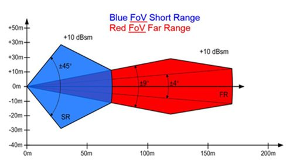

## Installation Guide of Continental ARS-408-21 Radar

```
The ARS408 realized a broad field of view by two independent scans in conjunction with the high range functions
like Adaptive Cruise Control, Forward Collision Warning and Emergency Brake Assist can be easily implemented.
Its capability to detect stationary objects without the help of a camera system emphasizes its performance. The ARS408 is a best in class radar,
especially for the stationary target detection and separation.

----Continental official website
```


The following diagram contains the range of the ARS-408-21 Radar:



### Installation

1. A mechanical mount needs to be designed to mount the Radar to the desired position. The mount should be able to hold the Radar in a way that the scanning plane is parallel to the bottom of the car, so that the scanning radar wave would not be blocked by the road surface causing it to create ghost objects. If a stationary mount cannot satisfy such requirement, please consider adding adjustment in vertical and horizontal directions to the mount

2. When you receive the Radar package, a set of connection cables should be included. Connect the water-proof connector to the Radar, and guide the cable through/under the car into the trunk. Secure the cable to the body of the car if necessary

   

3. Connect the power cable to **12VDC** power supply

4. Connect the CAN output to the CAN interface of the IPC

5. You should be able to receive the CAN messages through the CAN port once the Radar is powered.

### References

1. Additional information can be found on the [product page](https://www.continental-automotive.com/Landing-Pages/Industrial-Sensors/Products/ARS-408-21)

2. For information on troubleshooting or for the user manual, contact Continental directly

## Disclaimer

This device is `Apollo Platform Supported`


