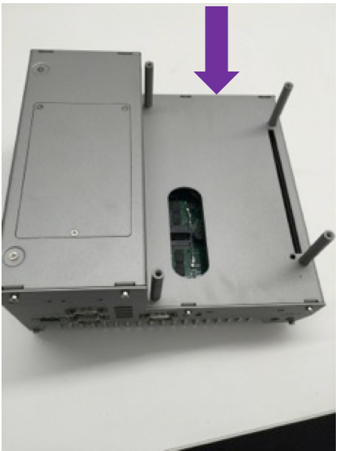
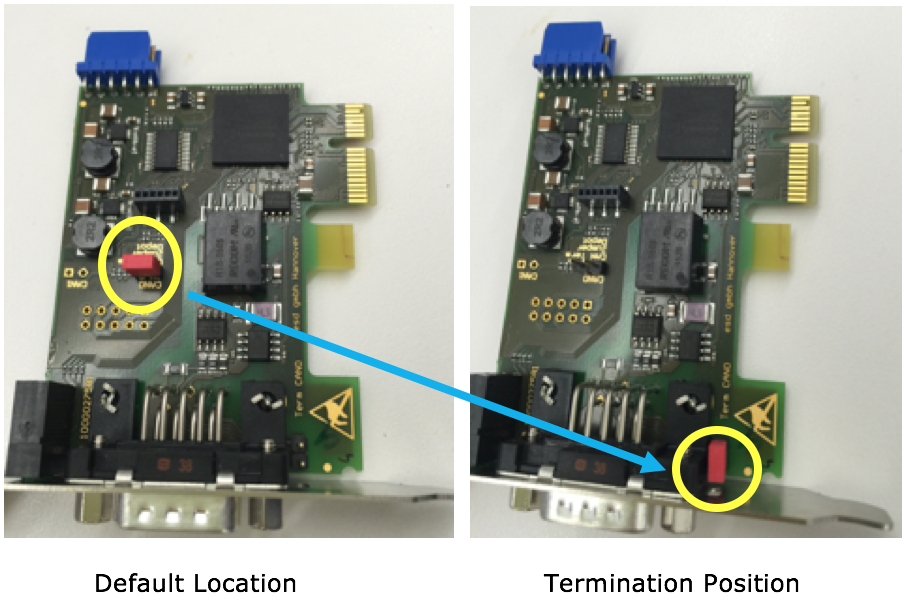
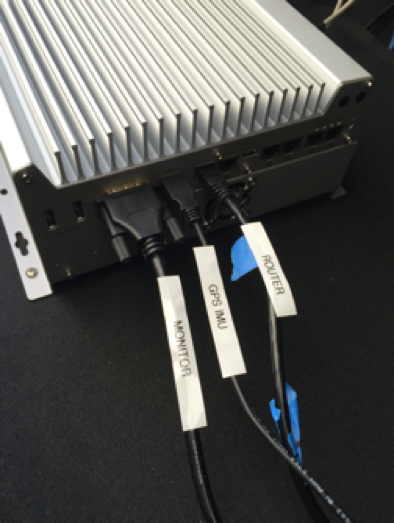

# Apollo 1.0 Hardware and System Installation Guide

* [About This Guide](#about-this-guide)
    * [Document Conventions](#document-conventions)
* [Introduction](#introduction)
    * [Documentation](#documentation)
* [Key Hardware Components](#key-hardware-components)
    * [Additional Components Required](#additional-components-required)
    * [Onboard Computer System - IPC](#onboard-computer-system---ipc)
        * [IPC Configuration](#ipc-configuration)
        * [IPC Front and Rear Views](#ipc-front-and-rear-views)
    * [Controller Area Network (CAN) Card](#controller-area-network-(can)-card)
    * [Global Positioning System (GPS) and Inertial Measurement Unit (IMU)](#global-positioning-system-(gps)-and-inertial-measurement-unit-(imu))

        * [Option 1: The NovAtel SPAN-IGM-A1](#option-1:-the-novatel-span-igm-a1)
        * [Option 2: The NovAtel SPAN ProPak6 and NovAtel IMU-IGM-A1](#option-2:-the-novatel-span-propak6-and-novatel-imu-igm-a1)
    * [The GPS Receiver/Antenna](#the-gps-receiver/antenna)
* [Overview of the Installation Tasks](#overview-of-the-installation-tasks)
* [Steps for the Installation Tasks](#steps-for-the-installation-tasks)
    * [At the Office](#at-the-office)
        * [Preparing the IPC](#preparing-the-ipc)
        * [Installing the Software for the IPC](#installing-the-software-for-the-ipc)
    * [In the Vehicle](#in-the-vehicle)
        * [Prerequisites](#prerequisites)
        * [Diagrams of the Major Component Installations](#diagrams-of-the-major-component-installations)
        * [Installing the GPS Receiver and Antenna](#installing-the-gps-receiver-and-antenna)
        * [Installing the IPC](#installing-the-ipc)
        * [Configuring the GPS and IMU](#configuring-the-gps-and-imu)
* [Setting up the Network](#setting-up-the-network)
    * [Recommendations](#recommendations)
* [Additional Tasks Required](#additional-tasks-required)
* [Next Steps](#next-steps)


# About This Guide

The *Apollo 1.0 Hardware and System Installation Guide* provides the instructions to install all of the hardware components and system software for the **Apollo Project **. The system installation information included pertains to the procedures to download and install the Apollo Linux Kernel.

## Document Conventions

The following table lists the conventions that are used in this document:

| **Icon**                            | **Description**                          |
| ----------------------------------- | ---------------------------------------- |
| **Bold**                            | Emphasis                                 |
| `Mono-space font`                   | Code, typed data                         |
| _Italic_                            | Titles of documents, sections, and headings Terms used |
|        | **Info**  Contains information that might be useful.  Ignoring the Info icon has no negative consequences. |
|          | **Tip**. Includes helpful hints or a shortcut that might assist you in completing a task. |
|    | **Online**. Provides a link to a particular web site where you can get more information. |
|  | **Warning**. Contains information that must **not** be ignored or you risk failure when you perform a certain task or step. |

# Introduction

The **Apollo Project** is an initiative that provides an open, complete, and reliable software platform for Apollo partners in the automotive and autonomous driving industries. The aim of this project is to enable these entities to develop their own self-driving systems based on Apollo software stack.

## Documentation

The following set of documentation describes Apollo 1.0:

- ***<u>[Apollo Hardware and System Installation Guide]</u>***  ─ Provides the instructions to install the hardware components and the system software for the vehicle:

    - **Vehicle**:

      - Industrial PC (IPC)
      - Global Positioning System (GPS)
      - Inertial Measurement Unit (IMU)
      - Controller Area Network (CAN) card
      - Hard drive
      - GPS Antenna
      - GPS Receiver

    - **Software**:
      - Ubuntu Linux
      - Apollo Linux Kernel

- ***<u>[Apollo Quick Start Guide]</u>*** ─ A combination tutorial and roadmap that provide the complete set of end-to-end instructions. The Quick Start Guide also provides links to additional documents that describe the conversion of a regular car to an autonomous-driving vehicle.


# Key Hardware Components

The key hardware components to install include:

- Onboard computer system ─ Neousys Nuvo-5095GC
- Controller Area Network (CAN) Card ─ ESD CAN-PCIe/402-1
- General Positioning System (GPS) and Inertial Measurement Unit (IMU) ─
  You can select one of the following options:
  - NovAtel SPAN-IGM-A1
  - NovAtel SPAN® ProPak6™ and NovAtel IMU-IGM-A1

## Additional Components Required

You need to provide these additional components for the Additional Tasks Required:

- A 4G router for Internet access
- A monitor, keyboard, and mouse for debugging at the car onsite
- Cables: Video Graphics Array (VGA) connector, a Digital Visual Interface (DVI) cable (optional)
- Apple iPad Pro: 9.7-inch, Wi-Fi (optional)

The features of the key hardware components are presented in the subsequent sections.

## Onboard Computer System - IPC

The onboard computer system is an industrial PC (IPC) for the autonomous vehicle and uses the **NeousysNuvo-5095GC** that is powered by a sixth-generation Intel Skylake core i7-6700 CPU.

The Neousys Nuvo-5095GC is the central unit of the autonomous driving system (ADS).

### IPC Configuration

Configure the IPC as follows:

- 32GB DDR4 RAM
- MezIO-V20-EP module (with ignition control for in-vehicle usage)
- PO-160W-OW 160W AC/DC power adapter
- CSM2 module (x16 PCIe expansion Gen3 8-lane cassette)

### IPC Front and Rear Views

The front and rear views of the IPC are shown with the Graphics Processing Unit (GPU) installed in the following pictures:

The front view of the Nuvo-5095GC:


The rear view of the Nuvo-5095GC:


For more information about the Nuvo-5095GC, see:


Neousys Nuvo-5095GC Product Page:

[http://www.neousys-tech.com/en/product/application/gpu-computing/product/nuvo-5095gc-gpu-computer](http://www.neousys-tech.com/en/product/application/gpu-computing/product/nuvo-5095gc-gpu-computer)


Neousys Nuvo-5095GC-Manual:

[http://www.neousys-tech.com/en/support/resources/category/162-manual](http://www.neousys-tech.com/en/support/resources/category/162-manual)

## Controller Area Network (CAN) Card

The CAN card to use with the IPC is **ESD** **CAN-PCIe/402**.


For more information about the CAN-PCIe/402, see:

    ESD CAN-PCIe/402 Product Page:

[https://esd.eu/en/products/can-pcie402](https://esd.eu/en/products/can-pcie402)


## Global Positioning System (GPS) and Inertial Measurement Unit (IMU)

There are **two** GPS-IMU **options** available,and the choice depends upon the one that most fits your needs:

- **Option 1: NovAtel SPAN-IGM-A1**
- **Option 2: NovAtel SPAN® ProPak6™ and NovAtel IMU-IGM-A1**

### Option 1: The NovAtel SPAN-IGM-A1

The NovAtel SPAN-IGM-A1 is an integrated, single-box solution that offers tightly coupled Global Navigation Satellite System (GNSS) positioning and inertial navigation featuring the NovAtel OEM615 receiver.


For more information about the NovAtel SPAN-IGM-A1, see:

  NovAtel SPAN-IGM-A1 Product Page:

[https://www.novatel.com/products/span-gnss-inertial-systems/span-combined-systems/span-igm-a1/](https://www.novatel.com/products/span-gnss-inertial-systems/span-combined-systems/span-igm-a1/)

### Option 2: The NovAtel SPAN ProPak6 and NovAtel IMU-IGM-A1

NovAtel ProPak6 is a standalone GNSS receiver. It works with a separate NovAtel- supported IMU (in this case, the NovAtel IMU-IGM-A1)to provide localization.

The ProPak6 provides the latest and most sophisticated enclosure product manufactured by NovAtel.

The IMU-IGM-A1 is an IMU that pairs with a SPAN-enabled GNSS receiver such as the SPAN ProPak6.


For more information about the NovAtel SPAN ProPak6 and the IMU-IGM-A1, see:

   NovAtel ProPak6 Installation & Operation Manual:

[https://www.novatel.com/assets/Documents/Manuals/OM-20000148.pdf](https://www.novatel.com/assets/Documents/Manuals/OM-20000148.pdf)

  NovAtel IMU-IGM-A1 Product Page:

[https://www.novatel.com/products/span-gnss-inertial-systems/span-imus/span-mems-imus/imu-igm-a1/#overview](https://www.novatel.com/products/span-gnss-inertial-systems/span-imus/span-mems-imus/imu-igm-a1/#overview)

## The GPS Receiver/Antenna

The GPS Receiver/Antenna used with the GPS-IMU component is the **NovAtel GPS-703-GGG-HV**.

**NOTE: **The GPS NovAtelGPS-703-GGG-HV works with either model of the two GPS-IMU options that are described in the previous section, Global Positioning System (GPS) and Inertial Measurement Unit (IMU).


For more information about the NovAtel GPS-703-GGG-HV, see:

   NovAtel GPS-703-GGG-HV Product Page:

[https://www.novatel.com/products/gnss-antennas/high-performance-gnss-antennas/gps-703-ggg-hv/](https://www.novatel.com/products/gnss-antennas/high-performance-gnss-antennas/gps-703-ggg-hv/)


# Overview of the Installation Tasks

Installing the hardware and the software components involves these tasks:

**AT THE OFFICE:**
1. Prepare the IPC:
    a. Examine the Graphics Processing Unit (GPU) cassette to determine if you need to remove the GPU card (if it was pre-installed).
    b. Prepare and then install the Controller Area Network (CAN) card by first repositioning the CAN card termination jumper before you insert the card into the slot.

2. Install the hard drive (if none was pre-installed) in the IPC.

    You can also choose to replace a pre-installed hard drive if you prefer.

    **Recommendations** :
    - Install a Solid-State Drive (SSD) for better reliability.
    - Use a high-capacity drive if you need to collect driving data.

3. Prepare the IPC for powering up:
    a. Attach the power cable to the power connector (terminal block).
    b. Connect the monitor, Ethernet, keyboard, and mouse to the IPC.
    c. Connect the IPC to a power source.

4. Install the software on the IPC (some Linux experience is required):
    a. Install Ubuntu Linux.
    b. Install the Apollo Linux kernel.

**IN THE VEHICLE:**

- Make sure that all the modifications for the vehicle, which are listed in the section Prerequisites, have been performed.

- Install the major components (according to the illustrations and the instructions included in this document):
    - GPS Antenna
    - IPC
    - GPS Receiver

The actual steps to install all of the hardware and software components are detailed in the section, Steps for the Installation Tasks.

# Steps for the Installation Tasks

This section describes the steps to install:

- The key hardware and software components
- The hardware in the vehicle

## At the Office

Perform these tasks:

- Prepare the IPC:
    - Install the CAN card
    - Install or replace the hard drive
    - Prepare the IPC for powering up

- Install the software for the IPC:
    - Ubuntu Linux
    - Apollo Kernel

### Preparing the IPC

Follow these steps:

1. In the IPC, examine the GPU cassette to determine if there is a pre-installed GPU card, which you need to remove:

    a. Turn over the IPC to unscrew the four screws (shown in the purple squares) on the bottom of computer that are holding the GPU cassette in place:

    

    b. Remove the GPU cassette from the IPC:

    

    c. Remove the GPU cassette from the IPC: Unscrew three additional screws (shown in the purple circles) on the bottom of the GPU cassette to open the cover:

    

    d. Remove the GPU card (if installed):

    


2. Prepare and install the CAN card:

    a. Set the CAN card termination jumper by removing the red jumper cap (shown in yellow circles) from its default location and placing it at its termination position:

    

    **WARNING**: The CAN card will not work if the termination jumper is not set correctly.

    b. Insert the CAN card into the slot in the IPC:

    

    c. Reinstall the GPU cassette in the IPC:

    

3. Install or replace the hard drive.

    You need to install one or two 2.5” SSD or hard drives if none have been pre-installed. As an alternative, you might want to replace a pre-installed hard drive with one of your own (say, an SSD).

     An SSD drive is highly recommended for better reliability. Also consider using a high-capacity drive if you need to collect driving data.

    To install the hard drive:

    a. Unscrew the three screws (shown in the purple circles) to open the hard drive cover (caddy):

    

    b. Install the drive in the caddy (as shown with an Intel SSD):

     Observe the way the hard drive is situated in the caddy for the installation.
    The Serial Advanced Technology Attachment (SATA) and the power connectors should be placed in the caddy facing the end that has the **two** screw holes showing.

    

       The hard drive in the caddy is now connected:

    

    c. Reinstall the SSD caddy in the IPC:

    

4. Prepare the IPC for powering up:

    a. Attach the power cable to the power connector(terminal block) that comes with the IPC:

    **WARNING**: Make sure that the positive(labeled **R** for red) and the negative(labeled **B** for black) wires of the power cable are inserted into the correct holes on the power terminal block.

    

    b.   Connect the monitor, Ethernet cable, keyboard, and mouse to the IPC:

    

    ​

    It is recommended that you use a Video Graphics Array (VGA) connector for the monitor for these reasons:

- If you do not see any screen display when the IPC boots up, switch to the VGA input. The Neousys Nuvo-5095GC IPC **always** outputs to a **VGA port** even if there is no monitor connected. Consequently, the Linux installer might “elect” to output to a VGA port instead of a DVI port.
- If you do not see a dialog window during the installation process when using a dual-monitor setup, try switching between VGA and DVI to find it. The Linux installer might detect two monitors and use them both.

For better display quality, you have the option to:

- Connect to another monitor using a DVI cable, or a High-Definition Multimedia Interface (HMI) with DVI-HMI adapter
- Use the DVI/HDMI port on the same monitor

    c. Connect the power:

    


### Installing the Software for the IPC

This section describes the steps to install:

- Ubuntu Linux
- Apollo Kernel

It is assumed that you have experience working with Linux to successfully perform the software installation.

#### Installing Ubuntu Linux
Follow these steps:

1. Create a bootable Ubuntu Linux USB flash drive:

    Download Ubuntu (or a variant such as Xubuntu) and follow the online instructions to create a bootable USB flash drive.

It is recommended that you use **Ubuntu 14.04.3**.

You can type F2 during the system boot process to enter the BIOS settings. It is recommended that you disable Quick Boot and Quiet Boot in the BIOS to make it easier to catch any issues in the boot process.

For more information about Ubuntu, see:
 Ubuntu for Desktop web site:

[https://www.ubuntu.com/desktop](https://www.ubuntu.com/desktop)

2. Install Ubuntu Linux:

    a.   Insert the Ubuntu installation drive into a USB port and turn on the system.
    b.   Install Linux by following the on-screen instructions.

3. Perform a software update and the installation:
    a.   Reboot into Linux after the installation is done.
    b.   Launch the Software Updater to update to the latest software packages (for the installed distribution) or type the following commands in a terminal program such as GNOME Terminal.
    ```shell
    sudo apt-get update; sudo apt-get upgrade
    ```

    c. Launch a terminal program such as GNOME Terminal and type the following command to install the Linux 4.4 kernel:

```shell
sudo apt-get install linux-generic-lts-xenial
```
The IPC must have Internet access to update and install software. Make sure that the Ethernet cable is connected to a network with Internet access. You might need to configure the network for the IPC if the network that it is connected to is not using the Dynamic Host Configuration Protocol (DHCP).


#### Installing the Apollo Kernel

The Apollo runtime in the vehicle requires the [Apollo Kernel](https://github.com/ApolloAuto/apollo-kernel). You are strongly recommended to install the pre-built kernel.

##### Use pre-built Apollo Kernel.

You get access and install the pre-built kernel with the following commands.

1. Download the release packages from the release section on github
```
https://github.com/ApolloAuto/apollo-kernel/releases
```
2. Install the kernel
After having the release package downloaded:
```
tar zxvf linux-4.4.32-apollo-1.0.0.tar.gz
cd install
sudo bash install_kernel.sh
```
3. Reboot your system by the `reboot` command
4. Build the ESD CAN driver source code
Now you need to build the ESD CAN driver source code according to [ESDCAN-README.md](https://github.com/ApolloAuto/apollo-kernel/blob/master/linux/ESDCAN-README.md)

##### Build your own kernel.
If have modified the kernel, or the pre-built kernel is not the best for your platform, you can build your own kernel with the following steps.

1. Clone the code from repository
```
git clone https://github.com/ApolloAuto/apollo-kernel.git
cd apollo-kernel
```
2. Add the ESD CAN driver source code according to [ESDCAN-README.md](https://github.com/ApolloAuto/apollo-kernel/blob/master/linux/ESDCAN-README.md)

3. Build the kernel with the following command.
```
bash build.sh
```
4. Install the kernel the same way as using a pre-built Apollo Kernel.

##### Optional: Test the ESD CAN device node
After rebooting the IPC with the new kernel:

a. Create the CAN device node by issuing the following commands in a terminal:

```shell
cd /dev; sudo mknod –-mode=a+rw can0 c 52 0
```
b. Test the CAN device node using the test program that is part of the ESD CAN software package that you have acquired from ESD Electronics.


The IPC is now ready to be mounted on the vehicle.

## In the Vehicle

Perform these tasks:

- Make the necessary modifications to the vehicle as specified in the list of prerequisites
- Install the major components:
    - GPS Antenna
    - IPC
    - GPS Receiver


### Prerequisites

**WARNING**: Prior to mounting the major components (GPS Antenna, IPC, and GPS Receiver) in the vehicle, certain modifications must be performed as specified in the list of prerequisites. The instructions for making the mandatory changes in the list are outside the scope of this document.

The list of prerequisites are as follows:

- The vehicle must be modified for “drive-by-wire” technology by a professional service company. Also, a CAN interface hookup must be provided in the trunk where the IPC will be mounted.
- A power panel must be installed in the trunk to provide power to the IPC and the GPS-IMU. The power panel would also service other devices in the vehicle such as a 4G LTE router. The power panel should be hooked up to the power system in the vehicle.
- A custom-made rack must be installed to mount the GPS-IMU Antenna on top of the vehicle.
- A custom-made rack must be installed to mount the GPS-IMU in the trunk.
- A 4G LTE router must be mounted in the trunk to provide Internet access for the IPC. The router must have built-in Wi-Fi access point (AP) capability to connect to other devices, such as an iPad, to interface with the autonomous driving (AD) system. A user would be able to use the mobile device to start AD mode or monitor AD status, for example.

### Diagrams of the Major Component Installations

The following two diagrams indicate the locations of where the three major components (GPS Antenna, IPC, and GPS Receiver) should be installed on the vehicle:


### Installing the GPS Receiver and Antenna

This section provides general information about installing **one** of two choices:

- **Option 1:** GPS-IMU: **NovAtel SPAN-IGM-A1**
- **Option 2:** GPS-IMU: **NovAtel SPAN® ProPak6™ and NovAtel IMU-IGM-A1**

#### Option 1: Installing the NovAtel SPAN-IGM-A1

The installation instructions describe the procedures to mount, connect, and take the lever arm measurements for the GPS-IMU NovAtel SPAN-IGM-A1.

##### Mounting

You can place the GPS-IMU NovAtel SPAN-IGM-A1 in most places in the vehicle but it is suggested that you follow these recommendations:

- Place and secure the NovAtel SPAN-IGM-A1 inside the trunk with the Y-axis pointing forward.
- Mount the NovAtel GPS-703-GGG-HV antenna in an unobscured location on top of the vehicle.

##### Wiring

You must connect two cables:

- The antenna cable ─ Connects the GNSS antenna to the antenna port of the SPAN-IGM-A1
- The main cable:
    - Connects its 15-pin end to the SPAN-IGM-A1
    - Connects its power wires to a power supply of 10-to-30V DC
    - Connects its serial port to the IPC. If the power comes from a vehicle battery, add an auxiliary battery (recommended).


Main Cable Connections

For more information, see the *SPAN-IGM™ Quick Start Guide*, page 3, for a detailed diagram:

SPAN-IGM™ Quick Start Guide

[http://www.novatel.com/assets/Documents/Manuals/GM-14915114.pdf](http://www.novatel.com/assets/Documents/Manuals/GM-14915114.pdf)

##### Taking the Lever Arm Measurement

When the SPAN-IGM-A1 and the GPS Antenna are in position,the distance from the SPAN-IGM-A1 to the GPS Antenna must be measured. The distance should be measured as: X offset, Y offset, and Z offset.

The error of offset must be within one centimeter to achieve high accuracy. For more information, see the *SPAN-IGM™ Quick Start Guide*, page 5, for a detailed diagram.

For an additional information about the SPAN-IGM-A1, see:

SPAN-IGM™ User Manual:

[http://www.novatel.com/assets/Documents/Manuals/OM-20000141.pdf](http://www.novatel.com/assets/Documents/Manuals/OM-20000141.pdf)


#### Option 2: Installing NovAtel SPAN® ProPak6™ and NovAtel IMU-IGM-A1

The installation instructions describe the procedures to mount, connect, and take the lever arm measurements for the GPS NovAtel SPAN® ProPak6™ **and** the NovAtel IMU-IGM-A1.

##### Components for the Installation

The components that are required for the installation include:

- NovAtel GPS SPAN ProPak6

- NovAtel IMU-IGM-A1

- NovAtel GPS-703-GGG-HV Antenna

- NovAtel GPS-C006 Cable (to connect antenna to GPS)

- NovAtel 01019014 Main Cable (to connect GPS to a serial port the IPC)

- Data Transport Unit (DTU) – similar to a 4G router

- Magnetic adapters (for antenna and DTU)

- DB9 Straight Through Cable

##### Mounting

You can place the two devices, the ProPak6 and the IMU, inmost places in the vehicle but it is suggested that you follow these recommendations:

- Place and secure the ProPak6 and the IMU side-by-side inside the trunk with the Y-axis pointing forward.
- Mount the NovAtel GPS-703-GGG-HV antenna on top of the vehicle or on top of the trunk lid as shown:


- Use a magnetic adapter to tightly attach the antenna to the trunk lid.
- Install the antenna cable in the trunk by opening the trunk and placing the cable in the space between the trunk lid and the body of the car.

##### Wiring

Follow these steps to connect the ProPak6 GNSS Receiver and the IMU to the Apollo system:

1. Use the split cable that comes with IMU-IGM-A1 to connect the IMU Main port and theProPak6 COM3/IMU port.
2. Use a USB-A-to-MicroUSB cable to connect the USB port of the IPC and the MicroUSB port of the ProPak6.
3. Connect the other end of the IMU-IGM-A1 split cable to the vehicle power.
4. Connect the GNSS antenna to Propak6.
5. Connect the Propak6 power cable.


For more information about the NovAtel SPAN ProPak6, see:

NovAtel ProPak6 Installation& Operation Manual:

[https://www.novatel.com/assets/Documents/Manuals/OM-20000148.pdf](https://www.novatel.com/assets/Documents/Manuals/OM-20000148.pdf)


### Installingthe IPC

Follow these steps:

1.   Use a power cable to connect the vehicle power source to the IPC:

Use its power connector as one end  , and connect the other end to the power panel in the vehicle(see the section, Prerequisites).

2.   Place the onboard computer system, the 5059GC,inside the trunk (recommended).

For example, Apollo 1.0 uses 4x4 self-tapping screws to bolt the 5059GC to the carpeted floor of the trunk. 

3. Mount the IPC so that its front and back sides(where all ports are located) face the right side (passenger) and the left side(driver) of the trunk.

This positioning makes it easier to connect all of the cables.

For more information, see:

Neousys Nuvo-5095GC – Manual:

[http://www.neousys-tech.com/en/support/resources/category/162-manual](http://www.neousys-tech.com/en/support/resources/category/162-manual)

4. Connect all cables, which include:

- Power cable

- Controller Area Network (CAN) cable

- Ethernet cable from the 4G router to the IPC

- GPS Receiver to the IPC

- (Optional) Monitor, keyboard, mouse


a.   Connect the power cable to the IPC (as shown):


b. Connect the other end of the power cable to the vehicle battery (as shown):


c. Connect the DB9 cable to the IPC to talk to the CAN (as shown):


d. Connect:

- the Ethernet cable from the 4G router to the IPC (labeled as Router)

- the GPS Receiver to the IPC (labeled as GPSIMU)

- (optional) the monitor (labeled as Monitor):




#### Taking the Lever Arm Measurement

Follow these steps:

1.    Before taking the measurement, turn on the IPC.


2.    When the IMU and the GPS Antenna are in position, the distance from the IMU to the GPS Antenna must be measured. The distance should be measured as: X offset, Yoffset, and Z offset.

The error of offset must be within one centimeter to achieve high accuracy in positioning and localization.

For an additional information, see:

NovAtel ProPak6 Installation & Operation Manual:

[https://www.novatel.com/assets/Documents/Manuals/OM-20000148.pdf](https://www.novatel.com/assets/Documents/Manuals/OM-20000148.pdf)

NovAtel SPAN-IGM-A1 Product Page:

[https://www.novatel.com/products/span-gnss-inertial-systems/span-combined-systems/span-igm-a1/](https://www.novatel.com/products/span-gnss-inertial-systems/span-combined-systems/span-igm-a1/)

### Configuring the GPS and IMU

Configure the GPS and IMU as shown:

```
WIFICONFIGSTATE OFF
UNLOGALLTHISPORT
SETIMUTOANTOFFSET0.00 1.10866 1.14165 0.05 0.05 0.08
SETINSOFFSET0 0 0
LOGCOM2 GPRMC ONTIME 1.0 0.25
EVENTOUTCONTROLMARK2 ENABLE POSITIVE 999999990 10
EVENTOUTCONTROLMARK1 ENABLE POSITIVE 500000000 500000000
LOGNCOM1 GPGGA ONTIME 1.0

logbestgnssposb ontime 0.5
logbestgnssvelb ontime 0.5
logbestposb ontime 0.5
logINSPVASB ontime 0.01
logCORRIMUDATASB ontime 0.01
logINSCOVSB ontime 1
logmark1pvab onnew

logimutoantoffsetsb once
logvehiclebodyrotationb onchanged

SAVECONFIG
```

For ProPak6:

```
WIFICONFIG STATE OFF
CONNECTIMU COM3 IMU_ADIS16488
INSCOMMAND ENABLE
SETIMUORIENTATION 5
ALIGNMENTMODE AUTOMATIC  
SETIMUTOANTOFFSET 0.00 1.10866 1.14165 0.05 0.05 0.08
VEHICLEBODYROTATION 0 0 0
 
COM COM1 9600 N 8 1 N OFF OFF
COM COM2 9600 N 8 1 N OFF OFF
INTERFACEMODE COM1 NOVATEL NOVATEL OFF
LOG COM2 GPRMC ONTIME 1 0.25
PPSCONTROL ENABLE POSITIVE 1.0 10000
MARKCONTROL MARK1 ENABLE POSITIVE
EVENTINCONTROL MARK1 ENABLE POSITIVE 0 2
 
interfacemode usb2 rtcmv3 none off
rtksource auto any
psrdiffsource auto any
 
SAVECONFIG
```

** WARNING:** Modify the **<u>SETIMUTOANTOFFSE</u>T** line based on the actual measurement (of the antenna and the IMU offset).

For example:

```
SETIMUTOANTOFFSET -0.05 0.5 0.8 0.05 0.05 0.08
```

# Setting up the Network

This section provides recommendations for setting up the network.

The IPC that is running the Apollo software must access the Internet to acquire the Real Time Kinematic (RTK) data for accurate localization. A mobile device also needs to connect to the IPC to run the Apollo software.

## Recommendations

Itis recommended that you set up your network according to the following diagram:


Follow these steps:

1.   Install and configure a 4G LTE router with Wi-Fi Access Point (AP) capability and Gigabit Ethernet ports.


2.   Connect the IPC to the LTE router using an Ethernet cable.


3.   Configure the LTE router to access the Internet using the LTE cellular network.


4.   Configure the AP capability of the LTE router so that the iPad Pro or another mobile device can connect to the router, and, in turn, connect to the IPC.

It is recommended that you configure a fixed IP instead of using DHCP on the IPC to make it easier to connect to it from a mobile terminal.

# Additional Tasks Required

Youwill use the components that you were required to provide to perform the following tasks:

1.   Connect a monitor using the DVI or the HDMI cables and connect the keyboard and mouse to perform debugging tasks at the car onsite.

2.   Establish a Wi-Fi connection on the Apple iPad Pro to access the HMI and control the Apollo ADS that is running on the IPC.

# Next Steps

After you complete the hardware installation in the vehicle, see the [Apollo Quick Start](../../../02_Quick%20Start/apollo_1_0_quick_start.md) for the steps to complete the software installation.
