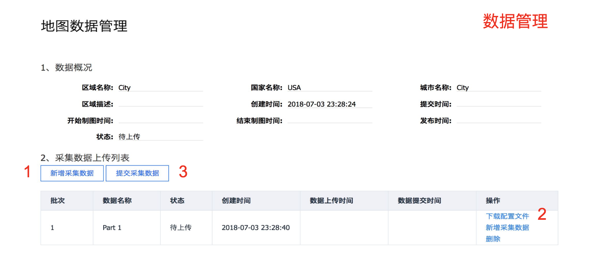

# Apollo 2.5 地图采集功能使用指南

本文档主要用来说明如何在 Apollo2.5 中使用地图数据采集的功能.重点介绍了数据采集所
需的软硬件环境,数据采集的流程和注意事项.

## 软硬件环境准备

1、硬件安装方法参
见[Apollo 2.5 硬件安装指南](../11_Hardware%20Integration%20and%20Calibration/%E8%BD%A6%E8%BE%86%E9%9B%86%E6%88%90/%E7%A1%AC%E4%BB%B6%E5%AE%89%E8%A3%85hardware%20installation/apollo_2_5_hardware_system_installation_guide_v1.md)

2、软件安装方法参
见[Apollo 软件安装指南](../01_Installation%20Instructions/apollo_software_installation_guide.md)

3、传感器标定方法参
见[Apollo 传感器标定方法使用指南](../06_Perception/multiple_lidar_gnss_calibration_guide.md)

4、NVMe SSD 硬盘。为了解决由于 IO 瓶颈导致可能的数据丢帧问题，建议工控机中安装
NVME SSD 硬盘。

5、卫星基站。为了得到精确的制图结果，需要搭建卫星基站，并且保证整个采集过程中采
集车的 RTK 可以正常工作。

## 数据采集流程

1、启动地图采集模式 Apollo 环境启动参
见[Apollo 2.5 快速上手指南](../02_Quick%20Start/apollo_2_5_quick_start_cn.md)

选择[Module Controller]、[Map Collection],打
开[GPS]、[Camera]、[Velodyne]、[Velodyne16]开关。

确认各个传感器状态是否 OK。

2、待确认各个传感器状态 OK 后，打开[Record Bag]开关，开始录制地图数据。

正式采集数据之前，需要车辆静止 5 分钟，8 字绕行 5 分钟。采集过程中需要保证双向车
道全覆盖采集五圈以上，车速 60KM/h 以下，尽量每圈走不同的车道，覆盖完全。在路口区
域无需刻意停留，慢速通过即可。路口区域需对各方向道路外延采集至少 50m，保障道路各
方向的红绿灯及车道线完整清晰。数据采集完成后，需要 8 字绕行五分钟，然后再静止五
分钟。

3、所有采集完成后，关闭[Record Bag]开关结束采集，然后关
闭[GPS]、[Camera]、[Velodyne]、[Velodyne16]开关。

4、数据上传

采集的数据放置在/apollo/data/bag/(采集开始时间,例如 2018-04-14-21-20-24)目录，把
该目录下的数据打包为 tar.gz 压缩文件，
到[Apollo 数据官网](http://data.apollo.auto/hd_map_intro/?locale=zh-cn)进行数据
上传。

## 地图数据生产服务

1、数据权限申请

首先需要注册一个百度账号，登陆百度账号，申请地图制作服务使用权限(仅需申请一次),
如果已经申请过，跳过此步。 

2、地图技术服务

用户可以在该页面进行新建区域、创建制图任务、管理地图数据、跟踪制图进度，下载地图
数据。 

3、数据管理

用户点击“采集数据管理”后可以进入采集数据管理页面，在该页面可以上传多份采集数据，
所有数据上传上传后可以提交采集数据，之后进入制图流程，不能再对数据进行编辑操作。

4、数据下载

当需求状态是"已发布"时，点击“下载地图”可进行地图数据下载。如果需要更新地图，请点
击“更新地图数据”发起制图流程，需重新进行数据上传及制图流程。

