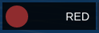
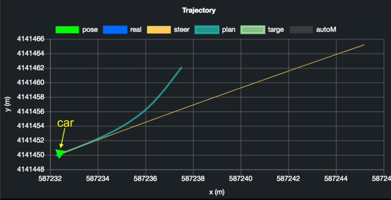

# Dreamview Usage Table

Dreamview is a web application that,
1. visualizes the current output of relevant autonomous driving modules, e.g. planning trajectory, car localization, chassis status, etc.
2. provides human-machine interface for users to view hardware status, turn on/off of modules, and start the autonomous driving car.
3. provides debugging tools, such as PnC Monitor to efficiently track module issues.

## Layout and Features

The application layout is divided into several regions: header, sidebar, main view, and tool view.

### Header
The Header has 3 drop-downs that can be set as shown:

The Co-Driver switch is used to detect disengagement event automatically. Once detected, Dreamview will display a pop-up of the data recorder window for the co-driver to enter a new drive event.

Depending on the mode chosen from the mode selector, the corresponding modules and commands, defined in [hmi.conf](https://github.com/ApolloAuto/apollo/blob/master/modules/dreamview/conf/hmi.conf), will be presented in the **Module Controller**, and **Quick Start**, respectively.

Note: navigation mode is for the purpose of the low-cost feature introduced in Apollo 2.5. Under this mode, Baidu (or Google) Map presents the absolute position of the ego-vehicle, while the main view has all objects and map elements presented in relative positions to the ego-vehicle.

### Sidebar and Tool View

Sidebar panel controls what is displayed in the tool view described below:

### Tasks
All the tasks that you could perform in DreamView:

* **Quick Start**: commands supported from the selected mode. In general,
    **setup**: turns on all modules

    **reset all**: turns off all modules

    **start auto**: starts driving the vehicle autonomously
* **Others**: switches and buttons for tools used frequently
* **Module Delay**: the time delay between two messages for each topic
* **Console**: monitor messages from the Apollo platform
### Module Controller
A panel to view the hardware status and turn the modules on/off

### Layer Menu
A toggle menu for visual elements displays.

### Route Editing
A visual tool to plan a route before sending the routing request to the Routing module

### Data Recorder
A panel to report issues to drive event topic ("/apollo/drive_event") to rosbag.

### Default Routing
List of predefined routes or single points, known as point of interest (POI).

If route editing is on, routing point(s) can be added visually on the map.

If route editing is off, clicking a desired POI will send a routing request to the server. If the selected POI contains only a point, the start point of the routing request is the current position of the autonomous car; otherwise, the start position is the first point from the desired route.

To edit POIs, see [default_end_way_point.txt](../../../modules/map/data/demo/default_end_way_point.txt) file under the directory of the Map. For example, if the map selected from the map selector is "Demo", then [default_end_way_point.txt](../../../modules/map/data/demo/default_end_way_point.txt) is located under `modules/map/data/demo`.

### Main view:
Main view animated 3D computer graphics in a web browser.

Elements in the main view are listed in the table below:

| Visual Element                           | Depiction Explanation                    |
| ---------------------------------------- | ---------------------------------------- |
|  | <ul><li>The autonomous car    </li></ul>                  |
|  | <ul><li>The wheel steering percentage.</li> <li>The status of left/right turn signals (In an emergency situation, both signals will be on.)</li></ul> |
|  | <ul><li>  The traffic signal detected     </li></ul>          |
|  |<ul><li>  The driving mode (AUTO/DISENGAGED/MANUAL/etc.) </li></ul>  |
|  | <ul><li>The driving speed in km/h as default. Click on the unit to change the unit.</li> <li>The accelerator/brake percentage</li></ul> |
|  | <ul><li> The  red thick line shows the routing suggestion</li></ul>  |
|  |<ul><li>  Nudge object decision -- the orange zone indicates the area to avoid </li></ul> |
|  |<ul><li>  The  green thick curvy band indicates the planned trajectory </li></ul> |

#### Obstacles

| Visual Element                           | Depiction Explanation                    |
| ---------------------------------------- | ---------------------------------------- |
|  | <ul><li>Vehicle  obstacle   </li></ul>                     |
|  | <ul><li>Pedestrian  obstacle    </li></ul>                 |
|  | <ul><li>Bicycle  obstacle      </li></ul>                |
|  | <ul><li>Unknown  obstacle </li></ul>                        |
|  | <ul><li>The  velocity arrow shows the direction of the movement with the length  proportional to the magnitude</li></ul>  |
|  | <ul><li>The  white arrow shows the directional heading of the obstacle</li></ul>  |
|  | The  yellow text indicates: <ul><li>The tracking ID of the obstacle.</li><li>The distance from the autonomous car and obstacle speed.</li></ul> |
|  | <ul><li>The  lines show the predicted movement of the obstacle with the same color as the  obstacle</li></ul>  |

#### Planning Decision
##### Decision Fence

Decision fences reflect decisions made by planning module to ego-vehicle (main) and obstacles (objects). Each type of decision is presented in different color and icon as shown below:

| Visual Element                           | Depiction Explanation                    |
| ---------------------------------------- | ---------------------------------------- |
|  | <ul><li>**Stop** depicting the primary stopping reason</li></ul>  |
|  | <ul><li>**Stop** depicting the object stopping reason</li></ul>  |
|  | <ul><li>**Follow** object</li></ul>                        |
|  | <ul><li>**Yield** object decision -- the dotted line connects with the respective object</li></ul>  |
|  | <ul><li>**Overtake** object decision -- the dotted line connects with the respective object</li></ul>  |

Changing lane is a special decision and hence, instead of having decision fence, a change lane icon shows on the autonomous car:

| Visual Element                           | Depiction Explanation                    |
| ---------------------------------------- | ---------------------------------------- |
|  | <ul><li>Change to **Left** lane </li></ul>|
|  | <ul><li>Change to **Right** lane </li></ul>|

When a yield decision is made based on the "Right of Way" laws at a stop-sign intersection, the obstacles to be yielded will have the yield icon on top:

| Visual Element                                       | Depiction Explanation          |
| ---------------------------------------------------- | ------------------------------ |
|  | Obstacle to yield at stop sign |

##### Stop reasons

When a STOP decision fence is shown, the reason to stop is displayed on the right side of the stop icon. Possible reasons and the corresponding icons are:

| Visual Element                           | Depiction Explanation                    |
| ---------------------------------------- | ---------------------------------------- |
|  | <ul><li> **Clear-zone in front** </li></ul>|
|  | <ul><li> **Crosswalk in front** </li></ul>|
|  | <ul><li> **Destination arrival** </li></ul>|
|  | <ul><li> **Emergency**  </li></ul>       |
|  | <ul><li> **Auto mode is not ready** </li></ul>|
|  | <ul><li> **Obstacle is blocking the route**</li></ul> |
|  | <ul><li> **Pedestrian crossing in front** </li></ul> |
|  | <ul><li> **Traffic light is yellow/red** </li></ul>|
|  | <ul><li> **Vehicle in front** </li></ul> |
|  | <ul><li> **Stop sign in front** </li></ul>|
|  | <ul><li> **Pull over** </li></ul>|
|  | <ul><li> **Yield sign in front** </li></ul> |

#### Point of View
Main view that reflects the point of view chosen from **Layer Menu**:

| Visual Element                           | Point of View                            |
| ---------------------------------------- | ---------------------------------------- |
|  | <ul><li>**Default**      </li></ul> |       |
|  | <ul><li>**Near**   </li></ul> |             |
|  | <ul><li>**Overhead**    </li></ul> |        |
|  | **Map** <ul><li> To zoom in/out: mouse scroll or pinch with two fingers </li><li> To move around:right-click and drag or swipe with three fingers</li></ul> |

## Shortcut Keys

| Shortcut Keys   | Description     |
| --------------- | --------------- |
| 1               | Toggle **Task** panel |
| 2               | Toggle **Module Controller** panel |
| 3               | Toggle **Layer Menu** panel |
| 4               | Toggle **Route Editing** panel |
| 5               | Toggle **Data Recorder** panel |
| 6               | Toggle **Audio Capture** panel |
| 7               | Toggle **Default Routing** panel |
| v               | Rotate **Point of View** options |

## PnC Monitor

To view the monitor:
1. Build Apollo and run Dreamview on your web browser
2. Turn on the "PNC Monitor" from the 'Others' panel.
3. On the right-hand side, you should be able to view the Planning, Control, Latency graphs as seen below

### Planning/Control Graphs

The Planning/Control tab from the monitor plots various graphs to reflect the internal states of its modules.

#### Customizable Graphs for Planning Module
[planning_internal.proto](../../../modules/planning/proto/planning_internal.proto) is a protobuf that stores debugging information, which is processed by dreamview server and send to dreamview client to help engineers debug. For users who want to plot their own graphs for new planning algorithms:
1. Fill in the information of your "chart" defined in planning_internal.proto.
2. X/Y axis: [**chart.proto** ](../../../modules/dreamview/proto/chart.proto) has "Options" that you could set for axis which include
    * min/max: minimum/maximum number for the scale
    * label_string: axis label
    * legend_display: to show or hide a chart legend.
        
3. Dataset:
    * Type: each graph can have multiple lines, polygons, and/or car markers defined in [**chart.proto**](../../../modules/dreamview/proto/chart.proto):
        * Line:

            
        * Polygon:

            
        * Car:

            

    * Label: each dataset must have a unique "Label" to each chart in order to help dreamview identify which dataset to update.
    * Properties: for polygon and line, you can set styles. Dreamview uses **Chartjs.org** for graphs. Below are common ones:

        | Name        | Description                             | Example                 |
        | ----------- | --------------------------------------- | ----------------------- |
        | color       | The line color                          | rgba(27, 249, 105, 0.5) |
        | borderWidth | The line width                          | 2                       |
        | pointRadius | The radius of the point shape           | 1                       |
        | fill        | Whether to fill the area under the line | false                   |
        | showLine    | Whether to draw the line                | true                    |

    Refer to https://www.chartjs.org/docs/latest/charts/line.html for more properties.
4. Sample: You could look into [on_lane_planning.cc](../../../modules/planning/on_lane_planning.cc) for a code sample.

#### Additional Planning Paths
For users who want to render additional paths on dreamview 3D scene, add the desired paths to the "path" field in [planning_internal.proto](../../../modules/planning/proto/planning_internal.proto#L164). These paths will be rendered when PnC Monitor is on:

Dreamview has predefined styles for the first four paths:

| Properties | Path 1   | Path 2   | Path 3    | Path 4   |
| ---------- | -------- | -------- | --------- | -------- |
| width      | 0.8      | 0.15     | 0.4       | 0.65     |
| color      | 0x01D1C1 | 0x36A2EB | 0x8DFCB4  | 0xD85656 |
| opacity    | 0.65     | 1        | 0.7       | 0.8      |
| zOffset    | 4        | 7        | 6         | 5        |

If you have more than four paths to render or want to change the styles, edit the planning.pathProperties value in [dreamview/frtonend/dist/parameters.json](../../../modules/dreamview/frontend/dist/parameters.json)
.

### Latency graph

The graph displays the difference in time when the module receives sensor input data to when it will publish this data.

The Latency Graph can be used to track the latency each individual faces. The graphs are coloured differently to help distinguish the modules and a key is included for better understanding. The graph is plotted as Latency measured in ms vs Timestamp measure in seconds as seen in the image below.
