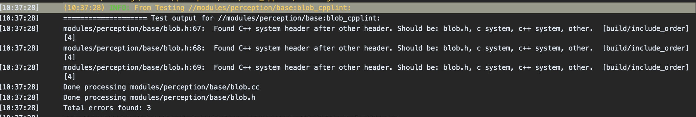

# 在Apollo中如何使用CI结果
在Apollo项目中，一个PR（pull request）能否被合入取决于是否签署了CLA协议以及CI的结果。

## CI将会检查哪些内容
Apollo的CI会按照以下步骤运行：

1. 将你的PR签入master的基础代码并进行构建
2. 对你的代码进行风格检查（包括 .cc、.h、.py、BUILD等）
3. 运行所有单元测试

所以，推荐在提交代码前执行以下命令：

```
./apollo.sh lint
./apollo.sh build
./apollo.sh test
```

当你的PR出现CI错误时，你可以点击下图中的`Details`


现在你就进入到了我们的CI系统，进入`Build Log`可以查看更详细的日志。


## 可能遇到的错误和解决办法

### Error: "FAIL: //modules/perception/base:blob_cpplint"



这是由于代码风格检查失败。Apollo的代码使用Google代码风格，所以头文件应该按照建议的顺序排列。如果你没有找到建议内容，可以点击展开日志信息。

### Error: "FAIL: //modules/perception/base:blob_test"


这是由于单元测试失败。你可以根据日志信息来修正单元测试。特别是发生超时问题时，你可以尝试将BUILD文件中的`size`设置从`small`修改为`medium`或`large`，这可能会有效。

如果遇到了更加复杂的情况，欢迎在你提交的PR下进行留言。
