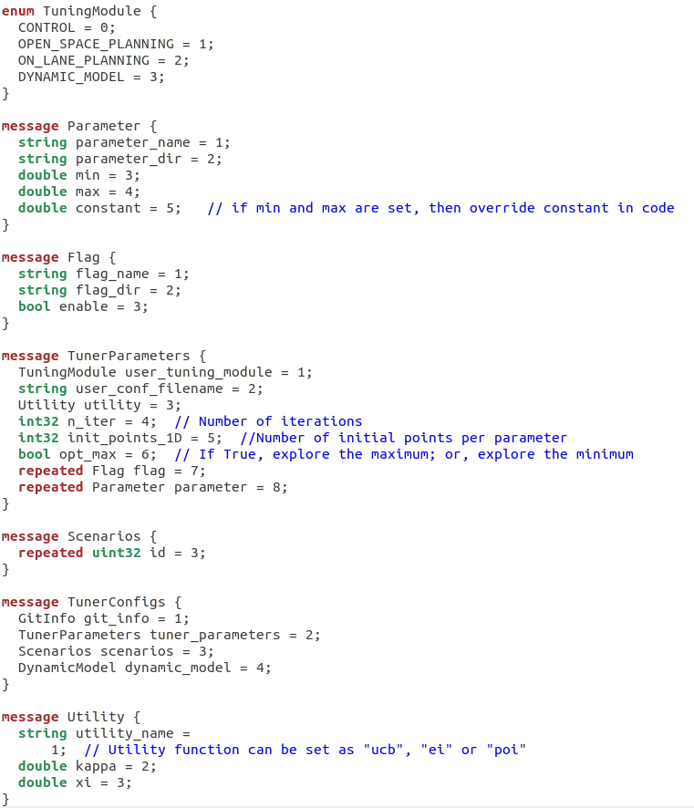
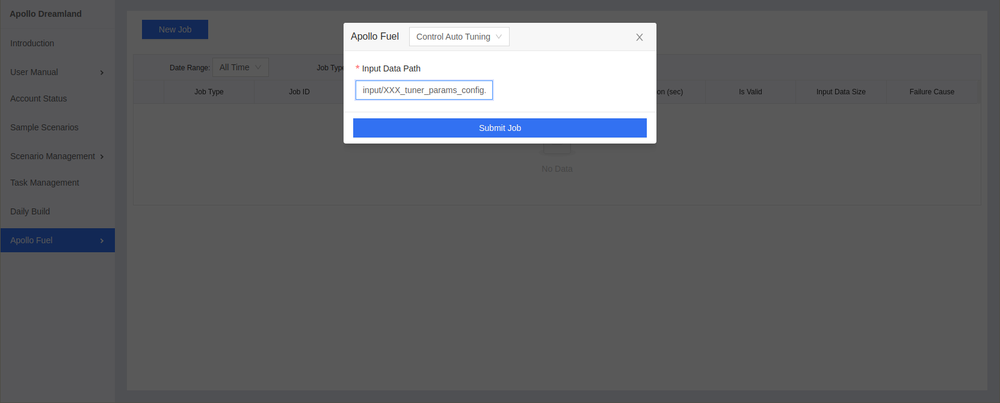

# Control Parameter Auto-Tuning Service

- [Control Parameter Auto-Tuning Service](#ControlParameterAuto-TuningService)
  - [Overview](#Overview)
  - [Prerequisites](#Prerequisites)
  - [Main Steps](#MainSteps)
  - [Baidu Cloud Storage BOS Registration](#BaiduCloudStorageBOSRegistration)
  - [Open Cloud Service Account](#OpenCloudServiceAccount)
  - [Task Configuration File Setting](#TaskConfigurationFileSetting)
    - [Task Configuration Protocol Buffers](#TaskConfigurationProtocolBuffers)
    - [Task Configuration File Example](#TaskConfigurationFileExample)
    - [Task Configuration Detailed Explanations](#TaskConfigurationDetailedExplanations)
    - [Customized Dynamic Models Guidance](#CustomizedDynamicModelsGuidance)
  - [Task Submission](#TaskSubmission)
    - [Task Configuration File Storage](#TaskConfigurationFileStorage)
    - [Submit Job via Webpage](#SubmitJobviaWebpage)
  - [Task Results Acquisition](#TaskResultsAcquisition)
    - [Receive Task Results Email](#ReceiveTaskResultsEmail)
    - [Task Results Analysis](#TaskResultsAnalysis)

## Overview

Control parameter auto-tuning service utilizes the machine learning method to automatically optimize the control parameters of the PID, LQR, MPC, MRAC, etc. controllers used in the Apollo Control Module, to realize the full automation of controller tuning within offline simulation environment that saves massive manual tests with on-road experiments. It integrates with multiple Apollo online service tools including the dynamic modeling, simulation platform, and control profiling.

Control parameter auto-tuning service 1) iteratively generates the new control parameters and evaluate the generated parameters by invoking the backend Apollo Simulation service, in which the pre-trained vehicle dynamic models are used to enable the control-in-the-loop simulation; 2) the simulation results are evaluated via the backend control profiling service; 3) and furthermore, tens of control metrics from the control profiling results are weighted and combined into one weighted score, and with this score as optimization target, the auto-tuning service continuously searches the new control parameters with better score in the promising zone, until it reaches the given step.   

## Prerequisites

Control parameter auto-tuning is executed in the control-in-the-loop simulation environment, and thus it request the users to provide their own vehicle dynamic model (i.e., the results of dynamic modeling service) for simulation; otherwise, the service will use the default vehicle dynamic model based on the MKZ vehicle model. Therefore, for a control parameter training service on the customized vehicle, some pre-required steps are listed as follows:

- [Apollo](https://github.com/ApolloAuto/apollo) 6.0 or higher version

- Cloud and simulation services registered according to [Apollo Dreamland](http://bce.apollo.auto/)

- [Dynamic Modeling](../Dynamic_Model/README.md) service

## Main Steps

- Task Configuration File Setting

- Task Submission

- Task Results Acquisition

## Baidu Cloud Storage BOS Registration

The registration please refer to [Baidu Cloud Storage BOS Register and User Manual](../../Apollo_Fuel/apply_bos_account_cn.md)

**Note:** The clients must use the registered `bucket`，and make sure that the `Bucket Name`、`Backet Area` are the same as the ones when registered。

## Open Cloud Service Account

Please contact with the business department to open the cloud service account and provide your `Bucket Name`、`Backet Area` mentioned in the last step  

## Task Configuration File Setting

### Task Configuration Protocol Buffers
The task configuration should be prepared in the form of the "XXX_tuner_params_config.pb.txt", with the
Protocol Buffers file as follows:
   

### Task Configuration File Example
According to the Protocol Buffers shown above, an example of the configuration file is shown as follows:
   

### Task Configuration Detailed Explanations
The detailed explanations of the message in the XXX_tuner_params_config.pb.txt is as follows:

| Message | Detailed Explanations | Notes |
|---|---|---|
| `git_info.repo`| The repo name which will be executed in the Apollo simulation platform | The dynamic models used in simulation must be placed in the designed path in this github repo, following the [Customized Dynamic Models Guidance](#CustomizedDynamicModelsGuidance)|
| `git_info.commit_id` | The commit id which will be executed in the Apollo simulation platform | If empty, by default the latest commit id will be used |
| `tuner_parameters.user_tuning_module` | Set as **CONTROL** | Must be **CONTROL** otherwise cannot pass the task sanity check |
| `tuner_parameters.user_conf_filename` | The control configuration file in the `git_info.repo`, which will be executed in the Apollo simulation platform | The tuned parameters and flags must be included in the configuration file |
| `tuner_parameters.n_iter` | The iteration step number used to search for the optimized control parameters. Suggested values: **n_iter=200 for 1-2 tuned parameters; n_iter=300 for 3-4 tuned parameters; n_iter=400 for 5-6 tuned parameters; n_iter=500 for 7-8 tuned parameters; n_iter=600 or more for 9+ tuned parameters** | The more the iteration steps are, the higher the optimization accuracy (but slower training process) is; must be **< 1000** otherwise cannot pass the task sanity check|
| `tuner_parameters.opt_max` | Set as **True** | Must be **True** otherwise cannot search for the optimized control parameters |
| `tuner_parameters.flag` | (repeated message) Set as many flags (boolen parameters) as the users need in the users' control configuration file. The flag values (True/False) you set will overwrite the default flag values in control configuration file | The flags are NOT counted as **Tuned Parameter** |
| `tuner_parameters.parameter` | (repeated message) Set as many parameters as the users need in the users' control configuration file. If the users set the **constant** property of the parameter, then the parameters will be treated as **Constant Parameter** and the set constant values will overwrite the default values in control configuration file; If the users set the **min** and **max** properties of the parameter, then the parameters will be treated as **Tuned Parameter** and the auto-tuning service will attempt to search the best parameter value through the range limited by **min** and **max** | The more the tuned parameters are, the more the optimization iteration step number (and the longer and slower auto-tuning process) may be needed |
| `scenarios.id` | (repeated message) Set as many scenario IDs as the users need for the control performance evaluation in the parameter auto-tuning. Suggested IDs: **11014, 11015, 11016, 11017, 11018, 11019, 11020** | The users may also choose any available scenario ID from the public scenarios from the Apollo simulation platform. The more the scenario IDs are, the slower the auto-tuning process may be |
| `dynamic_model` | Set as **ECHO_LINCOLN**, only if `git_info.repo` is set as the official Apollo repo | Ignored if the customized repo is used in `git_info.repo`|  

### Customized Dynamic Models Guidance

If the users intend to use their own dynamic models in simulation, then please provide the forward-driving model at github **apollo/modules/control/conf/dynamic_model_forward.bin**; backward-driving model at github **apollo/modules/control/conf/dynamic_model_backward.bin**. Please refer to [Dynamic Model](../../Apollo_Fuel/Dynamic_Model/README.md) for guidance on how to generate the customized dynamic models

## Task Submission

### Task Configuration File Storage

Before using the auto-tuning service，set up the input file storage first according to [Baidu Cloud Storage BOS Register and User Manual](../../Apollo_Fuel/apply_bos_account_cn.md) as indicated in [Baidu Cloud Storage BOS Registration](#Baidu Cloud Storage BOS Registration). Then, put the designed XXX_tuner_params_config.pb.txt file into any place under the users' BOS folder  

### Submit Job via Webpage

Login in the [Apollo webpage](http://bce.apollo.auto/) and choose the **Apollo Fuel -> New Job** in the functionality menu. Select the **Control Auto Tuning** option in the **New Job** menu，and then fill the **Input Data Path** with the task configuration file path starting from the root directory under the users' BOS folder (Note: **the Input Data Path must include the full configuration file name**, for example, 'input/XXX_tuner_params_config.pb.txt'). Finally, submit your job by clicking the **Submit Job** button。

## Task Results Acquisition

### Receive Task Results Email

 - After the control parameter auto-tuning job successfully starts, the users' task configuration file will be tested by the sanity check procedure. If cannot pass the sanity check, then the user will receive the **failure notice email** at your registered email address, with the detailed failure reason.

 - If the control parameter auto-tuning job successfully passes the sanity check procedure, then after the job is fully finished, the user will receive the **results report email**, in which the parameter auto-tuning results and the linked configuration file will be provided as attachments.  

- Results Email

  

### Task Results Analysis

- The control auto-tuning results can be attained by accessing the report table in the email or in the attached tuner_results.txt file, with the detailed explanations as follows:

| Message | Detailed Explanations | Notes |
|---|---|---|
| `Tuner_Config`| The source of the task configuration file |
| `Base_Target` | The weighted score of the best control parameters  |
| `Base_Params` | The best control parameters  |
| `Optimization_Time` | The overall time consumption of the entire auto-tuning optimization process | Unit: seconds |
| `Time_Efficiency` | The average time consumption of the single optimization iteration step | Unit: seconds / iteration |
