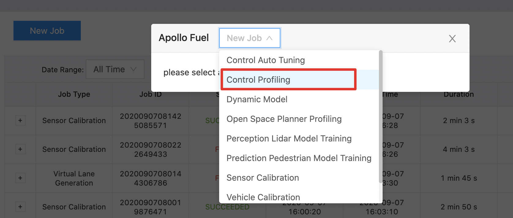
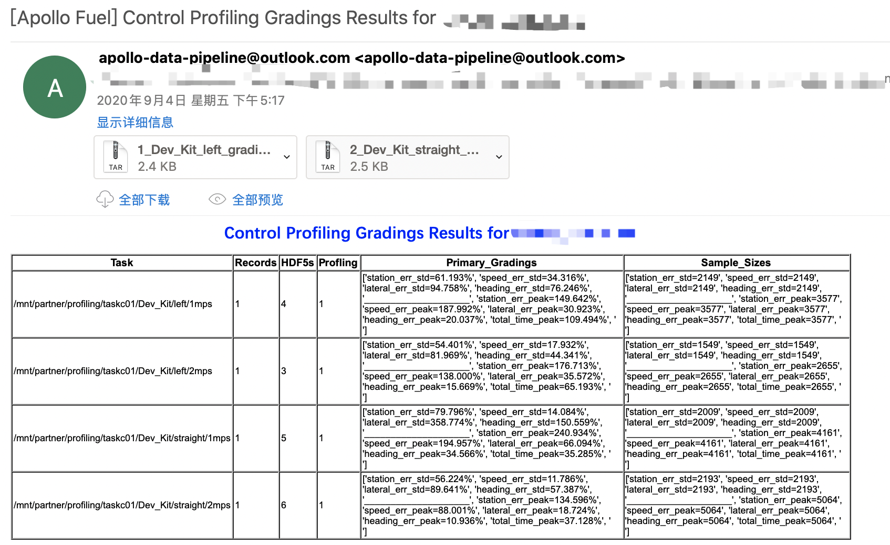

# 控制评测分析服务

## 概述

控制评测分析服务是一项基于云的服务，用于评估来自道路测试或模拟记录的控制和规划轨迹。


## 前提条件

- [Apollo](https://github.com/ApolloAuto/apollo) 6.0或更高版本。

- 根据[文档](../apply_fuel_account_cn.md)注册的百度云BOS服务。

- 在[Apollo Dreamland](http://bce.apollo.auto/user-manual/fuel-service)上的Fuel服务账户。

## 主要步骤

- 数据收集

- 任务提交

- 结果分析


## 数据收集

### 数据记录

完成一个自主驾驶场景的闭环测试，如RTK或闭环。

### 数据真实性检查

- **在提交给云服务之前，确保记录中包括以下通道**：

| 模块 | channel | items |
|---|---|---|
| Canbus | `/apollo/canbus/chassis` | 退出时没有错误信息 |
| Control | `/apollo/control` | 退出时没有错误信息 |
| Planning | `/apollo/planning` | - |
| Localization | `/apollo/localization/pose` | - |
| GPS | `apollo/sensor/gnss/best_pose` | `sol_type` 是 `NARROW_INT` |

- 你可以用`cyber_recorder`检查：

```
    cyber_recorder info xxxxxx.record.xxxxx
```


## 任务提交

### 上传数据到BOS

以下是任务提交的文件夹结构要求：
1. 一个cyber record文件，包含开放空间的规划场景的执行。

1. 一个配置文件`vehicle_param.pb.txt`；在`apollo/modules/common/data/vehicle_param.pb.txt`下有一个样本文件。

### 在Dreamland中提交任务

进入[Apollo Dreamland](http://bce.apollo.auto/)，用百度账号登录，选择`Apollo Fuel --> Jobs`，`New Job`，`Control Profiling`，并在[Upload data to BOS](###上传数据到BOS)部分输入正确的BOS路径：




## 结果分析

- 任务完成后，预期每项任务会有一封邮件，包括 "评分结果 "和 "可视化结果"。




