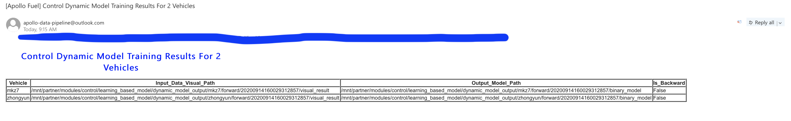

# 车辆动态建模

车辆动态建模服务采用有监督的机器学习算法，生成基于学习的车辆动态模型，该模型可作为Apollo仿真平台的定制动态模型，用于control-in-the-loop仿真。动态模型的使用要求有三个主要步骤：(1)通过前端数据采集过程监控系统采集基于学习的建模的训练/测试数据；(2)通过本地建立标准的BOS链接文件夹将采集的数据上传到云端；(3)通过在线服务网页提交服务指令，并在邮件通知中等待建模结果。

<!-- # Table of Contents 1\. [Frontend](#frontend) 2\. [Data](#data) - [Upload Tool](#upload) - [Download Tool](#download) 3\. [Visulization](#visulization) -->

## 前端

在DreamView中，呈现了一个数据采集显示器，用于监控数据采集过程。当用户在 "setup_mode"菜单中选择 "Vehicle Calibration"选项后，数据采集过程在数据采集监视器中被可视化。驾驶数据被归类为不同的驾驶条件，如下图所示。采集的数据量（以帧为单位）以进度条形式表示。

### 设置

在车载DreamView环境下，

1. 在 "setup mode"中选择 "vehicle calibration"，
2. 在 "Others"面板上选择 "Data Collection Monitor"，


数据收集显示器在DreamView中显示。

### 数据采集

驾驶时，通过识别底盘Chassis Channel中的驾驶状态，自动处理数据帧。当单个数据帧满足速度标准（速度等于或大于0.2 mps）时，单个数据帧会根据其转向、速度和油门/刹车信息进行分类。数据收集过程在数据收集监视器的进度条中显示。

在数据收集监视器中总共有21个进度条。最上面的进度条显示了整个过程。其余20个进度条表示20种驾驶条件，包括

- 在不同速度水平上的六种制动条件

  - 低速（<10 mps）制动脉冲
  - 中速（10 mps ~ 20 mps）制动脉冲
  - 高速（>=20 mps）制动脉冲
  - 低速（<10 mps）制动脉动
  - 中速（10 mps ~ 20 mps）制动脉动
  - 高速(>=20 mps)制动脉动

- 不同速度水平的六种油门状态

  - 低速（<10 mps）下油门
  - 中速(10 mps ~ 20 mps)油门下
  - 高速(>=20 mps)油门下
  - 低速（<10 mps）苛刻的油门
  - 中速(10 mps ~ 20 mps) 苛刻的油门
  - 高速(>=20 mps) 苛刻的油门

- 八个转向角条件

  - 左0% ~ 20%
  - 左20% ~ 40%
  - 左40% ~ 60%
  - 左60% ~ 100%
  - 右0% ~ 20%
  - 右20% ~ 40%
  - 右40% ~ 60%
  - 右60% ~ 100%

对于每个条形图，有一个蓝色的带子，表示收集的数据帧。当蓝带填满整个条形图时，收集的帧数就达到了目标数。在每个条形图的右端也有一个数字表示完成的百分比。对于动态建模数据收集，当所有进度条达到100%时，数据收集过程被认为是 "完成"。

所有数据都保存在`nvme drive`或`data/record/`中。

### 车辆配置

不同车型的刹车和油门规格是不同的。因此，刹车脉动/踏步和大/小油门的标准取决于车型。默认设置是基于林肯MKZ车型。对于不同的车型，这些参数可以在以下位置配置：

```
/apollo/modules/dreamview/conf/mkz7_data_collection_table.pb.txt
```

(描述)


## 文件夹结构要求

在上传你的数据之前，注意一下：

1. 需要维护的文件夹结构是：
   

1. 如上所示，需要维护的文件结构是
   
   ```
   初始文件夹 -> 任务文件夹 -> 车辆文件夹 -> 记录文件夹 + 配置文件
   ```
   
1. 需要为你的动态建模任务创建一个**task**文件夹，如task001, task002...

1. 需要为你的车辆创建一个车辆文件夹。该文件夹的名称应与Dreamview中看到的相同。

1. 在你的文件夹内，创建一个**Records**文件夹来存放数据。

1. 将所有的**配置文件**和Records文件夹一起存放在**车辆文件夹**中。

1. 车辆配置文件（vehicle_param.pb.txt）从Apollo 5.0及以后版本开始更新，你应该检查它。

1. 一个任务文件夹可以包含一个以上的车辆文件夹，换句话说，你可以在一个训练任务中为多个车辆训练模型。

### 上传数据

使用[bosfs](https://cloud.baidu.com/doc/BOS/BOSCLI/8.5CBOS.20FS.html)将你的数据bucket挂载到本地，例如：

```
BUCKET=<bucket>
AK=<access key>
SK=<secret key>
MOUNT=/mnt/bos
# 这需要提供正确的BOS区域。请阅读文件
# https://cloud.baidu.com/doc/BOS/S3.html#.E6.9C.8D.E5.8A.A1.E5.9F.9F.E5.90.8D
REGION=bj

mkdir -p "${MOUNT}"
bosfs "${BUCKET}" "${MOUNT}" -o allow_other,logfile=/tmp/bos-${BUCKET}.log,endpoint=${REGION}.bcebos.com,ak=${AK},sk=${SK}
```

然后你可以把准备好的数据文件夹复制到/mnt/bos下的某个地方。

## 通过在线服务网站提交任务

登录[Apollo网页](http://bce.apollo.auto/)，在功能菜单中选择**Apollo Fuel->New Job**。在**New Job**菜单中选择**Dynamic Model**选项，然后在**Input Data Path**中填写从您的BOS文件夹下的根目录开始的数据存储路径，并选择是否点击**is backward**单选按钮（只有当您打算在**倒车**模式下训练动态模型时才点击它；否则，留空）。最后，通过点击**Submit Job**按钮提交你的任务。


## 接收模型训练结果

在动态建模任务成功启动，且您上传的数据通过合理性检查后，用户将收到**第一封通知邮件**到您的注册邮箱。

然后，在动态建模任务完全结束后，用户将收到**第二封通知邮件**，其中将提供生成的模型存储路径和你自己的BOS文件夹下的过滤数据可视化路径。 



为了使用在仿真平台或[Control_Auto_Tuning](../../Apollo_Fuel/Control_Auto_Tuning/README. md)服务中生成的动态模型，用户需要对收到的动态模型进行重命名，并放到相应的github repo路径中，具体如下：在github **apollo/modules/control/conf/dynamic_model_forward.bin**提供前向驱动模型；在github **apollo/modules/control/conf/dynamic_model_backward.bin**提供后向驱动模型。

