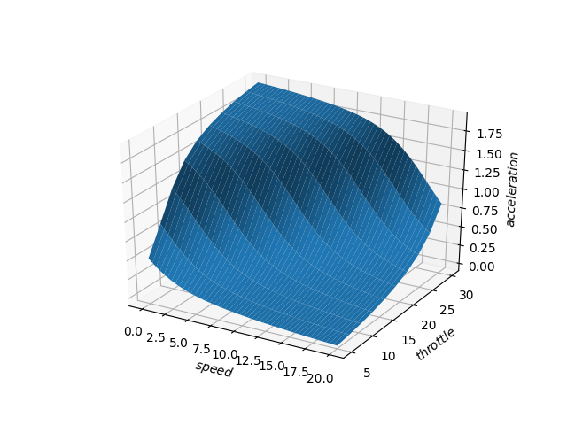

# 车辆在线标定服务

### 注意

1. 在使用本服务前，请参考[Apply_BOS_Account](././Apollo_Fuel/apply_bos_account_cn.md)进行账户设置。

2. 新的服务入口点在[Apollo Dreamland](http://bce.apollo.auto)。

3. D-kit的中文版在[Vehicle_Calibration_Online_cn.md](././D-kit/Waypoint_Following/vehicle_calibration_online_cn.md)。

车辆标定系统为不同的车辆模型自动生成标定表。它包括三个部分：前端数据采集监控系统，用于上传采集数据和下载生成的标定表的数据上传/下载工具，以及用于性能评估的可视化工具。

<! -- #Table of Contents 1\. [Frontend](#frontend) 2\. [Data](#data) - [Upload Tool](#upload) - [Download Tool](#download) 3\. [Visulization](#visulization) -->

 ## 前端

在DreamView中，呈现了一个数据收集显示器，用于监测数据标定过程。在车辆标定模式下，收集的数据帧在数据标定显示器中被可视化。根据底盘信息，数据帧被归类为不同的驾驶模式。收集的数据帧的数量以进度条的形式显示。

### 设置

在车载DreamView环境下。

1. 在 "setup mode"中选择 "vehicle calibration"，
2. 在 "Others"面板上选择 "Data Collection Monitor"，


数据收集显示器在DreamView中显示。

### 数据收集

当驾驶时，数据帧通过读取其底盘信息被自动处理。当一个数据帧满足速度标准（速度等于或大于0.2 mps）时，该数据帧按照其转向、速度和油门/刹车信息被分类。数据收集过程在数据收集监视器中以进度条显示。

在数据收集监视器中总共有21个条形图。整体过程由最上面的条形图表示。其余20条表示20种驾驶条件，包括

- 在不同速度水平上的六种制动条件

  - 低速（<10 mps）缓刹车
  - 中速（10 mps ~ 20 mps）缓刹车
  - 高速（>=20 mps）缓刹车
  - 低速（<10 mps）急刹车
  - 中速（10 mps ~ 20 mps）急刹车
  - 高速(>=20 mps)急刹车

- 不同速度水平的六种油门状态

  - 低速（<10 mps）小油门
  - 中速(10 mps ~ 20 mps)小油门
  - 高速(>=20 mps)小油门
  - 低速（<10 mps）大油门
  - 中速(10 mps ~ 20 mps)大油门
  - 高速(>=20 mps) 大油门

- 八个转向角条件

  - 左0% ~ 20%
  - 左20% ~ 40%
  - 左40% ~ 60%
  - 左60% ~ 100%
  - 右0% ~ 20%
  - 右20% ~ 40%
  - 右40% ~ 60%
  - 右60% ~ 100%

对于每个条形图，有一个蓝色的带子，表示收集的数据帧。当蓝带填满整个条形图时，收集的帧数就达到了目标数。在每个条形图的右端也有一个数字表示完成的百分比。

对于标定表的数据收集，当前13条（总进度条和12条刹车/油门状况条）达到100%时，数据收集过程被认为是完成的。对于动态模型数据采集，当所有条形图达到100%时，数据采集过程就完成了。

所有数据都保存在`nvme drive`或`data/record/`中。

### 车辆配置

不同车型之间的刹车和油门规格是不同的。因此，刹车脉动/踏步和大/小油门的标准取决于车型。默认设置是基于林肯MKZ车型。对于不同的车型，这些参数可以通过以下方式配置：

```
/apollo/modules/dreamview/conf/mkz7_data_collection_table.pb.txt
```

(描述)


## 文件夹结构要求

在上传你的数据之前，注意：

1. 需要维护的文件夹结构是：
   

1. 如上所示，需要维护的文件结构是：

   ```
   初始文件夹 -> 任务文件夹 -> 车辆文件夹 -> records + 配置文件
   ```

2. 需要为你的标定任务创建一个**task**文件夹，如task001, task002...

3. 需要为你的车辆创建一个车辆文件夹。该文件夹的名称应与Dreamview中的名称相同。

4. 在你的文件夹内，创建一个**Records**的文件夹来存放数据。

5. 将所有的**配置文件**和Records文件夹一起存放在**车辆**文件夹中。

6. 车辆配置文件（vehicle_param.pb.txt）从Apollo 5.0及以后版本开始更新，你应该确认。

7. 一个任务文件夹可以包含一个以上的车辆文件夹，你可以在一个训练任务中训练更多的车辆。

### 上传

使用[bosfs](https://cloud.baidu.com/doc/BOS/BOSCLI/8.5CBOS.20FS.html)将你的bucket挂载到本地，例如：

```
BUCKET=<bucket>
AK=<access key>
SK=<secret key>
MOUNT=/mnt/bos
# 这需要提供正确的BOS区域。请阅读文件
# https://cloud.baidu.com/doc/BOS/S3.html#.E6.9C.8D.E5.8A.A1.E5.9F.9F.E5.90.8D
REGION=bj

mkdir -p "${MOUNT}"
bosfs "${BUCKET}" "${MOUNT}" -o allow_other,logfile=/tmp/bos-${BUCKET}.log,endpoint=http://${REGION}.bcebos.com,ak=${AK},sk=${SK}
```

然后你可以把准备好的数据文件夹复制到/mnt/bos下的某个地方。

### 下载

不需要下载，结果将被发送到与你的BOS bucket相关的邮箱。


## 结果可视化

docker环境不支持Matplotlib。因此，结果是在docker环境之外可视化的。下面两张图显示了PC训练结果的可视化结果。




