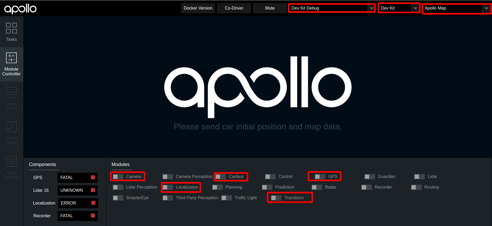

# 基于摄像头的封闭园区自动驾驶搭建--感知适配

- [基于摄像头的封闭园区自动驾驶搭建--感知适配](#基于摄像头的封闭园区自动驾驶搭建--感知适配)
  - [概览](#概览)
  - [前提条件](#前提条件)
  - [配置文件的修改](#配置文件的修改)
  - [启动Camera感知](#启动camera感知)
      - [1. 启动can卡](#1-启动can卡)
      - [2. 编译项目，启动Dreamview](#2-编译项目启动dreamview)
      - [3. 启动所需模块](#3-启动所需模块)
      - [4. 检查各模块channel是否正确](#4-检查各模块channel是否正确)
      - [5. 启动Camera感知](#5-启动camera感知)
      - [6. 验证Camera感知效果](#6-验证camera感知效果)
  - [NEXT](#next)
  - [常见问题](#常见问题)
      - [1. 感知的输出帧率达不到10帧](#1-感知的输出帧率达不到10帧)
      - [2. 感知的障碍物位置与实际障碍物误差较大](#2-感知的障碍物位置与实际障碍物误差较大)

## 概览
该用户手册旨在帮助用户完成摄像头感知适配，实现Camera感知

## 前提条件

 1. 正确完成了[循迹搭建--车辆循迹演示](../Waypoint_Following/start_waypoint_following_cn.md)。

 2. 正确完成了[基于摄像头的封闭园区自动驾驶搭建--感知设备集成](sensor_integration_cn.md)。
 
 3. 正确完成了[基于摄像头的封闭园区自动驾驶搭建--感知设备标定](sensor_calibration_cn.md)。

## 配置文件的修改

|序号 | 待修改文件 | 修改内容 | 
|---|---|---|
|  1 | `modules/common/data/global_flagfile.txt` |  添加`--half_vehicle_width=0.43` |

## 启动Camera感知

把车辆开到户外，手动控制车辆，看感知是否有数据。

#### 1. 启动can卡

进入can卡目录启动can卡，用以下命令启动

    cd ~/SocketCan/
    bash start.sh

#### 2. 编译项目，启动Dreamview
进入docker环境，用gpu编译项目，启动Dreamview 

    cd apollo
    bash docker/scripts/dev_start.sh
    bash docker/scripts/dev_into.sh
    bash apollo.sh build_opt_gpu
    bash scripts/bootstrap.sh

#### 3. 启动所需模块
在浏览器中打开`(http://localhost:8888)`,选择模式为`Dev Kit Debug`， 选择车型为`dev_kit`并选择相应高精地图，在Module Controller标签页启动Canbus、Camera、GPS、Localization、Transform模块。

#### 4. 检查各模块channel是否正确

在docker中输入`cyber_monitor`命令并检查以下channel（使用`上下方向键`选择channel，使用`右方向键`查看channel详细信息。关于cyber_monitor更详细使用，请参考[CyberRT_Developer_Tools](../../cyber/CyberRT_Developer_Tools.md)）：
	
| channel_name | 检查项目 | 
|---|---|
|`/apollo/localization/pose`| 确保能正常输出数据 | 
|`/apollo/sensor/gnss/best_pose` | 确保能正常输出数据、`sol_type:` 选项显示为`NARROW_INT` |
|`/apollo/sensor/camera/front_6mm/image` | 确保能正常输出数据，帧率稳定在15HZ左右 |
|`/apollo/sensor/camera/front_12mm/image` | 确保能正常输出数据，帧率稳定在15HZ左右 |
|`/tf`| 确保能正常输出数据 |
|`/tf_static` | 确保能正常输出数据 |
|`/apollo/canbus/chassis`|确保能正常输出数据|
|`/apollo/canbus/chassis_detail`|确保能正常输出数据|

#### 5. 启动Camera感知
在dreamview中启动`Camera Perception`模块，使用`cyber_monitor`查看`/apollo/perception/obstacles`是否正常输出，并在dreamview上查看障碍物信息：

#### 6. 验证Camera感知效果
查看车前方运动的人或者自行车（自行车上要有人），在DreamView上查看障碍物颜色以及位置速度信息（自行车青蓝色，行人黄色，车辆绿色），如下图所示：

`/apollo/perception/obstacles`的数据如下图所示：

如果在dreamview上能看到障碍物并且`/apollo/perception/obstacles`有障碍物信息，则开环测试通过。

## NEXT
现在，您已经完成摄像头感知适配，接下来可以开始[封闭园区自动驾驶搭建--规划适配](../Lidar_Based_Auto_Driving/planning_configuration_cn.md)

## 常见问题

#### 1. 感知的输出帧率达不到10帧
建议使用 `bash apollo.sh build_opt_gpu` 编译Apollo工程

#### 2. 感知的障碍物位置与实际障碍物误差较大
* 确认localization信号状态，保证`/apollo/sensor/gnss/best_pose`中`sol_type` 选项显示为`NARROW_INT`
* 保证各个传感器外参文件准确

