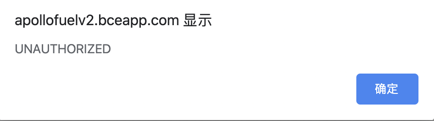

# 基于摄像头的封闭园区自动驾驶搭建--感知设备标定

- [基于摄像头的封闭园区自动驾驶搭建--感知设备标定](#基于摄像头的封闭园区自动驾驶搭建--感知设备标定)
  - [概览](#概览)
  - [前提条件](#前提条件)
  - [修改配置文件](#修改配置文件)
  - [Camera-Lidar标定初始外参测量和内参标定](#camera-lidar标定初始外参测量和内参标定)
    - [各传感器坐标系的定义及初始化外参文件的配置](#各传感器坐标系的定义及初始化外参文件的配置)
      - [1. Lidar、Camera的坐标系定义](#1-lidarcamera的坐标系定义)
      - [2. Camera坐标系原点在传感器的位置](#2-camera坐标系原点在传感器的位置)
      - [3. Lidar坐标系原点在传感器的位置](#3-lidar坐标系原点在传感器的位置)
      - [4. 手动测量Camera-Lidar的初始化外参文件](#4-手动测量camera-lidar的初始化外参文件)
    - [传感器内参标定](#传感器内参标定)
  - [Camera-Lidar标定数据包录制](#camera-lidar标定数据包录制)
      - [1. 准备所需channel](#1-准备所需channel)
      - [2. 使用Apollo录制数据包的方法](#2-使用apollo录制数据包的方法)
      - [3. 开始录制数据包](#3-开始录制数据包)
  - [Camera-Lidar标定数据预处理](#camera-lidar标定数据预处理)
      - [1. 按照目录结构放置好Camera-Lidar标定数据包](#1-按照目录结构放置好camera-lidar标定数据包)
      - [2. 修改抽取工具配置文件 camera_to_lidar.config](#2-修改抽取工具配置文件-camera_to_lidarconfig)
      - [3. 运行数据抽取工具](#3-运行数据抽取工具)
      - [4. 修改配置文件 sample_config.yaml](#4-修改配置文件-sample_configyaml)
      - [5. 修改初始外参文件extrinsics.yaml](#5-修改初始外参文件extrinsicsyaml)
      - [6. 修改初始化内参文件intrinsics.yaml](#6-修改初始化内参文件intrinsicsyaml)
  - [使用标定云服务生成外参文件](#使用标定云服务生成外参文件)
      - [1. 上传预处理后的数据至BOS](#1-上传预处理后的数据至bos)
      - [2. 提交云标定任务](#2-提交云标定任务)
      - [3. 获取标定结果验证及标定外参文件](#3-获取标定结果验证及标定外参文件)
  - [NEXT](#next)
  - [常见问题](#常见问题)
      - [1. 提交后，显示`UNAUTHORIZED`](#1-提交后显示unauthorized)
      - [2. 进行`Sensor Calibration`任务后，邮件显示任务失败](#2-进行sensor-calibration任务后邮件显示任务失败)
      - [3. 标定结果误差较大](#3-标定结果误差较大)


## 概览
该用户手册旨在帮助用户完成摄像头的标定(Camera-Lidar)


## 前提条件
 
 - 完成了[循迹搭建--车辆循迹演示](../Waypoint_Following/start_waypoint_following_cn.md)
 
 - 完成了[基于摄像头的封闭园区自动驾驶搭建--感知设备集成](sensor_integration_cn.md)
 
 - 完成了[开通云服务账号向导](../../Apollo_Fuel/apply_fuel_account_cn.md)
  
## 百度云对象存储BOS注册
注册方法参考[百度云对象存储BOS注册与基本使用向导](../../Apollo_Fuel/apply_bos_account_cn.md) 
## 开通云服务账号
请与商务部门联系开通云服务账号，需要提供上一步骤中注册的`Bucket名称`、`所属地域`和用户邮箱信息
## 修改配置文件
|修改文件名称 | 修改内容 | 
|---|---|
| `modules/localization/conf/localization.conf`|`enable_lidar_localization`为`false`| 
 


**注意**：所有传感器标定完成后，如果用户要使用msf定位，则需要再改为`true`。

## Camera-Lidar标定初始外参测量和内参标定

### 各传感器坐标系的定义及初始化外参文件的配置

#### 1. Lidar、Camera的坐标系定义

 
 
#### 2. Camera坐标系原点在传感器的位置

Camera坐标系原点在下图所示平面的中心点：


#### 3. Lidar坐标系原点在传感器的位置

见[基于激光雷达的封闭园区自动驾驶搭建--感知设备标定](../Lidar_Based_Auto_Driving/sensor_calibration_cn.md)文档

#### 4. 手动测量Camera-Lidar的初始化外参文件

这里默认用户按照感知设备集成文档的要求正确安装了传感器，即传感器坐标系的定义与上文中的定义相同，且安装误差满足文档中的要求。

 - rotation:在传感器的安装满足感知设备集成文档要求的情况下，用户无需测量该值，可直接使用如下的默认值即可

	```
	  rotation:
	    w: 0.5
	    x: -0.5
	    y: 0.5
	    z: -0.5
	```
 - translation:用户需要手动测量以Velodyne16坐标系为基坐标系，以Camera坐标系为目标坐标系的位移变换，一个Velodyne16-Camera的位移变换的示例如下所示：

	```
	  translation:
	    x: 0.67
	    y: -0.1
	    z: -0.64
	```

### 传感器内参标定

内参包含相机的焦距、主点和畸变系数等信息，可以通过一些成熟的相机标定工具来获得，例如 [ROS Camera Calibration Tools](http://wiki.ros.org/camera_calibration/Tutorials/MonocularCalibration) 和 [Camera Calibration Toolbox for Matlab](http://www.vision.caltech.edu/bouguetj/calib_doc/)。

## Camera-Lidar标定数据包录制

开发套件的摄像头有6mm和12mm两种规格，以下步骤以6mm标定为例说明。

#### 1. 准备所需channel
进行Camera-Lidar的标定，需要录制包含传感器信息的数据包作为数据输入，所需的`channel`及`channel频率`如下表所示：

| 模块       | Topic名称                                 |Topic发送频率（Hz）|
| ------------ | ----------------------------------------- | ----------------- |
| 6mm camera | /apollo/sensor/camera/front_6mm/image | 15                 |
| VLP-16    |  /apollo/sensor/lidar16/PointCloud2   | 10            |
| Localization       | /apollo/localization/pose             | 100           |

为获取上述`channel`，需要正确启动Apollo环境及dreamview，在dreamview中选择模式为`Dev Kit Debug`， 选择车型为`Dev Kit`，并在dreamview中启动启动`GPS`、`Localization`、`Camera`三个模块，详细操作方式分别参考[循迹搭建--定位模块配置](../Waypoint_Following/localization_configuration_cn.md)、[基于摄像头的封闭园区自动驾驶搭建--感知设备集成](../Camera_Based_Auto_Driving/sensor_integration_cn.md)。在正式开始录制前，务必确保以上channel能正常输出数据。

#### 2. 使用Apollo录制数据包的方法

- 在dreamview中，启动`recorder`模块即开始录制数据包，关闭`recorder`模块即停止录制数据包

    

- 如果工控机没有插入移动硬盘，则数据包会存储到工控机的`apollo/data/bag/`路径下(注意，apollo为代码目录);如果工控机插入了移动硬盘，则系统会将数据包存储到可用容量较大的硬盘中，如果移动硬盘可用容量较大，则存储路径为移动硬盘的`data/bag/`目录。


#### 3. 开始录制数据包

待channel数据正常输出后，可以开始录制数据包。在录制数据的时候，遥控车辆直线慢速行驶行驶，行驶10秒再停止5秒，如此反复5次。

**注意**：需要光照条件好时进行标定，场地需要是直线道路，路侧两边需要有静态参照物，如建筑物、车辆，避免过多动态障碍物，避免大逆光。

## Camera-Lidar标定数据预处理

该步骤将通过提取工具将record数据包中的点云、定位数据和相机数据进行预处理，以方便通过云服务进行在线标定。开发套件的摄像头有6mm和12mm两种规格，以下步骤以6mm标定为例说明。

#### 1. 按照目录结构放置好Camera-Lidar标定数据包
复制[sensor_calibration目录](../../Apollo_Fuel/examples/)(路径为 docs/specs/Apollo_Fuel/examples/sensor_calibration/)并放置于apollo根目录下，其目录结构如下：

```
.
└── sensor_calibration
	├── camera_12mm_to_lidar
	│   ├── camera_12mm_to_lidar.config
	│   ├── extracted_data
	│   └── records
	├── camera_6mm_to_lidar
	│   ├── camera_6mm_to_lidar.config
	│   ├── extracted_data
	│   └── records
	└── lidar_to_gnss
	    ├── extracted_data
	    ├── lidar_to_gnss.config
	    └── records
```
 
本小节重点关注camera_6mm_to_lidar目录，把前面录制的Camera-Lidar标定数据包放置于`sensor_calibration/camera_6mm_to_lidar/records`目录中。

#### 2. 修改抽取工具配置文件 camera_to_lidar.config

根据实际情况，修改配置文件`camera_to_lidar.config`中预处理数据产出目录（output_path）和待处理数据包目录（record_path）。参考下图：


**注意**：以上目录需要指定绝对路径。

#### 3. 运行数据抽取工具

**进入docker环境**，执行如下命令：

```
budaoshi@in_dev_docker:/apollo$ cd /apollo/modules/tools/sensor_calibration
budaoshi@in_dev_docker:/apollo/modules/tools/sensor_calibration$ python extract_data.py --config /apollo/sensor_calibration/camera_6mm_to_lidar/camera_6mm_to_lidar.config
```

**注意**：--config参数指定了配置文件路径，必须为绝对路径，用户实际根据情况自行修改。

 等待终端中显示`Data extraction is completed successfully!`的提示代表数据提取成功，提取出的数据被存储到配置文件中指定的`output_path`路径下。运行数据抽取工具后的目录如下图红框所示：
 

 
#### 4. 修改配置文件 sample_config.yaml

修改数据抽取工具生成的sample_config.yaml文件。把`beams`字段取值修改为`16`。

#### 5. 修改初始外参文件extrinsics.yaml

修改数据抽取工具生成的init_params/extrinsics.yaml文件。把前面步骤手动测量的Camera-Lidar标定初始外参信息填入，仅需要填写`translation`字段。

#### 6. 修改初始化内参文件intrinsics.yaml

修改数据抽取工具生成的init_params/intrinsics.yaml文件。把内参标定的Camera内参信息填入，仅需要填写`R`、`K`、`D`字段。

修改完之后把`camera_front_6mm_to_lidar16_calibration`目录准备后续待用。

## 使用标定云服务生成外参文件

#### 1. 上传预处理后的数据至BOS

**注意：** 必须使用开通过权限的 bucket，确认`Bucket名称`、`所属地域`和提交商务注册时的Bucket名称和所属区域保持一致。

在BOS bucket中新建目录sensor_calibration，作为后续云标定服务读取数据的`Input Data Path`，把前面预处理生成的数据拷贝至该目录。目录结构如下：


#### 2. 提交云标定任务

打开Apollo云服务页面，如下图：


点击`新建任务`，在下拉框中选择`感知标定`选项，根据实际情况填写输入数据路径(Input Data Path)、输出数据路径(Output Data Path),最后点击`提交任务`(Submit Job)按钮提交。

#### 3. 获取标定结果验证及标定外参文件

云标定任务完成后，将在注册的邮箱中收到一封标定结果邮件。如果标定任务成功，将包含标定外参文件。

 **Camera-Lidar标定结果验证**：
 BOS中用户指定的Output Data Path路径下包含了标定结果验证图片。在产生的点云投影图像内，可寻找其中具有明显边缘的物体和标志物，查看其边缘轮廓对齐情况。如果50米以内的目标，点云边缘和图像边缘能够重合，则可以证明标定结果的精度很高。反之，若出现错位现象，则说明标定结果存在误差。当误差大于一定范围时（范围依据实际使用情况而定），该外参不可用。如下图所示，图1为准确外参的点云投影效果，图2为有偏差外参的点云投影效果。
 
 


 **Camera-Lidar标定外参文件**：

确认邮件得到的外参文件合理后，进行如下操作： 

 -  将邮件得到的内参文件重命名为`front_6mm_intrinsics.yaml`，并替换`modules/calibration/data/dev_kit/camera_para/`目录下的文件，将邮件发送的外参文件的`rotation`、`translation`的值替换掉`modules/calibration/data/dev_kit/camera_params/front_6mm_extrinsics.yaml`中对应的`rotation`、`translation`值。注意不要修改`frame_id`。

 - 如标定12mm摄像头，则需要修改`modules/calibration/data/dev_kit/camera_para`目录下`front_12mm_intrinsics.yaml`、`front_12mm_extrinsics.yaml`两个文件。
 
 - 默认使用1个6mm、1个12mm摄像头，用户如需要使用第二个6mm摄像头时，需要自行指定文件名，并进行相应修改。
## NEXT
现在，您已经完成摄像头感知设备标定， 接下来可以开始[封闭园区自动驾驶搭建--虚拟车道线制作](../Lidar_Based_Auto_Driving/virtual_lane_generation_cn.md)(如果在适配基于激光雷达的自动驾驶过程中已经制作了虚拟车道线文件，则可以跳过此步骤，进行[基于摄像头的封闭园区自动驾驶搭建--感知适配](perception_configuration_cn.md))
## 常见问题
#### 1. 提交后，显示`UNAUTHORIZED`

出现该问题，一般是`Partner ID`输入有误 
#### 2. 进行`Sensor Calibration`任务后，邮件显示任务失败
建议检查一下输入路径是否正确

#### 3. 标定结果误差较大
- 标定时，确保GNSS信号状态良好，周围有轮廓清晰的静态障碍物
- 保证传感器的安装精度，安装误差超过要求精度时，标定结果不容易收敛
