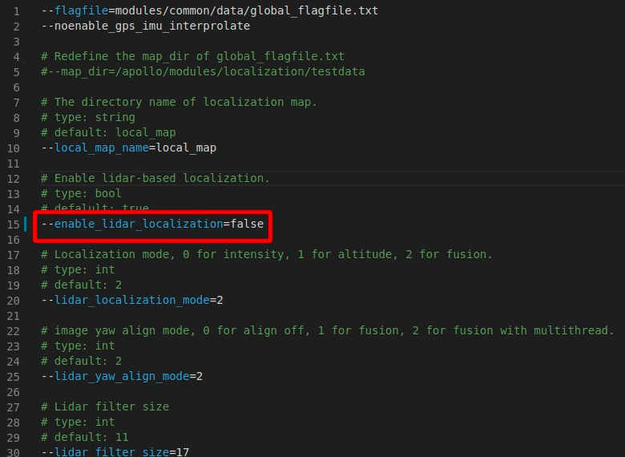
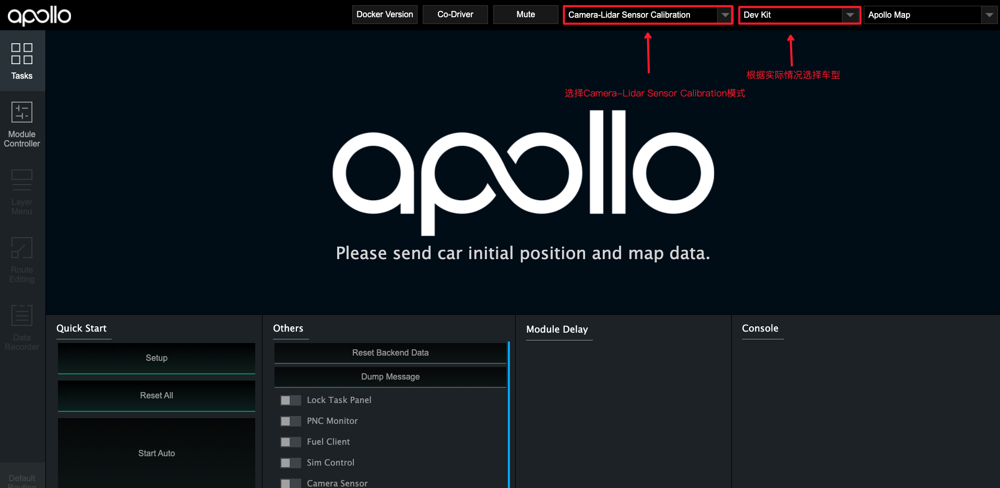
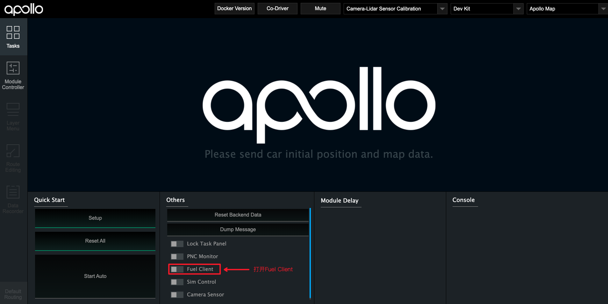
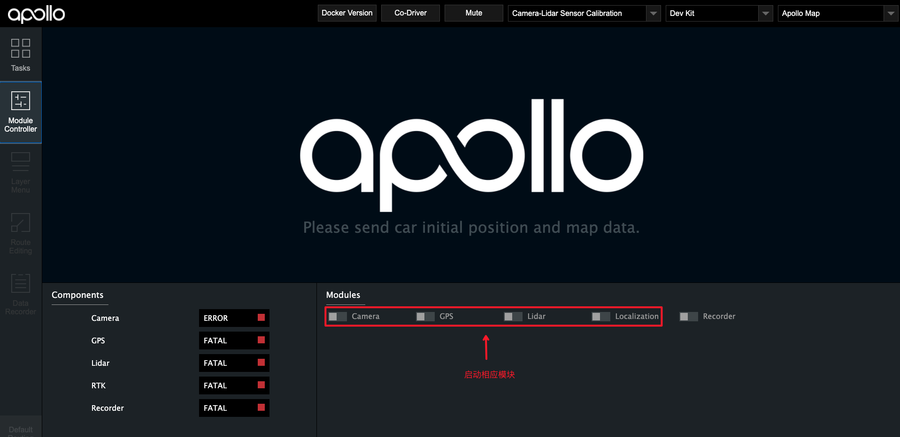
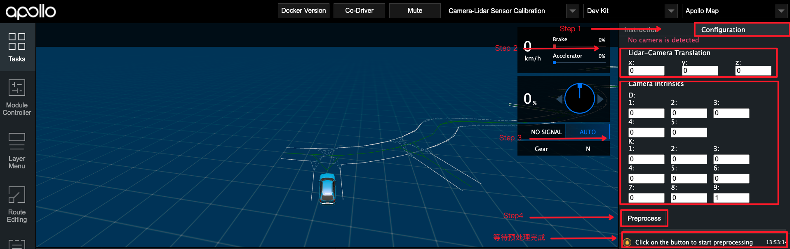

# 基于摄像头的封闭园区自动驾驶搭建--感知设备标定

- [基于摄像头的封闭园区自动驾驶搭建--感知设备标定](#基于摄像头的封闭园区自动驾驶搭建--感知设备标定)
  - [概览](#概览)
  - [前提条件](#前提条件)
  - [百度云对象存储BOS注册](#百度云对象存储bos注册)
  - [开通云服务账号](#开通云服务账号)
  - [修改配置文件](#修改配置文件)
  - [Camera-Lidar标定初始外参测量和内参标定](#camera-lidar标定初始外参测量和内参标定)
    - [各传感器坐标系的定义及初始化外参文件的配置](#各传感器坐标系的定义及初始化外参文件的配置)
      - [1. Lidar、Camera的坐标系定义](#1-lidarcamera的坐标系定义)
      - [2. Camera坐标系原点在传感器的位置](#2-camera坐标系原点在传感器的位置)
      - [3. Lidar坐标系原点在传感器的位置](#3-lidar坐标系原点在传感器的位置)
      - [4. 手动测量Camera-Lidar的初始化外参文件](#4-手动测量camera-lidar的初始化外参文件)
    - [传感器内参标定](#传感器内参标定)
  - [使用Fuel-Client采集数据](#使用fuel-client采集数据)
      - [1. 选择正确的模式、车型](#1-选择正确的模式车型)
      - [2. 启动`Fuel Client`，并启动相应模块](#2-启动fuel-client并启动相应模块)
      - [3. 启动`Recorder`模块并开始采集](#3-启动recorder模块并开始采集)
  - [使用`Fuel Client`进行数据预处理](#使用fuel-client进行数据预处理)
  - [使用标定云服务生成外参文件](#使用标定云服务生成外参文件)
      - [1. 上传预处理后的数据至BOS](#1-上传预处理后的数据至bos)
      - [2. 提交云标定任务](#2-提交云标定任务)
      - [3. 获取标定结果验证及标定外参文件](#3-获取标定结果验证及标定外参文件)
  - [NEXT](#next)
  - [常见问题](#常见问题)
      - [1. 进行`Sensor Calibration`任务后，邮件显示任务失败](#1-进行sensor-calibration任务后邮件显示任务失败)
      - [2. 标定结果误差较大](#2-标定结果误差较大)


## 概览
该用户手册旨在帮助用户完成摄像头的标定(Camera-Lidar)


## 前提条件
 
 - 完成了[循迹搭建--车辆循迹演示](../Waypoint_Following/start_waypoint_following_cn.md)
 
 - 完成了[基于摄像头的封闭园区自动驾驶搭建--感知设备集成](sensor_integration_cn.md)
 
 - 完成了[开通云服务账号向导](../../Apollo_Fuel/apply_fuel_account_cn.md)
  
## 百度云对象存储BOS注册
注册方法参考[百度云对象存储BOS注册与基本使用向导](../../Apollo_Fuel/apply_bos_account_cmd) 
## 开通云服务账号
请与商务部门联系开通云服务账号，需要提供上一步骤中注册的`Bucket名称`、`所属地域`和用户邮箱信息

## 修改配置文件

|修改文件名称 | 修改内容 |
|---|---|
| `modules/calibration/data/车型目录/localization_conf/localization.conf`|`enable_lidar_localization`设置为`false`|

**注意：** 上表中`车型目录`需要用户根据自身车型确认。lite用户为`dev_kit`，standard用户为`dev_kit_standard`，单激光雷达的advanced用户为`dev_kit_advanced_ne-s`，3激光雷达的advanced用户为`dev_kit_advanced_sne-r`



**注意**：所有传感器标定完成后，如果用户要使用msf定位，则需要再改为`true`。

## Camera-Lidar标定初始外参测量和内参标定

### 各传感器坐标系的定义及初始化外参文件的配置

#### 1. Lidar、Camera的坐标系定义

 
 
#### 2. Camera坐标系原点在传感器的位置

Camera坐标系原点在下图所示平面的中心点：


#### 3. Lidar坐标系原点在传感器的位置

见[基于激光雷达的封闭园区自动驾驶搭建--感知设备标定](../Lidar_Based_Auto_Driving/sensor_calibration_cn.md)文档

#### 4. 手动测量Camera-Lidar的初始化外参文件

这里默认用户按照感知设备集成文档的要求正确安装了传感器，即传感器坐标系的定义与上文中的定义相同，且安装误差满足文档中的要求。

 - rotation:在传感器的安装满足感知设备集成文档要求的情况下，用户无需测量该值，可直接使用如下的默认值即可

	```
	  rotation:
	    w: 0.5
	    x: -0.5
	    y: 0.5
	    z: -0.5
	```
 - translation:用户需要手动测量以Velodyne16坐标系为基坐标系，以Camera坐标系为目标坐标系的位移变换，一个Velodyne16-Camera的位移变换的示例如下所示：

	```
	  translation:
	    x: 0.67
	    y: -0.1
	    z: -0.64
	```

### 传感器内参标定

内参包含相机的焦距、主点和畸变系数等信息，可以通过一些成熟的相机标定工具来获得，例如 [ROS Camera Calibration Tools](http://wiki.ros.org/camera_calibration/Tutorials/MonocularCalibration) 和 [Camera Calibration Toolbox for Matlab](http://www.vision.caltech.edu/bouguetj/calib_doc/)。

## 使用Fuel-Client采集数据

**注意：Fuel-Client进行Camera-Lidar标定数据采集时，需要保证只有需要采集标定数据的相机工作，建议先拔掉其他相机的USB插头；多个相机标定需要分多次进行数据采集**

#### 1. 选择正确的模式、车型
- 选择`Camera-Lidar Sensor Calibration`模式
- 根据实际情况选择正确的车型(lite用户选择`Dev Kit`车型，standard用户选择`Dev Kit Standard`，单雷达的advanced用户选择`Dev Kit Standard Ne-s`，3雷达的advanced用户选择`Dev Kit Standard Sne-r`)



#### 2. 启动`Fuel Client`，并启动相应模块

- 在dreamview的`Tasks`标签下，首先打开`Sim Control`，然后打开`Fuel Client`，`Fuel Client`打开后务必关闭`Sim Control`

  
- 在dreamview的`Module Controllers`标签下，启动`Camera`、`GPS`、`Lidar`、`Localization`模块，等待左侧状显示模块中的`Camera`、`GPS`、`Lidar`、`RTK`均为绿色时，代表模块启动成功(Localization启动后，需要等待1~2分钟才能正常输出数据)。


#### 3. 启动`Recorder`模块并开始采集

- 当左侧左侧状显示模块中的`Camera`、`GPS`、`Lidar`、`RTK`均为绿色时，打开Recorder模块，并开始采集数据。在录制数据的时候，遥控车辆直线慢速行驶行驶，行驶10秒再停止5秒，如此反复5次。
- 数据采集完成后，关闭`Recorder`模块停止数据录制

**注意**：需要光照条件好时进行标定，场地需要是直线道路，路侧两边需要有静态参照物，如建筑物、车辆，避免过多动态障碍物，避免大逆光。


## 使用`Fuel Client`进行数据预处理


- 点击右上角的`Configuration`进入预处理界面
- 填入测量的初始化外参
- 填入内参的`D`、`K`矩阵参数
- 点击`Preprocess`进行预处理
- 等待预处理完成,提示`Data extraction is completed successfully!`代表预处理完成

- 保存生成的预处理文件。切换到`apollo/output/sensor_calibration/camera_to_lidar/extracted_data/`目录，保存该目录下的`camera_to_lidar-xxx`文件(`xxx`为数据包录制的时间)，这里和下文以`camera_to_lidar-2021-01-12-13-49`为例

## 使用标定云服务生成外参文件

#### 1. 上传预处理后的数据至BOS

**注意：** 必须使用开通过权限的 bucket，确认`Bucket名称`、`所属地域`和提交商务注册时的Bucket名称和所属区域保持一致。

将`camera_to_lidar-2021-01-12-13-49`目录上传到BOS的根目录下，作为后续云标定服务读取数据的`输入数据路径`。

#### 2. 提交云标定任务

打开Apollo云服务页面，新建一个任务，如下图所示：


点击`新建任务`后，在下拉框中选择`感知标定`选项，根据实际情况填写输入`输入数据路径`，这里以`camera_to_lidar-2021-01-12-13-49`为例，指定`输出数据路径`后，点击`提交任务`(Submit Job)按钮提交。


#### 3. 获取标定结果验证及标定外参文件

云标定任务完成后，将在注册的邮箱中收到一封标定结果邮件。如果标定任务成功，将包含标定外参文件。

 **Camera-Lidar标定结果验证**：
 BOS中用户指定的`输出数据路径`下包含了标定结果验证图片。在产生的点云投影图像内，可寻找其中具有明显边缘的物体和标志物，查看其边缘轮廓对齐情况。如果50米以内的目标，点云边缘和图像边缘能够重合，则可以证明标定结果的精度很高。反之，若出现错位现象，则说明标定结果存在误差。当误差大于一定范围时（范围依据实际使用情况而定），该外参不可用。如下图所示，图1为准确外参的点云投影效果，图2为有偏差外参的点云投影效果。
 
 


 **Camera-Lidar标定外参文件**：

确认邮件得到的外参文件合理后，进行如下操作： 

 -  对于6mm相机，将标定得到的内参文件重命名为`front_6mm_intrinsics.yaml`，并替换`modules/calibration/data/车型目录/camera_para/`目录下的文件，将标定得到的外参文件中的`rotation`、`translation`的值替换掉`modules/calibration/data/车型目录/camera_params/front_6mm_extrinsics.yaml`中对应的`rotation`、`translation`值注意不要修改`frame_id`。

 - 如标定12mm摄像头，则需要修改`modules/calibration/data/车型目录/camera_para`目录下`front_12mm_intrinsics.yaml`、`front_12mm_extrinsics.yaml`两个文件。
 
 - 默认使用1个6mm、1个12mm摄像头，用户如需要使用第二个6mm摄像头时，需要自行指定文件名，并进行相应修改。
## NEXT
现在，您已经完成摄像头感知设备标定， 接下来可以开始[封闭园区自动驾驶搭建--虚拟车道线制作](../Lidar_Based_Auto_Driving/virtual_lane_generation_cn.md)(如果在适配基于激光雷达的自动驾驶过程中已经制作了虚拟车道线文件，则可以跳过此步骤，进行[基于摄像头的封闭园区自动驾驶搭建--感知适配](perception_configuration_cn.md))
## 常见问题
#### 1. 进行`Sensor Calibration`任务后，邮件显示任务失败
建议检查一下输入路径是否正确

#### 2. 标定结果误差较大
- 标定时，确保GNSS信号状态良好，周围有轮廓清晰的静态障碍物
- 保证传感器的安装精度，安装误差超过要求精度时，标定结果不容易收敛
