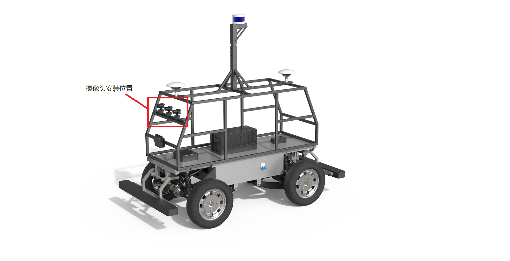
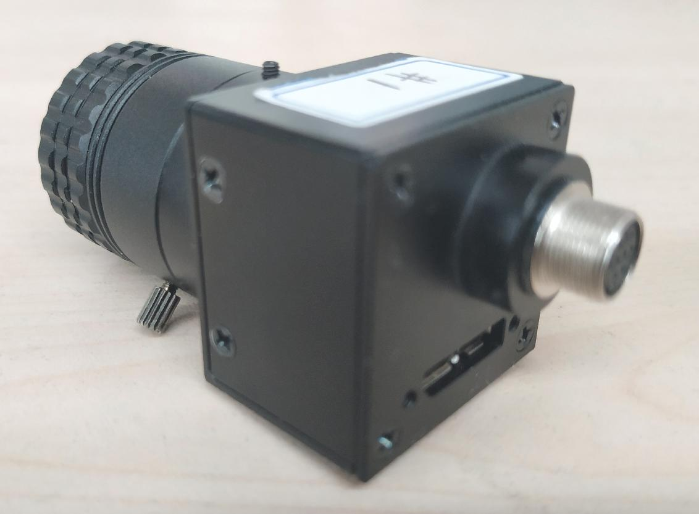
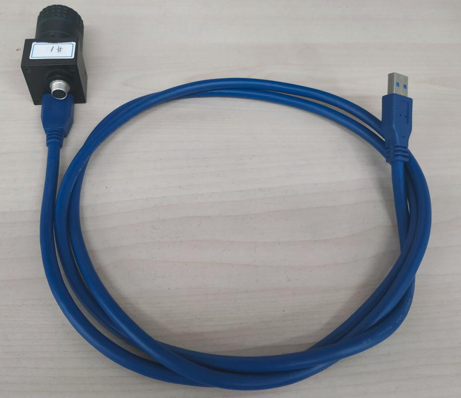
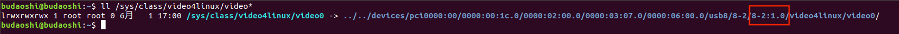
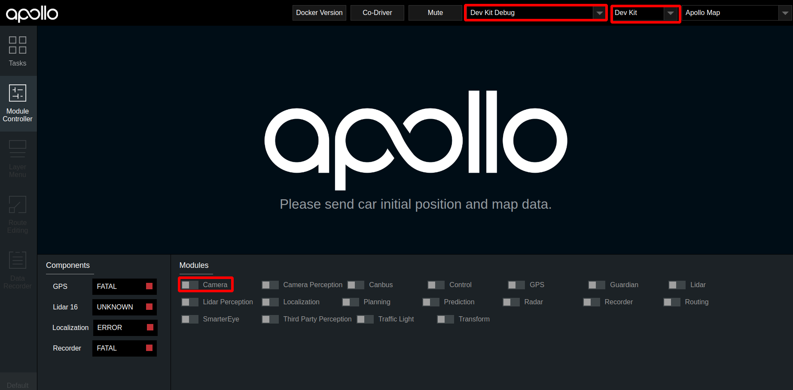
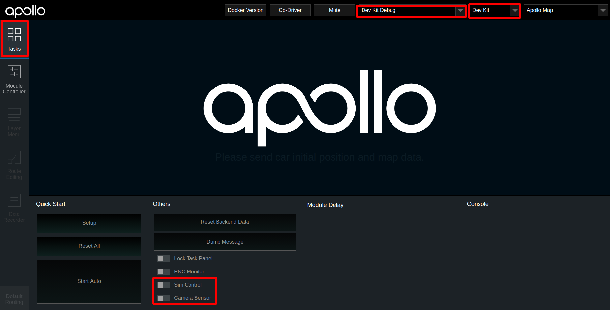

# 基于摄像头的封闭园区自动驾驶搭建--感知设备集成

- [基于摄像头的封闭园区自动驾驶搭建--感知设备集成](#基于摄像头的封闭园区自动驾驶搭建--感知设备集成)
	- [前提条件](#前提条件)
	- [概览](#概览)
	- [摄像头型号说明](#摄像头型号说明)
	- [摄像头安装配置与数据验证](#摄像头安装配置与数据验证)
		- [相机的安装固定](#相机的安装固定)
		- [摄像头与工控机连接](#摄像头与工控机连接)
		- [摄像头规则文件的配置](#摄像头规则文件的配置)
		- [Apollo配置的修改](#apollo配置的修改)
		- [摄像头的启动](#摄像头的启动)
			- [1. 检查摄像头是否被系统识别](#1-检查摄像头是否被系统识别)
			- [2. 检查是否存在摄像头软连接文件](#2-检查是否存在摄像头软连接文件)
			- [3. 编译项目，启动Dreamview](#3-编译项目启动dreamview)
			- [4. 启动camera模块](#4-启动camera模块)
			- [5. 验证camera是否工作正常](#5-验证camera是否工作正常)
	- [NEXT](#next)
	- [常见问题](#常见问题)
		- [1. 规则文件修改后不显示软连接](#1-规则文件修改后不显示软连接)

## 前提条件

 - 完成了[循迹搭建--车辆循迹演示](../Waypoint_Following/start_waypoint_following_cn.md)
 
 
## 概览
该用户手册旨在帮助用户完成摄像头感知设备(Camera)的安装、集成及数据验证。 
 
## 摄像头型号说明

- 摄像头型号：LI-USB30-AR023ZWDR（leopard 摄像头）。 

- 摄像头LI-USB30-AR023ZWDR采用标准USB 3.0接口，由Leopard Imaging Inc.制造。该系列产品基于AZ023Z 1080P传感器和安森美半导体的AP0202 ISP。它支持外部触发和软件触发。 

- 建议使用两个带 6mm镜头的摄像头和一个带 12mm镜头的摄像头，以达到所需的性能。

- 更多详细参数可参考：[leopard数据手册](https://leopardimaging.com/product/li-usb30-ar023zwdrb/)。

## 摄像头安装配置与数据验证
### 相机的安装固定
- 牢固安装在小车结构架前端横梁处，水平安装，俯仰角向下0-2度（向下倾斜小于2度，不能上仰），翻滚角误差±1度（左右两侧的平齐程度），航向角误差±2度，镜头保持清洁，避免影响图像采集。安装位置如下图所示：

	

- 注意摄像头不要装反(usb接口应该在下方)，正确的放置方向如下图所示：

	

### 摄像头与工控机连接
 
 - 直接用数据线将设备连接在IPC的USB3.0接口。接口顺序无固定顺序，用户可自行指定。
 
	

	

### 摄像头规则文件的配置
 
 摄像头规则文件的作用是，当linux启动时，根据规则文件设置的规则，自动生成对应的软链接文件。
 
 - 在docker环境外，执行如下命令，打开默认的规则文件

	```
	vim  ~/apollp/docker/setup_host/etc/udev/rules.d/99-webcam.rules 
	```
 
 - 根据自身情况，修改rules文件，摄像头的rules文件示例如下所示(这里只包含了两个摄像头的规则文件，如需用到3个摄像头，可参照格式自行添加)：
	```
	SUBSYSTEM=="video4linux", SUBSYSTEMS=="usb", KERNELS=="2-1:1.0", MODE="0666", SYMLINK+="camera/front_6mm", OWNER="apollo", GROUP="apollo"
	SUBSYSTEM=="video4linux", SUBSYSTEMS=="usb", KERNELS=="2-2:1.0", MODE="0666", SYMLINK+="camera/front_12mm", OWNER="apollo", GROUP="apollo"
	```
其中，第一条代表连接到USB端口号为`2-1:1.0`的摄像头对应的软链接文件为`camera/front_6mm`；第二条代表连接到USB端口号为`2-2:1.0`的摄像头对应的软链接文件为`camera/front_12mm`。

 - 查看摄像头所接的USB端口对应的端口号方法：在docker环境外执行如下命令
	```
	ll /sys/class/video4linux/video* 
	```
 
 摄像头端口号如下图所示
 	

 - 在docker环境外，执行如下命令，使配置的规则文件在本地系统生效:
 
	```
	bash ~/apollo/docker/setup_host/setup_host.sh  
	sudo reboot  //重启工控机
	```
 
### 摄像头的启动
#### 1. 检查摄像头是否被系统识别  
在摄像头与工控机正常连接的基础上，执行`ls /dev/video*`指令，查看摄像头是否被识别， 如果摄像头设备已经被识别，则会显示以`video`开头的设备名称，否则的话，请检查摄像头与工控机的连线是否可靠。


#### 2. 检查是否存在摄像头软连接文件
检查`/dev/camera`目录是否存在，以及该目录下`front_6mm`、`front_12mm`两个软链接文件是否存在(根据规则文件配置不同，可能有1个或多个软链接文件)。如果使用`ls /dev/video*`命令能显示摄像头设备，但不存在软链接文件或者没有`camera`文件夹，请参照上文`摄像头规则文件的配置`章节，检查规则文件是否配置正确。

 
#### 3. 编译项目，启动Dreamview
进入docker环境，用gpu编译项目，启动DreamView 

    cd /apollo
    bash docker/scripts/dev_start.sh
    bash docker/scripts/dev_into.sh
    bash apollo.sh build_opt_gpu
    bash scripts/bootstrap.sh 
    
#### 4. 启动camera模块


 - 在浏览器中打开`(http://localhost:8888)`，选择模式为`Dev Kit Debug`， 选择车型为`Dev Kit`，在Module Controller标签页启动`Camera`模块
 
	

 - 之后在`Tasks`标签栏下依次打开`SimControl`和`Camera Sensor`开关，`Camera Sensor`打开后，务必关闭`SimControl`。开关在dreamview界面的位置如下图所示：
 
	
#### 5. 验证camera是否工作正常
 - 如果一切正常，则会在`dreamview`右下角出现摄像头采集的图像。
 
 - 在`docker`环境内使用`cyber_monitor`工具，查看`/apollo/sensor/camera/front_6mm/image`、`/apollo/sensor/camera/front_12mm/image`是否有数据输出，且帧率是否稳定在15帧左右(关于cyber_monitor更详细使用，请参考[CyberRT_Developer_Tools](../../cyber/CyberRT_Developer_Tools.md))。

	```
	//输入如下命令启动cyber_monitor
	budaoshi@in_dev_docker:/apollo$ cyber_monitor
	```
## NEXT
现在，您已经完成摄像头感知设备集成，接下来可以开始[基于摄像头的封闭园区自动驾驶搭建--感知设备标定](sensor_calibration_cn.md)
## 常见问题
#### 1. 规则文件修改后不显示软连接
规则文件修改后需要重启工控机才能生效
	
