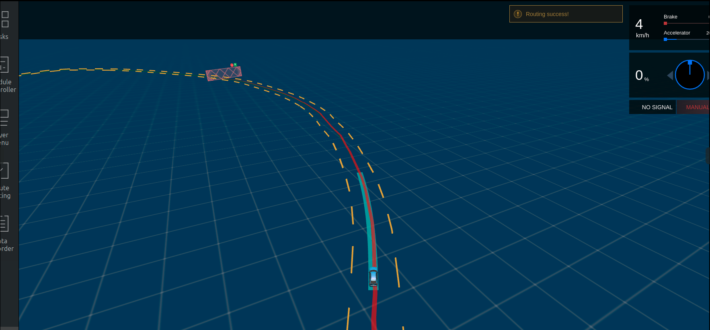
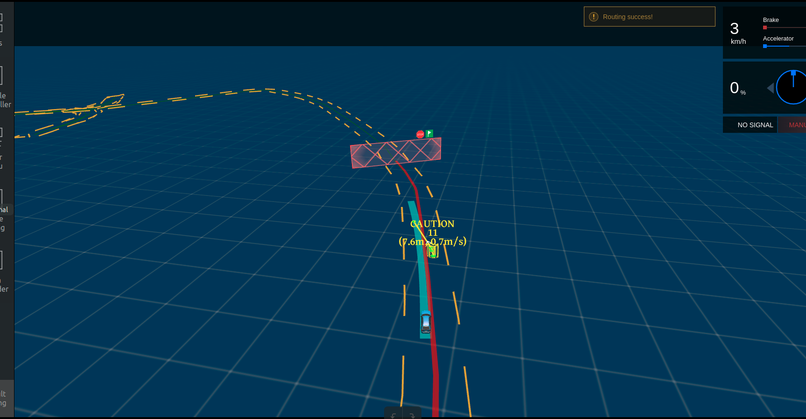
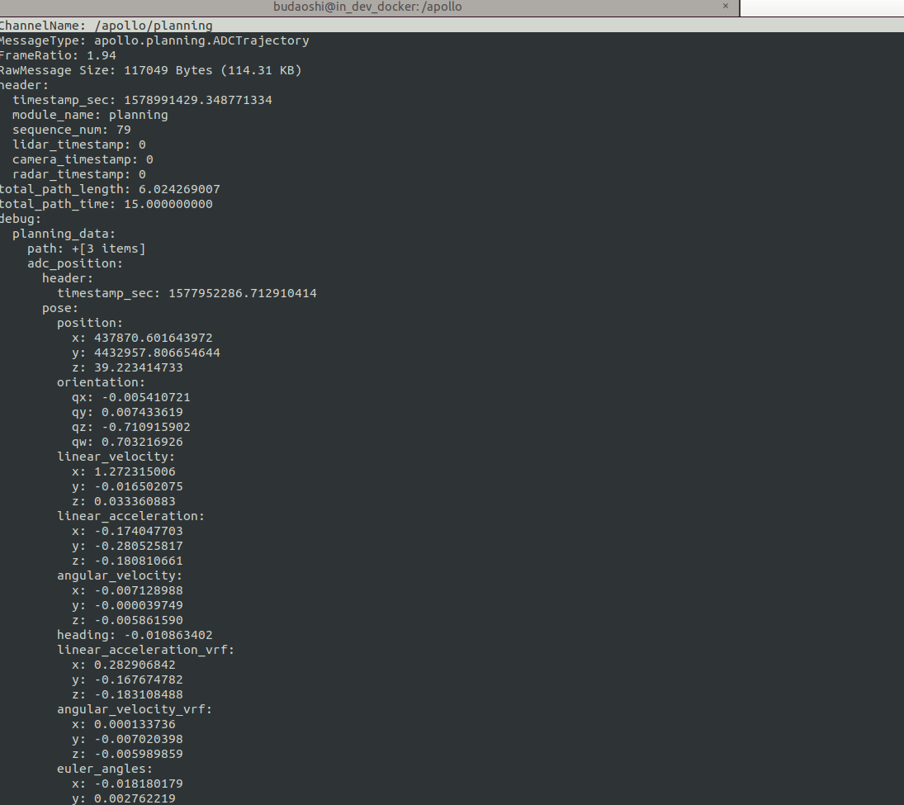

# 基于摄像头的封闭园区自动驾驶搭建--自动驾驶演示

- [基于摄像头的封闭园区自动驾驶搭建--自动驾驶演示](#基于摄像头的封闭园区自动驾驶搭建--自动驾驶演示)
  - [前提条件](#前提条件)
  - [概览](#概览)
  - [启动流程](#启动流程)
      - [1. 启动can卡](#1-启动can卡)
      - [2. 编译项目，启动Dreamview](#2-编译项目启动dreamview)
      - [3. 启动所需模块](#3-启动所需模块)
      - [4. 检查各模块channel是否正确](#4-检查各模块channel是否正确)
      - [5. 启动Camera感知](#5-启动camera感知)
      - [6. 感知验证](#6-感知验证)
      - [7. 启动 Planning、Prediction、Routing、Control模块](#7-启动-planningpredictionroutingcontrol模块)
      - [8. 验证Planning、Prediction、Routing、Control模块是否启动成功](#8-验证planningpredictionroutingcontrol模块是否启动成功)
      - [9. 启动自动驾驶](#9-启动自动驾驶)
  - [常见问题](#常见问题)
      - [1. 自动驾驶过程中车轮来回摆动，有画龙现象](#1-自动驾驶过程中车轮来回摆动有画龙现象)
      - [2. 车辆换道、停止等效果不理想](#2-车辆换道停止等效果不理想)

## 前提条件

1. 正确完成了[基于摄像头的封闭园区自动驾驶搭建--感知设备集成](sensor_integration_cn.md)。

2. 正确完成了[基于摄像头的封闭园区自动驾驶搭建--感知适配](perception_configuration_cn.md)。

3. 正确完成了[封闭园区自动驾驶搭建--虚拟车道线制作](../Lidar_Based_Auto_Driving/virtual_lane_generation_cn.md)。

4. 正确完成了[封闭园区自动驾驶搭建--规划适配](../Lidar_Based_Auto_Driving/planning_configuration_cn.md)。

5. 确保在道路平整、车少人少等相对安全的情况下实验。

6. 确保至少两人操作，一人操作工控机，一人操作遥控器，做好随时接管准备。

## 概览
该用户手册旨在帮助用户完成基于Camera感知的封闭园区自动驾驶

## 启动流程

#### 1. 启动can卡

进入can卡目录启动can卡，用以下命令启动

    cd ~/SocketCan/
    bash start.sh

#### 2. 编译项目，启动Dreamview
进入docker环境，用gpu编译项目，启动DreamView 

    cd /apollo
    bash docker/scripts/dev_start.sh
    bash docker/scripts/dev_into.sh
    bash apollo.sh build_opt_gpu
    bash scripts/bootstrap.sh
 
#### 3. 启动所需模块
在浏览器中打开`(http://localhost:8888)`,选择模式为`Dev Kit Debug`， 选择车型为`dev_kit`并选择相应高精地图，在module Controller标签页启动Canbus、Camera、GPS、Localization、Transform模块。

####  4. 检查各模块channel是否正确
在docker中输入`cyber_monitor`命令并检查以下channel（使用`上下方向键`选择channel，使用`右方向键`查看channel详细信息。关于cyber_monitor更详细使用，请参考[CyberRT_Developer_Tools](../../cyber/CyberRT_Developer_Tools.md)）：
	
|channel_name | 检查项目 | 
|---|---|
| `/apollo/localization/pose`| 确保能正常输出数据 | 
|`/apollo/sensor/gnss/best_pose` | 确保能正常输出数据、`sol_type:` 选项显示为`NARROW_INT`   |
| `/apollo/sensor/camera/front_6mm/image` | 确保能正常输出数据、帧率在15帧左右|
|`/tf`|确保能正常输出数据|
|`/tf_static`|确保能正常输出数据|
|`/apollo/canbus/chassis`|确保能正常输出数据|
|`/apollo/canbus/chassis_detail`|确保能正常输出数据|

#### 5. 启动Camera感知

在dreamview中启动`Camera Perception`模块，使用`cyber_monitor`查看`/apollo/perception/obstacles`是否正常输出，并在dreamview上查看障碍物信息：

#### 6. 感知验证
使用`cyber_monitor`查看`/apollo/perception/obstacles`是否正常输出，并在DreamView上查看障碍物信息：查看车前方10米处运动的人或者自行车（自行车上要有人），在DreamView上查看障碍物颜色以及位置速度信息（自行车青蓝色，行人黄色，车辆绿色），如下图所示：

`/apollo/perception/obstacles`的数据如下图所示：

确保在Dreamview上能看到障碍物并且`/apollo/perception/obstacles`有障碍物信息。

#### 7. 启动 Planning、Prediction、Routing、Control模块
在Module Controller标签页启动Planning、Prediction、Routing、Control模块。

在Routing Editor标签中点击Add Point of Interest按钮添加一个point, 然后选择Send Routing Request按钮发送添加的routing点

#### 8. 验证Planning、Prediction、Routing、Control模块是否启动成功
从DreamView中查看会出现一个蓝色的线以及一个红色的stop标志。如下图所示：

在车前方存在人或者自行车（车上有人）时，在Tasks标签页查看Planning轨迹线，如下图所示：

在docker环境中输入命令`cyber_monitor`并查看Planning channel信息： 

 

如果出现上图所示轨迹线和topic信息，表示规划模块适配和开环测试通过，否则继续查看log信息进行调试。
#### 9. 启动自动驾驶
在附近没有人员和车的情况下，遥控器下放权限并在Tasks标签页中点击Start Auto使车进入自动驾驶状态，在车自动驾驶这个过程中做好随时用遥控器接管，确保安全的准备。

## 常见问题
#### 1. 自动驾驶过程中车轮来回摆动，有画龙现象
这种情况一般是车辆动力学标定没有做好，建议重新进行动力学标定
#### 2. 车辆换道、停止等效果不理想
- 在保证感知、定位稳定的前提下，可以尝试修改planning配置文件中的相关参数进行调整，详情参考[封闭园区自动驾驶搭建--规划适配](../Lidar_Based_Auto_Driving/planning_configuration_cn.md)

