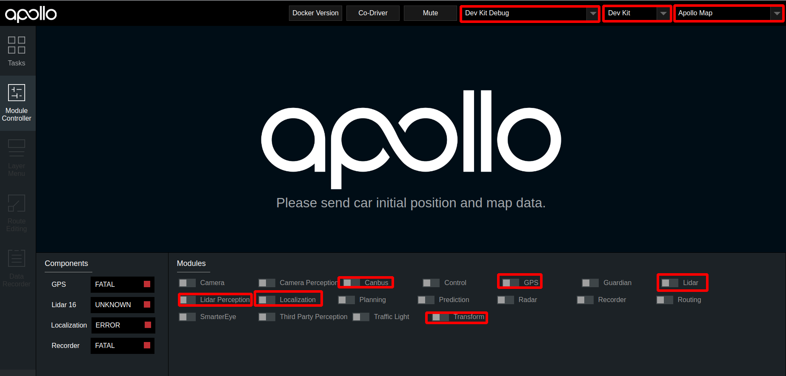

# 基于激光雷达的封闭园区自动驾驶搭建--感知适配

- [基于激光雷达的封闭园区自动驾驶搭建--感知适配](#基于激光雷达的封闭园区自动驾驶搭建--感知适配)
  - [概览](#概览)
  - [前提条件](#前提条件)
  - [配置文件的修改](#配置文件的修改)
  - [启动Lidar感知](#启动lidar感知)
      - [1. 启动can卡](#1-启动can卡)
      - [2. 编译项目，启动Dreamview](#2-编译项目启动dreamview)
      - [3. 启动所需模块](#3-启动所需模块)
      - [4. 检查lidar数据是否正确](#4-检查lidar数据是否正确)
      - [5. 启动Lidar感知](#5-启动lidar感知)
  - [验证Lidar感知效果](#验证lidar感知效果)
  - [NEXT](#next)
  - [常见问题](#常见问题)
      - [1. 感知的输出帧率达不到10帧](#1-感知的输出帧率达不到10帧)
      - [2. 感知的障碍物位置与实际障碍物误差较大](#2-感知的障碍物位置与实际障碍物误差较大)
## 概览
该用户手册旨在帮助用户完成激光雷达感知适配，实现Lidar感知

## 前提条件

 1. 正确完成了[循迹搭建--车辆循迹演示](../Waypoint_Following/start_waypoint_following_cn.md)

 2. 正确完成了[基于激光雷达的封闭园区自动驾驶搭建--感知设备集成](sensor_integration_cn.md)
 
 3. 正确完成了[基于激光雷达的封闭园区自动驾驶搭建--感知设备标定](sensor_calibration_cn.md)

## 配置文件的修改

|序号 | 待修改文件 | 修改内容 | 
|---|---|---|
|  1 | `modules/common/data/global_flagfile.txt` |  添加`--half_vehicle_width=0.43` |

## 启动Lidar感知

把车辆开到户外，启动lidar感知

#### 1. 启动can卡

进入can卡目录启动can卡，用以下命令启动

    cd ~/SocketCan/
    bash start.sh

####  2. 编译项目，启动Dreamview
进入docker环境，用gpu编译项目，启动DreamView 

    cd /apollo
    bash docker/scripts/dev_start.sh
    bash docker/scripts/dev_into.sh
    bash apollo.sh build_opt_gpu
    bash scripts/bootstrap.sh

####  3. 启动所需模块

- 在浏览器中打开`(http://localhost:8888)`，选择模式为`Dev Kit Debug`， 选择车型为`Dev Kit`，在Module Controller标签页启动Canbus、GPS、Localization、Transform模块。

  

- 定位模块启动后，需要接收定位数据，需要等待约1分钟左右。打开新的终端，并使用`bash docker/scripts/dev_into.sh`命令进入docker环境，在新终端中输入`cyber_monitor`命令查看`tf`、`tf_static`、`/apollo/localization/pose`数据，这三个数据在cyber_monitor中均显示为绿色代表定位模块启动成功

- 在dreamview中启动`lidar`模块

  
 
####  4. 检查lidar数据是否正确

 - 使用`cyber_monitor`，查看是否有`/apollo/sensor/lidar16/PointCloud2`、`/apollo/sensor/lidar16/Scan`、`/apollo/sensor/lidar16/compensator/PointCloud2`三个channel，并使用上下方向键选择channel，使用右方向键查看channel详细数据。(关于cyber_monitor更详细使用，请参考[CyberRT_Developer_Tools](../../cyber/CyberRT_Developer_Tools.md))
 
    

    

#### 5. 启动Lidar感知
在dreamview中启动`lidar perception`模块，使用`cyber_monitor`查看`/apollo/perception/obstacles`是否正常输出，并在dreamview上查看障碍物信息：

## 验证Lidar感知效果

查看车前方10米处运动的人或者自行车（自行车上要有人），在DreamView上查看障碍物颜色以及位置速度信息（自行车青蓝色，行人黄色，车辆绿色），如下图所示：

`/apollo/perception/obstacles`的数据如下图所示：

如果在dreamview上能看到障碍物并且`/apollo/perception/obstacles`有障碍物信息，则开环测试通过。

## NEXT
现在，您已经完成激光雷达感知适配，接下来可以开始[封闭园区自动驾驶搭建--规划适配](planning_configuration_cn.md)

## 常见问题
#### 1. 感知的输出帧率达不到10帧
* 建议使用 `bash apollo.sh build_opt_gpu` 编译Apollo工程

#### 2. 感知的障碍物位置与实际障碍物误差较大
* 确认localization信号状态，保证`/apollo/sensor/gnss/best_pose`中`sol_type` 选项显示为`NARROW_INT`
* 保证各个传感器外参文件准确
