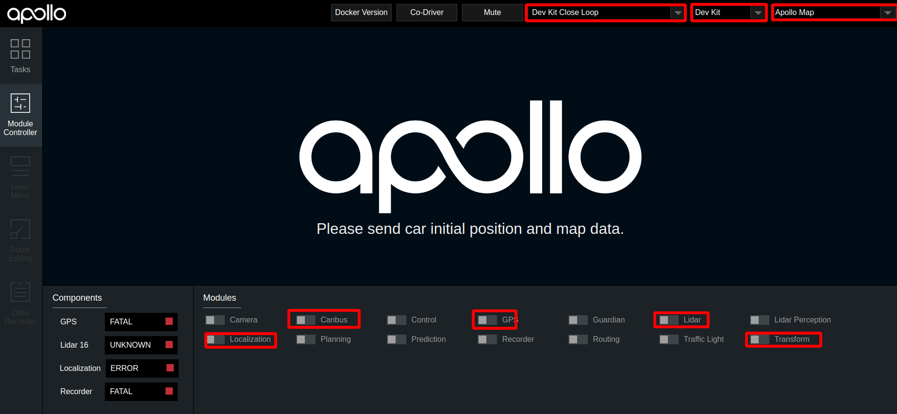
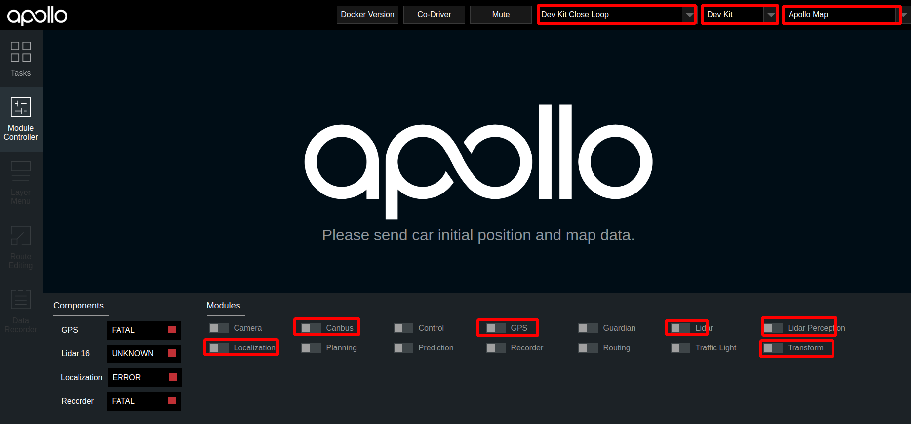
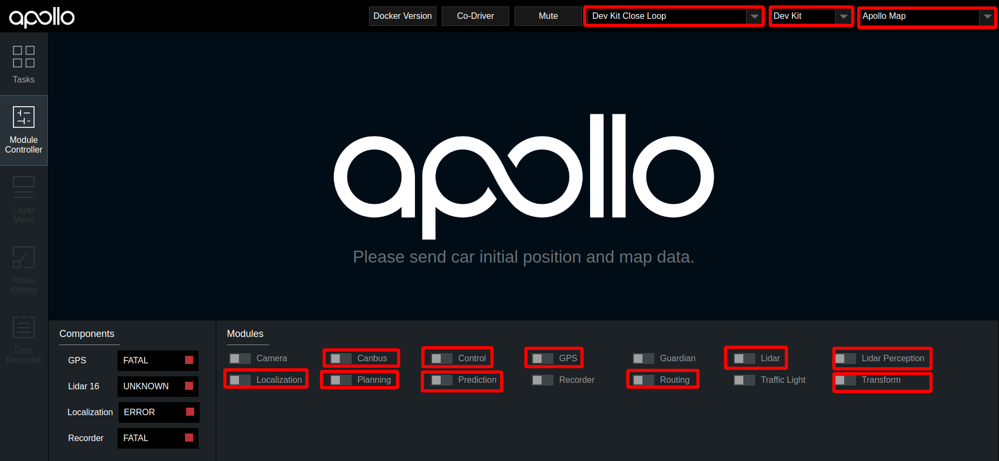
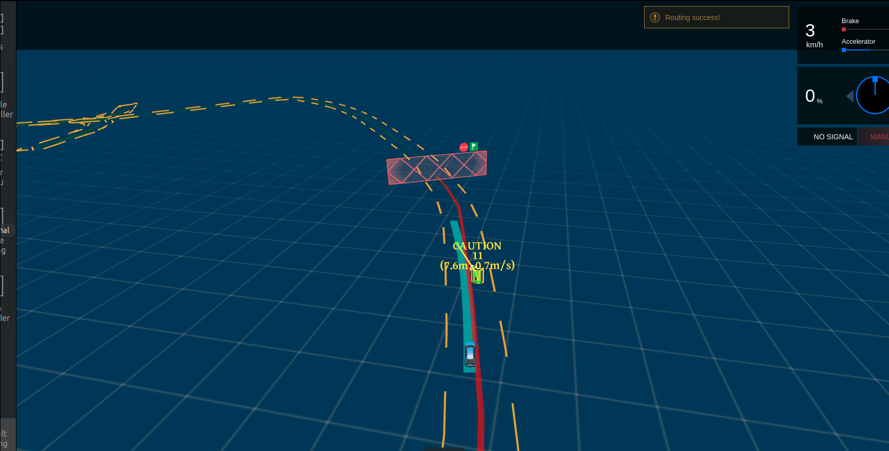

# 基于激光雷达的封闭园区自动驾驶搭建--自动驾驶演示

- [基于激光雷达的封闭园区自动驾驶搭建--自动驾驶演示](#基于激光雷达的封闭园区自动驾驶搭建--自动驾驶演示)
  - [概览](#概览)
  - [前提条件](#前提条件)
  - [启动流程](#启动流程)
      - [1. 启动can卡](#1-启动can卡)
      - [2. 编译项目，启动Dreamview](#2-编译项目启动dreamview)
      - [3. 启动所需模块](#3-启动所需模块)
      - [4. 检查lidar数据是否正确](#4-检查lidar数据是否正确)
      - [5. 检查各模块channel是否正确](#5-检查各模块channel是否正确)
      - [6. 启动Lidar感知](#6-启动lidar感知)
      - [7. 验证Lidar感知](#7-验证lidar感知)
      - [8. 启动 Canbus、Planning、Prediction、Routing、Control模块](#8-启动-canbusplanningpredictionroutingcontrol模块)
      - [9. 验证Planning、Prediction、Routing、Control模块是否启动成功](#9-验证planningpredictionroutingcontrol模块是否启动成功)
      - [10. 启动自动驾驶](#10-启动自动驾驶)
  - [常见问题](#常见问题)
      - [1. 自动驾驶过程中车轮来回摆动，有画龙现象](#1-自动驾驶过程中车轮来回摆动有画龙现象)
      - [2. 车辆换道、停止等效果不理想](#2-车辆换道停止等效果不理想)

## 概览
该用户手册旨在帮助用户完成基于Lidar感知的封闭园区自动驾驶。为了方便用户快速实现基于lidar的封闭园区自动驾驶演示，我们提供了`Dev kit Closeloop`模式，建议用户在进行基于lidar的封闭园区自动驾驶演示时使用该模式， 除此之外建议使用`Dev Kit Debug`模式。本文将以`Dev kit Closeloop`模式进行说明，如果用户选择使用`Dev Kit Debug`模式，操作方法相同。
## 前提条件
 
1. 正确完成了[封闭园区自动驾驶搭建--规划适配](planning_configuration_cn.md)。

2. 确保在道路平整、车少人少等相对安全的情况下实验。

3. 确保至少两人操作，一人操作工控机，一人操作遥控器，做好随时接管准备。

## 启动流程
#### 1. 启动can卡

进入can卡目录启动can卡，用以下命令启动

    cd ~/SocketCan/
    bash start.sh

#### 2. 编译项目，启动Dreamview
进入docker环境，用gpu编译项目，启动Dreamview 

    cd apollo
    bash docker/scripts/dev_start.sh
    bash docker/scripts/dev_into.sh
    bash apollo.sh build_opt_gpu
    bash scripts/bootstrap.sh

####  3. 启动所需模块

- 在浏览器中打开`(http://localhost:8888)`，选择模式为`Dev Kit Closeloop`， 选择车型为`Dev Kit`，选择对应的虚拟车道线或高精地图，在Module Controller标签页启动Canbus、GPS、Localization、Transform模块。

  

- 定位模块启动后，需要接收定位数据，需要等待约1分钟左右。打开新的终端，并使用`bash docker/scripts/dev_into.sh`命令进入docker环境，在新终端中输入`cyber_monitor`命令查看`tf`、`tf_static`、`/apollo/localization/pose`数据，这三个数据在cyber_monitor中均显示为绿色代表定位模块启动成功

- 在dreamview中启动`lidar`模块

  
 
####  4. 检查lidar数据是否正确

 - 使用`cyber_monitor`，查看是否有`/apollo/sensor/lidar16/PointCloud2`、`/apollo/sensor/lidar16/Scan`、`/apollo/sensor/lidar16/compensator/PointCloud2`三个channel，并使用上下方向键选择channel，使用右方向键查看channel详细数据，数据无异常则说明激光雷达适配成功。(关于cyber_monitor更详细使用，请参考[CyberRT_Developer_Tools](../../cyber/CyberRT_Developer_Tools.md))
 
    

    

####  5. 检查各模块channel是否正确

在docker中输入`cyber_monitor`命令并检查以下channel（使用`上下方向键`选择channel，使用`右方向键`查看channel详细信息）：
	
|channel_name | 检查项目 | 
|---|---|
| `/apollo/localization/pose`| 确保能正常输出数据 | 
|`/apollo/sensor/gnss/best_pose` | 确保能正常输出数据、`sol_type:` 选项显示为`NARROW_INT`   |
|`/apollo/sensor/lidar16/PointCloud2` | 确保能正常输出数据|
|`/apollo/sensor/lidar16/Scan`| 确保能正常输出数据|
| `/apollo/sensor/lidar16/compensator/PointCloud2`  | 确保能正常输出数据 |
|`/tf`|确保能正常输出数据|
|`/tf_static`|确保能正常输出数据|
|`/apollo/canbus/chassis`|确保能正常输出数据|
|`/apollo/canbus/chassis_detail`|确保能正常输出数据|

#### 6. 启动Lidar感知
确认各模块正常启动且channel输出正常后，在DreamView上启动`Lidar Perception`，使用`cyber_monitor`查看`/apollo/perception/obstacles`是否正常输出

#### 7. 验证Lidar感知
在DreamView上启动Perception模块，使用`cyber_monitor`查看`/apollo/perception/obstacles`是否正常输出，查看车前方10米处运动的人或者自行车（自行车上要有人），在DreamView上查看障碍物颜色以及位置速度信息（自行车青蓝色，行人黄色，车辆绿色），如下图所示：

`/apollo/perception/obstacles`的数据如下图所示：

确保在DreamView上能看到障碍物且`/apollo/perception/obstacles`有障碍物信息。

#### 8. 启动 Canbus、Planning、Prediction、Routing、Control模块
在Module Controller标签页启动Planning、Prediction、Routing、Control模块。

在Routing Editor标签中点击Add Point of Interest按钮添加一个point， 然后选择Send Routing Request按钮发送添加的routing点

####  9. 验证Planning、Prediction、Routing、Control模块是否启动成功
从DreamView中查看会出现一个蓝色的线 以及一个红色的stop标志。如下图所示：

在车前方存在人或者自行车（车上有人）时，在task标签页查看planning轨迹线，正常情况下planning会重新规划轨迹，如下图所示：

在docker环境中输入命令`cyber_monitor`并查看planning channel信息： 

 

如果出现上图所示轨迹线和topic信息，表示规划模块适配和开环测试通过，否则继续查看log信息进行调试。

####  10. 启动自动驾驶
在附近没有人员和车的情况下，遥控器下放权限并在task标签页中点击start auto使车进入自动驾驶状态，在车自动驾驶这个过程中做好随时用遥控器接管确保安全的准备。

## 常见问题
#### 1. 自动驾驶过程中车轮来回摆动，有画龙现象
这种情况一般是车辆动力学标定没有做好，建议重新进行动力学标定
#### 2. 车辆换道、停止等效果不理想
- 在保证感知、定位稳定的前提下，可以尝试修改planning配置文件中的相关参数进行调整，详情参考[封闭园区自动驾驶搭建--规划适配](planning_configuration_cn.md)
