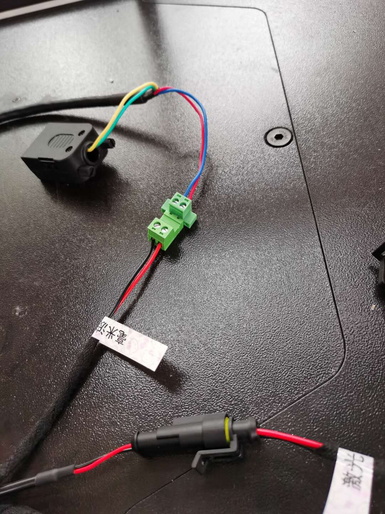
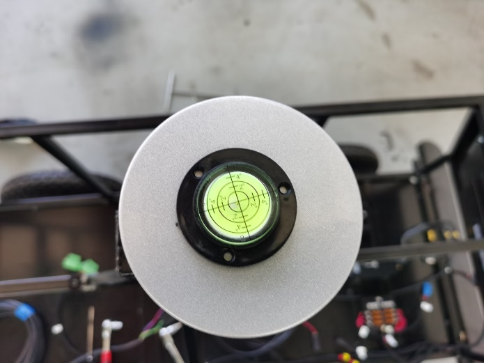
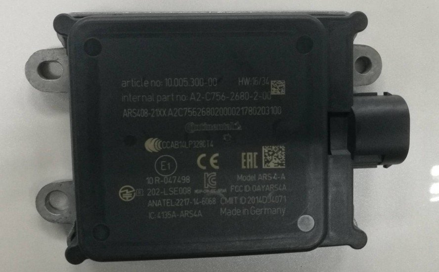
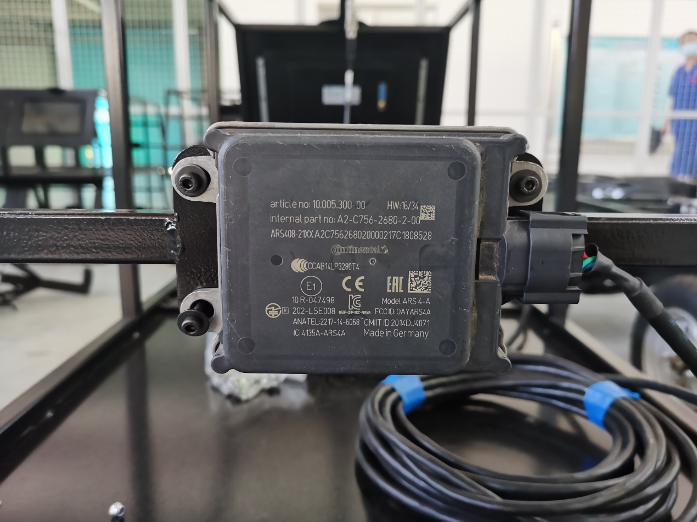

# **Apollo传感器集成说明**

传感器上车集成前，请优先或同步完成工控机的Apollo系统安装，教程详见“循迹搭建——Apollo系统安装”。工控机安装Apollo系统时开采用自带的直流电源模块供电，显示器可使用电脑显示器。

## **快速介绍**

请您在传感器集成前仔细阅读本文档。本文档介绍了传感器供电线束安装的注意事项。

## **Apollo上装电气原理图**

Apollo上装电气原理图如下图所示：

通过电气原理图可知，6108/8108工控机（IPC）由底盘独立提供24V电源，显示器、激光雷达、毫米波雷达、IMU和路由器则由底盘通过保险盒提供12V电源。

## **1. 上装传感器供电线束简介**

Apollo电气原理图中的供电部分集成在了一条供电线束中，如下图所示。

保险丝盒取消了负极接线，负极回路集成在线束内部。

底盘后部电气面板如下图所示：

上装供电插座的脚位定义如图所示:1、Pin1—12V+；2、Pin2—12V-；3、Pin3—24V+；4、Pin4—24V-。

底盘can口通过db9延长线与工控机相连。上装供电线通过4pin航插与底盘供电插座相连。
** 提示：请在检查供电线束与传感器连接插头极性之后，再连接供电线束与底盘供电口的航插。**

## **2. 传感器电源接口介绍**

### **1、工控机电源接口**

### 2、M2电源接口

M2自带数据线缆为1分5线缆，一端为与工控机相连的航插接头，另一端为M2电源输入口，网口、激光雷达授时输出口，USB输出口，db9输出口（M2配置串口）。详细如下图所示：

注意：M2线缆电源输入口为白色2pin插头，红色为12V正极，蓝色为12V负极；上装线束M2供电插头为蓝色2pin插头，红色为12V正极，黑色色为12V负极，对插后红色对红色，黑色对蓝色。连接插头时请确认线色或用万用表检查线束端供电插头电源极性。连接如下图所示：

### 3、毫米波雷达电源接口

毫米波雷达线束，一端为毫米波雷达连接插头，另一端是电源插头2pin凤凰端子和CAN口。

**注意：毫米波雷达线束电源插头：红色正+，蓝色负-；线束供电端为红色正+，黑色负-；再插接时，保证红对红，黑对蓝。**

### 4、激光雷达电源接口

### 5、屏幕供电

车载屏幕供电线为单独一段线束：1端为DJ7021-1.5-11插件（公头），连接供电线束端DJ7021-1.5-21（母头）；另一端为DC5.5mm插头，接口如下图所示：

### 6、路由器供电

路由器线束断供电插头为DC5.5直流插头，如下图所示：

## **3. 传感器固定介绍**

### 1、工控机固定

### 2、M2及线束保险丝盒固定

### 3、激光雷达固定

#### 3.1激光雷达支架固定

#### 3.2激光雷达固定

### 4、摄像头固定

摄像头安装位置如下图

### 5、激光雷达与摄像头相对水平调整

### 6、毫米波雷达固定

