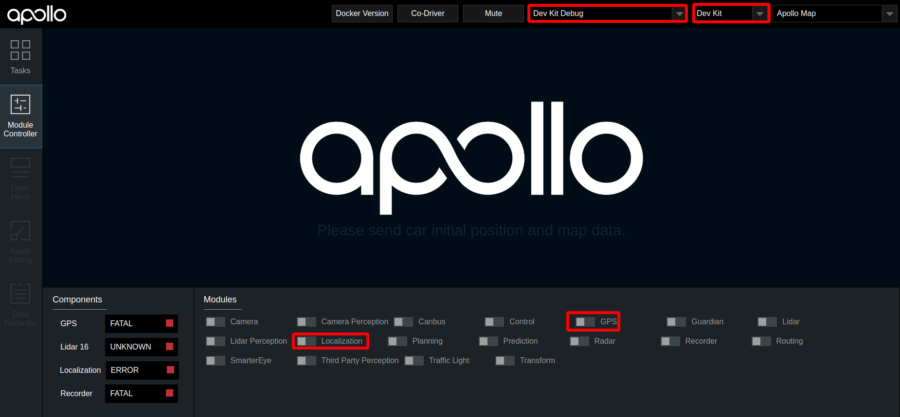
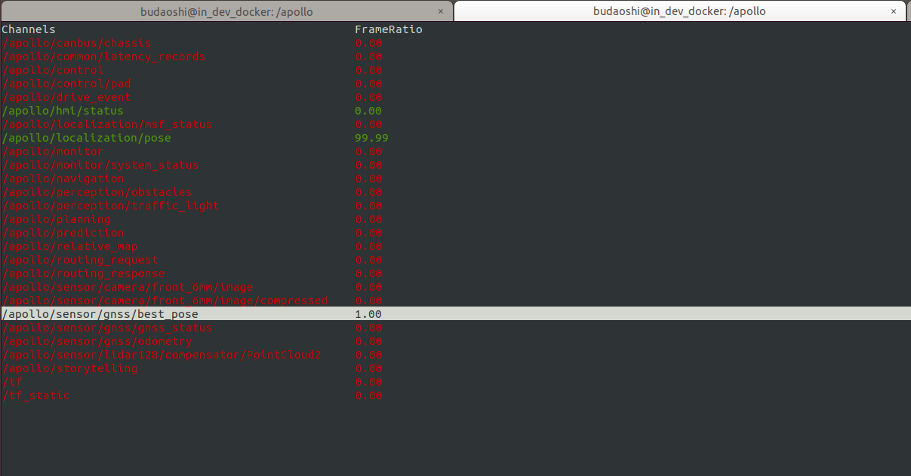
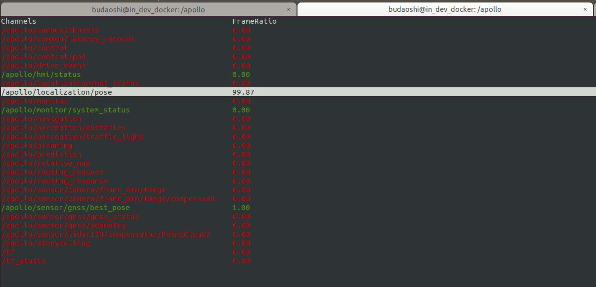

# 循迹搭建--定位模块配置
- [循迹搭建--定位模块配置](#循迹搭建--定位模块配置)
  - [概览](#概览)
  - [前提条件](#前提条件)
  - [导航设备配置](#导航设备配置)
    - [杆臂配置](#杆臂配置)
    - [GNSS航向配置](#gnss航向配置)
    - [导航模式配置](#导航模式配置)
    - [USB接口输出设置](#usb接口输出设置)
    - [网口配置](#网口配置)
    - [PPS授时接口输出](#pps授时接口输出)
  - [系统文件配置](#系统文件配置)
    - [GNSS配置](#gnss配置)
    - [`Localization.conf`文件的配置](#localizationconf文件的配置)
  - [检查定位模块能否正常启动](#检查定位模块能否正常启动)
      - [1. 编译项目，启动Dreamview](#1-编译项目启动dreamview)
      - [2. 启动定位模块](#2-启动定位模块)
      - [3. 检查GPS信号](#3-检查gps信号)
      - [4. 检查定位信号](#4-检查定位信号)
  - [NEXT](#next)
  - [常见问题](#常见问题)

## 概览

该手册旨在帮助用户在自动驾驶开发套件上配置定位模块。在定位模块配置环节，将完成导航设备配置。

## 前提条件

 - 完成了[循迹搭建--车辆集成](vehicle_integration_cn.md)
 - 拥有RTK基站账号

## 导航设备配置

下面介绍导航配置的方法。当设备正确接入系统后，在/dev/下面有名为ttyACM0的设备，即表示M2已经被正确地加载了。在配置导航设备之前，我们先给导航设备添加一个规则文件。在终端中输入以下命令来查看设备的端口号：

`ls -l /sys/class/tty/ttyACM0`

记下形如`1-10:1.0`的一串数字；在系统`/etc/udev/rules.d/`目录下执行`sudo touch 99-kernel-rename-imu.rules`命令新建一个文件`99-kernel-rename-imu.rules`,执行`sudo vim 99-kernel-rename-imu.rules`命令添加文件内容：`ACTION=="add",SUBSYSTEM=="tty",MODE=="0777",KERNELS=="1-10:1.0",SYMLINK+="imu"`

其中的`1-10:1.0`就是上面记下的一串数字，根据实际情况进行替换即可；然后先按`ESC`键然后再按`:wq`保存文件内容退出，并重启系统。重启系统后执行`cd /dev`命令，用`ls -l imu`命令查看设备，要确保`imu`存在。配置设备时，需要将设备的串口线连接上电脑的串口才可以对设备进行配置，也就是说，用来配置设备的电脑主机需要拥有串口。Windows下可以通过串口助手、串口猎人或者COMCenter等工具进行配置，Linux下可以通过Minicom、cutecom等工具进行配置。linux下建议使用cutecom软件，可使用`sudo apt install cutecom`来安装此软件，在终端中使用`sudo cutecom`命令打开该软件，在软件中`open`名为`ttyS0`的设备。

### 杆臂配置

车尾天线（后天线，通常是主天线，也就是Primary）杆臂配置：

`$cmd,set,leverarm,gnss,x_offset,y_offset,z_offset*ff`

这里的杆臂值`x_offset,y_offset,z_offset`就是车辆集成环节中测量所得的杆臂值，杆臂值请以自己使用的实际情况为准。

### GNSS航向配置

天线车头车尾前后安装

`$cmd,set,headoffset,0*ff`

### 导航模式配置
```
$cmd,set,navmode,FineAlign,off*ff
$cmd,set,navmode,coarsealign,off*ff
$cmd,set,navmode,dynamicalign,on*ff
$cmd,set,navmode,gnss,double*ff
$cmd,set,navmode,carmode,on*ff
$cmd,set,navmode,zupt,on*ff
$cmd,set,navmode,firmwareindex,0*ff
```

### USB接口输出设置
```
$cmd,output,usb0,rawimub,0.010*ff
$cmd,output,usb0,inspvab,0.010*ff
$cmd,through,usb0,bestposb,1.000*ff
$cmd,through,usb0,rangeb,1.000*ff
$cmd,through,usb0,gpsephemb,1.000*ff
$cmd,through,usb0,gloephemerisb,1.000*ff
$cmd,through,usb0,bdsephemerisb,1.000*ff
$cmd,through,usb0,headingb,1.000*ff
```
### 网口配置
```
$cmd,set,localip,192,168,0,123*ff
$cmd,set,localmask,255,255,255,0*ff
$cmd,set,localgate,192,168,0,1*ff
$cmd,set,netipport,111,112,113,114,8000*ff
$cmd,set,netuser,username:password*ff
$cmd,set,mountpoint,XMJL*ff
```

假如您通过自建RTK基站或者购买RTK基站服务的方式拥有了一个RTK基站账号，账号信息如下：

```
ip:203.107.45.154
port:8002
mount_point:RTCM32_GGB
user:qianxun1234
password:abc123
```

这里我们假设您所使用的无线路由器的IP地址为192.168.0.1,那么我们将M2主机的IP地址设置为192.168.0.123，子网掩码为255.255.255.0，网关为192.168.0.1。netipport设置的是RTK基站的IP地址和端口号，具体到上面您购买的RTK基站账号中，在此处IP地址为：203.107.45.154，端口号为：8002；netuser设置的是RTK基站的用户名和密码，在此处用户名为：qianxun1234，密码为：abc123；在实际配置中，请以自己实际购买的基站账号的用户名和密码为准。mountpoint是RTK基站的挂载点，在这里我们选用RTCM32_GGB。注意：在M2的网络模块配置完成后，在IPC主机中应该是可以ping通IMU的ip地址的；否则，IMU无法正常联网，在后续的GNSS信号检查中会一直显示SINGLE而不是我们期望的NARROW_INT。

**注意**：当您升级了IMU的固件版本时，请用以下命令来查看IMU的网络相关的配置：

```
$cmd,get,netpara*ff
```

若输出的内容有`$cmd,set,ntrip,disable,disable*ff`相关的字样，则将以下命令输入IMU：

```
$cmd,set,ntrip,enable,enable*ff
$cmd,save,config*ff
```

### PPS授时接口输出
```
ppscontrol enable positive 1.0 10000
log com3 gprmc ontime 1 0.25
```

将所有配置逐条发送给设备，得到设备返回`$cmd,config,ok*ff`字段，说明配置成功，配置成功后要进行配置保存，发送`$cmd,save,config*ff`指令;也可以将以上的相关配置命令保存在`/apollo/docs/D-kit/sample/imu.conf`文件中,然后在cutecom中点击右边的`Send file...`按钮，在弹出的对话框中选择`imu.conf`文件后点击`Open`按钮后即可将文件中保存的配置命令全部发送给设备，一切正常的情况下，设备会返回25个`$cmd,config,ok*ff`字段，说明配置成功；切记在发送文件之前将自己的实际信息保存在文件中，比如杆臂值和`GNSS`的账号信息等。配置成功后将该设备断电后重新上电加载后即可使用。注意：PPS授时接口输出的两条配置命令是没有返回`$cmd,config,ok*ff`字段的，这是正常情况，不用担心。

## 系统文件配置

系统文件配置主要包括两部分，GNSS配置、`localization.conf`文件配置。

### GNSS配置

将文档`modules/calibration/data/dev_kit/gnss_conf/gnss_conf.pb.txt`中的`proj4_text: "+proj=utm +zone=50 +ellps=WGS84 +towgs84=0,0,0,0,0,0,0 +units=m +no_defs"`这一行中的`zone=50`中的50换成自己的城市所在的utmzone数值；比如这里的数值50代表的是北京，若您在纽约，则用纽约的utmzone数值10替换掉这里的数值50，以此类推。

### `Localization.conf`文件的配置
对`modules/calibration/data/dev_kit/localization_conf/localization.conf`文件进行配置。**如果该配置文件没有进行正确配置，可能会对之后的传感器标定、虚拟车道线制作等功能产生影响**

| 参数 | 说明 |
| --  |-- |
|lidar_height_default|参数值修改为lidar中心到地面的距离 单位m|
|local_utm_zone_id|  需要用户查询所在地区的utm_zone，并进行修改。例如，北京地区utm_zone为50。utm_zone的查询可参考[该网页](https://mangomap.com/robertyoung/maps/69585/what-utm-zone-am-i-in-#) |
|imu_to_ant_offset_x|x轴方向杆臂值，单位m，杆臂值测量方法参看`循迹搭建--车辆集成`文档|
|imu_to_ant_offset_y|y轴方向杆臂值，单位m，杆臂值测量方法参看`循迹搭建--车辆集成`文档|
|imu_to_ant_offset_z|z轴方向杆臂值，单位m，杆臂值测量方法参看`循迹搭建--车辆集成`文档|
|--enable_lidar_localization=true|修改为`--enable_lidar_localization=false`|


## 检查定位模块能否正常启动

将车辆移至室外平坦开阔处，按顺序执行如下操作

####  1. 编译项目，启动Dreamview
进入docker环境，用gpu编译项目，启动DreamView 

    cd /apollo
    bash docker/scripts/dev_start.sh
    bash docker/scripts/dev_into.sh
    bash apollo.sh build_opt   
    bash scripts/bootstrap.sh

####  2. 启动定位模块

- 在浏览器中打开`(http://localhost:8888)`，选择模式为`Dev Kit Debug`， 选择车型为`Dev Kit`，在Module Controller标签页启动GPS、Localization模块。

  

####  3. 检查GPS信号

打开新的终端，并使用`bash docker/scripts/dev_into.sh`命令进入docker环境，在新终端中输入`cyber_monitor`命令，进入 `/apollo/sensor/gnss/best_pose`条目下，查看sol_type字段是否为NARROW_INT。若为NARROW_INT，则表示GPS信号良好；若不为NARROW_INT，则将车辆移动一下，直到出现NARROW_INT为止。进入`/apollo/sensor/gnss/imu`条目下，确认IMU有数据刷新即表明GPS模块配置成功。




####  4. 检查定位信号

使用`cyber_monotor`查看，进入`/apollo/localization/pose`条目下，等待两分钟，直到有数据刷新即表明定位模块配置成功。




## NEXT

现在，您已经完成定位模块配置，接下来可以开始[循迹搭建--车辆动力学云标定](vehicle_calibration_online_cn.md)

## 常见问题
a.系统无法生成驱动设备`ttyACM0`，在`/apollo/data/log/gnss.INFO`里面会有类似报错提示：

```
open device /dev/ttyACM0 failed， error: no such file or directory
gnss driver connect failed, stream init failed
```

docker内和docker外的/dev/下都没有`ttyACM0`设备，先退出docker，然后关闭docker，再执行如下命令：
```
cd /apollo/docker/setup_host
bash setup_host.sh
```
重启工控机，然后在/docker/外，/dev/下，就有`ttyACM0`，再进docker，再试gps，可以了。

b.GPS打开后，发现best_pose, imu, localization/pose 信号没有收到

运行bash gps.sh后，可以cyber_monitor中观察以下几个信号。(关于cyber_monitor更详细使用，请参考[CyberRT_Developer_Tools](../../cyber/CyberRT_Developer_Tools.md))
```
/apollo/sensor/gnss/best_pose
/apollo/sensor/gnss/imu
/apollo/localization/pose
```
如果best_pose和imu没有，请检查gps和imu的配置。
如果best_pose和imu有了，但是localization/pose没有信号，请等待2分钟，如果还是没有，请让车开动几分钟。

c.GPS打开后，发现best_pose的sol_type为single，不是我们需要的NARROW_INT。

首先，确认IMU设备中已经配置好了基站信息。  
其次，检查IMU的网络接口是否插好了网线连接上了路由器，并且可以在工控机的终端里ping通IMU，同时保证路由器里面插上了手机的sim卡并且工控机能通过路由器正常地访问互联网。  
再次，联系商务的同事请他们提供刷新IMU的固件版本的教程和工具，刷新完IMU后请按照文档重新配置一遍IMU。  
最后，联系商务的同事商讨将IMU返厂维修的事宜。
