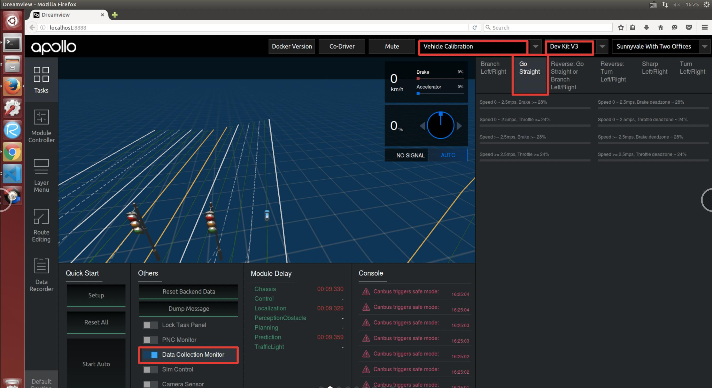
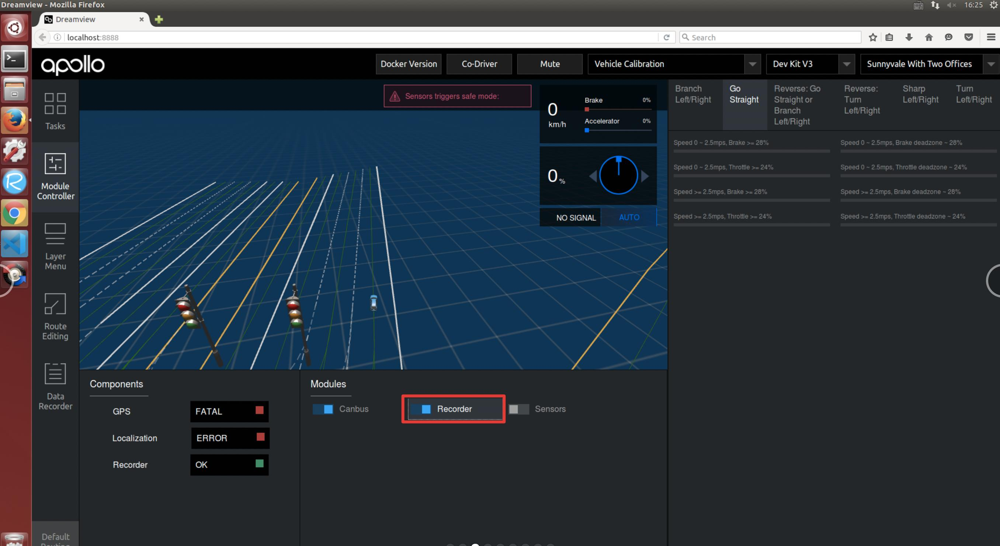
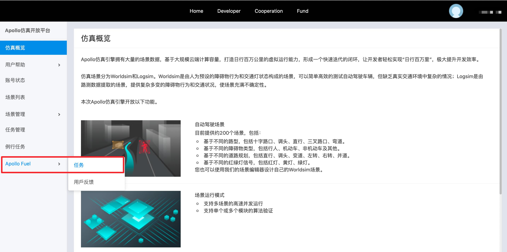
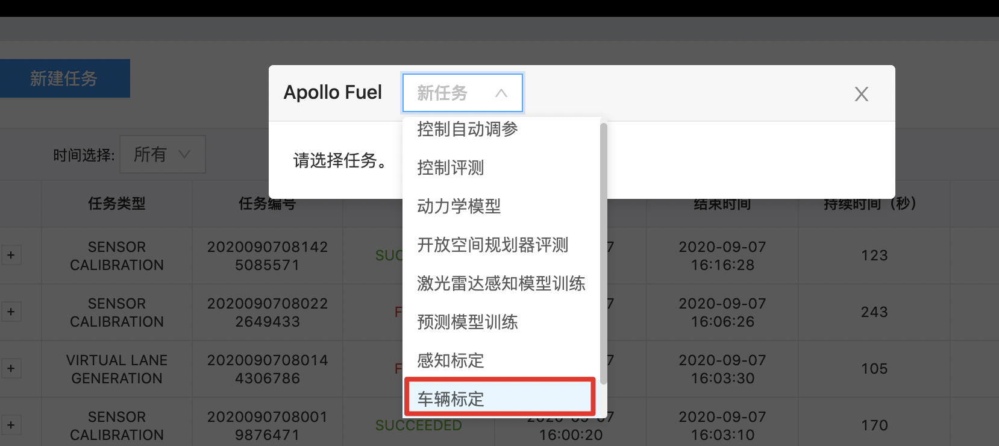
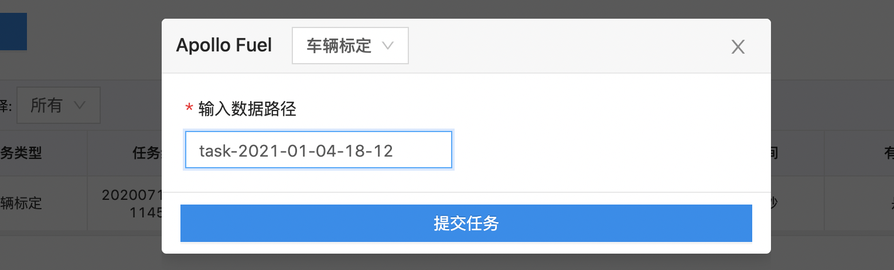
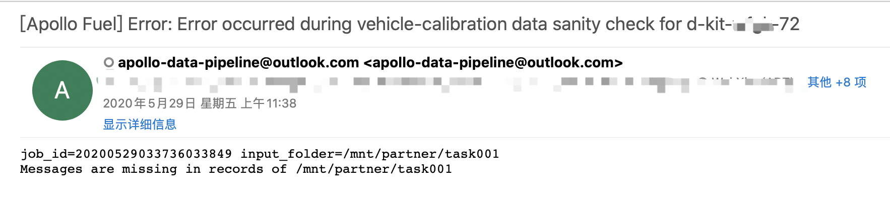
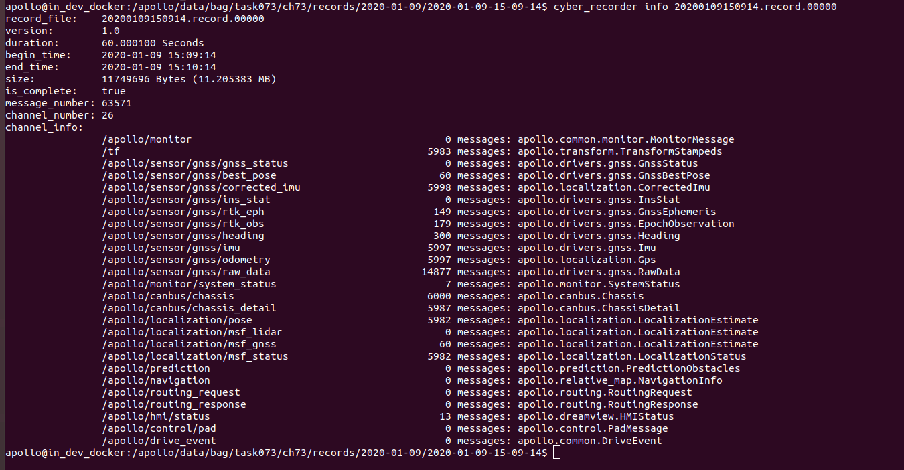

# 循迹搭建--车辆动力学云标定

- [循迹搭建--车辆动力学云标定](#循迹搭建--车辆动力学云标定)
  - [概览](#概览)
  - [前提条件](#前提条件)
  - [主要步骤](#主要步骤)
  - [修改配置文件](#修改配置文件)
  - [标定数据采集](#标定数据采集)
    - [准备](#准备)
    - [开始采集](#开始采集)
  - [标定任务提交](#标定任务提交)
    - [文件夹结构要求](#文件夹结构要求)
      - [1. 上传预处理后的数据至BOS](#1-上传预处理后的数据至bos)
      - [2. 提交标定任务](#2-提交标定任务)
      - [3. 获取标定结果及标定表](#3-获取标定结果及标定表)
      - [4. 将标定表写入控制配置文件中](#4-将标定表写入控制配置文件中)
  - [结果显示](#结果显示)
  - [NEXT](#next)
  - [常见问题](#常见问题)


## 概览

车辆云标定是通过采集车辆底盘油门踏板量、刹车踏板量、车辆速度、加速度作为车辆纵向动力模型的输入，通过机器学习的方式，生成相应车辆的踏板标定表，生成的标定表数据量大，精度高，提高车辆的控制精度。车辆踏板标定系统主要包括三个部分：

- 在`DreamView`数据采集监视器内采集标定数据；

- 标定数据上传至BOS云盘，提交标定任务；

- 生成用于性能评估的可视化标定结果。

在`DreamView`中，提供了一个踏板标定数据采集的监视器，用于监视采集标定数据的过程。通过配置文件设定标定条件（case），每个数据帧代表一种标定条件，每次采集数据时，每符合标定条件一次，则进度条增加一点，直至进度条增加满为止。


## 前提条件

- [循迹搭建--车辆集成](vehicle_integration_cn.md)

- [循迹搭建--定位模块配置](localization_configuration_cn.md)

- [循迹搭建--Apollo系统安装](apollo_installation_cn.md)

- [开通云服务账号](../../Apollo_Fuel/apply_fuel_account_cn.md)

## 主要步骤

- 修改标定配置文件

- 标定数据采集

- 标定任务提交

- 可视化结果分析

## 修改配置文件

在开始标定前，需要根据实际车辆的最大速度、速度、油门、刹车踏板的限制，进行用于车辆踏板标定的数据采集配置，来适配车辆的标定，满足标定数据能够尽可能多的覆盖车辆踏板的有效范围。我们设置了开发套件的默认车辆标定数据采集配置文件，在文件`apollo/modules/calibration/data/dev_kit/dreamview_conf/data_collection_table.pb.txt`内，开发者在了解了标定文件构成后，如有需要可以自行修改需要的数据采集配置文件，通常情况下使用默认标定配置可以覆盖小车大部分踏板控制范围，**建议开发者不需要单独修改此配置文件，使用默认标定配置即可**。默认标定配置文件内主要设计了小车的标定条件如下：

车辆前进模型

- 速度条件

  - 低速 0 ～ 2.5m/s
  - 高速 >= 2.5m/s

- 油门条件

  - 小油门 Throttle deadzone ~ 24%
  - 大油门 Throttle >= 24%

- 刹车条件

  - 缓刹车 Brake deadzone ~ 28%
  - 急刹车 Brake >= 28%

上述的`Throttle deadzone`表示车辆油门踏板的不产生加速度的无效区段，一般设在车辆刚能起步的附近，**开发套件给出的默认值是5%，开发者可以根据实际车辆的情况修改此参数**；`Brake deadzone`表示车辆刹车踏板的不产生减速度的无效区段，一般设在较低的踏板开度时，**开发套件给出的默认值是3%，开发者可以根据实际车辆的情况修改此参数**。此参数设置在`apollo/modules/calition/data/dev_kit/vehicle_param.pb.txt`文件内`throttle_deadzone`和`brake_deadzone`，在标定开始前，就要先把改参数确定好，后面进行数据训练时上传的配置文件，也需要对应使用该参数。

根据如上标定条件，即可匹配出车辆的所有标定条件，共8种条件，分别为：
- 低速小油门
- 低速大油门
- 高速小油门
- 高速大油门
- 低速缓刹车
- 低速急刹车
- 高速缓刹车
- 高速急刹车

确认好上述标定条件后，通常情况下使用默认标定配置可以覆盖小车大部分踏板控制范围，如果需要修改配置文件，则需要将`apollo/modules/calibration/data/dev_kit/dreamview_conf/data_collection_table.pb.txt` 中`Go Straight`部分配置进行修改，其它部分配置代码无需修改，无需删除，通过启动dreamview后重新选择车辆后配置生效，具体修改代码如下：

    frame_threshold: 20 // 帧有效阈值，连续满足标定条件的帧数大于等于该阈值时才会被记录
    total_frames: 4000  // 设置每一个标定case数据帧总量，当前设置为4000帧，可根据实际情况调整，数据量越大采集标定数据时间越长
    scenario {
      key: "Go Straight"
      value {
        feature {
          name: "Forward"
          range {
            criterion {
              field: "gear_location"
              comparison_operator: EQUAL
              value: 1
            }
          }
        }
        feature {
          name: "Steering Angle"
          range {
            name: "Straight"
            criterion {
              field: "steering_percentage"
              comparison_operator: GREATER_THAN_OR_EQUAL
              value: -1
            }
            criterion {
              field: "steering_percentage"
              comparison_operator: LESS_THAN
              value: 1
            }
          }
        }
        feature {
          name: "Speed"
          range {
            name: "Speed 0 ~ 2.5mps"
            criterion {
              field: "speed_mps"
              comparison_operator: GREATER_THAN_OR_EQUAL
              value: 0.2
            }
            criterion {
              field: "speed_mps"
              comparison_operator: LESS_THAN
              value: 2.5
            }
          }
          range {
            name: "Speed >= 2.5mps"
            criterion {
              field: "speed_mps"
              comparison_operator: GREATER_THAN_OR_EQUAL
              value: 2.5
            }
          }
        }
        feature {
          name: "Accelerator (Decelerator)"
          range {
            name: "Throttle deadzone ~ 24%"
            criterion {
              field: "throttle_percentage"
              comparison_operator: GREATER_THAN_OR_EQUAL
              vehicle_config: "throttle_deadzone"
            }
            criterion {
              field: "throttle_percentage"
              comparison_operator: LESS_THAN
              value: 24
            }
          }
          range {
            name: "Throttle >= 24%"
            criterion {
              field: "throttle_percentage"
              comparison_operator: GREATER_THAN_OR_EQUAL
              value: 24
            }
          }
          range {
            name: "Brake deadzone ~ 28%"
            criterion {
              field: "brake_percentage"
              comparison_operator: GREATER_THAN_OR_EQUAL
              vehicle_config: "brake_deadzone"
            }
            criterion {
              field: "brake_percentage"
              comparison_operator: LESS_THAN
              value: 28
            }
          }
          range {
            name: "Brake >= 28%"
            criterion {
              field: "brake_percentage"
              comparison_operator: GREATER_THAN_OR_EQUAL
              value: 28
            }
          }
        }
      }
    }

## 标定数据采集

### 准备

完成配置文件修改后，将车辆移动至适合标定的场地后，启动apollo，并执行以下命令：
```
    bash apollo.sh build_opt
    bash scripts/bootstrap.sh 
```
在浏览器打开`DreamView`，进行下述步骤：

1、在`--setup mode--`内，选择`vehicle calibration`（车辆标定）选项，在`--vehicle--`选择`Dev_Kit`；

2、在`Others`按钮区，选择`Data Collection Monitor`（数据采集监视器），选择`Go Straight`按钮。
如下图所示，为标定数据才采集面板。



### 开始采集

准备所需channel：
**车辆标定数据采集开始前，一定要检查标定需要的channel数据是否正常，否则会造成采集的标定数据缺少信息而造成后续生成标定表失败**。需要采集包含车辆底盘、定位信息的数据作为输入，所需要的channel如下表所示：

| 模块 | channel名称 | 检查项目 |
|---|---|---|
| Canbus | `/apollo/canbus/chassis` | 确保能正常输出数据 |
| GPS | `/apollo/sensor/gnss/best_pose` | 确保能正常输出数据,`sol_type:` 选项显示为`NARROW_INT` |
| Localization | `/apollo/localization/pose` | 确保能正常输出数据 |

为获取上述channel，在命令提示行内启动`canbus`模块、`GPS`模块、`localization`模块：
```
    bash scripts/canbus.sh
    bash scripts/gps.sh
    bash scripts/localization.sh
```
**通过cyber_monitor检查上述channel数据是否反馈正常**。

在`DreamView`界面点击左侧边栏，选择`Module Controller`，可以看到`Canbus`开关已经打开，这时开始点击`Recorder`开关，**（请务必切记先打开<Recorder>开关，再进行标定数据采集操作，实际情况常常会因未打开<Recorder>开关造成数据未记录保存，影响效率）**，这时Apollo系统就开始录制记录车辆标定数据了。



这时，我们使用遥控器遥控车辆，根据右侧数据采集监视器，采集相应标定条件的车辆数据，直到采集监视器内各标定条件进度条（**蓝色**）全部集满后，点击关闭`Recorder`开关，关闭数据记录，结束车辆标定数据采集。


所有采集的标定数据都保存在`apollo/data/bag/`目录下，找到以`年-月-日-时-分-秒`命名的文件夹，根据时间找到属于车辆标定采集的数据。我们可以分批采集数据，即每一次可以采集一部分数据，这样数据会记录在不同的`年-月-日-时-分-秒`文件夹，（**注意**：默认情况下，数据采集后会在`apollo/data/bag/`文件夹下生成2个`年月日时分秒相似`的文件夹，分别以`年-月-日-时-分-秒`和`年-月-日-时-分-秒_s`命名，开发者可以不用理会`_s`后缀的文件夹，只需要使用`年-月-日-时-分-秒`文件夹内录制的标定数据即可）也可以一次全部采集，这样所有的数据都记录在同一个文件夹内，通常完成上述标定条件的车辆标定数据采集需要20分钟左右。

## 标定任务提交

### 文件夹结构要求

#### 1. 上传预处理后的数据至BOS

在上传数据之前，请注意以下几点：

1）请将标定数据按照如下文件夹结构进行放置：


2）`Origin Folder`确保是**BOS的根目录**，确保`task001`目录是在BOS根目录下创建的（根目录：登录BOS存储服务器后首先看到的目录即为根目录，一般是`Bucket name`目录）；

3）`task001、task002...`代表一次车辆标定任务文件夹，即每次标定任务提交时，会训练一个`task文件夹`内的车辆数据；`task文件夹`上一层（`Origin Folder`）可以是BOS根目录或其他目录；

3） `Vehicle1、Vehicle2...`代表标定的车辆文件夹，可以根据实际情况，按照车辆名称+编号的形式命名，如`ch01`、`ch02`等。一个task文件夹下内可以包含多个Vehicle车辆文件夹，在一次任务提交中标定多个车辆；

4）`Records`文件内导入采集的车辆标定数据，车辆的录制数据在`apollo/data/bag/`目录下；

**需要注意：**`Records`文件夹下需要有2层子文件夹，第一层为大时间（年-月-日），如上图`2019-04-19`，第二层文件夹是具体的record文件夹（年-月-日-时-分等），如上图`2019-04-19-12-45-01`等，提醒大家一定要注意`Records`文件夹下的文件夹结构还要有2层，不然后续会影响标定找不到文件数据，文件夹结构如上图所示；

5） `Configuration File`即为`vehicle_param.pb.txt`（车辆配置文件），该文件在`apollo/modules/calition/data/dev_kit`文件夹内，将该文件夹下的`vehicle_param.pb.txt`拷贝至BOS对应的车辆标定文件夹下，如上图`Vehicle2`文件夹内；
 
6）总结上述文件夹结构：

    BOS根目录 -> Task Folder ->Vehicle Folder -> Records + vehicle_param.pb.txt


#### 2. 提交标定任务

首先进入[Apollo云服务任务页面](http://bce.apollo.auto/login)，选择使用百度账号登录，在左侧框中选择`Apollo Fuel-->任务`，点击`新建任务`，然后在下拉框内选择`车辆标定`，然后输入相应要评测的数据路径，在`输入数据路径`中填写到根目录，在本示例中填写为`task001`（因为“task001”在BOS的根目录）。如下图所示：








#### 3. 获取标定结果及标定表

- 云标定任务完成后，将在注册的邮箱（请与商务联系）中收到一封标定结果邮件。如果标定任务成功，将包含标定表及标定结果图片。

#### 4. 将标定表写入控制配置文件中

- 生成的标定表以 `车型_calibration_table.pb.txt`命名，将标定表内的标定数据为calibration_table字段，把全部数据拷贝替换至`apollo/modules/calibration/data/dev_kit/control_conf.pb.txt`下对应的`lon_controller_conf`字段下面的`calibration_table`段内。

注：云标定数据片段示例（截取了前4段）

    calibration {
      speed: 0.0
      acceleration: -1.3040223121643066
      command: -69.0
    }
    calibration {
      speed: 0.0
      acceleration: -1.2989914417266846
      command: -65.63157894736842
    }
    calibration {
      speed: 0.0
      acceleration: -1.2903447151184082
      command: -62.26315789473684
    }
    calibration {
      speed: 0.0
      acceleration: -1.2760969400405884
      command: -58.89473684210526
    }


## 结果显示

标定表和结果，以邮件的形式，发送至与BOS存储绑定的电子邮箱中。

- 油门踏板标定结果


- 刹车踏板标定结果


## NEXT
车辆云标定能够提供精度较高的车辆踏板标定表，对于自动驾驶的控制精度有显著提升。当然，使用`D-KIT`文件夹内默认的标定表数据，也可以进行循迹等自动驾驶控制。

现在，您已经完成车辆动力学标定，接下来可以开始[车辆循迹演示](start_waypoint_following_cn.md)。

## 常见问题

#### 1.在进行车辆标定时，收到如下报错邮件，数据完整性检查出现错误


排查方法：
1. 查看`文件夹结构`是否正确；
2. 查看是否在车辆文件夹内添加车辆配置文件（`vehicle_param.pb.txt`）
3. 查看录制数据包内是否存在`gps/localization`数据：
- 通过`cyber_recorder info xxxxxx.record.xxxxx`
检查采集数据内是否存在下面3个`channel`的数据：
- `/apollo/canbus/chassis`
- `/apollo/sensor/gnss/best_pose`
- `/apollo/localization/pose`
- 下图为正确的数据包示意

