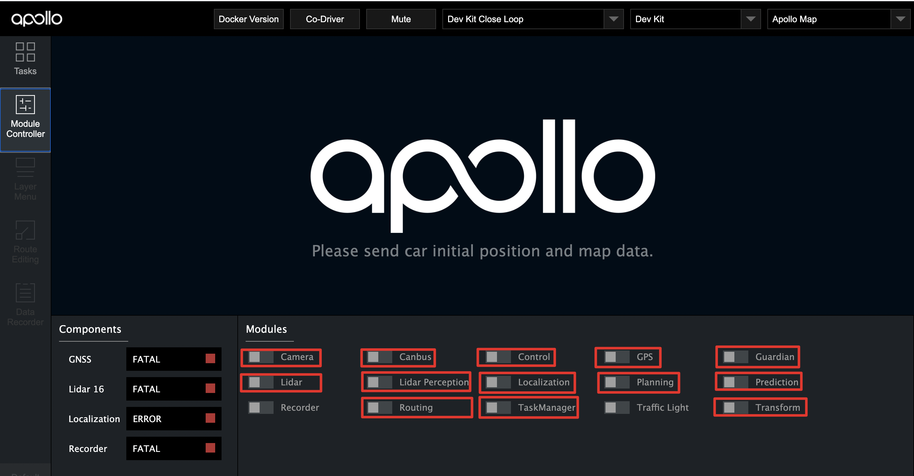
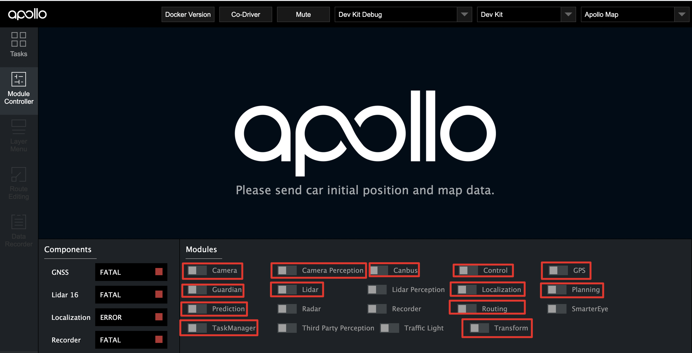
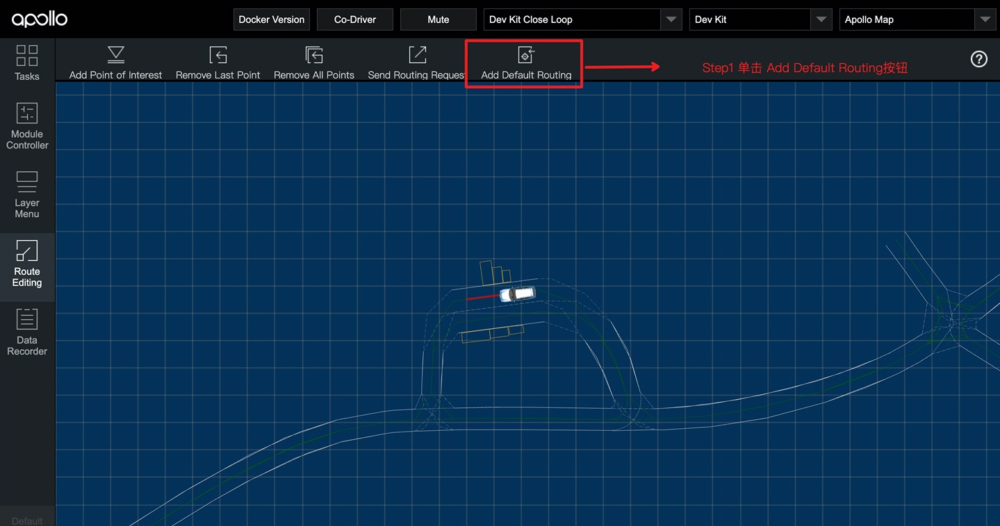
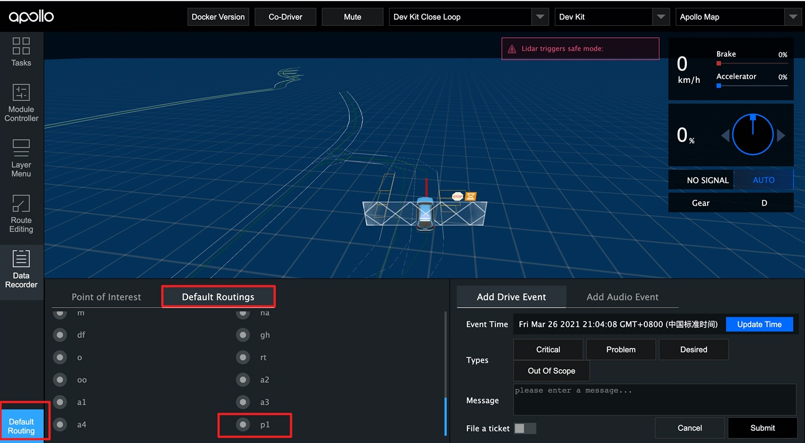
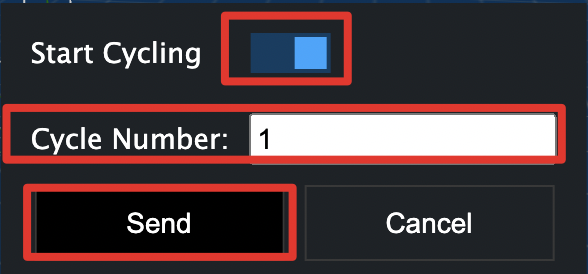

# 如何使用loop_routing实现封闭环形区域的循环自动驾驶
## loop_routing概览
通过loop_routing，用户可以在地图上指定一封闭环形路线，自动驾驶车辆可以在该封闭环形路线上持续进行自动驾驶，直到完成用户指定的圈数。

## loop_routing使用前提条件
- 地图中必须能指定一封闭环形区域
- 正确完成了 [基于激光雷达的封闭园区自动驾驶搭建--自动驾驶演示](../Lidar_Based_Auto_Driving/start_auto_driving_cn.md)或[基于摄像头的封闭园区自动驾驶搭建--自动驾驶演示](../Camera_Based_Auto_Driving/start_auto_driving_cn.md)  

## loop_routing使用方法

#### 1. 启动所需模块
- 参照[基于激光雷达的封闭园区自动驾驶搭建--自动驾驶演示](../Lidar_Based_Auto_Driving/start_auto_driving_cn.md)或[基于摄像头的封闭园区自动驾驶搭建--自动驾驶演示](../Camera_Based_Auto_Driving/start_auto_driving_cn.md)，正确启动所需模块。

- 启动task_manager模块

- 使用lidar感知方案，启动的模块如下图所示

- 使用camera感知方案，启动的模块如下图所示

####  2. 在地图上指定环形路线并保存
- 切换到DreamView的`Route Editing`
- 点击`Add Default Routing`
  
 

- 通过选择单个或多个POI来指定一环形路径
- 注意，最后一个POI距离车的距离应大于10米

- 再次点击`Add Default Routing`，在弹出框中指定名称以保存该路径

  

#### 3. 选择存储的环形路线，并指定循环圈数
- 切换到`Default Routing`，选择上一步中存储的路径，单击该点，在弹出菜单中点击`Start Cycling`，在`Cycle Number`中指定圈数，点击`Send`发送该路线的Routing信息

#### 4. 给车辆自动驾驶权限，并点击`Tasks`下的`Start Auto`，以开始循环Routing  
在附近没有人员和车的情况下，遥控器下放权限并在task标签页中点击start auto使车进入自动驾驶状态，在车自动驾驶这个过程中做好随时用遥控器接管确保安全的准备。

