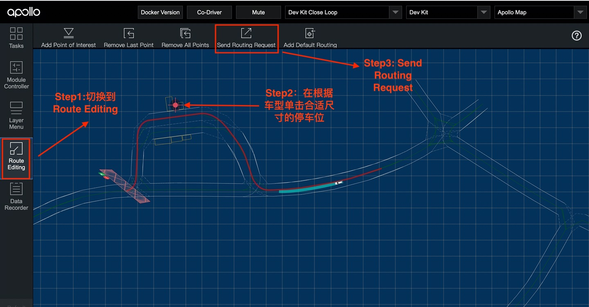

# 如何使用open_space_planner实现自主泊车

## 概览
该用户手册旨在帮助用户通过OpenSpacePlanner实现自主泊车功能

## 前提条件
- 包含停车位信息的地图
- 正确完成了 [基于激光雷达的封闭园区自动驾驶搭建--自动驾驶演示](../Lidar_Based_Auto_Driving/start_auto_driving_cn.md)或[基于摄像头的封闭园区自动驾驶搭建--自动驾驶演示](../Camera_Based_Auto_Driving/start_auto_driving_cn.md)

## 使用方法

#### 1. 启动所需模块
- 参照[基于激光雷达的封闭园区自动驾驶搭建--自动驾驶演示](../Lidar_Based_Auto_Driving/start_auto_driving_cn.md)或[基于摄像头的封闭园区自动驾驶搭建--自动驾驶演示](../Camera_Based_Auto_Driving/start_auto_driving_cn.md)，正确启动所需模块。

- 启动task_manager模块

- 使用lidar感知方案，启动的模块如下图所示

- 使用camera感知方案，启动的模块如下图所示

#### 2.根据车型选择合适尺寸的停车位
- 切换到DreamView的`Route Editing`
- 在DreamView上通过鼠标左键单击选择合适尺寸的的停车位，并点击`Send Routing Request`。成功后，该车位会红色高亮显式，并有红色routing线显式

- 各车型对应的最小停车位尺寸如下（垂直车位），如果尺寸小于该尺寸，则无法触发泊车动作

    |车型 | 长*宽(单位m) |
    |---|---|
    |D-KIT Standard |1.5 * 1  |
    |D-KIT Lite | 2.2*1.2 |
    |D-KIT Advanced | 3.2*1.5 |

- 注意：使用泊车功能时，车辆的起始位置不能离车位太近，否则容易无法规划出路径

#### 3. 给车辆自动驾驶权限，并点击`Tasks`下的`Start Auto`，开始自主泊车
- 在附近没有人员和车的情况下，遥控器下放权限并在task标签页中点击start auto使车进入自动驾驶状态，在车自动驾驶这个过程中做好随时用遥控器接管确保安全的准备。
