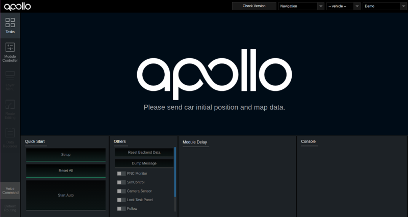
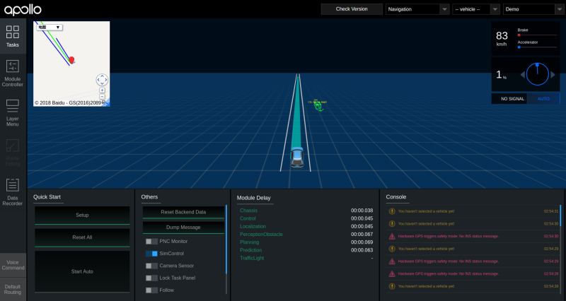

# 运行Apollo3.0

```shell
$ source envset 
$ source ros_set 
$ source /home/tmp/ros/setup.sh 
$ scripts/bootstrap.sh start
```

启动过程中的打印信息

```txt
Start roscore...
Launched module monitor.
Launched module dreamview.
Started supervisord with dev conf
Dreamview is running at http://localhost:8888
```

可以在TX2的浏览器中访问http://localhost:8888访问Dreamview页面  




使用测试数据

```shell
$ rosbag play demo_2.5.bag -l --clock
```

运行起来之后的打印信息

```txt
[ INFO] [1540197376.289937065]: Opening demo_2.5.bag

Waiting 0.2 seconds after advertising topics... done.

Hit space to toggle paused, or 's' to step.
 [RUNNING]  Bag Time: 1523917554.190199   Duration: 18.187073 / 19.995227   
 ```

 回访数据后Dreamview的显示

 