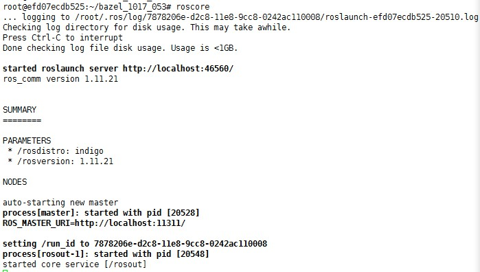

# apollo-platform（ROS）编译

本文针对apollo-platform的源码编译进行描述和问题排除。apollo-platform是apollo的运行环境，基于ros-indigo开发，是一款专门用于机器人相关开发的软件环境。

由于启动Docker容器时已经将ApolloAuto/apollo-platform目录映射到容器的/apollo-platform目录，所以进入容器后开始编译ROS

> *编译之前先将[FindPCL.cmake](../patchs/FindPCL.cmake)文件拷贝到apollo-platform/ros/cmake_modules/cmake/Modules目录下*

## 安装依赖库

```shell
apt-get install libgstreamer0.10-dev libgtest-dev
apt-get install libgstreamer-plugins-base0.10-dev
apt-get install ligogg-dev libtheora-dev
apt-get install python-empy python-nose
```

## PCL编译安装

ros依赖PCL，需要重新编译PCL的aarch64版本。[下载PCL源码](https://github.com/PointCloudLibrary/pcl)

```shell
mkdir build
cd build
cmake ../ #如果编译release版本：cmake -DCMAKE_BUILD_TYPE=Release ../
make && make install
```

> *编译之前请确认安装依赖的库文件，比如libgtest-dev、libboost-all-dev、eigen、flann、HDF5、libvtk5-qt4-dev、liblog4cxx10-dev、libogg-dev、libtheora-dev、liblua5.1-0-dev、liblua50-dev、liblualib50-dev、liblivemedia-dev、libmad0-dev、libfaad-dev、liba52-dev、libflac-dev、libmpeg2-4-dev等。*

编译完成后在如下目录的CMakefiles.txt文件中添加include path (vision_opencv/cv_bridge/include)：
- image_transport_plugin/compressed_depth_image_transport
- image_transport_pligin/image_transport_plugin

## 编译ROS

```shell
sudo ln -s -f /bin/true /usr/bin/chfn 
cd /apollo-platform/ros/
./build.sh build
```

开始构建会打印出如下的列表

```txt
Base path: /apollo-platform/ros
Source space: /apollo-platform/ros
Build space: /apollo-platform/ros/build_isolated
Devel space: /apollo-platform/ros/devel_isolated
Install space: /apollo-platform/ros/install/ros_aarch64
Additional CMake Arguments: -DCMAKE_BUILD_TYPE=Release -DFASTRTPS_PATH=/apollo-platform/ros/third_party/fast-rtps --no-warn-unused-cli
Additional make Arguments: -j1
~~~~~~~~~~~~~~~~~~~~~~~~~~~~~~~~~~~~~~~~~~~~~~~~~
~~  traversing 115 packages in topological order:
~~  - catkin
~~  - genmsg
~~  - gencpp
~~  - genlisp
~~  - genpy
~~  - angles
~~  - audio_common
~~  - bond_core
~~  - cmake_modules
~~  - class_loader
~~  - common_msgs
~~  - cpp_common
~~  - geometry
~~  - image_common
~~  - image_transport_plugins
~~  - message_generation
~~  - audio_common_msgs
~~  - message_runtime
~~  - mk
~~  - nodelet_core
~~  - opencv_tests
~~  - orocos_kdl (plain cmake)
~~  - perception_pcl
~~  - python_orocos_kdl (plain cmake)
~~  - ros
~~  - ros_comm
~~  - ros_tutorials
~~  - rosbash
~~  - rosboost_cfg
~~  - rosbuild
~~  - rosclean
~~  - roscpp_traits
~~  - roscreate
~~  - rosgraph
~~  - roslang
~~  - roslisp
~~  - rosmake
~~  - rosmaster
~~  - rosmsg
~~  - rospack
~~  - roslib
~~  - rosparam
~~  - rospbconvertor
~~  - rospy
~~  - rosservice
~~  - rostime
~~  - roscpp_serialization
~~  - roslaunch
~~  - rosunit
~~  - rosconsole
~~  - pluginlib
~~  - roslz4
~~  - rosbag_storage
~~  - rostest
~~  - smclib
~~  - std_msgs
~~  - actionlib_msgs
~~  - bond
~~  - diagnostic_msgs
~~  - geometry_msgs
~~  - eigen_conversions
~~  - kdl_conversions
~~  - nav_msgs
~~  - rosgraph_msgs
~~  - sensor_msgs
~~  - image_geometry
~~  - pcl_msgs
~~  - shape_msgs
~~  - std_srvs
~~  - stereo_msgs
~~  - tf2_msgs
~~  - tf2
~~  - trajectory_msgs
~~  - vision_opencv
~~  - visualization_msgs
~~  - xmlrpcpp
~~  - roscpp
~~  - audio_capture
~~  - audio_play
~~  - bondcpp
~~  - bondpy
~~  - camera_calibration_parsers
~~  - nodelet
~~  - pb_msgs
~~  - pb_msgs_example
~~  - pcl_conversions
~~  - roscpp_tutorials
~~  - rosout
~~  - cv_bridge
~~  - dynamic_reconfigure
~~  - message_filters
~~  - image_transport
~~  - camera_info_manager
~~  - polled_camera
~~  - rosnode
~~  - rospy_tutorials
~~  - rostopic
~~  - roswtf
~~  - tf2_py
~~  - topic_tools
~~  - rosbag
~~  - actionlib
~~  - compressed_depth_image_transport
~~  - compressed_image_transport
~~  - nodelet_topic_tools
~~  - sound_play
~~  - tf2_ros
~~  - tf
~~  - pcl_ros
~~  - tf2_geometry_msgs
~~  - tf2_kdl
~~  - tf2_sensor_msgs
~~  - pointcloud_to_laserscan
~~  - tf_conversions
~~  - theora_image_transport
~~~~~~~~~~~~~~~~~~~~~~~~~~~~~~~~~~~~~~~~~~~~~~~~~
The packages or cmake arguments have changed, forcing cmake invocation
```

总共有115个模块需要构建！   

编译过程中如果出现以下报错信息

- 找不到GLIBCXX_3.4.21

```txt
Linking CXX executable /apollo-platform/ros/devel_isolated/roscpp/lib/roscpp/listener
/apollo-platform/ros/third_party/fast-rtps/lib/libfastrtps.so: undefined reference to `VTT for std::__cxx11::basic_stringstream<char, std::char_traits<char>, std::allocator<char> >@GLIBCXX_3.4.21'
......中间的打印省略
/apollo-platform/ros/third_party/fast-rtps/lib/libfastrtps.so: undefined reference to `std::__cxx11::basic_string<char, std::char_traits<char>, std::allocator<char> >::compare(unsigned long, unsigned long, std::__cxx11::basic_string<char, std::char_traits<char>, std::allocator<char> > const&) const@GLIBCXX_3.4.21'
collect2: error: ld returned 1 exit status
make[2]: *** [/apollo-platform/ros/devel_isolated/roscpp/lib/roscpp/listener] Error 1
make[1]: *** [CMakeFiles/listener.dir/all] Error 2
make: *** [all] Error 2
<== Failed to process package 'roscpp': 
```

根据提示查看libroscpp.so的依赖

```shell
ldd /apollo-platform/ros/devel_isolated/roscpp/lib/libroscpp.so
```
会出现这样的提示

```txt
/apollo-platform/ros/devel_isolated/roscpp/lib/libroscpp.so: /usr/lib/aarch64-linux-gnu/libstdc++.so.6: version `GLIBCXX_3.4.20' not found (required by /apollo-platform/ros/third_party/fast-rtps/lib/libfastrtps.so.1)
/apollo-platform/ros/devel_isolated/roscpp/lib/libroscpp.so: /usr/lib/aarch64-linux-gnu/libstdc++.so.6: version `CXXABI_1.3.8' not found (required by /apollo-platform/ros/third_party/fast-rtps/lib/libfastrtps.so.1)
/apollo-platform/ros/devel_isolated/roscpp/lib/libroscpp.so: /usr/lib/aarch64-linux-gnu/libstdc++.so.6: version `GLIBCXX_3.4.21' not found (required by /apollo-platform/ros/third_party/fast-rtps/lib/libfastrtps.so.1)
/apollo-platform/ros/devel_isolated/roscpp/lib/libroscpp.so: /usr/lib/aarch64-linux-gnu/libstdc++.so.6: version `GLIBCXX_3.4.21' not found (required by /apollo-platform/ros/third_party/fast-rtps/lib/libfastcdr.so.1)
```

此时可以从Ubuntu16.04系统中拷贝/usr/lib/aarch64-linux-gnu/libstdc++.so.6.0.21文件到Docker容器中/usr/lib/aarch64-linux-gnu/目录下，然后执行：
```shell
$ sudo mv /usr/lib/aarch64-linux-gnu/libstdc++.so.6 /usr/lib/aarch64-linux-gnu/libstdc++.so.6.backup
$ sudo ln -s /usr/lib/aarch64-linux-gnu/libstdc++.so.6.0.21 /usr/lib/aarch64-linux-gnu/libstdc++.so.6
```

> *当不确定动态库所在路径时，可以先执行updatedb命令，再执行locate libstdc++.so.6命令来定位*

- 找不到console_bridge

```txt
CMake Error at CMakeLists.txt:11 (find_package)By not providing "Findconsole_bridge.cmake" in CMAKE_MODULE_PATH this  project has asked CMake to find a package configuration file provided by "console_bridge", but CMake did not find one.Could not find a package configuration file provided by "console_bridge"
```

此时可以从源码编译console_bridge

```shell
sudo apt-get install python-catkin-pkg
mkdir cb_ws
cd cb_ws
wget https://github.com/ros/console_bridge/archive/0.4.0.tar.gz
tar -xzf 0.4.0.tar.gz
cd console_bridge-0.4.0/
cmake ./
make
make install
```

- 找不到Boost库

可以从源码编译Boost库安装

```shell
wget http://sourceforge.net/projects/boost/files/boost/1.53.0/boost_1_53_0.tar.bz2
tar -xjf boost_1_53_0.tar.bz2
cd boost_1_53_0/
./bootstrap.sh
./b2
./b2 install
```

- 找不到PocoFoundation

```shell
wget https://github.com/pocoproject/poco/archive/poco-1.9.0-release.tar.gz
tar xvf poco-1.9.0-release.tar.gz
./configure
make
make install
```

- 找不到PCL

```txt
CMakeFiles/bag_to_pcd.dir/tools/bag_to_pcd.cpp.o: In function `pcl::PCDWriter::write(std::string const&, pcl::PCLPointCloud2 const&, Eigen::Matrix<float, 4, 1, 0, 4, 1
> const&, Eigen::Quaternion<float, 0> const&, bool)':
bag_to_pcd.cpp:(.text._ZN3pcl9PCDWriter5writeERKSsRKNS_14PCLPointCloud2ERKN5Eigen6MatrixIfLi4ELi1ELi0ELi4ELi1EEERKNS6_10QuaternionIfLi0EEEb[_ZN3pcl9PCDWriter5writeERKS
sRKNS_14PCLPointCloud2ERKN5Eigen6MatrixIfLi4ELi1ELi0ELi4ELi1EEERKNS6_10QuaternionIfLi0EEEb]+0xc): undefined reference to `pcl::PCDWriter::writeASCII(std::string const&
, pcl::PCLPointCloud2 const&, Eigen::Matrix<float, 4, 1, 0, 4, 1> const&, Eigen::Quaternion<float, 0> const&, int)'
bag_to_pcd.cpp:(.text._ZN3pcl9PCDWriter5writeERKSsRKNS_14PCLPointCloud2ERKN5Eigen6MatrixIfLi4ELi1ELi0ELi4ELi1EEERKNS6_10QuaternionIfLi0EEEb[_ZN3pcl9PCDWriter5writeERKS
sRKNS_14PCLPointCloud2ERKN5Eigen6MatrixIfLi4ELi1ELi0ELi4ELi1EEERKNS6_10QuaternionIfLi0EEEb]+0x10): undefined reference to `pcl::PCDWriter::writeBinary(std::string cons
t&, pcl::PCLPointCloud2 const&, Eigen::Matrix<float, 4, 1, 0, 4, 1> const&, Eigen::Quaternion<float, 0> const&)'
CMakeFiles/bag_to_pcd.dir/tools/bag_to_pcd.cpp.o: In function `main':
bag_to_pcd.cpp:(.text.startup+0xf1c): undefined reference to `pcl::PCDWriter::writeBinary(std::string const&, pcl::PCLPointCloud2 const&, Eigen::Matrix<float, 4, 1, 0,
 4, 1> const&, Eigen::Quaternion<float, 0> const&)'
collect2: error: ld returned 1 exit status
make[2]: *** [/apollo/apollo-platform/ros/devel_isolated/pcl_ros/lib/pcl_ros/bag_to_pcd] Error 1
make[1]: *** [CMakeFiles/bag_to_pcd.dir/all] Error 2
make: *** [all] Error 2
<== Failed to process package 'pcl_ros': 
  Command '['/apollo/apollo-platform/ros/install/ros_aarch64/env.sh', 'make', '-j1']' returned non-zero exit status 2

Reproduce this error by running:
==> cd /apollo/apollo-platform/ros/build_isolated/pcl_ros && /apollo/apollo-platform/ros/install/ros_aarch64/env.sh make -j1

Command failed, exiting.
============================
[ERROR] Build ros failed!
============================
```

请确认pcl-1.7.2已经正确安装，且apollo-platform/ros/cmake_modules/cmake/Modules/FindPCL.cmake文件存在。  

- 软链接死循环

```txt
System check passed. Build continue ...
[WARNING] ESD CAN library supplied by ESD Electronics does not exist. If you need ESD CAN, please refer to third_party/can_card_library/esd_can/README.md.
[INFO] Start building, please wait ...
INFO: Reading 'startup' options from /apollo/tools/bazel.rc: --batch_cpu_scheduling
Extracting Bazel installation...
.............................................
____Loading package: modules/map/relative_map/proto
____Loading package: modules/prediction
____Loading package: modules/drivers/gnss
____Loading package: modules/third_party_perception/integration_tests
____Loading package: modules/control/integration_tests
____Loading package: modules/localization/msf/local_map/lossless_map
____Loading package: modules/dreamview/conf
____Loading package: modules/localization/msf/local_tool/data_extraction
____Loading package: modules/localization/msf/local_integ
____Loading package: modules/perception/traffic_light/recognizer
____Loading package: modules/planning/integration_tests
____Loading package: modules/routing/topo_creator
____Loading package: modules/prediction/proto
____Loading package: modules/planning/tasks/speed_decider
____Loading package: modules/data/util
____Loading package: modules/monitor/hardware
____Loading package: modules/monitor/hardware/can/socketcan
____Loading package: modules/data/tools
____Loading package: modules/planning/common/path
____Loading package: modules/perception/obstacle/lidar/visualizer/opengl_visualizer
____Loading package: modules/planning/tasks/dp_st_speed
____Loading package: modules/common/proto
____Loading package: modules/localization/msf/common/test
____Loading package: modules/perception/traffic_light/preprocessor
____Loading package: modules/perception/tool/offline_visualizer_tool/conf
____Loading package: modules/monitor/hardware/can/esdcan
____Loading package: modules/canbus
____Loading package: modules/perception/obstacle/fusion/async_fusion
____Loading package: modules/perception/obstacle/camera/tracker
____Loading package: modules/planning/tools
____Loading package: modules/canbus/tools
____Loading package: modules/localization/msf/local_tool/local_visualization/offline_visual
____Loading package: modules/drivers/lidar_velodyne
____Loading package: modules/perception/obstacle/lidar/tracker/hm_tracker
____Loading package: modules/perception/obstacle/camera/common
____Loading package: modules/perception/obstacle/camera/tracker/cs2d
____Loading package: modules/monitor/software
____Loading package: modules/drivers/canbus/can_client
____Loading package: modules/planning/constraint_checker
____Loading package: modules/common/math
____Loading package: modules/drivers/pandora
____Loading package: modules/common/transform_listener
____Loading package: modules/perception/obstacle/camera/detector/yolo_camera_detector/proto
____Loading package: modules/common/status
____Loading package: modules/canbus/vehicle/lincoln
____Loading package: modules/localization
____Loading package: modules/common/data
____Loading package: modules/common/math/qp_solver
____Loading package: modules/drivers/radar/ultrasonic_radar/proto
____Loading package: modules/drivers/radar/racobit_radar/protocol
____Loading package: modules/prediction/network
____Loading package: modules/dreamview/backend/testdata
____Loading package: modules/dreamview/backend/map
____Loading package: modules/perception/obstacle/camera/visualizer/common
____Loading package: modules/map/hdmap/adapter
ERROR: infinite symlink expansion detected
[start of symlink chain]
/apollo/apollo-platform/ros/third_party/fast-rtps_aarch64/fast-rtps_aarch64
/apollo/apollo-platform/ros/third_party/fast-rtps_aarch64
[end of symlink chain]
.
WARNING: Failed to get information about path, for apollo-platform/ros/third_party/fast-rtps_aarch64/fast-rtps_aarch64, skipping: Infinite symlink expansion.
ERROR: Infinite symlink expansion.
============================
[ERROR] Build failed!
[INFO] Took 30 seconds
============================
```

请检查apollo-platform/ros/third_party/fast-rtps_aarch64目录下是否存在指向自身的软链接，存在的话就删除这个软链接。  

- 找不到vtk库

```txt
ERROR: /apollo/modules/calibration/lidar_ex_checker/BUILD:23:1: Linking of rule '//modules/calibration/lidar_ex_checker:lidar_ex_checker' failed (Exit 1).
/usr/bin/ld: cannot find -lvtkCommon
/usr/bin/ld: cannot find -lvtkCommon
```

请先检查libvtk5-dev是否安装，然后查看/usr/lib目录下vtk相关的软链接是否正确。  

- 无法访问github

```txt
ERROR: /apollo/modules/tools/manual_traffic_light/BUILD:21:1: no such package '@google_styleguide//': Error cloning repository: https://github.com/google/styleguide.gi
t: cannot open git-upload-pack caused by https://github.com/google/styleguide.git: cannot open git-upload-pack caused by github.com and referenced by '//modules/tools/
manual_traffic_light:manual_traffic_light_cpplint'.
ERROR: Analysis of target '//modules/tools/manual_traffic_light:manual_traffic_light_cpplint' failed; build aborted.
```

请检查网络是否能访问github。  

- /usr/local/cuda不存在

```txt
ERROR: /apollo/modules/perception/cuda_util/BUILD:35:1: no such package '@cuda//': Expected directory at /usr/local/cuda but it does not exist. and referenced by '//mo
dules/perception/cuda_util:cuda_util'.
ERROR: Analysis of target '//modules/perception/cuda_util:cuda_util' failed; build aborted.
```

请检查CUDA是否正确安装（参考Docker环境准备的文档中CUDA安装）。  

- 找不到protobuf-3.3.0.tar.gz

```txt
ERROR: /apollo/modules/third_party_perception/proto/BUILD:10:1: every rule of type proto_library implicitly depends upon the target '@com_google_protobuf//:protoc', bu
t this target could not be found because of: no such package '@com_google_protobuf//': Error downloading [file:/home/tmp/protobuf-3.3.0.tar.gz] to /root/.cache/bazel/_
bazel_root/540135163923dd7d5820f3ee4b306b32/external/com_google_protobuf/protobuf-3.3.0.tar.gz: /home/tmp/protobuf-3.3.0.tar.gz (No such file or directory).
ERROR: Analysis of target '//modules/third_party_perception:third_party_perception_lib' failed; build aborted.
```

请检查/homt/tmp目录下是否存在protobuf-3.3.0.tar.gz文件（确保Docker环境准备文档中下载的组件源码都存放在/homt/tmp目录下）。  

- 找不到catkin_pkg

```shell
sudo apt-get install python-catkin-pkg
```

- empy.cmake第29行报错

```shell
sudo apt-get install python-empy
```

重新执行build脚本！  

编译完成的提示如下：
```txt
......省略之前的打印输出
<== Finished processing package [115 of 115]: 'theora_image_transport'
============================
[ OK ] Build ros succeed!
============================
```

此时将生成的库拷贝到以下目录中

```shell
sudo mkdir -p /home/tmp/ros
sudo cp -R install/ros_aarch64/ /home/tmp/ros
```

至此，安装完毕，使用`roscore`命令检查安装是否成功；安装成功现象：



如果执行`roscore`报错

```txt
(most recent call last):File "/opt/ros/bin/roscore", line 36, in <module>from rosmaster.master_api import NUM_WORKERS
```

重新执行

```shell
cd third_party
sudo ./build.sh build
cd swig_wrapper
bash build.sh
cd /apollo-platform/ros/
./build.sh build
cp -R install/ros_aarch64/ /home/tmp/ros
```