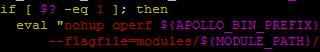
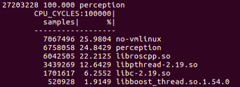
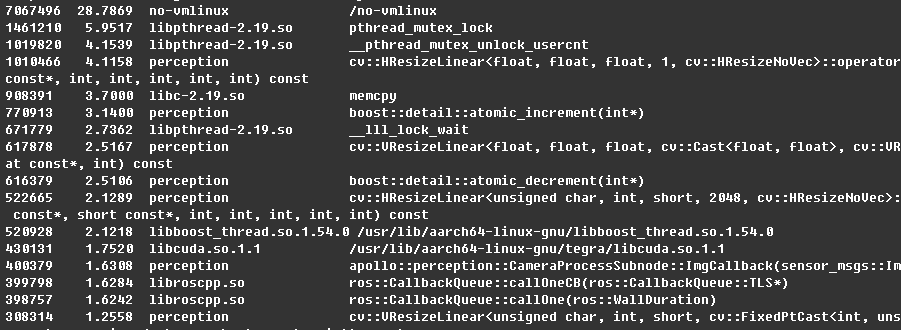

oprofile is a performance monitoring tool that runs on linux system. Generally, oprofile has been included in linux system modules, but oprofile module is not supported on ARM, so we have to install it manually.

oprofile supports multi-thread program. It records the number of function calls, and can also output the source code to show results user-friendly. So it fits well to performance monitoring on TX2.


Notes: oprofile has been installed in image `dev_aarch64_20190102_1200` and late, so it doesn’t need to install oprofile in Docker environment anymore.

#### Download
Download the newest version of oprofile
```bash
$ wget http://prdownloads.sourceforge.net/oprofile/oprofile-1.3.0.tar.gz
$ tar zxvf oprofile-1.3.0.tar.gz
$ cd oprofile-1.3.0
```
#### Installation 
```bash
$ sudo apt-get install libpopt-dev libiberty-dev binutils-dev
$ ./configure
$ make -j4
$ sudo make install
```
#### Test
After installation，perform command `operf` to see if it could get CPU information normally. If it fails and the output is like this:

`unable to open /sys/devices/system/cpu/cpu0/online`

This is because TX2 only launches 4 CPU cores by default. The other two CPU cores are closed.
Use below command to open the other two CPU cores:
```bash
$ sudo nvpmodel -m 0
```

#### How to use
oprofile provides variety of commands, the commands `operf`, `opreport` and `opannotate` are used more often.
Take testing perception as an example.

* 1.modify `script/apollo_bash.sh`, add command `operf` behind keyword `nuhup` in line 239. As shown below：



* 2.use script like `./script/perception.sh` to launch perception program

And now, operf is collecting data of perception program. Stopping perception program in any approach can stop the collecting process.

#### Output
After stopping perception program, a directory named oprofile_data is generated in current directory.
Use command `opreport` to show the total statistics:
```bash
$ opreport
```
As shown below:



Use command `opreport` to show the statistics of each function:
```bash
$ opreport -l bazel-bin/modules/perception/perception 
```
Because there is too much information to show, so it’s better to save the output into a file.
```bash
$ opreport -l bazel-bin/modules/perception/perception > perception_op_funcs.md
```
As shown below:



Use command `opannotate` to show the statistics with source code:
```bash
$ opannotate -s bazel-bin/modules/perception/perception > perception_op_details.md
```

Notice:
It only supports one operf program to be running at any time, so when operf program is running, we could launch another program with `operf`.


oprofile official website:
[http://oprofile.sourceforge.net/news/](http://oprofile.sourceforge.net/news/)

oprofile user manual:
[http://oprofile.sourceforge.net/doc/index.html](http://oprofile.sourceforge.net/doc/index.html)

