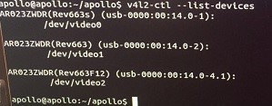

# Camera调试

在Camera安装并通过USB接口和TX2连接后，需要通过一定的设置才能识别成功。首先检查在/dev文件夹下是否生成`video*`设备文件，该文件为Ubuntu加载的摄像头设备文件。执行指令`v4l2-ctl --list-devices`查看所有摄像头设备的信息。TX2默认自带了一个摄像头，并标记为`video0`。

 

上图中展示的摄像头信息是Apollo官方推荐的摄像头型号，如果使用了非官方推荐的摄像头，输出的信息会不同。

## 修改Camera相关代码

因为Apollo3.0依赖libadv_trigger_ctl库，而这个库主要是为了百度自研的Hercules或者Dragonfly FPGA卡上的触发功能的；Nvidia Jetson TX2开发板上没有这个FPGA卡，所以不需要这个触发功能，也就不需要依赖这个库，这就需要将所有涉及这个库的引用及函数调用删掉。  
主要涉及两个文件：
- modules/drivers/usb_cam/CMakeLists.txt  
    删除对如下库的引用  
    + libadv_trigger_ctl.a
    + libjsoncpp.so
    + libadv_plat_common.a
- modules/drivers/usb_cam/src/usb_cam.cpp  
    删除对如下函数的调用  
    + adv_trigger_enable
    + adv_trigger_disable


## 安装luvcview

```shell
sudo apt-get install luvcview
sudo luvcview -d /dev/video1 -L
```

> *执行luvcview时如果出现如下错误提示*

```txt
luvcview 0.2.6

Couldn't initialize SDL: Unable to open mouse
```

> *此时需要在终端上导出一个环境变量*

```shell
export SDL_NOMOUSE=1
```

查询到的结果如下

```txt
luvcview 0.2.6

SDL information:
  Video driver: fbcon
  Hardware surfaces are available (73728k video memory)
Device information:
  Device path:  /dev/video1
{ pixelformat = 'YUYV', description = 'YUYV 4:2:2' }
{ discrete: width = 640, height = 480 }
        Time interval between frame: 1/30, 1/25, 1/20, 1/15, 1/10, 1/5, 
......此处省略
```

> *可以查看到摄像头支持的图像格式和分辨率；目前Apollo3.0支持的图像格式有：YUYV、UYVY、MJGP*  

## 修改配置文件

需要修改的配置有两处：  
- /home/tmp/ros/share/usb_cam/launch/
- /apollo/modules/drivers/usb_cam/launch/

找到.launch文件中video_device节点，修改成当前接入的USB摄像头设备文件路径，如下所示：

```txt
<param name="video_device" value="/dev/video1" />
```

> *此处使用的外接摄像头是/dev/video1；如果接入了多个摄像头，设备文件路径根据实际使用的摄像头填写*


## 编译USB Camera模块

```shell
sudo ./apollo.sh build_usbcam
```

编译过程中输出

```txt
System check passed. Build continue ...
[WARNING] ESD CAN library supplied by ESD Electronics does not exist. If you need ESD CAN, please refer to third_party/can_card_library/esd_can/README.md.
Base path: /apollo/modules
Source space: /apollo/modules/drivers/usb_cam
Build space: /apollo/modules/build_isolated
Devel space: /apollo/modules/devel_isolated
Install space: /home/tmp/ros
Additional CMake Arguments: -DCMAKE_BUILD_TYPE=Release --no-warn-unused-cli
~~~~~~~~~~~~~~~~~~~~~~~~~~~~~~~~~~~~~~~~~~~~~~~
~~  traversing 1 packages in topological order:
~~  - usb_cam
~~~~~~~~~~~~~~~~~~~~~~~~~~~~~~~~~~~~~~~~~~~~~~~
The packages or cmake arguments have changed, forcing cmake invocation

......中间打印输出省略
-- Installing: /home/tmp/ros/share/usb_cam/nodelets.xml
-- Installing: /home/tmp/ros/include/usb_cam
-- Installing: /home/tmp/ros/include/usb_cam/usb_cam.h
<== Finished processing package [1 of 1]: 'usb_cam'
/apollo
```

> *如果编译过程报gtest的错误，可以修改/home/tmp/ros/share/usb_cam/test/gtest.cmake文件，讲其中涉及get_filename_component的地方注视掉即可*

## 安装设备

```shell
cd /apollo
sudo docker/setup_host/setup_host.sh
sudo service udev restart
```

上述指令执行完毕后，在`/dev`文件夹下会生成`camera`文件夹，`camera`文件夹下包含了三个软链接文件`lanemark`、`obstacle`和`trafficlights`，分别指向`video*`设备文件。
 
创建这三个链接文件的规则为`/apollo/docker/setup_host/etc/udev/rules.d/99-webcam.rules
`该文件中配置了摄像头设备的信息，摄像头型号不同，rules文件中配置的信息也会不同。所以如果使用了非Apollo官方推荐的摄像头，则可以通过如下指令查询摄像头设备的信息：
```shell
udevadm info -a -p $(udevadm info -q path -n /dev/video0
```
根据上述指令的输出对应的修改rules文件即可。

## 测试USB Camera模块

> *首先需要通过bootstrap.sh脚本启动apollo*

```shell
roslaunch usb_cam start_obstacle_camera.launch
```

模块输出的日志信息如下：  

```txt
Checking log directory for disk usage. This may take awhile.
Press Ctrl-C to interrupt
Done checking log file disk usage. Usage is <1GB.

started roslaunch server http://localhost:45188/

SUMMARY
========

PARAMETERS
 * /camera_obstacle/sensor_camera_obstacle/camera_frame_id: usb_cam
 * /camera_obstacle/sensor_camera_obstacle/camera_info_url: file:///home/tmp/...
 * /camera_obstacle/sensor_camera_obstacle/camera_timeout: 2000
 * /camera_obstacle/sensor_camera_obstacle/error_code: 14
 * /camera_obstacle/sensor_camera_obstacle/frame_rate: 30
 * /camera_obstacle/sensor_camera_obstacle/image_height: 1080
 * /camera_obstacle/sensor_camera_obstacle/image_width: 1920
 * /camera_obstacle/sensor_camera_obstacle/io_method: mmap
 * /camera_obstacle/sensor_camera_obstacle/pixel_format: yuyv
 * /camera_obstacle/sensor_camera_obstacle/video_device: /dev/video1
 * /rosdistro: indigo
 * /rosversion: 1.11.21

NODES
  /camera_obstacle/
    camera_nodelet_manager (nodelet/nodelet)
    sensor_camera_obstacle (nodelet/nodelet)

auto-starting new master
process[master]: started with pid [1167]
ROS_MASTER_URI=http://localhost:11311

setting /run_id to 11460c1c-d8c7-11e8-a5d2-00044bc4fad1
process[rosout-1]: started with pid [1199]
started core service [/rosout]
process[camera_obstacle/camera_nodelet_manager-2]: started with pid [1213]
process[camera_obstacle/sensor_camera_obstacle-3]: started with pid [1214]
[ WARN] [1540521016.756710096]: parse transport_mode file error:yaml-cpp: error at line 0, column 0: bad file
[ WARN] [1540521016.756905283]: Parse transport_mode file failed
[ INFO] [1540521017.865510755]: Loading nodelet /camera_obstacle/sensor_camera_obstacle of type usb_cam/UsbCamNodelet to manager camera_nodelet_manager with the following remappings:
[ INFO] [1540521017.865830350]: /apollo/sensor/camera/traffic/camera_info -> /apollo/sensor/camera/obstacle/front_6mm/camera_info
[ INFO] [1540521017.865955143]: /camera_obstacle/image_raw0 -> /apollo/sensor/camera/obstacle/front_6mm
```

此时可以在浏览器中访问Dreamview，打开**Tasks->Others->Camera Sensor**和**Module Controller->Modules->Camera**，左侧`Hardware`项目栏中`CameraL`和`CameraS`状态变为OK，表示启动成功，然后在Dreamview的左上角会展现出摄像头采集的图像数据。  


> *如果启动过程中报错*
```txt
Traceback (most recent call last):
  File "/usr/local/lib/python2.7/dist-packages/roslaunch/__init__.py", line 307, in main
    p.start()
  File "/usr/local/lib/python2.7/dist-packages/roslaunch/parent.py", line 268, in start
    self._start_infrastructure()
  File "/usr/local/lib/python2.7/dist-packages/roslaunch/parent.py", line 217, in _start_infrastructure
    self._load_config()
  File "/usr/local/lib/python2.7/dist-packages/roslaunch/parent.py", line 132, in _load_config
    roslaunch_strs=self.roslaunch_strs, verbose=self.verbose)
  File "/usr/local/lib/python2.7/dist-packages/roslaunch/config.py", line 471, in load_config_default
    config.assign_machines()
  File "/usr/local/lib/python2.7/dist-packages/roslaunch/config.py", line 222, in assign_machines
    if [m for m in machine_unify_dict.values() if not is_machine_local(m)]:
  File "/usr/local/lib/python2.7/dist-packages/roslaunch/core.py", line 97, in is_machine_local
    local_addresses = ['localhost'] + rosgraph.network.get_local_addresses()
  File "/usr/local/lib/python2.7/dist-packages/rosgraph/network.py", line 218, in get_local_addresses
    import netifaces
ImportError: No module named netifaces
```

在Shell中执行安装netifaces模块的命令

```shell
pip install netifaces
```
