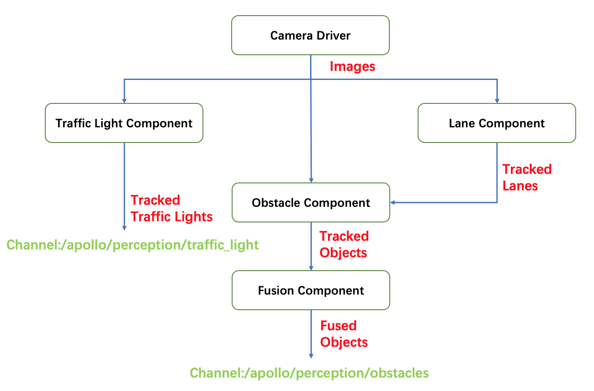

# How to add a new camera detector algorithm

The processing flow of camera perception module is shown below:
    

The 3 detector algorithms introduced by this document were traffic_light_detector, land_detector, obstacle_detector. These 3 detectors are located in their own component. The architecture of each component is showed below:

Traffic Light:
    

Lane:
    

Obstacle:
    


As we can see clearly from above structure, each component has its own abstract class member `base_XXX_detector`. Different derived detector algorithms inherit `base_XXX_detector` and implement their main flows to complete the deployment. Next, we will take `base_obstacle_detector` as an example to introduce how to add a new camera detector algorithm. You could also refer to this document if you want to add traffic light detector or lane detector.


Apollo has provided three camera detector algorithms in Obstacle Detection -- Smoke，Yolo, YoloV4. All of them could be easily changed or replaced by other algorithms. The input of algorithm should be preprocessed image data, while the output should be obastacle object data. This document will introduce how to add a new camera detector algorithm, the basic task sequence is listed below：

1. Define a class that inherits `base_obstacle_detector` 
2. Implement the class `NewObstacleDetector`
3. Add param proto file for `NewObstacleDetector`
4. Update config file to put your detector into effect

The steps are elaborated below for better understanding:

## Define a class that inherits `base_obstacle_detector` 

All the camera detector algorithms shall inherit `base_obstacle_detector`，which defines a set of interfaces. Here is an example of the detector implementation:

```c++
namespace apollo {
namespace perception {
namespace camera {

class NewObstacleDetector : public BaseObstacleDetector {
 public:
  NewObstacleDetector();
  virtual ~NewObstacleDetector() = default;

  bool Init(const ObstacleDetectorInitOptions &options =
            ObstacleDetectorInitOptions()) override;

  bool Detect(const ObstacleDetectorOptions &options,
              CameraFrame *frame) override;

  std::string Name() const override;

};  // class NewObstacleDetector

}  // namespace camera
}  // namespace perception
}  // namespace apollo
```

The function signature of `base_obstacle_detector` is pre-defined：

```c++
struct ObstacleDetectorInitOptions : public BaseInitOptions {
  std::shared_ptr<base::BaseCameraModel> base_camera_model = nullptr;
  Eigen::Matrix3f intrinsics;

  EIGEN_MAKE_ALIGNED_OPERATOR_NEW
} EIGEN_ALIGN16;

struct ObstacleDetectorOptions {};

struct CameraFrame {
  // timestamp
  double timestamp = 0.0;
  // frame sequence id
  int frame_id = 0;
  // data provider
  DataProvider *data_provider = nullptr;
  // calibration service
  BaseCalibrationService *calibration_service = nullptr;
  // hdmap struct
  base::HdmapStructPtr hdmap_struct = nullptr;
  // tracker proposed objects
  std::vector<base::ObjectPtr> proposed_objects;
  // segmented objects
  std::vector<base::ObjectPtr> detected_objects;
  // tracked objects
  std::vector<base::ObjectPtr> tracked_objects;
  // feature of all detected object ( num x dim)
  // detect lane mark info
  std::vector<base::LaneLine> lane_objects;
  std::vector<float> pred_vpt;
  std::shared_ptr<base::Blob<float>> track_feature_blob = nullptr;
  std::shared_ptr<base::Blob<float>> lane_detected_blob = nullptr;
  // detected traffic lights
  std::vector<base::TrafficLightPtr> traffic_lights;
  // camera intrinsics
  Eigen::Matrix3f camera_k_matrix = Eigen::Matrix3f::Identity();
  // narrow to obstacle projected_matrix
  Eigen::Matrix3d project_matrix = Eigen::Matrix3d::Identity();
  // camera to world pose
  Eigen::Affine3d camera2world_pose = Eigen::Affine3d::Identity();
  EIGEN_MAKE_ALIGNED_OPERATOR_NEW
} EIGEN_ALIGN16;  // struct CameraFrame
```

## Implement the class `NewObstacleDetector`

To ensure the new detector could function properly, `NewObstacleDetector` should at least override the interface Init(), Detect(), Name() defined in `base_obstacle_detector` Init() is resposible for config loading, class member initialization, etc. And Detect() will implement the basic logic of algorithm. A concrete `NewObstacleDetector.cc` example is shown：

```c++
namespace apollo {
namespace perception {
namespace camera {

bool NewObstacleDetector::Init(const ObstacleDetectorInitOptions &options) {
    /*
    Initialization of your detector
    */
}

bool NewObstacleDetector::Detect(const ObstacleDetectorOptions &options,
                                 CameraFrame *frame) {
    /*
    Implementation of your detector
    */
}

std::string NewObstacleDetector::Name() const {
    /*
    Return your detector's name
    */
}

REGISTER_OBSTACLE_DETECTOR(NewObstacleDetector); //register the new detector

}  // namespace camera
}  // namespace perception
}  // namespace apollo
```


## Add param proto file for `NewObstacleDetector`

Follow the steps below to add parameters for your new camera detector:

1. Create the `proto` file for parameters according to the requirement of the detector. If the parameters are compatible, you can use or just modify current `proto` directly. As an example, you can refer to the `proto` file from `smoke detector` at `modules/perception/camera/lib/obstacle/detector/smoke/proto/smoke.proto`. Remember to include the following content once you finished your definition:

    ```protobuf
    syntax = "proto2";
    package apollo.perception.camera.NewObstacleDetector;

    // Your parameters
    ```

2. Refer to `yolo_obstacle_detector` at `modules/perception/production/data/perception/camera/models/` and create your `newobstacledetector` folder and `*.pt` file：

    ```
    Note：The "*.pt" file should have the format defined in step one
    ```

## Update config file to put your detector into effect

To use your new camera detector algorithm in Apollo， you have to config the following files according to your demand:

1. Refer to the following content to update `modules/perception/production/conf/perception/camera/obstacle.pt`,put your `*.pt` file created in previous step to the load path:

    ```protobuf
    detector_param {
    plugin_param{
        name : "NewObstacleDetector"
        root_dir : "/apollo/modules/perception/production/data/perception/camera/models/newobstacledetector"
        config_file : "*.pt"
    }
    camera_name : "front_12mm"
    }
    ```

2. If you want to modify the structure of `detector_param` shown in step one or just add a new `_param`, your can do that at `modules/perception/camera/app/proto/perception.proto`:

    ```protobuf
    message PluginParam {
    optional string name = 1;
    optional string root_dir = 2;
    optional string config_file = 3;
    }
    message DetectorParam {
    optional PluginParam plugin_param = 1;
    optional string camera_name = 2;
    }
    ```

3. If you create a new `*.pt` instead of using `obstacle.pt` given in step one， you also have to modify `modules/perception/production/conf/perception/camera/fusion_camera_detection_component.pb.txt`. The corresponding `proto` file is `modules/perception/onboard/proto/fusion_camera_detection_component.proto`：

    ```protobuf
    camera_obstacle_perception_conf_dir : "/apollo/modules/perception/production/conf/perception/camera"
    camera_obstacle_perception_conf_file : "NewObstacleDetector.pt"
    ```

Once you finished the above modifications, you new camera detector should take effect in Apollo.
