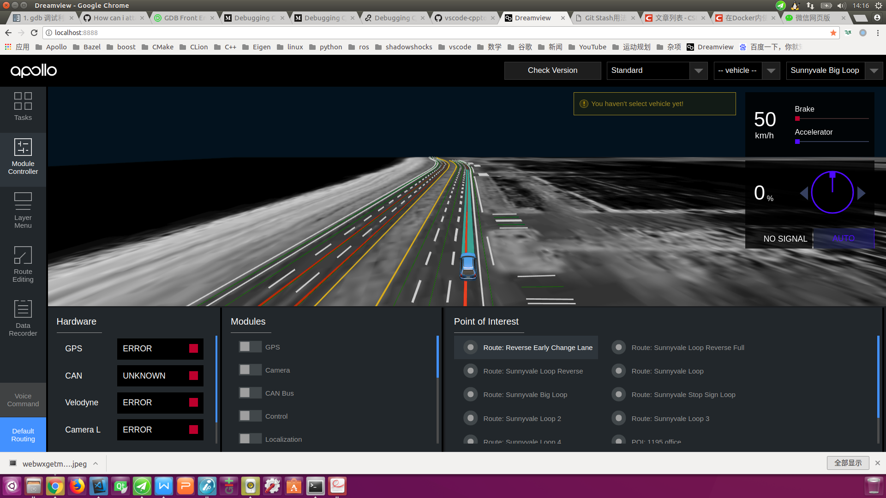

# How to Debug Apollo

## Debugging Apollo

The Apollo project runs in Docker and cannot be used directly on the host
machine. It must be created in Docker with GDBServer. Debug the service process,
and then use GDB to connect to the debug service process in Docker on the host
machine. The specific operation methods are as follows:

### Prerequisites

The main prerequisites contain collecting debugging information and installing
the GDBServer if it is not already present in Docker

#### Collecting debugging information

When compiling Apollo projects, you will need to use debugging information
options **build_dbg**. Optimization options such as **build_opt** or
**build_opt_gpu** cannot be used.

#### Install GDBServer inside Docker

After entering Docker, you can use the following command to view if the
GDBServer is present:

```bash
gdbserver --version
```

If the prompt is similar to the following information:

```bash
GNU gdbserver (Ubuntu 8.1-0ubuntu3.2) 8.1.0.20180409-git
Copyright (C) 2018 Free Software Foundation, Inc.
gdbserver is free software, covered by the GNU General Public License.
This gdbserver was configured as "x86_64-linux-gnu"
```

It means that GDBServer has been installed inside Docker. You should be able to
view the prompt below. But if the GDBServer is not present and if you are
prompted with the following information:

```bash
bash: gdbserver: command not found
```

Then you would need to install the GDBServer using

```bash
sudo apt-get -y update
sudo apt-get install gdbserver
```

#### Start the Dreamview daemon

Go to Docker and start Dreamview. The command is as follows:

```bash
cd ${APOLLO_ROOT_DIR}
# If Docker is not started, start it first, otherwise ignore this step
bash docker/scripts/dev_start.sh
# Enter Docker
bash docker/scripts/dev_into.sh
# Start Dreamview background service
bash scripts/bootstrap.sh
```

#### Start the module that needs to be debugged

Start the module to be debugged, either by using the command line or by using
the Dreamview interface. The following is an example of debugging the
**Planning** module from the Dreamview interface.

- Open URL: <http://localhost:8888/> in Chrome
- On Dreamview, click on the **SimControl** slider, as shown below:


- Click on the `Module Controler` tab on the left toolbar and select the
  `Routing` and `Planning` options as shown below:


- Click the `Default Routing` tab on the left toolbar, select
  `Route: Reverse Early Change Lane` or any of these options, send a
  `Routing Request` request, and generate a global navigation path, as shown
  below:



#### Viewing the "Planning" Process ID

Use the following command to view the "Planning" process ID:

```bash
ps aux | grep mainboard | grep planning
```

The result in the following figure is similar to the previous figure, you can
see that the `Planning` process ID is 4147.


#### Debugging Planning module using GDBServer

Next we need to carry out our key operations, using GDBServer to additionally
debug the `Planning` process, the command is as follows:

```bash
sudo gdbserver :1111 --attach 4147
```

In the command above, ":1111" indicates that the debugging service process with
the port "1111" is enabled, and "4147" indicates the "Planning" process ID. If
the result is as shown below, the operation is successful.


After restarting a terminal and entering Docker, use the following command to
see if the "gdbserver" process is running properly:

```bash
ps aux | grep gdbserver
```


#### Starting GDBServer with a Script File

`docker/scripts/dev_start_gdb_server.sh` can start GDBServer directly on the
host (outside Docker).

Assuming that while debugging the planning module, the port number is 1111, the
usage of `docker/scripts/dev_start_gdb_server.sh` is:

```bash
# Start gdbserver directly on the host machine (outside Docker)
bash docker/scripts/dev_start_gdb_server.sh planning 1111
```

### Possible Errors and their Solutions

During the debugging process, you may encounter the following problems:

#### the network connection is not smooth, can not be debugged

#### Solution

The solution is to ensure the network is smooth, and disable the agent tool

### Remote debugging

During the R&D process, we also need to debug the Apollo project remotely on the
industrial computer inside the vehicle, that is, connect the in-vehicle
industrial computer with the SSH service on the debugging computer, start the
relevant process in the industrial computer, and then perform remote debugging
on the debugging computer. The following is an example of debugging the planning
module:

#### View the IP address of the industrial computer in the car

On the industrial computer in the car, check the IP of the machine by the
following command:

```bash
ifconfig
```

#### Open Dreamview in the browser of the debugging computer and start the module to be debugged

Assuming that the IP address of the industrial computer LAN is: `192.168.3.137`,
open URL: <http://192.168.3.137:8888/> on your machine and start the module (`Planning`) to debug as
shown in [Start the module that needs debugging](#Start-the-module-that-needs-to-be-debugged)
section.


#### Use the SSH Command to Remotely Log In to the Industrial PC and Start the Gdbserver Service of the Industrial PC

Assume that the user name of the industrial computer in the car is `xxxxx`, and
the IP address of the LAN is `192.168.3.137`. Use the following command to
remotely log in to the industrial computer:

```bash
ssh xxxxx@192.168.3.137
```

After successfully entering the IPC, assume that the Planning module needs to be
debugged, and the port number is 1111, use the following command to start the
gdbserver service of the in-vehicle IPC:

```bash
# Switch to the Apollo project root directory on the industrial computer
cd ~/code/apollo
# Start the gdbserver service outside of Docker
bash docker/scripts/dev_start_gdb_server.sh planning 1111
```

As shown in the figure below, if you see a prompt similar to Listening on port
1111, the gdbserver service starts successfully.


