# How to Leverage Scenario Editor

## Introduction

Simulation plays a central role in Apollo’s internal development cycle. Dreamland empowers developers and start-ups to run millions of miles of simulation daily, which dramatically accelerates the development cycle.

So far Apollo simulation allowed external users to access over 200 sample scenarios which includes a diverse range of LogSim scenarios based on real world driving data and WorldSim scenarios that have been manually created by our simulation team. To learn more about Dreamland, refer to [our Dreamland Introduction Guide](https://github.com/ApolloAuto/apollo/blob/master/docs/specs/Dreamland_introduction.md)

Several developers wrote in requesting that our Dreamland platform should support Scenario Creation and Editing which the Apollo team now proudly presents in Apollo 5.0!

```
Please note,
In order to use this feature, please send an email to our BD team at idg-apollo@baidu.com using your company email as it is currently available only for select partners
```

## Setting up Scenario Editor

1. Login to your Dreamland account. For additional details on How to create an account, please refer to [our Dreamland Introduction Guide](https://github.com/ApolloAuto/apollo/blob/master/docs/specs/Dreamland_introduction.md) 

2. Once inside the platform, the Scenario Editor can be accessed under `Scenario Management` or using the [following link](https://azure.apollo.auto/scenario-management/scenario-editor)

    

3. Once inside, you should see the prompt as seen in the image below, requesting you to send us an email from your company's email. As this app is in Beta testing, it is not open to all our developers.

    

4. In 3 business days, you should receive an email confirming your account's approval and activation, after which, your screen should no longer display the prompt and the buttons would no longer be greyed out.

## Using Scenario Editor

Congratulations! You are now ready to use our scenario editor.

1. The first step is to select a map. Currently, we offer 2 maps - Sunnyvale and San Mateo

    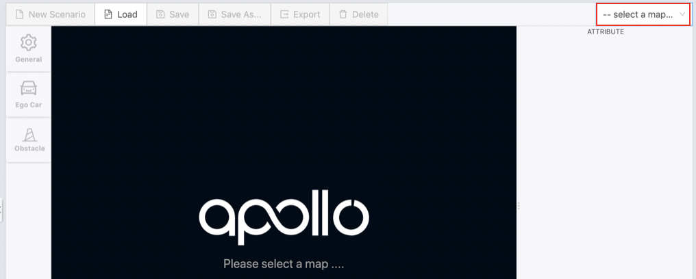

2. Once a map has been selected, you will have access to the editor pane on the right along with other tools as seen below:

    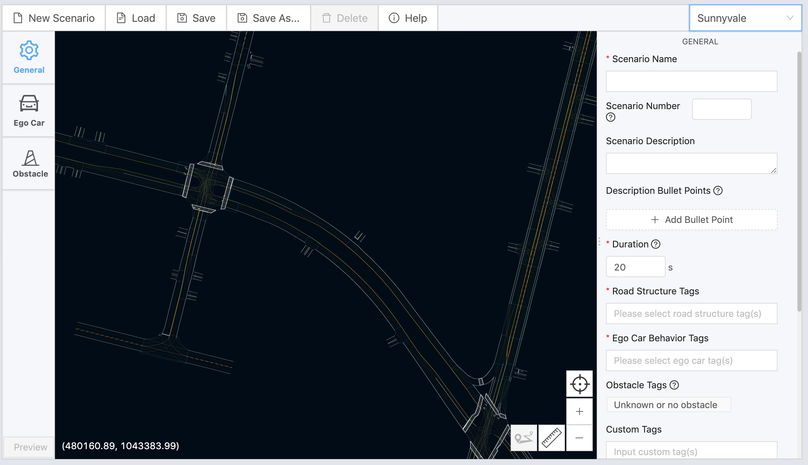


You can navigate through the map using your arrow keys. Alternatively, you can right-click the mouse and drag it to move the map. If you are using a trackpad, you will have to two-finger click drag with two fingers.
Lets understand each tool along with its purpose

### General Action Tools

The 4 General action tools can be found on the bottom right corner of the map. 

1. **Zoom tool**: while you can use your trackpad to zoom in and out of the map, there exists the Zoom tool to help you zoom in and out of the map in case you do not have a trackpad ready.

    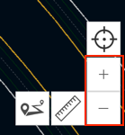

2. **Re-center tool**: this tool allows you to locate you ego-car on the map even if you have moved away

    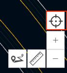

3. **Ruler tool**: this tool allows you to measure the distance between two points. 

    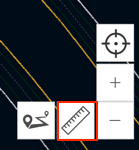  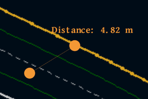

4. **Add Route tool**: you can set the ego car’s end point by clicking on the Add Route tool. Please note that the first version of the Scenario Editor does support the creation of multiple route points for the ego car.

    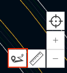
 
### Configuration Tools

There are 3 types of configuration tools that you need to setup in order to create a scenario, which are listed on the left-side of the map - General, Ego-car and Obstacles

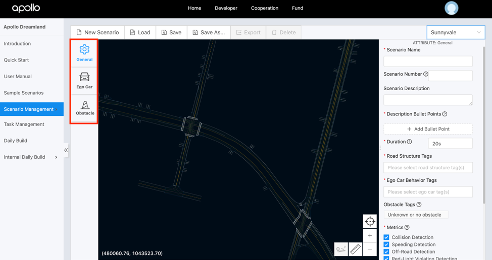

#### General Configuration

This configuration tool is selected by default upon the selection of a map. The form on your right requests general scenario informagtion like the scenario name, duration, road structure, ego-car behavior along with which metrics you would like to track. Please note some selections are required while some are based on your discretion. Once you have set and confirmed all the parameters, please proceed to the `Ego Car` configuration tool.

You can learn more about what each parameter is by hovering over the `?` sign next to each parameter.

#### Ego Car Configuration

This configuration tool allows you to set your Ego car on the map and configure its parameters. As soon as you select the tool icon, you can then hover over the map and place the car at your desired location. Once placed, you will notice a form on the right-hand side of the map, which allows you to configure the Ego car to set its speed, acceleration, along with your desired destination.

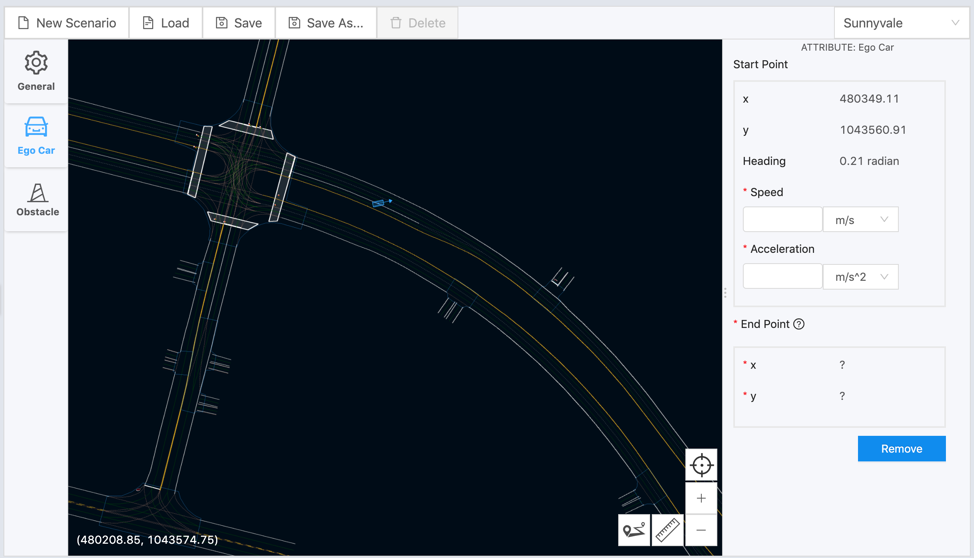

The Ego car's heading can also be set by dragging the arrow linked to the ego car

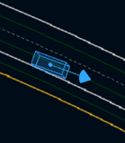

```
Note: 
You can set the ego car’s end point by clicking on the “Add Route Point” icon in the lower right corner of the map. Described in the General Action tools section. Please note that the first version of the Scenario Editor does support the creation of multiple route points for the ego car.
```

Once you have placed the Ego car's end point on the map, The end point coordinates will then appear on the right-hand attribute's window. You can drag the end point flag to change the ego car’s end point location. The “End point” coordinates will be automatically updated accordingly.

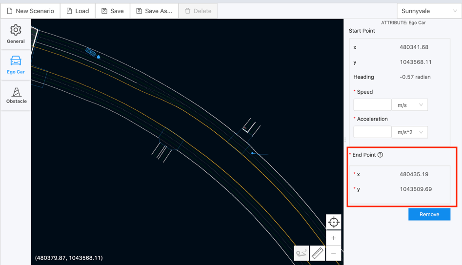

Finally, you can always come back and edit the existing attributes of the ego car by clicking on the ego car on the map. This will open its attributes tab in the right-hand attributes window.

#### Traffic Light Configuration

This configuration tool will allow you to edit the traffic lights that are a part of your scenario. To activate this tool, look for a traffic light on the map and click on it which opens a configuration form on the right-hand side of your window. You will notice 2 constant attricutes ID and its coordinates.
However, you will need to select a trigger type for the traffic light:
- **Distance** - the traffic light will be triggered by the distance between the ego car and the light
- **Time** -  the light will be triggered by the scenario run time

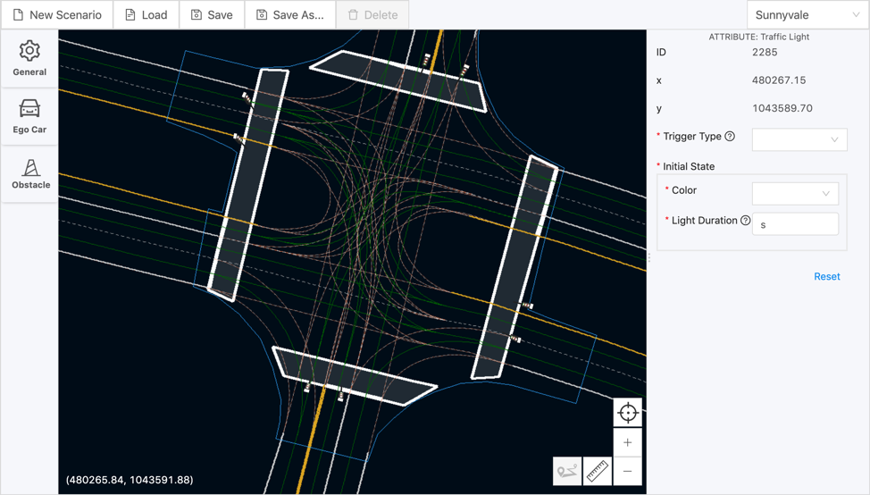

You will also be required to set the `Initial State` of the traffic light. And once your trigger type is set, you will also be required to complete the `States` section, in terms of color and light durations for each state. If the traffic lights have reached the end of their configured states before the end of the scenario, the last state will remain until the end.

## Saving a Scenario

You can save your scenario by clicking on `Save` in the file menu.
```
Note:
The minimum requirements of saving a scenario are to configure all required attributes in the “General” and “Ego Car” configurations. If not, a pop-up failure message window will highlight what you are still required to configure.
```

## Running a New Scenario

1. To locate and run your scenario requires you to trigger a `New Task` under `Task Management`

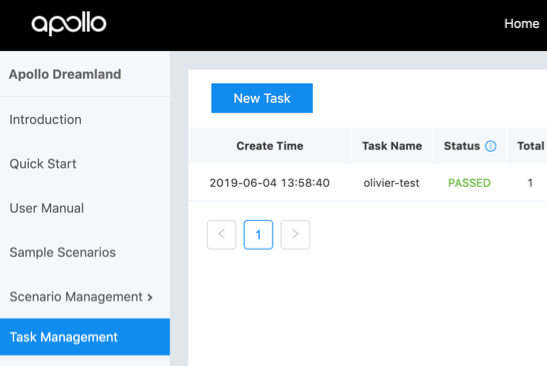

2. click on `Select Scenarios`

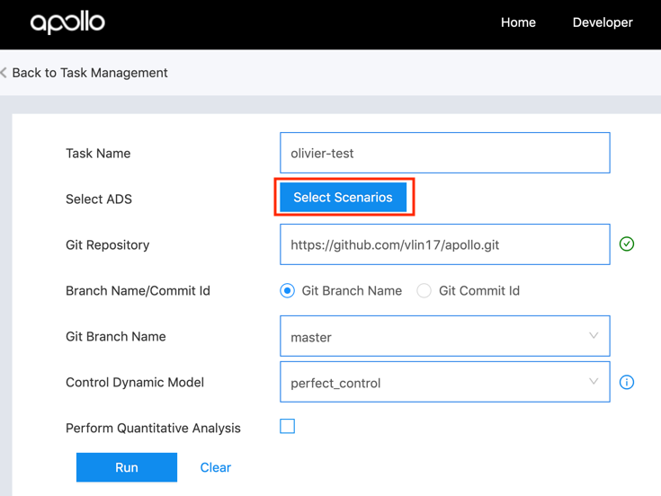

3. You can then search for your newly created scenario. An easy way to filter your private scenarios is to perform an instance search for your username in the `Search scenarios` field. 


