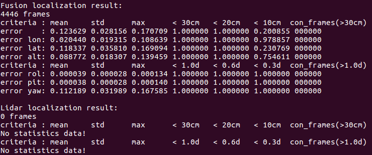

# 如何在本地运行基于NDT点云匹配的定位模块

本文档提供了如何在本地基于NDT点云匹配的定位模块的方法。

## 1. 事先准备
 - 从[GitHub网站](https://github.com/ApolloAuto/apollo)下载Apollo master分支源代码
 - 按照[教程](https://github.com/ApolloAuto/apollo/blob/master/README_cn.md)设置Docker环境并搭建Apollo工程
 - 从[Apollo数据平台](http://data.apollo.auto/?name=sensor%20data&data_key=multisensor&data_type=1&locale=en-us&lang=en)下载定位数据（仅限美国地区）

## 2. 配置定位模块
为了使定位模块正确运行，需要对地图路径和传感器外参进行配置。假设下载的定位数据的所在路径为DATA_PATH。

在进行以下步骤前，首先确定你在docker容器中。

### 2.1 配置传感器外参
将定位数据中的传感器外参拷贝至指定文件夹下, 目前NDT定位模块与MSF定位模块使用相同外参路径。

```
  cp DATA_PATH/params/ant_imu_leverarm.yaml /apollo/modules/localization/msf/params/gnss_params/
  cp DATA_PATH/params/velodyne64_novatel_extrinsics_example.yaml /apollo/modules/localization/msf/params/velodyne_params/
  cp DATA_PATH/params/velodyne64_height.yaml /apollo/modules/localization/msf/params/velodyne_params/
```
在`/apollo/modules/localization/conf/localization.conf`中添加传感器外参文件配置，以覆盖默认值。
```
# The lidar extrinsics file
--lidar_extrinsics_file=/apollo/modules/localization/msf/params/velodyne_params/velodyne64_novatel_extrinsics_example.yaml
```
各个外参的意义
 - ant_imu_leverarm.yaml： 杆臂值参数，GNSS天线相对Imu的距离
 - velodyne64_novatel_extrinsics_example.yaml： Lidar相对Imu的外参
 - velodyne64_height.yaml： Lidar相对地面的高度

### 2.2 配置地图路径
在`/apollo/modules/localization/conf/localization.conf`中添加关于地图路径的配置

```
# Redefine the map_dir in global_flagfile.txt
--map_dir=DATA_PATH
```
这将会覆盖global_flagfile.txt中的默认值。

### 2.3 修改Topic名称
由于目前Apollo支持velodyne 64线,128线lidar, 因此为区分不同设备数据，采用不同的topic名称。因此，在启动之前需要设置正确的lidar topic名称。在`/apollo/modules/localization/conf/localization.conf`中添加lidar topic名称，以覆盖默认值。
```
# The pointcloud topic name.
--lidar_topic=/apollo/sensor/velodyne64/compensator/PointCloud2
```
(可选)另外，对于定位可视化工具的使用，同样需要配置相应的topic名称。修改文件`/apollo/modules/localization/dag/dag_streaming_msf_visualizer.dag` 中的channel值为:
```
channel: /apollo/sensor/velodyne64/compensator/PointCloud2
```

## 3. 运行NDT定位模块
```
./scripts/ndt_localization.sh
```
定位程序将在后台运行，可以通过以下命令进行查看。
```
ps -e | grep ndt_localization
```

在/apollo/data/log目录下，可以看到定位模块输出的相关文件。 

 - localization.INFO : INFO级别的log信息
 - localization.WARNING : WARNING级别的log信息
 - localization.ERROR : ERROR级别的log信息
 - localization.out : 标准输出重定向文件
 - localizaiton.flags : 启动localization模块使用的配置

## 4. 播放演示record
```
cd DATA_PATH/record
cyber_record play -f *.record
```
另外打开一个终端，进入docker环境，执行
```
cyber_monitor
```
终端会显示出topic列表，可以看到定位topic `/apollo/localization/pose` 有输出。

## 5. 记录与可视化定位结果（可选）
### 记录定位结果
```
python ./scripts/record_bag.py
```
该脚本会在后台运行录包程序，并将存放路径输出到终端上。

### 可视化定位结果
NDT定位模块使用与MSF定位模块相同的可视化工具。

运行可视化工具

```
./scripts/localization_online_visualizer.sh
```
该可视化工具首先根据MSF定位地图生成用于可视化的缓存文件，存放在/apollo/data/map_visual目录下。

然后接收以下topic并进行可视化绘制。

 - /apollo/sensor/velodyne64/compensator/PointCloud2
 - /apollo/localization/pose

可视化效果如下


如果发现可视化工具运行时卡顿，可使用如下命令重新编译可视化工具

```
cd /apollo
bazel build -c opt //modules/localization/msf/local_tool/local_visualization/online_visual:online_local_visualizer
```

编译选项-c opt优化程序性能，从而使可视化工具可以实时运行。

## 6. 结束运行定位模块

```
./scripts/ndt_localization.sh stop
```

如果之前有运行步骤5的录包脚本，还需执行

```
python ./scripts/record_bag.py --stop
```

## 7. 验证定位结果（可选）

NDT模块定位结果的验证使用MSF模块的验证工具。
假设步骤5中录取的数据存放路径为OUTPUT_PATH，杆臂值外参的路径为ANT_IMU_PATH。
首先将录制的数据包重命名为以`.record`为后缀的文件。

运行脚本
```
./scripts/msf_local_evaluation.sh OUTPUT_PATH ANT_IMU_PATH
```
该脚本会以RTK定位模式为基准，将多传感器融合模式的定位结果进行对比。

(注意只有在GNSS信号良好，RTK定位模式运行良好的区域，这样的对比才是有意义的。)

获得如下统计结果：



NDT模块的统计结果只有一组，即定位输出`/apollo/localization/pose`的统计结果。

表格中各项的意义， 
 - error：  平面误差，单位为米
 - error lon：  车前进方向的误差，单位为米
 - error lat：  车横向方向的误差，单位为米
 - error roll： 翻滚角误差，单位为度
 - error pit：  俯仰角误差，单位为度
 - error yaw：  偏航角误差，单位为度
 - mean： 误差的平均值
 - std：  误差的标准差
 - max：  误差的最大值
 - <30cm：  距离误差少于30cm的帧所占的百分比
 - <1.0d：  角度误差小于1.0d的帧所占的百分比
 - con_frame()： 满足括号内条件的最大连续帧数