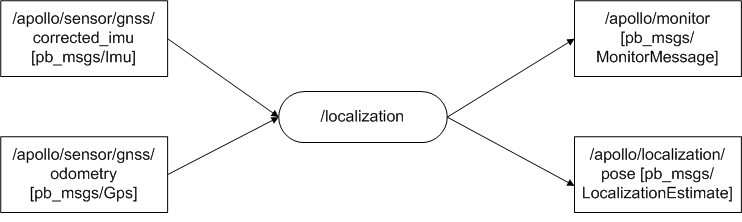

# Localization module 分析
## 作用：
实时确定车辆的位置。

## Localization节点流图：
### 节点数据流图：

### 输入：
 * Imu数据：/apollo/sensor/gnss/corrected_imu。
 * Gps数据：/apollo/sensor/gnss/odometry。

### 输出：
 * 定位信息：/apollo/localization/pose。
 * 监视信息：/apollo/localization/。

## 代码分析：
主要文件：localization.cc,localization.h,localization_base.h。
### Localization类:
 * 继承于ApolloApp类，有三个数据，localization_具体的定位算法实例指针，localization_factory_存储定位算法类，config_存储配置文件信息。
 * Init()函数注册RTKLocalization类到localization_factory_，此类基于RTK算法实现定位算法；读取配置文件到config_。
 * Name()函数返回模块名字。
 * Start()函数，用localization_factory_类实例化一个定位算法对象，用localization_直向。若创建成功，调用定位算法的start()函数。

### LocalizationBase类：
 * 定位算法的基类。
 * Start()函数启动定位算法。
 * Stop()函数终止定位算法。

### RTKLocalization类：
 * 继承LocalizationBase类。
 * Start()函数：创建timer，检测gps和imu是否有数据。超时执行OnTimer()函数。OnTimer()函数检查gps和imu是否有数据，然后调用PublishLocalization()发布定位信息，并更新数据接收时间。在PublishLocalization()函数中先调用PrepareLocalizationMsg()函数计算定位信息，并填充发布数据结构localization；然后调用AdapterManager::PublishLocalization发布定位topic。PrepareLocalizationMsg(&localization)函数首先获取gps数据，然后根据gps数据时间戳获取imu数据，然后调用ComposeLocalizationMsg()函数，进行数据融合以定位，其实所谓的数据融合也就是在最终的定位信息中分别使用gps和imu测得数据设置定位信息，唯一由两个器件融合的量只有线速度。所谓RTK算法应该单指由gps数据获取gps定位信息，在localization阶段其实是使用这个定位信息，真正RTK算法应该是作用在gps数据的处理上。
 * Stop()函数停止timer，即退出定位模式。

## 疑惑：
* 定位信息给出的应该是车辆在世界中的的绝对位置，因为采用gps数据，那么这个位置如何与地图建立关系的？

 答：地图中的点也可能是世界中的绝对位置。

* map_offset这个量的作用：//TODO
