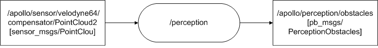

# Perception Module 分析
## 功能：
感知障碍物，预测障碍物的运动轨迹。

## 数据流图：

### 输入：
 * 点云数据：/apollo/sensor/velodyne64/compensator/PointCloud2。
 * 坐标系转换关系：/tf（world->novatel）。
 * HD Map。
 * LiDAR外参：/tf_static（novatel->velodyne64）。
 * 注：在最小仿真系统中，/tf，/tf_static和HD map都不是以topic形式作为输入的。

### 输出：
 * 带航向和速度，障碍物的3D轨道消息：/apollo/perception/obstacles。

## 代码分析：
### main.cc：
 * 主节点文件。
 * 通过apollo顶层宏APOLLO_MAIN，创建ros节点Perception。

### perception.h，perception.cc：
 * 模块主体文件。
 * 定义实现Perception类，用于表述perception模块。
 * Name()函数：返回模块名字，也就是ros节点名字，即"perception"。
 * Init()函数：模块初始化函数。AdapterManager::Init(）函数通过配置文件adapter.conf创建node handle，以及相应的topics；lidar_process_->Init()函数配置对激光雷达数据处理的算法；检测激光雷达是否有数据；注册点云数据的回调函数。
 * OnPointCloud()函数：数据处理回调函数。判断lidar处理算法是否就绪；lidar_process_->Process()函数使用前面注册的雷达处理算法依次处理雷达数据；lidar_process_->GeneratePbMsg()函数使用处理后的数据生成障碍物信息；AdapterManager::PublishPerceptionObstacles()函数基于adapter架构发布障碍物信息。

### lidar_process.h，lidar_process.c：
 * 激光雷达数据处理文件，主要包含激光雷达的处理算法。
 * 定义实现LidarProcess类，用于处理激光雷达数据。
 * init()函数：RegistAllAlgorithm()函数注册激光雷达处理函数，分别是HdmapROIFilter，CNNSegmentation，MinBoxObjectBuilder，HmObjectTracker其对应的时激光雷达数据处理流程。InitFrameDependence()函数配置HD map。InitAlgorithmPlugin()函数将roi_filter_,segmentor_,object_builder_,tracker_实例化，可能是只作为插件，并调用其init()方法。
 * Process(const sensor_msgs::PointCloud2& message)函数：调用GetVelodyneTrans()函数获取velodyne2world坐标系转化关系，调用TransPointCloudToPCL()函数由Lidar数据生成PCL，存入point_cloud变量。然后调用Process(timestamp_, point_cloud, velodyne_trans)函数。
 * Process(timestamp_, point_cloud, velodyne_trans)函数：hdmap_input_->GetROI()函数从HD map获取ROI；roi_filter_->Filter()函数获取ROI的索引indices；segmentor_->Segment()函数对根据indices对障碍物进行分割，object_builder_->Build()函数重建障碍物，构成6边形；tracker_->Track()函数	预测障碍物运动轨迹。这是perception算法的核心部分，其四个步骤分别使用四种不同的算法，详细算法需要进一步研究。此步结束之后，对激光雷达数据处理结束，剩余部分就是合成障碍物，然后发布出去。

### HD map的引入：
 * HD map的引入是通过hdmap_input.cc和hdmap_input.h文件实现，通过定义HDMapInput类表述和操作HD map。

### 激光雷达数据处理算法：
 * 每个算法对应obstacle\lidar\下的相应的一个目录，每个算法被包装为一个插件类。每种算法都牵涉比较深的相关数学理论知识，后续可将每一项作为专题研究，例如segment，其核心即是CNN算法。
