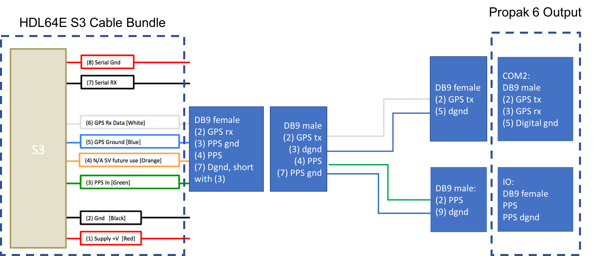
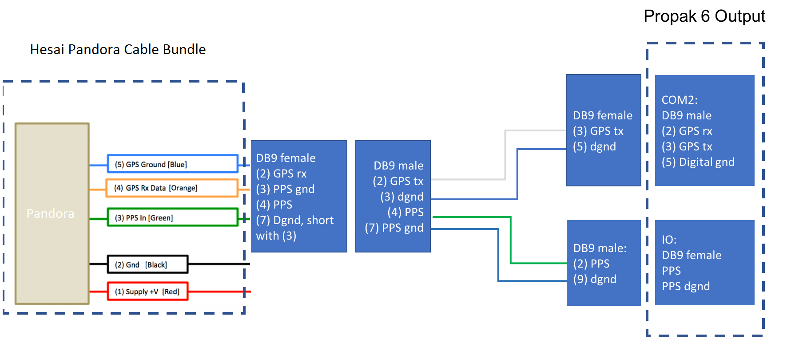

# Apollo 2.0 Hardware and System Installation Guide

* [About This Guide](#about-this-guide)
    * [Document Conventions](#document-conventions)
* [Introduction](#introduction)
    * [Documentation](#documentation)
* [Key Hardware Components](#key-hardware-components)
    * [Additional Components Required](#additional-components-required)
    * [Onboard Computer System - IPC](#onboard-computer-system---ipc)
        * [IPC Configuration](#ipc-configuration)
        * [IPC Front and Rear Views](#ipc-front-and-rear-views)
    * [Controller Area Network (CAN) Card](#controller-area-network-(can)-card)
    * [Global Positioning System (GPS) and Inertial Measurement Unit (IMU)](#global-positioning-system-(gps)-and-inertial-measurement-unit-(imu))
        * [Option 1: The NovAtel SPAN-IGM-A1](#option-1-the-novatel-span-igm-a1)
        * [Option 2: The NovAtel SPAN ProPak6 and NovAtel IMU-IGM-A1](#option-2-the-novatel-span-propak6-and-novatel-imu-igm-a1)
    * [The GPS Receiver/Antenna](#the-gps-receiver/antenna)
    * [Light Detection and Ranging System (LiDAR)](#light-detection-and-ranging-system-(lidar)-)
        * [Option 1: Velodyne HDL-64E S3](#option-1-velodyne-hdl-64e-s3)
        * [Option 2: Hesai Pandora](#option-2-hesai-pandora) 
* [Overview of the Installation Tasks](#overview-of-the-installation-tasks)
* [Steps for the Installation Tasks](#steps-for-the-installation-tasks)
    * [At the Office](#at-the-office)
        * [Preparing the IPC](#preparing-the-ipc)
        * [Installing the Software for the IPC](#installing-the-software-for-the-ipc)
    * [In the Vehicle](#in-the-vehicle)
        * [Prerequisites](#prerequisites)
        * [Diagrams of the Major Component Installations](#diagrams-of-the-major-component-installations)
        * [Installing the GPS Receiver and Antenna](#installing-the-gps-receiver-and-antenna)
        * [Installing the Light Detection and Ranging System (LiDAR)](#installing-the-light-detection-and-ranging-system-(lidar))
        * [Installing the Cameras](#installing-the-cameras)
        * [Installing the Radar](#installing-the-radar)
        * [Installing the IPC](#installing-the-ipc)
        * [Configuring the GPS and IMU](#configuring-the-gps-and-imu)
* [Setting up the Network](#setting-up-the-network)
    * [Recommendations](#recommendations)
* [Additional Tasks Required](#additional-tasks-required)
* [Next Steps](#next-steps)


# About This Guide

The *Apollo 2.0 Hardware and System Installation Guide* provides the instructions to install all of the hardware components and system software for the **Apollo Project**. The system installation information included pertains to the procedures to download and install the Apollo Linux Kernel.

## Document Conventions

The following table lists the conventions that are used in this document:

| **Icon**                            | **Description**                          |
| ----------------------------------- | ---------------------------------------- |
| **Bold**                            | Emphasis                                 |
| `Mono-space font`                   | Code, typed data                         |
| _Italic_                            | Titles of documents, sections, and headings Terms used |
|        | **Info**  Contains information that might be useful.  Ignoring the Info icon has no negative consequences. |
|          | **Tip**. Includes helpful hints or a shortcut that might assist you in completing a task. |
|    | **Online**. Provides a link to a particular web site where you can get more information. |
|  | **Warning**. Contains information that must **not** be ignored or you risk failure when you perform a certain task or step. |

# Introduction

The **Apollo Project** is an initiative that provides an open, complete, and reliable software platform for Apollo partners in the automotive and autonomous driving industries. The aim of this project is to enable these entities to develop their own self-driving systems based on Apollo software stack.

## Documentation

The following set of documentation describes Apollo 2.0:

- ***<u>[Apollo Hardware and System Installation Guide]</u>***  ─ Provides the instructions to install the hardware components and the system software for the vehicle:

    - **Vehicle**:

      - Industrial PC (IPC)
      - Global Positioning System (GPS)
      - Inertial Measurement Unit (IMU)
      - Controller Area Network (CAN) card
      - GPS Antenna
      - GPS Receiver
      - Light Detection and Ranging System (LiDAR)
      - Camera
      - Radar

    - **Software**:
      - Ubuntu Linux
      - Apollo Linux Kernel
      - NVIDIA GPU Driver

- ***<u>[Apollo Quick Start Guide]</u>*** ─ A combination tutorial and roadmap that provide the complete set of end-to-end instructions. The Quick Start Guide also provides links to additional documents that describe the conversion of a regular car to an autonomous-driving vehicle.


# Key Hardware Components

The key hardware components to install include:

- Onboard computer system ─ Neousys Nuvo-6108GC
- Controller Area Network (CAN) Card ─ ESD CAN-PCIe/402-B4
- General Positioning System (GPS) and Inertial Measurement Unit (IMU) ─
  You can select one of the following options:
  - NovAtel SPAN-IGM-A1
  - NovAtel SPAN® ProPak6™ and NovAtel IMU-IGM-A1
- Light Detection and Ranging System (LiDAR) ─ You can select one of the following options:
  - Velodyne HDL-64E S3
  - Hesai Pandora
- Cameras — Leopard Imaging LI-USB30-AR023ZWDR with USB 3.0 case
- Radar — Continental ARS408-21

## Additional Components Required

You need to provide these additional components for the Additional Tasks Required:

- A 4G router for Internet access
- A USB hub for extra USB ports
- A monitor, keyboard, and mouse for debugging at the car onsite
- Cables:a Digital Visual Interface (DVI) cable (optional), a customized cable for GPS-LiDAR time synchronization
- Apple iPad Pro: 9.7-inch, Wi-Fi (optional)

The features of the key hardware components are presented in the subsequent sections.

## Onboard Computer System - IPC

The onboard computer system is an industrial PC (IPC) for the autonomous vehicle and uses the **NeousysNuvo-6108GC** that is powered by a sixth-generation Intel Xeon E3 1275 V5 CPU.

The Neousys Nuvo-6108GC is the central unit of the autonomous driving system (ADS).

### IPC Configuration

Configure the IPC as follows:

- ASUS GTX1080 GPU-A8G-Gaming GPU Card
- 32GB DDR4 RAM
- PO-280W-OW 280W AC/DC power adapter
- 2.5" SATA Hard Disk 1TB 7200rpm

### IPC Front and Side Views

The front and rear views of the IPC are shown with the Graphics Processing Unit (GPU) installed in the following pictures:

The front view of the Nuvo-6108GC:


The side view of the Nuvo-6108GC:


For more information about the Nuvo-6108GC, see:


Neousys Nuvo-6108GC Product Page:

[http://www.neousys-tech.com/en/product/application/rugged-embedded/nuvo-6108gc-gpu-computing](http://www.neousys-tech.com/en/product/application/rugged-embedded/nuvo-6108gc-gpu-computing)


Neousys Nuvo-6108GC-Manual:

**[Link unavailable yet]**

## Controller Area Network (CAN) Card

The CAN card to use with the IPC is **ESD** **CAN-PCIe/402-B4**.


For more information about the CAN-PCIe/402-B4, see:

    ESD CAN-PCIe/402 Product Page:

[https://esd.eu/en/products/can-pcie402](https://esd.eu/en/products/can-pcie402)


## Global Positioning System (GPS) and Inertial Measurement Unit (IMU)

There are **two** GPS-IMU **options** available and the choice depends upon the one that most fits your needs:

- **Option 1: NovAtel SPAN-IGM-A1**
- **Option 2: NovAtel SPAN® ProPak6™ and NovAtel IMU-IGM-A1**

### Option 1: The NovAtel SPAN-IGM-A1

The NovAtel SPAN-IGM-A1 is an integrated, single-box solution that offers tightly coupled Global Navigation Satellite System (GNSS) positioning and inertial navigation featuring the NovAtel OEM615 receiver.


For more information about the NovAtel SPAN-IGM-A1, see:

  NovAtel SPAN-IGM-A1 Product Page:

[https://www.novatel.com/products/span-gnss-inertial-systems/span-combined-systems/span-igm-a1/](https://www.novatel.com/products/span-gnss-inertial-systems/span-combined-systems/span-igm-a1/)

### Option 2: The NovAtel SPAN ProPak6 and NovAtel IMU-IGM-A1

NovAtel ProPak6 is a standalone GNSS receiver. It works with a separate NovAtel- supported IMU (in this case, the NovAtel IMU-IGM-A1)to provide localization.

The ProPak6 provides the latest and most sophisticated enclosure product manufactured by NovAtel.

The IMU-IGM-A1 is an IMU that pairs with a SPAN-enabled GNSS receiver such as the SPAN ProPak6.


For more information about the NovAtel SPAN ProPak6 and the IMU-IGM-A1, see:

   NovAtel ProPak6 Installation & Operation Manual:

[https://www.novatel.com/assets/Documents/Manuals/OM-20000148.pdf](https://www.novatel.com/assets/Documents/Manuals/OM-20000148.pdf)

  NovAtel IMU-IGM-A1 Product Page:

[https://www.novatel.com/products/span-gnss-inertial-systems/span-imus/span-mems-imus/imu-igm-a1/#overview](https://www.novatel.com/products/span-gnss-inertial-systems/span-imus/span-mems-imus/imu-igm-a1/#overview)

## The GPS Receiver/Antenna

The GPS Receiver/Antenna used with the GPS-IMU component is the **NovAtel GPS-703-GGG-HV**.

**NOTE:**The GPS NovAtelGPS-703-GGG-HV works with either model of the two GPS-IMU options that are described in the previous section, Global Positioning System (GPS) and Inertial Measurement Unit (IMU).


For more information about the NovAtel GPS-703-GGG-HV, see:

   NovAtel GPS-703-GGG-HV Product Page:

[https://www.novatel.com/products/gnss-antennas/high-performance-gnss-antennas/gps-703-ggg-hv/](https://www.novatel.com/products/gnss-antennas/high-performance-gnss-antennas/gps-703-ggg-hv/)

## Light Detection and Ranging System (LiDAR)
There are **two** LiDAR **options** available and the choice depends upon the one that most fits your needs:

- **Option 1: Velodyne HDL-64E S3**
- **Option 2: Hesai Pandora**

### Option 1: Velodyne HDL-64E S3

The 64 line LiDAR system **HDL-64E S3** is available from Velodyne LiDAR, Inc.


**Key Features:**

- 64 Channels
- 120m range
- 2.2 Million Points per Second
- 360° Horizontal FOV
- 26.9° Vertical FOV
- 0.08° angular resolution (azimuth)
- <2cm accuracy
- ~0.4° Vertical Resolution
- User selectable frame rate
- Rugged Design

Webpage for Velodyne HDL-64E S3:
[http://velodynelidar.com/hdl-64e.html](http://velodynelidar.com/hdl-64e.html)

### Option 2: Hesai Pandora

The 40 line LiDAR system **Pandora** is available from Hesai Photonics Technology Co., Ltd.


**Key Features:**

- 40 Channels
- 200m range (20% reflectivity)
- 720 kHz measuring frequency
- 360° Horizontal FOV
- 23° Vertical FOV (-16° to 7°)
- 0.2° angular resolution (azimuth)
- <2cm accuracy
- Vertical Resolution: 0.33° ( from -6° to +2°); 1° (from -16° to -6°, +2° to +7°)
- User selectable frame rate
- 360° surrounding view with 4 mono cameras and long disatance front view with 1 color camera

Webpage for Hesai Pandora:
[http://www.hesaitech.com/pandora.html](http://www.hesaitech.com/pandora.html)

## Cameras

The cameras used are LI-USB30-AR023ZWDR with standard USB 3.0 case manufactured by Leopard Imaging Inc. We recommend using two cameras with 6 mm and 25 mm lens respectively to achieve the required performance.


You can find more information at Leopard Imaging Inc. website:

[https://www.leopardimaging.com/LI-USB30-AR230WDR.html](https://www.leopardimaging.com/LI-USB30-AR230WDR.html)


## Radar

The Radar used is ARS408-21 manufactured by Continental AG.


You can find more information can be found on the product page:

[https://www.continental-automotive.com/Landing-Pages/Industrial-Sensors/Products/ARS-408-21](https://www.continental-automotive.com/Landing-Pages/Industrial-Sensors/Products/ARS-408-21)

# Overview of the Installation Tasks

Installing the hardware and the software components involves these tasks:

**AT THE OFFICE:**
1. Prepare and install the Controller Area Network (CAN) card by first repositioning the CAN card termination jumper before you insert the card into the slot.

2. Install the hard drive (if none was pre-installed) in the IPC.

    You can also choose to replace a pre-installed hard drive if you prefer.

    **Recommendations** :
    - Install a Solid-State Drive (SSD) for better reliability.
    - Use a high-capacity drive if you need to collect driving data.

3. Prepare the IPC for powering up:
    a. Attach the power cable to the power connector (terminal block).
    b. Connect the monitor, Ethernet, keyboard, and mouse to the IPC.
    c. Connect the IPC to a power source.

4. Install the software on the IPC (some Linux experience is required):
    a. Install Ubuntu Linux.
    b. Install the Apollo Linux kernel.

**IN THE VEHICLE:**

- Make sure that all the modifications for the vehicle, which are listed in the section Prerequisites, have been performed.

- Install the major components (according to the illustrations and the instructions included in this document):
    - GPS Antenna
    - IPC
    - GPS Receiver and IMU
    - LiDAR
    - Camera
    - Radar

The actual steps to install all of the hardware and software components are detailed in the section, Steps for the Installation Tasks.

# Steps for the Installation Tasks

This section describes the steps to install:

- The key hardware and software components
- The hardware in the vehicle

## At the Office

Perform the following tasks:

- Prepare the IPC:
    - Install the CAN card
    - Install or replace the hard drive
    - Prepare the IPC for powering up

- Install the software for the IPC:
    - Ubuntu Linux
    - Apollo Kernel
    - Nvidia GPU Driver

### Prepare the IPC
Follow these steps:
1. Prepare and install the Controller Area Network (CAN) card: 	
  In the Neousys Nuvo-6108GC, ASUS® GTX-1080GPU-A8G-GAMING GPU card is pre-installed into one of the three PCI slots. We still need to install a CAN card into a PCI slot. 
  a. Locate and unscrew the eight screws (shown in the brown squares or	pointed by brown arrows) on the side of computer:
  b. Remove the cover from the IPC. 3 PCI slots (one occupied by the	graphic card) locate on the base:

  

  

  c. Set the CAN card termination jumper by removing the red jumper cap (shown in yellow circles) from its default location and placing it at its termination position:

  

  **WARNING**: The CAN card will not work if the termination jumper is not set correctly.

  d. Insert the CAN card into the slot in the IPC:

  

   e. Reinstall the cover for the IPC

  

2. Prepare the IPC for powering up:

   a. Attach the power cable to the power connector (terminal block) that comes with the IPC:

   **WARNING**: Make sure that the positive(labeled **R**  for red) and the negative(labeled **B** for black) wires of the power cable are inserted into the correct holes on the power terminal block.

   

   b. Connect the monitor, Ethernet cable, keyboard, and mouse to the IPC:

3. 

It is recommended to configure the fan speed through BIOS settings, if one or more plugin card is added to the system

    - While starting up the computer, press F2 to enter BIOS setup menu.
    - Go to [Advanced] => [Smart Fan Setting]
    - Set [Fan Max. Trip Temp] to 50
    - Set [Fan Start Trip Temp] to 20


It is recommended that you use a Digital Visual Interface (DVI) connector on the graphic card for the monitor. To set the display to the DVI port on the motherboard, following is the setting procedure:

    - While starting up the computer, press F2 to enter BIOS setup menu.
    - Go to [Advanced]=>[System Agent (SA) Configuration]=>[Graphics Configuration]=>[Primary Display]=> Set to "PEG"
It is recommended to configure the IPC to run at maximum performance mode at all time:
     - While starting up the computer, press F2 to enter BIOS setup menu.
     - Go to [Power] => [SKU POWER CONFIG] => set to "MAX. TDP"

c. Connect the power: 


### Installing the Software for the IPC

This section describes the steps to install:

- Ubuntu Linux
- Apollo Kernel
- Nvidia GPU Driver

It is assumed that you have experience working with Linux to successfully perform the software installation.

#### Installing Ubuntu Linux
Follow these steps:

1. Create a bootable Ubuntu Linux USB flash drive:

    Download Ubuntu (or a variant such as Xubuntu) and follow the online instructions to create a bootable USB flash drive.

It is recommended that you use **Ubuntu 14.04.3**.

You can type F2 during the system boot process to enter the BIOS settings. It is recommended that you disable Quick Boot and Quiet Boot in the BIOS to make it easier to catch any issues in the boot process.

For more information about Ubuntu, see:

 Ubuntu for Desktop web site:

[https://www.ubuntu.com/desktop](https://www.ubuntu.com/desktop)

2. Install Ubuntu Linux:

    a.   Insert the Ubuntu installation drive into a USB port and turn on the system.
    b.   Install Linux by following the on-screen instructions.

3. Perform a software update and the installation:
    a.   Reboot into Linux after the installation is done.
    b.   Launch the Software Updater to update to the latest software packages (for the installed distribution) or type the following commands in a terminal program such as GNOME Terminal.
    ```shell
    sudo apt-get update; sudo apt-get upgrade
    ```

    c. Launch a terminal program such as GNOME Terminal and type the following command to install the Linux 4.4 kernel:
    ```shell
    sudo apt-get install linux-generic-lts-xenial
    ```

The IPC must have Internet access to update and install software. Make sure that the Ethernet cable is connected to a network with Internet access. You might need to configure the network for the IPC if the network that it is connected to is not using the Dynamic Host Configuration Protocol (DHCP).


#### Installing the Apollo Kernel

The Apollo runtime in the vehicle requires the [Apollo Kernel](https://github.com/ApolloAuto/apollo-kernel). It is strongly recommended to install the pre-built kernel.

##### Use the pre-built Apollo Kernel.

You get access to and install the pre-built kernel using the following commands.

1. Download the release packages from the release section on GitHub:
```
https://github.com/ApolloAuto/apollo-kernel/releases
```
2. Install the kernel after having downloading the release package:
```
tar zxvf linux-4.4.32-apollo-1.5.0.tar.gz
cd install
sudo bash install_kernel.sh
```
3. Reboot your system using the `reboot` command.

4. Build the ESD CAN driver source code, according to [ESDCAN-README.md](https://github.com/ApolloAuto/apollo-kernel/blob/master/linux/ESDCAN-README.md)

##### Build your own kernel.
If have modified the kernel, or the pre-built kernel is not the best for your platform, you can build your own kernel using the following steps.

1. Clone the code from the repository
```
git clone https://github.com/ApolloAuto/apollo-kernel.git
cd apollo-kernel
```
2. Add the ESD CAN driver source code according to [ESDCAN-README.md](https://github.com/ApolloAuto/apollo-kernel/blob/master/linux/ESDCAN-README.md)

3. Build the kernel using the following command.
```
bash build.sh
```
4. Install the kernel using the steps for a pre-built Apollo Kernel as described in the previous section.

#### Installing NVIDIA GPU Driver

The Apollo runtime in the vehicle requires the [NVIDIA GPU Driver](http://www.nvidia.com/download/driverResults.aspx/114708/en-us). You must install the NVIDIA GPU driver with specific options.

1. Download the installation files
```
wget http://us.download.nvidia.com/XFree86/Linux-x86_64/375.39/NVIDIA-Linux-x86_64-375.39.run
```

2. Start the installation
```
sudo bash ./NVIDIA-Linux-x86_64-375.39.run --no-x-check -a -s --no-kernel-module
```

##### Optional: Test the ESD CAN device node
After rebooting the IPC with the new kernel:

a. Create the CAN device node by issuing the following commands in a terminal:

```shell
cd /dev 
sudo mknod –-mode=a+rw can0 c 52 0
sudo mknod –-mode=a+rw can1 c 52 1
```
b. Test the CAN device node using the test program that is part of the ESD CAN software package that you have acquired from ESD Electronics.


The IPC is now ready to be mounted on the vehicle.

## In the Vehicle

Perform these tasks:

- Make the necessary modifications to the vehicle as specified in the list of prerequisites
- Install the major components:
    - GPS Antenna
    - IPC
    - GPS Receiver and IMU
    - LiDAR
    - Cameras
    - Radar


### Prerequisites

**WARNING**: Prior to mounting the major components (GPS Antenna, IPC, and GPS Receiver) in the vehicle, perform certain modifications as specified in the list of prerequisites. The instructions for making the mandatory changes in the list are outside the scope of this document.

The list of prerequisites are as follows:

- The vehicle must be modified for “drive-by-wire” technology by a professional service company. Also, a CAN interface hookup must be provided in the trunk where the IPC will be mounted.
- A power panel must be installed in the trunk to provide power to the IPC and the GPS-IMU. The power panel would also service other devices in the vehicle such as a 4G LTE router. The power panel should be hooked up to the power system in the vehicle.
- A custom-made rack must be installed to mount the GPS-IMU Antenna, the cameras and the LiDAR on top of the vehicle.
- A custom-made rack must be installed to mount the GPS-IMU in the trunk.
- A custom-made rack must be installed in front of the vehicle to mount the front-facing radar.
- A 4G LTE router must be mounted in the trunk to provide Internet access for the IPC. The router must have built-in Wi-Fi access point (AP) capability to connect to other devices, such as an iPad, to interface with the autonomous driving (AD) system. A user would be able to use the mobile device to start AD mode or monitor AD status, for example.

### Diagrams of the Major Component Installations

The following two diagrams indicate the locations of where the three major components (GPS Antenna, IPC, GPS Receiver and LiDAR) should be installed on the vehicle:


### Installing the GPS Receiver and Antenna

This section provides general information about installing **one** of two choices:

- **Option 1:** GPS-IMU: **NovAtel SPAN-IGM-A1**
- **Option 2:** GPS-IMU: **NovAtel SPAN® ProPak6™ and NovAtel IMU-IGM-A1**

#### Option 1: Installing the NovAtel SPAN-IGM-A1

The installation instructions describe the procedures to mount, connect, and take the lever arm measurements for the GPS-IMU NovAtel SPAN-IGM-A1.

##### Mounting

You can place the GPS-IMU NovAtel SPAN-IGM-A1 in most places in the vehicle but it is suggested that you follow these recommendations:

- Place and secure the NovAtel SPAN-IGM-A1 inside the trunk with the Y-axis pointing forward.
- Mount the NovAtel GPS-703-GGG-HV antenna in an unobscured location on top of the vehicle.

##### Wiring

You must connect two cables:

- The antenna cable connects the GNSS antenna to the antenna port of the SPAN-IGM-A1
- The main cable:
    - Connects its 15-pin end to the SPAN-IGM-A1
    - Connects its power wires to a power supply of 10-to-30V DC
    - Connects its serial port to the IPC. If the power comes from a vehicle battery, add an auxiliary battery (recommended).


Main Cable Connections

For more information, see the *SPAN-IGM™ Quick Start Guide*, page 3, for a detailed diagram:

SPAN-IGM™ Quick Start Guide

[http://www.novatel.com/assets/Documents/Manuals/GM-14915114.pdf](http://www.novatel.com/assets/Documents/Manuals/GM-14915114.pdf)

##### Taking the Lever Arm Measurement

When the SPAN-IGM-A1 and the GPS Antenna are in position, the distance from the SPAN-IGM-A1 to the GPS Antenna must be measured. The distance should be measured as: X offset, Y offset, and Z offset.

The error of offset must be within one centimeter to achieve high accuracy. For more information, see the *SPAN-IGM™ Quick Start Guide*, page 5, for a detailed diagram.

For an additional information about the SPAN-IGM-A1, see:

SPAN-IGM™ User Manual:

[http://www.novatel.com/assets/Documents/Manuals/OM-20000141.pdf](http://www.novatel.com/assets/Documents/Manuals/OM-20000141.pdf)


#### Option 2: Installing NovAtel SPAN® ProPak6™ and NovAtel IMU-IGM-A1

The installation instructions describe the procedures to mount, connect, and take the lever arm measurements for the GPS NovAtel SPAN® ProPak6™ **and** the NovAtel IMU-IGM-A1.

##### Components for the Installation

The components that are required for the installation include:

- NovAtel GPS SPAN ProPak6

- NovAtel IMU-IGM-A1

- NovAtel GPS-703-GGG-HV Antenna

- NovAtel GPS-C006 Cable (to connect antenna to GPS)

- NovAtel 01019014 Main Cable (to connect GPS to a serial port the IPC)

- Data Transport Unit (DTU) – similar to a 4G router

- Magnetic adapters (for antenna and DTU)

- DB9 Straight Through Cable

##### Mounting

You can place the two devices, the ProPak6 and the IMU in most places in the vehicle, but it is suggested that you follow these recommendations:

- Place and secure the ProPak6 and the IMU side-by-side inside the trunk with the Y-axis pointing forward.
- Mount the NovAtel GPS-703-GGG-HV antenna on top of the vehicle or on top of the trunk lid as shown:


- Use a magnetic adapter to tightly attach the antenna to the trunk lid.
- Install the antenna cable in the trunk by opening the trunk and placing the cable in the space between the trunk lid and the body of the car.

##### Wiring

Follow these steps to connect the ProPak6 GNSS Receiver and the IMU to the Apollo system:

1. Use the split cable that comes with IMU-IGM-A1 to connect the IMU Main port and theProPak6 COM3/IMU port.
2. Use a USB-A-to-MicroUSB cable to connect the USB port of the IPC and the MicroUSB port of the ProPak6.
3. Connect the other end of the IMU-IGM-A1 split cable to the vehicle power.
4. Connect the GNSS antenna to Propak6.
5. Connect the Propak6 power cable.


For more information about the NovAtel SPAN ProPak6, see:

NovAtel ProPak6 Installation& Operation Manual:

[https://www.novatel.com/assets/Documents/Manuals/OM-20000148.pdf](https://www.novatel.com/assets/Documents/Manuals/OM-20000148.pdf)

### Installing the Light Detection and Ranging System (LiDAR)

This section provides general information about installing **one** of two choices:

- **Option 1:** LiDAR: **Velodyne HDL-64E S3**
- **Option 2:** LiDAR: **Hesai Pandora**

#### Option 1: Installing Velodyne HDL-64E S3

This section provides descriptions on the installation procedure of HDL-64E S3 LiDAR

##### Mounting

A customized mounting structure is required to successfully mount an HDL64E S3 LiDAR on top of a vehicle. This structure must provide rigid support to the LiDAR system while raising the LiDAR to a certain height above the ground. This height avoids the laser beams from the LiDAR being blocked by the front and/or rear of the vehicle. The actual height needed for the LiDAR depends on the design of the vehicle and the mounting point of the LiDAR relative to the vehicle. The vertical tilt angle of the lasers normally ranges from +2~-24.8 degrees relative to the horizon. To fully use the angle range for detection, on a Lincoln MKZ, it is recommended that you mount the LiDAR at a minimum height of 1.8 meters (from ground to the base of the LiDAR).

##### Wiring

Each HDL-64E S3 LiDAR includes a cable bundle to connect the LiDAR to the power supply, the computer (Ethernet for data transfer, and serial port for LiDAR configuration) and the GPS timesync source. 


1. Connection to the LiDAR

   Connect the power and signal cable to the matching ports on the LiDAR

    

2. Connection to Power Source

   The two AWG 16 wires are used to power HDL-64E S3 LiDAR. It requires about 3A at 12V. To connect the power source, make full contact with the wires and tighten the screws. 

   

3. Conection to IPC

   The connection to the IPC is through an ethernet cable. Plug the ethernet connector in the cable bundle into an ethernet port on the IPC.

4. Connection to GPS:

   The HDL64E S3 LiDAR requires the Recommended minimum specific GPS/Transit data (GPRMC) and pulse per second (PPS)signal to synchronize to the GPS time. A customized connection is needed to establish the communication between the GPS receiver and the LiDAR:

   a. SPAN-IGM-A1

   If you configured the SPAN-IGM-A1 as specified in [Configuring the GPS and IMU](#configuring-the-gps-and-imu), the GPRMC signal is sent from the GPS receiver via the User Port cable from the Main port. The PPS signal is sent through the wire cables labeled as “PPS” and “PPS dgnd” from the Aux port. The dash-line boxes in the figure below show the available connections that come with the HDL64E S3 LiDAR and the SPAN-IGM-A1 GPS receiver. The remaining connections must be made by the user.

   

   b. Propak 6 and IMU-IGM-A1

   If you configured the Propak 6 as specified in [Configuring the GPS and IMU](#configuring-the-gps-and-imu), the GPRMC signal is sent from the GPS receiver via COM2 port. The PPS signal is sent through the IO port. The dash-line boxes in the figure below are available connections that comes with the HDL-64E S3 LiDAR and the Propak 6 GPS receiver. The remaining connections need to be made by the user. 

   

5. Connection through serial port for LiDAR configuration

   You can configure some of the low-level parameters through serial port. Within the cable bundle provided by Velodyne LiDAR, Inc., there are two pairs of red/black cables as shown in the pinout table below. The thicker pair (AWG 16) is used to power the LiDAR system. The thinner pair is used for serial connection. Connect the black wire (Serial In) to RX, the red wire to the Ground wire of a serial cable. Connect the serial cable with a USB-serial adapter to your selected computer. 

   

##### Configuration

   By default, the HDL-64E S3 has the network IP address setting as 192.168.0.1. However, when you set up for Apollo, change the network IP address to 192.168.20.13 . You can use the terminal application with Termite3.2 and enter the network setting command. The IP address of the HDL-64E S3 can be configured using the following steps:

   1. Connect one side of the serial cable to your	laptop

   2. Connect the other side of the serial cable to HDL-64E S3’s serial wires

   3. Use the following COM port default setting:

      Baudrate: 9600

      Parity: None

      Data bits: 8

      Stop bits: 1

   4. Use the COM port application:

      Download Termite3.2 from the link below and install it on your laptop (Windows): 

      [http://www.compuphase.com/software_termite.htm](http://www.compuphase.com/software_termite.htm)

   5. Use the serial cable connection for COM port between the HDL-64E S3 and the laptop:

      

   6. Launch **Termite 3.2** from laptop 

   7. Issue a serial command for setting up the HDL-64E S3’s IP addresses over serial port "\#HDLIPA192168020013192168020255"

   8. The unit must be power cycled to adopt the new IP addresses

      

      HDL-64E S3 Manual can be found on this webpage:

      [http://velodynelidar.com/hdl-64e.html](http://velodynelidar.com/hdl-64e.html)

#### Option 2: Installing Hesai Pandora

This section provides descriptions on the installation procedure of Hesai Pandora

##### Mounting

A customized mounting structure is required to successfully mount an Hesai Pandora on top of a vehicle. This structure must provide rigid support to the LiDAR system while raising the LiDAR to a certain height above the ground. This height avoids the laser beams from the LiDAR being blocked by the front and/or rear of the vehicle. The actual height needed for the LiDAR depends on the design of the vehicle and the mounting point of the LiDAR relative to the vehicle. The vertical tilt angle of the lasers normally ranges from +7~-16 degrees relative to the horizon. To fully use the angle range for detection, on a Lincoln MKZ, it is recommended that you mount the LiDAR at a minimum height of 1.7 meters (from ground to the base of the LiDAR).

##### Wiring

Each Pandora includes a cable bundle to connect the LiDAR to the power supply, the computer (Ethernet for data transfer) and the GPS timesync source. 

   

1. Connection to the Pandora

   Connect the power and signal cable to the matching ports on the Pandora interface box.

    


2. Connection to Power Source

   The Pandora requires about 3A at 12V. To connect the power source, make full contact with the wires and tighten the screws. 

   

3. Conection to IPC

   The connection to the IPC is through an ethernet cable. Plug the ethernet connector in the cable bundle into an ethernet port on the IPC.

4. Connection to GPS:

   The Pandora requires the Recommended minimum specific GPS/Transit data (GPRMC) and pulse per second (PPS)signal to synchronize to the GPS time. A customized connection is needed to establish the communication between the GPS receiver and the LiDAR:

   a. SPAN-IGM-A1

   If you configured the SPAN-IGM-A1 as specified in [Configuring the GPS and IMU](#configuring-the-gps-and-imu), the GPRMC signal is sent from the GPS receiver via the User Port cable from the Main port. The PPS signal is sent through the wire cables labeled as “PPS” and “PPS dgnd” from the Aux port. The dash-line boxes in the figure below show the available connections that come with the Pandora and the SPAN-IGM-A1 GPS receiver. The remaining connections must be made by the user.

   
   
   b. Propak 6 and IMU-IGM-A1

   If you configured the Propak 6 as specified in [Configuring the GPS and IMU](#configuring-the-gps-and-imu), the GPRMC signal is sent from the GPS receiver via COM2 port. The PPS signal is sent through the IO port. The dash-line boxes in the figure below are available connections that comes with the Pandora and the Propak 6 GPS receiver. The remaining connections need to be made by the user. 

   

   The pinout table for Pandora is shown below.
   

 Pandora Manual can be found on this webpage:
[http://www.hesaitech.com/pandora.html](http://www.hesaitech.com/pandora.html)

### Installing the Cameras

This section provides guidelines for the camera  installation procedure.

The Apollo reference design recommends using two cameras with different focal lengths, 6 mm and 25 mm. The mounting of the cameras can be tailored to the actual design of the system. 

- Both of the cameras should face forward to the driving direction. The field of view (FOV) should be kept free from obstructions as much as possible.

- 

- The camera with the 25 mm focal length should be tilted up by about two degrees. After you make this adjustment, the 25 mm camera should be able to observe the traffic light from 100 m away to the stop line at the intersection.

- The lenses of the cameras, out of the package, are not in the optimal position. Set up the correct position by adjusting the focus of the lens to form a sharp image of a target object at a distance. A good target to image is a traffic sign or a street sign within the FOV. After adjusting the focus, use the lock screw to secure the position of the lens.

  

- Use USB 3.0 Cables to connect the cameras (USB 3.0 Micro-B) and the IPC(USB 3.0 type A), and use the screws to secure the connection.


### Installing the Radar

This section provides descriptions of the installation procedure of Continental Radar. 

The radar requires a matching mechanical rack to mount on the front bumper. After the installation, it is required that the radar faces towards the driving direction and slightly tilts up by no more than two degrees. 


The cable that comes with the radar needs to be routed to the back of the car and connected to the CAN1 channel of the ESD CAN card.

### Installing the IPC

Follow these steps:

1.   Use a voltage converter/regulator to convert the 12 VDC output from the vehicle to desired voltage to power IPC. 

     As recommended by Neousys, use a 12 VDC to 19 VDC converter with maximal output current of 20 A. 

     

     a.  Connect the two 19 VDC output wires to IPC's power connector (Green as shown below).

     

     b. Connect the two cables of 12 VDC input to the power panel in the vehicle. If the size of the wire is too thick, the wire should be split to several wires and connect to corresponding ports, respectively.

     This step is required. If the input voltage goes below the required limit, it can cause system failure.


2.   Place the onboard computer system, the 6108GC, inside the trunk (recommended).

     For example, Apollo 2.0 uses 4x4 self-tapping screws to bolt the 6108GC to the carpeted floor of the trunk. 

3. Mount the IPC so that its front and back sides(where all ports are located) face the right side (passenger) or the left side(driver) of the trunk.

This positioning makes it easier to connect all of the cables.

For more information, see:

Neousys Nuvo-6108GC – Manual:

**[Link Unavailable]**

4. Connect all cables, which include:

- Power cable

- Controller Area Network (CAN) cable

- Ethernet cable from the 4G router to the IPC

- GPS Receiver to the IPC

- (Optional) Monitor, keyboard, mouse


a. Connect the power cable to the IPC (as shown):

b. Connect the other end of the power cable to the vehicle battery (as shown):


c. Connect the DB9 cable to the IPC to talk to the CAN (as shown):


d. Connect:

- the Ethernet cable from the 4G router to the IPC 

- the GPS Receiver to the IPC 

- (optional) the monitor:


#### Taking the Lever Arm Measurement

Follow these steps:

1.    Before taking the measurement, turn on the IPC.


2.    When the IMU and the GPS Antenna are in position, the distance from the IMU to the GPS Antenna must be measured. The distance should be measured as: X offset, Y offset, and Z offset. The error of offset must be within one centimeter to achieve high accuracy in positioning and localization.

For an additional information, see:

NovAtel ProPak6 Installation & Operation Manual:

[https://www.novatel.com/assets/Documents/Manuals/OM-20000148.pdf](https://www.novatel.com/assets/Documents/Manuals/OM-20000148.pdf)

NovAtel SPAN-IGM-A1 Product Page:

[https://www.novatel.com/products/span-gnss-inertial-systems/span-combined-systems/span-igm-a1/](https://www.novatel.com/products/span-gnss-inertial-systems/span-combined-systems/span-igm-a1/)

### Configuring the GPS and IMU

Configure the GPS and IMU as shown:

```
WIFICONFIG STATE OFF
UNLOGALL THISPORT
INSCOMMAND ENABLE
SETIMUORIENTATION 5
ALIGNMENTMODE AUTOMATIC  
VEHICLEBODYROTATION 0 0 0
COM COM1 9600 N 8 1 N OFF OFF
COM COM2 9600 N 8 1 N OFF OFF
INTERFACEMODE COM1 NOVATEL NOVATEL ON
PPSCONTROL ENABLE POSITIVE 1.0 10000
MARKCONTROL MARK1 ENABLE POSITIVE
EVENTINCONTROL MARK1 ENABLE POSITIVE 0 2
interfacemode usb2 rtcmv3 none off
rtksource auto any
psrdiffsource auto any

SETIMUTOANTOFFSET 0.00 1.10866 1.14165 0.05 0.05 0.08
SETINSOFFSET 0 0 0
EVENTOUTCONTROL MARK2 ENABLE POSITIVE 999999990 10
EVENTOUTCONTROL MARK1 ENABLE POSITIVE 500000000 500000000


LOG COM2 GPRMC ONTIME 1.0 0.25
LOG USB1 GPGGA ONTIME 1.0

log USB1 bestgnssposb ontime 1
log USB1 bestgnssvelb ontime 1
log USB1 bestposb ontime 1
log USB1 INSPVAXB ontime 1
log USB1 INSPVASB ontime 0.01
log USB1 CORRIMUDATASB ontime 0.01
log USB1 RAWIMUSXB onnew 0 0
log USB1 mark1pvab onnew

log USB1 rangeb ontime 1
log USB1 bdsephemerisb
log USB1 gpsephemb
log USB1 gloephemerisb
log USB1 bdsephemerisb ontime 15
log USB1 gpsephemb ontime 15
log USB1 gloephemerisb ontime 15

log USB1 imutoantoffsetsb once
log USB1 vehiclebodyrotationb onchanged
 
SAVECONFIG


```

For ProPak6:

```
WIFICONFIG STATE OFF
UNLOGALL THISPORT
CONNECTIMU COM3 IMU_ADIS16488
INSCOMMAND ENABLE
SETIMUORIENTATION 5
ALIGNMENTMODE AUTOMATIC  
VEHICLEBODYROTATION 0 0 0
COM COM1 9600 N 8 1 N OFF OFF
COM COM2 9600 N 8 1 N OFF OFF
INTERFACEMODE COM1 NOVATEL NOVATEL ON
PPSCONTROL ENABLE POSITIVE 1.0 10000
MARKCONTROL MARK1 ENABLE POSITIVE
EVENTINCONTROL MARK1 ENABLE POSITIVE 0 2
interfacemode usb2 rtcmv3 none off
rtksource auto any
psrdiffsource auto any
SETIMUTOANTOFFSET 0.00 1.10866 1.14165 0.05 0.05 0.08
SETINSOFFSET 0 0 0
EVENTOUTCONTROL MARK2 ENABLE POSITIVE 999999990 10
EVENTOUTCONTROL MARK1 ENABLE POSITIVE 500000000 500000000


LOG COM2 GPRMC ONTIME 1.0 0.25
LOG USB1 GPGGA ONTIME 1.0

log USB1 bestgnssposb ontime 1
log USB1 bestgnssvelb ontime 1
log USB1 bestposb ontime 1
log USB1 INSPVAXB ontime 1
log USB1 INSPVASB ontime 0.01
log USB1 CORRIMUDATASB ontime 0.01
log USB1 RAWIMUSXB onnew 0 0
log USB1 mark1pvab onnew

log USB1 rangeb ontime 1
log USB1 bdsephemerisb
log USB1 gpsephemb
log USB1 gloephemerisb
log USB1 bdsephemerisb ontime 15
log USB1 gpsephemb ontime 15
log USB1 gloephemerisb ontime 15

log USB1 imutoantoffsetsb once
log USB1 vehiclebodyrotationb onchanged
 
SAVECONFIG
```

** WARNING:** Modify the **<u>SETIMUTOANTOFFSE</u>T** line based on the actual measurement (of the antenna and the IMU offset).

For example:

```
SETIMUTOANTOFFSET -0.05 0.5 0.8 0.05 0.05 0.08
```

# Setting up the Network

This section provides recommendations for setting up the network.

The IPC that is running the Apollo software must access the Internet to acquire the Real Time Kinematic (RTK) data for accurate localization. A mobile device also needs to connect to the IPC to run the Apollo software.

## Recommendations

It is recommended that you set up your network according to the following diagram:


Follow these steps:

1.   Install and configure a 4G LTE router with Wi-Fi Access Point (AP) capability and Gigabit Ethernet ports.


2.   Connect the IPC to the LTE router using an Ethernet cable.


3.   Configure the LTE router to access the Internet using the LTE cellular network.


4.   Configure the AP capability of the LTE router so that the iPad Pro or another mobile device can connect to the router, and, in turn, connect to the IPC.

It is recommended that you configure a fixed IP instead of using DHCP on the IPC to make it easier to connect to it from a mobile terminal.

# Additional Tasks Required

Use the components that you were required to provide to perform the following tasks:

1.   Connect a monitor using the DVI or the HDMI cables and connect the keyboard and mouse to perform debugging tasks at the car onsite.

2.   Establish a Wi-Fi connection on the Apple iPad Pro to access the HMI and control the Apollo ADS that is running on the IPC.

# Time Sync Script Setup [Optional]

In order to, sync the computer time to the NTP server on the internet, you could use the [Time Sync script](https://github.com/ApolloAuto/apollo/blob/master/scripts/time_sync.sh)


# Next Steps

After you complete the hardware installation in the vehicle, see the [Apollo Quick Start](https://github.com/ApolloAuto/apollo/blob/master/docs/quickstart/apollo_1_5_quick_start.md) for the steps to complete the software installation.
