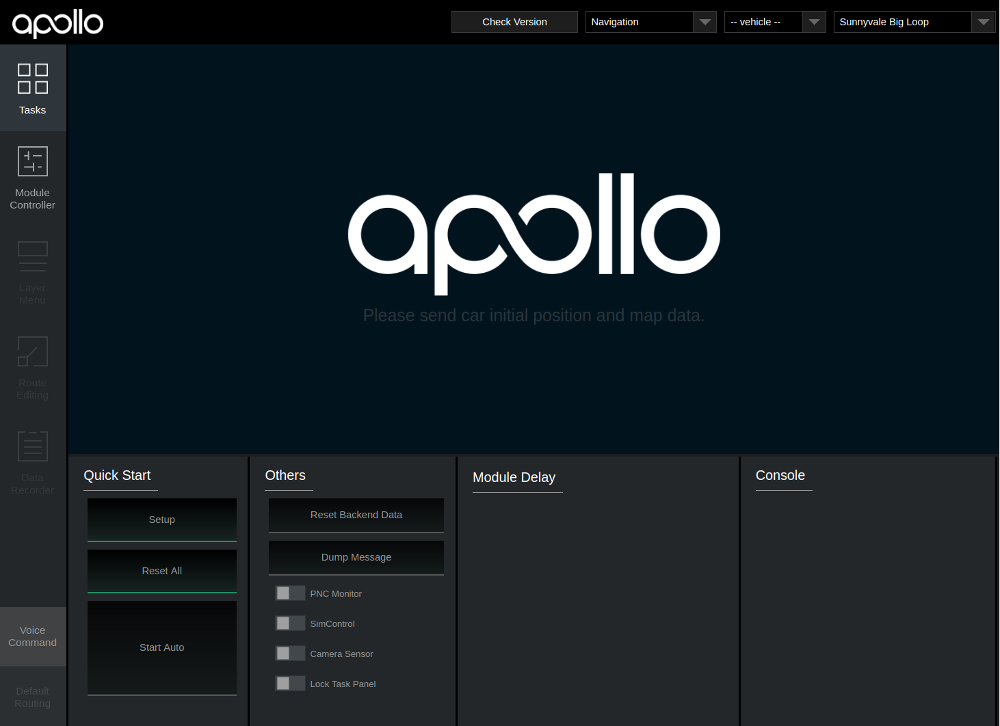
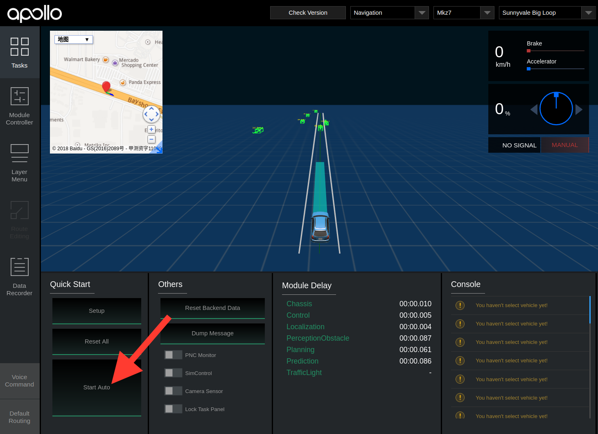

# Apollo 2.5 Quick Start Guide

The following guide serves as a user manual for launching the Apollo 2.5
software and hardware stack on vehicle.

The Apollo 2.5 Quick Start Guide focuses on Apollo 2.5 new features. For general
Apollo concepts, please refer to
[Apollo 1.0 Quick Start](https://github.com/ApolloAuto/apollo/blob/master/docs/quickstart/apollo_1_0_quick_start.md).

## Contents

- [Calibration Guide](#calibration-guide)
- [Hardware and Software Installation](#hardware-and-software-installation)
- [Dreamview Usage Table](#dreamview-usage-table)
- [Onboard Test](#onboard-test)

## Calibration Guide

For vehicle onboard testing make sure you have calibrated all sensors. For
sensor calibration, please refer to
[Apollo 2.0 Sensor Calibration Guide](https://github.com/ApolloAuto/apollo/blob/master/docs/quickstart/apollo_2_0_sensor_calibration_guide.md)
before you proceed.

## Hardware and Software Installation

Please refer to
[Apollo 2.5 Hardware and System Installation Guide](https://github.com/ApolloAuto/apollo/blob/master/docs/quickstart/apollo_2_5_hardware_system_installation_guide_v1.md)
for the steps to install the hardware components and the system software, as well as
[Apollo Software Installation Guide](https://github.com/ApolloAuto/apollo/blob/master/docs/quickstart/apollo_software_installation_guide.md).

## Dreamview Usage Table

For questions regarding Dreamview icons refer to the
[Dreamview Usage Table]( https://github.com/ApolloAuto/apollo/blob/master/docs/specs/dreamview_usage_table.md).

## Onboard Test

1. Plug-in an external hard-drive to any available USB port in the host machine.

2. Turn on the vehicle, and then the host machine.

3. Launch Docker Release Container.

4. Launch DreamView.

   Note\: Use your favorite browser to access Dreamview web service in your host
   machine browser with URL http://localhost:8888.

   

5. Select Mode, Vehicle and Map.

   

   Note\: You'll be required to setup profile before doing anything else. Click
   the dropdown menu to select **Navigation** mode, the HDMap and vehicle you
   want to use. The lists are defined in
   [HMI config file](https://raw.githubusercontent.com/ApolloAuto/apollo/master/modules/dreamview/conf/hmi.conf).

   Note\: It's also possible to change the profile on the right panel of the
   HMI, but just remember to click "Reset All" on the top-right corner to
   restart the system.

6. Start Modules.

   Click the "Setup" button.

   

   Go to **Module Controller** tab, check if all modules and hardware are ready.
   (Note\: In your offline environment, the hardware modules such as GPS,
   CANBus, Velodyne, Camera and Radar cannot be brought up.)
   (Note\: You may need to drive around a bit to get a good GPS signal.)

   

7. Under Default Routing select your desired route.

8. Under Tasks click Start Auto. (Note: Be cautious when starting autonomous
   driving, you should now be in autonomous mode.)

   

9. After autonomous testing is complete, under Tasks click Reset All, close all
   windows and shutdown the machine.

10. Remove the hard drive.
