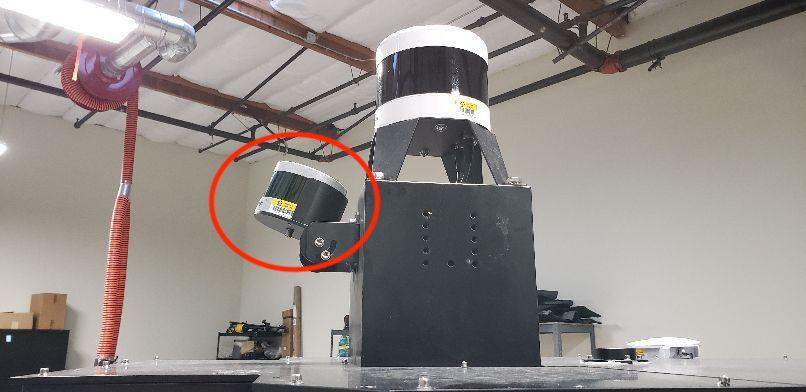
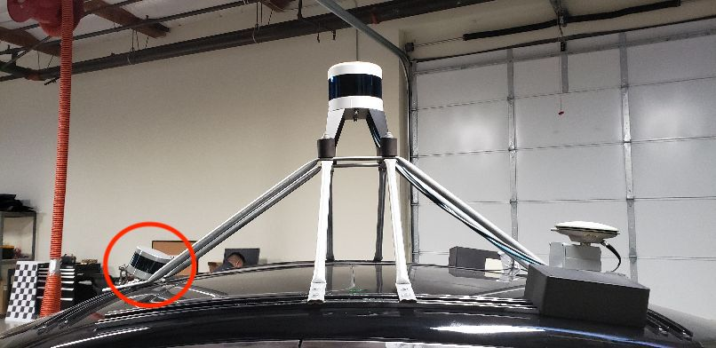
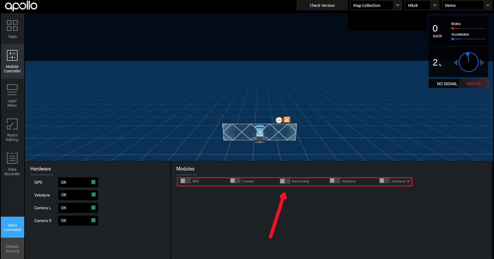

# Apollo 3.5 Map Collection Guide

This guide describes the process of map data collection and best practices for Apollo 3.5.

## Prerequisites

### Hardware requirements

Hardware installed as mentioned in this guide - [https://github.com/ApolloAuto/apollo/blob/master/docs/quickstart/apollo_3_5_hardware_system_installation_guide.md]
In order to proceed with Data collection, we need to use a single 16-Line LiDAR for traffic light detection placed on top of the car, tilted upwards as described below:

#### Installation of VLP-16 lidar

In Apollo 2.5, map creation services became a part of Apollo Open Source project. To acquire the data necessary for map creation, one would need to install an additional VLP-16 LiDAR on the vehicle. The purpose of this LiDAR is to collect point cloud information for objects above the FOV of the HDL-64 S3 LiDAR, such as traffic lights and signs. It requires a customized rack to mount the VLP-16 Lidar on top of the vehicle. The figure below shows one of the possible configurations: 

Another possible mounting is:




In this specific configuration, the VLP-16 LiDAR is mounted with an upward tilt of **20±2°**. The power cable of the VLP-16 is connected to the DataSpeed power panel. The ethernet connection is connected to the IPC (possibly through an ethernet switch). Similar to HDL-64 S3 LiDAR, the VLP-16 GPRMC and PPS receive input from the GPS receiver. Ideally, additional hardware should be installed to duplicate the GPRMC and PPS signal from the GPS receiver sent to HDL-64 and VLP-16 respectively. However, a simple Y-split cable may also provide adequate signal for both LiDARs. To distinguish from the HDL-64 S3 LiDAR, please follow the VLP-16 manual and configure the IP of VLP-16 to **192.168.20.14**, the data port to **2369**, and the telemetry port to **8309**. The pinout for the signal input from GPS receiver can also be found in the manual if you need customized cable.


For additional reference, please visit: [http://velodynelidar.com/vlp-16.html](http://velodynelidar.com/vlp-16.htmll)


### Software requirements
 Apollo 3.5 installed without any errors - [How to Build Apollo](https://github.com/ApolloAuto/apollo/blob/master/docs/howto/how_to_build_and_release.md)

### Calibration requirement

Refer to the [Apollo Sensor Calibration Guide](https://github.com/ApolloAuto/apollo/blob/master/docs/quickstart/multiple_lidar_gnss_calibration_guide.md)
for Sensor Calibration information.

### Additional requirements

1. **NVMe SSD Installation:** In order to avoid possible data loss caused by IO bottleneck, it is recommended to install NVME SSD hard disk in IPC.

2. **Satellite Base Station:** In order to get accurate mapping results, satellite base stations are needed to be set up to ensure the RTK can work properly.

## Good to know - Data Collection
1. **Weather condition:** Do not collect data when it is either raining or snowing. Please wait for the road to be as clean and dry as possible. You could collect data when there is a slight drizzle as the reflectance of the road would not change too much but it is still highly recommended to collect data in clear weather conditions.

2. Please make sure that the camera lens' are clean.

3. **Driving speed:** Try to keep you speed below 60 km/h (~ 37 mph). For roads with a higher speed limit, drive additional laps of the route (at least 2 or 3 more) to ensure accurate data collection.

## Data Collection Steps
Once all the prerequisites are met, follow the steps below:

1. Inside the Dreamview environment, Choose **Module Control** tab, select [Map Collection] mode, and switch on [GPS]、[Camera]、[Velodyne]、[Velodyne16].


Confirm whether the sensors are ready. The button should be `Green`


The only special case is that the additional front lidar 16 (which is facing upwards) which is installed for traffic lights, is not Green – this can be ignored when traffic light information is not being collected


2. Go into your terminal,
    - Enter `dev_docker` on your terminal and type `cyber_monitor` 
    - If all the topics are green, then they are working correctly
    - Once inspected, go to the next page, shortcut `fn + up/down arrow key`
    - Verify that all necessary topics are green
    
        Topic list for mapping: 
   ```
    /apollo/monitor/system_status
    /apollo/sensor/gnss/best_pose
    /apollo/sensor/gnss/gnss_status
    /apollo/sensor/gnss/imu
    /apollo/sensor/gnss/ins_stat
    /apollo/sensor/gnss/odometry
    /apollo/sensor/gnss/raw_data
    /tf
    /tf_static
    /apollo/sensor/camera/front_12mm/image/compressed
    /apollo/sensor/camera/front_6mm/image/compressed
    /apollo/sensor/lidar16/front/up/Scan
    /apollo/sensor/lidar16/front/up/compensator/PointCloud2
    /apollo/sensor/lidar128/Scan
    /apollo/sensor/lidar128/compensator/PointCloud2
    ```
3. Sync Localization module with your GPS signal,
    -	Go outside the garage where the GPS signal is good, you can confirm that the strength of the GPS signal is good when it turns green in Dreamview as mentioned in Step 1.
    -	Once you see the topic `gnss/best_pose` in cyber_monitor, then you know GPS is working. Inside the topic gnss/best_pose: click on it, if the `sol_type` specifies `narrow int` then it confirms that the signal is good enough to use
    -	Check for topic called `tf` in cyber_monitor to see if the Localization module is up and running
    -	Note, Localization takes time to warm up
    -	If the map in Dreamview has jiggly lines as seen in the image below, please restart dreamview or rebuild Apollo

          

4. Data collection,

    Once the localization module has warmed up and you see the topic `tf` in cyber_monitor, you are now ready for map data collection.
    -	After confirming GPS is working, you can start the data collection process, click on the `Recorder` button as seen in the image below

        

    - **[IMPORTANT]** Stay stationary for 3~5 minutes for the GPS signal to sync
    - Drive around in figure 8 shape to warm up the localization module.
    - While collecting map date, we should ensure the same route can be covered more than five times in the speed under 60KM/h. Try to include as many lanes as possible while covering the route.
    - You do not need to stop at any intersections, you can pass it slowly. But remember that at the intersection, it is necessary to collect at least 50m of all the lanes that enter the intersection in all directions to ensure the traffic lights and lane lines in all directions are captured completely and clearly.
5. Once you are done with data collection,
    -	Go to an area where the GPS signal is good 
    -	**[IMPORTANT]** Stay stationary for 3~5 minutes 
    -	Shut down the `Recorder` button and close sensor types like Lidar, Camera, GPS 
    
        


## Data Verification

-	Check if the point cloud of VLS 128 covers all obstacles surrounding the vehicle like trees, other vehicles - `cyber_visualizer`
-	Check that the framerate of VLS 128 is at least 10Hz `cyber_monitor`
-	Check that the LiDAR’s generated noise is moderate (not to high) `cyber_visualizer`
-	Check whether the IMU coordinates are correct and not rotated on a different axis `cyber_monitor`
- **[IMPORTANT]** If data is collected for the first time, or the extrinsic parameters between multiple-lidars and GNSS are changed or if a new vehicle is used to install Apollo 3.5 and data is being collected on this new vehicle, we would need to verify your map data. In order to verify your data, we would need you to collect the data of a small route and upload it as mentioned in the steps above.

## Data Size Management 

1. Set your camera frame rate to 10Hz (this will drastically lower the data size)
2. For Lidar topics:
    - For the vehicles that are needed for map data verification, all the LiDAR related point cloud topics (velodynescan, pointcloud2, compenstator/pointcloud2) must be saved and sent to us
    - After the vehicle passes the map verification, only velodynescan & pointcloud2 are needed for map creation
3.  In order to ensure a smooth upload process:
    - If you are currently collecting data on Apollo 3.5, then Apollo Cyber will take care of reducing the size of the data files via a splitter
    - If you are currently collecting data on Apollo 3.0 or lower based on ROS, you could split the file to a maximum size of 4GB per file. Please refer to the following [ROS guide](http://wiki.ros.org/rosbag/Commandline) and look for the keyword --split to learn how to split your bag.

## Data Upload

The collected map data is placed in the */apollo/data/bag/(start time of collection, e.g.,2018-04-14-21-20-24)* directory by default, package the data as tar.gz compressed file and contact the team (wuzhenni01@baidu.com) to learn how to mail/upload your data to us for map generation.

```
Note:
Please follow the aforementioned data collection guide to acquire data for a small area and upload it to use for verification purposes. This step is vital to understand if your sensors have captured the right data for our map generation process.
```

## FAQs

-	If localization doesn’t warm up and if the topic `tf` is not visible, then the best way to kickstart the module is by going to an area where you already have a map and start driving through it. 
Note: this will not work if you are collecting data for the first time. If you are collecting for the first time, keep driving in a loop in an area with good GPS signal
-	If the map has jiggly lines, restart Dreamview or rebuild Apollo