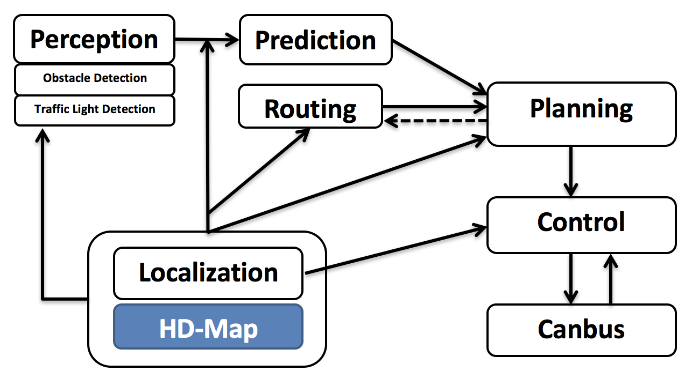

# Apollo 2.0 Software Architecture

Core software modules running on the Apollo 2.0 powered autonomous vehicle include:
* Perception: the perception module perceives the world surrounding the autonomous vehicle. There are two important submodules inside perception. The first one is obstacle detection and the other one is traffic light detection.
* Prediction: the prediction module predicts the future motion trajectories of the perceived obstacles
* Routing: the routing module is to tell the autonomous vehicle how to reach its destination via a serie of lanes or roads
* Planning: the planning module plans the spatio-temporal trajectory for the autonomous vehicle to take
* Control: the control module executes the planned spatio-temporal trajectory by generating control commands such as throttle, brake and steering
* CanBus: the interface where control commands are passed to the vehicle hardware. It is also where chasiss information gets passed through to the software system
* HD-Map: this module is more like a library. Instead of publishing/subscribing messages, it is frequently used as a query fashion engine to provide add-hoc structured information regarding the roads
* Localization: the localization module leverages various information sources such as GPS, Lidar and IMU to estimate where the autonomous vehicle is located.

The interactions of these modules are illustrated in the following picture.

Every module is running as a separate baidu CarOS based ROS node. Each module node publishes and subcribes certain topics. The subscribed topics serve as data input while the published topics serve as data output. The detailed interactions are as follows.
## Perception
Obviously perception strictly depends on the raw sensor data such as Lidar point cloud data and camera data. However, besides these raw sensor data inputs, traffic light detection also needs to depend on the localization data as well as the HD-Map. Since real-time ad-hoc fashioned traffic light detection is computationally infeasible, the traffic light detection will need localization to determine when and where to start detecting traffic lights through the camera captured pictures.

**Perception seems to be so different from other modules like prediction, routing , planning, control, canbus. Hard to describe its data interfaces. Maybe better to be a little blurring here.**

## Prediction
Prediction module “predicts” the future motion trajectories for all the perceived obstacles. And the output prediction message also wrapps the perception information. Prediction subscribes two both localization and perception obstacle messages as shown below.

When localization update is received, the prediction module updates its internal status. And the actual prediction is triggred when perception sends out its published perception obstacle message.

## Localization
The routing module fuses various information to locate where the autonomous vehicle is at. There are two types of localization modes. The first localization method is an RTK based one, with a timer based callback function  “OnTimer”.

The other localization method is the “Multiple Sensor Fusion” (MSF) method, where a bunch of event triggered callback functions are registered, such as:

## Routing
The routing module also needs to know where the autnomous vehicle location is, as well as the destination, in order to compute the passage lanes and roads towards the destination. The important data interface is an event trigged function called “OnRoutingRequest”, in which “RoutingResponse” will be computed and published.

## Planning
The planning module interacts with almost every other module, since all various information sources are required to plan a safe and collision free trajectory. Firstly, the planning module takes the prediction output. Note that since prediction output wraps the original perceived obstacle, planning module just need to subscribe to traffic light detection output rather than perception obstacles output. Secondly, the planning module takes the routing output. Under certain scenarios, the planning module might also trigger new routing computation by sending routing request if the current route could not be faithfully followed. At last, the planning module will have to know the location (Localization: where I am) as well as current autonomous vehicle information (Chassis: what is my status).  The planning module is also triggered by a fixed frequency, and the main data interface is the “OnTimer” callback function which invokes the “RunOnce” function.

The data dependency such as chassis, localization, traffic light, prediction, etc,  are managed through the “AdapterManager” class. For example, localization is managed through “AdapterManager::GetLocalization()”, and the other modules are similar.

## Control
Control takes the planned trajectory as input, and generates the control command to pass to CanBus.  It has main data interfaces like: OnPad, OnMonitor, OnTimer, localization and CanBus messages.

The “OnPad” and “OnMonitor” are control interaction with the PAD based human interface and simulations. The main data interface is the “OnTimer” interface which periodically produces the actual control commands.

## CanBus
The CanBus has two data interfaces as shown below:

The first data interface is a timer based publisher with callback function “OnTimer”. This data interface will periodically publish the chassis information as well as chassis details if enabled.

The second data interface is an event based published with callback function “OnControlCommand”, which is triggered when the CanBus module receives control commands.
