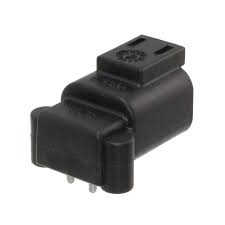
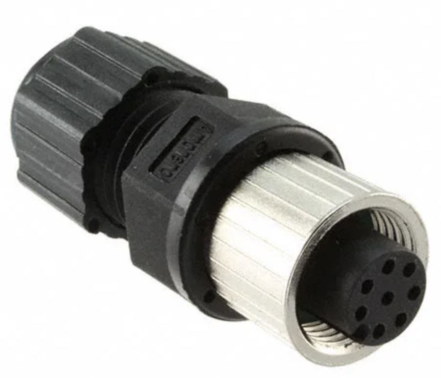

## Guide for Apollo Sensor Unit

Apollo Sensor Unit (ASU) is designed to work with Industrial PC (IPC) to implement sensor fusion, vehicle control and network access in Apollo's autonomous driving platform.

The ASU system provides sensor interfaces to collect data from various sensors, including cameras, Lidars, Radars, and Ultrasonic Sensors. The system also utilizes pulse per second (PPS) and GPRMC signals from GNSS receiver to implement data collection synchronization for the camera and LiDAR sensors.

The communication between the ASU and the IPC is through PCI Express Interface. ASU collects sensor data and passes to IPC via PCI Express Interface, and the IPC uses the ASU to send out Vehicle Control commands in the Controller Area Network (CAN) protocol.

In addition, Lidar connectivity via Ethernet, WWAN gateway via 4G LTE module, and WiFi access point via WiFi module will be enabled in the future releases.

### System Connectors

#### Front Panel Connectors

1. External GPS PPS / GPRMC Input Port
2. FAKRA Camera Data Input Port (5 ports)
3. 100 Base-TX/1000 Base-T Ethernet Port (2 Ports)
4. KL-15 (AKA Car Ignition) Signal Input Port

#### Rear Panel Connectors

1. General purpose UART port(reserved)
2. External PCI Express Port (Support X4 or X8) For connections to IPC, please use EXTN port.
3. GPS PPS/GPRMC Output Rectangular Port (3 Ports) for LiDAR
4. Power and PPS/GPRMC Cylindrical Output Port for Stereo Camera/LiDAR
5. CAN Bus (4 Ports)
6. Main Power Input Connector

### Purchase Channels

The Apollo Sensor Unit is currently only provided to our Partners and certain developers. Questions regarding the availability and access to ASU should be directed to  apollo-hw@baidu.com

### Installation

1. Power Cable

   The main power is from vehicle battery, 9V ~ 36V, 120W.

   

   |MFR|MPN|Description|
   |---------------|--------|-----------|
   |TE Connectivity|DTF13-2P|DT RECP ASM|

   | PIN # | NAME | I/O  | Description        |
   | ----- | ---- | ---- | ------------------ |
   | 1     | 12V  | PWR  | 12V (9V~36V, 120W) |
   | 2     | GND  | PWR  | GROUND             |

2. FPD-Link III cameras.

   There are 5 FAKRA connectors for FPD Link III cameras in ASU Front Panel labeled with 1~5, respectively, from right to left. The ASU can support up to 5 cameras by enabling Camera 1 ~ 5 whose deserializers (TI, DS90UB914ATRHSTQ1) convert FPD Link III signals into parallel data signals.

   |Camera #| I2C Address | Deserializer|
   | -------- | ----------- | ------------------------- |
   | 1        | 0x60        | DS90UB914ATRHSTQ1         |
   | 2        | 0x61        | DS90UB914ATRHSTQ1         |
   | 3        | 0x62        | DS90UB914ATRHSTQ1         |
   | 4        | 0x63        | DS90UB914ATRHSTQ1         |
   | 5       | 0x64        | DS90UB914ATRHSTQ1         |

3. GPS synchronization input channel

   GPS synchronization input channel is using 1565749-1 from TE Connectivity as the connector. The connector information and the pinout are shown in the tables below.

   

   | MFR             | MPN       | Description                               |
   | :-------------- | --------- | ----------------------------------------- |
   | TE Connectivity | 1565749-1 | Automotive Connectors 025 CAP ASSY, 4 Pin |

   | PIN # | NAME  | I/O   | Description                                                  |
   | ----- | ----- | ----- | ------------------------------------------------------------ |
   | 1     | GPRMC    | INPUT    | GPRMC TX                                                 |
   | 2     | NC | NC | NO CIRCUIT |
   | 3     | GND   | PWR   | GROUND (the ground for PPS and GPRMC should be shorted on ground) |
   | 4     | PPS   | INPUT | Pulse per Second from GPS transceiver, 3.3V CMOS Signal      |

4. GPS synchronization output channels

   ASU forwards the duplicated GPS PPS/GPRMC from external GPS to the customized 8 Pin connector. This connector provides 3 sets of PPS/GPRMC output for sensors that need to be synchronized, such as LiDARs, etc.

   

   |MFR| MPN| Description|
   | --------------- | --------- | ------------------------------------------------- |
   | TE Connectivity | 1376350-2 | Automotive Connectors 025 I/O CAP HSG ASSY, 8 Pin |

   | PIN # | NAME   | I/O    | Description                                             |
   | ----- | ------ | ------ | ------------------------------------------------------- |
   | 1     | GPRMC0 | OUTPUT | Channel 0, GPRMC OUTPUT, RS-232 Signal                  |
   | 2     | PPS0   | OUTPUT | Pulse per Second from GPS transceiver, 3.3V CMOS Signal |
   | 3     | GPRMC1 | OUTPUT | Channel 1, GPRMC OUTPUT, RS-232 Signal                  |
   | 4     | PPS1   | OUTPUT | Pulse per Second from GPS transceiver, 3.3V CMOS Signal |
   | 5     | GPRMC2 | OUTPUT | Channel 2, GPRMC OUTPUT, RS-232 Signal                  |
   | 6     | GND    | PWR    | GROUND                                                  |
   | 7     | GND    | PWR    | GROUND                                                  |
   | 8     | PPS2   | OUTPUT | Pulse per Second from GPS transceiver, 3.3V CMOS Signal |

5. CAN interface

   The ASU provides 4 CAN Bus ports, the datapath is :

   

   | MFR             | MPN       | Description                                        |
   | --------------- | --------- | -------------------------------------------------- |
   | TE Connectivity | 1318772-2 | Automotive Connectors 025 I/O CAP HSG ASSY, 12 Pin |

   | PIN # | NAME   | I/O   | Description     |
   | ----- | ------ | ----- | --------------- |
   | 1     | CANH-0 | INOUT | Channel 0, CANH |
   | 2     | CANL-0 | INOUT | Channel 0, CANL |
   | 3     | GND    | PWR   | Ground          |
   | 4     | CANH-1 | INOUT | Channel 1, CANH |
   | 5    | CANL-1 | INOUT | Channel 1, CANL |
   | 6    | GND    | PWR   | Ground          |
   | 7    | CANH-2 | INOUT | Channel 2, CANH |
   | 8    | CANL-2 | INOUT | Channel 2, CANL |
   | 9    | GND    | PWR   | Ground          |
   | 10   | CANH-3 | INOUT | Channel 3, CANH |
   | 11   | CANL-3 | INOUT | Channel 3, CANL |
   | 12   | GND    | PWR   | Ground          |

6. GPS PPS / GPRMC Output Rectangular Port

    The Connector provides 8 ports for 3 LiDARs

    

      | MFR             | MPN       | Description                                        |
   | --------------- | --------- | -------------------------------------------------- |
   | Digi-Key | A121343-ND | 025 I/O PLUG HSG ASSY 8P |
    |

    | PIN # | NAME   | I/O   | Description     |
   | ----- | ------ | ----- | --------------- |
   | 1     | GPRMC | OUT | GPRMC (ASU) -> Pin4 GPS_RXD_CNT (LiDAR 1) |
   | 2     | PPS | OUT | PPS (ASU) -> Pin1 GPS_PULSE_CNT (LiDAR 1)|
   | 3     | GPRMC    | OUT   | GPRMC (ASU) -> Pin4 GPS_RXD_CNT (LiDAR 2)           |
   | 4     | PPS| OUT | PPS (ASU) -> Pin1 GPS_PULSE_CNT (LiDAR 2)|
   | 5    | GPRMC | OUT | GPRMC (ASU) -> Pin4 GPS_RXD_CNT (LiDAR 3) |
   | 6    | GND    | PWR   | Ground (ASU) -> Pin3 GND (LiDAR 1,3)      |
   | 7    | GND | PWR | Ground (ASU) -> Pin3 GND (LiDAR 2)  |
   | 8    | PPS | OUT | PPS (ASU) -> Pin1 GPS_PULSE_CNT (LiDAR 3)|

7. PPS/GPRMC Cylindrical Output Port for Stereo Camera/ LiDAR

    The Connector provides 8 ports but we currently use only 3

    

      | MFR             | MPN       | Description                                        |
   | --------------- | --------- | -------------------------------------------------- |
   | Digi-Key | APC1735-ND | CONN RCPT FMALE 8POS SOLDER CUP |

    | PIN # | NAME   | I/O   | Description     |
    | ----- | ------ | ----- | --------------- |
    |   6     | PPS |  OUT | PPS (ASU) -> Pin1 GPS_PULSE_CNT (LiDAR)
    | 7     | GPRMC | OUT | GPRMC (ASU) -> Pin4 GPS_RXD_CNT (LiDAR) |
    | 8     |  GND   | PWR   | Ground (ASU) -> Pin3 GND (LiDAR)        |

## Disclaimer

This device is `Apollo Platform Supported`