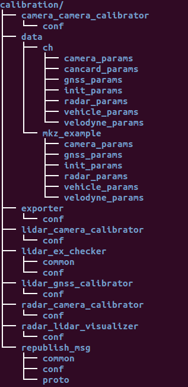
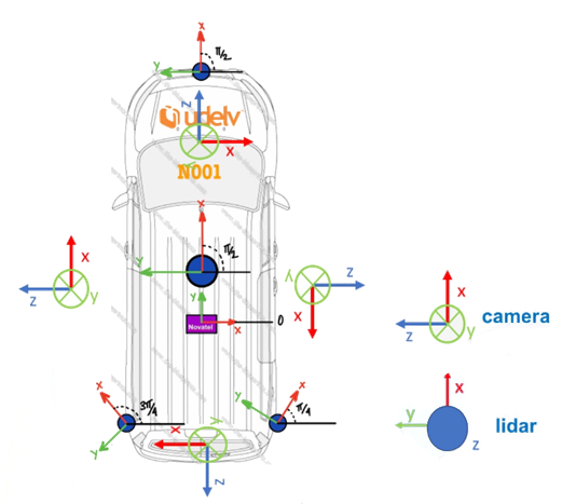
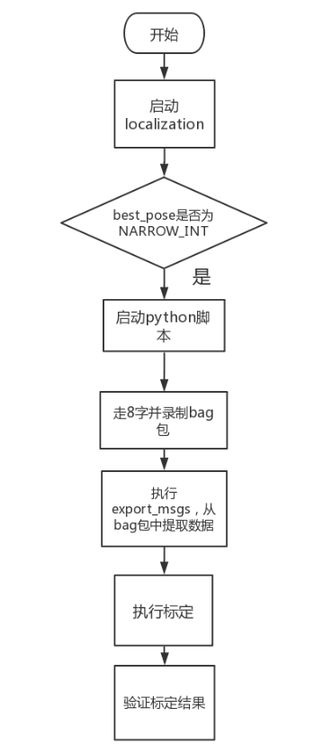
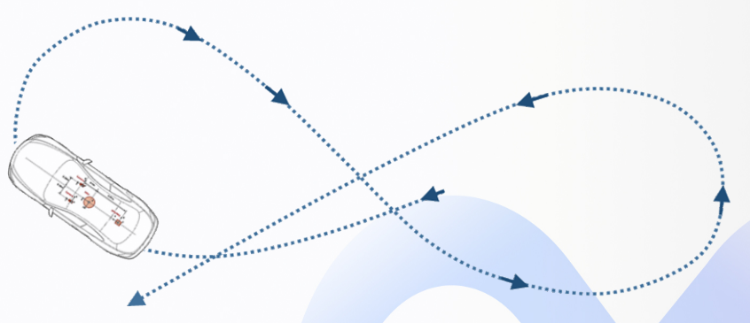
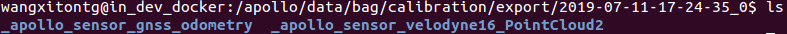
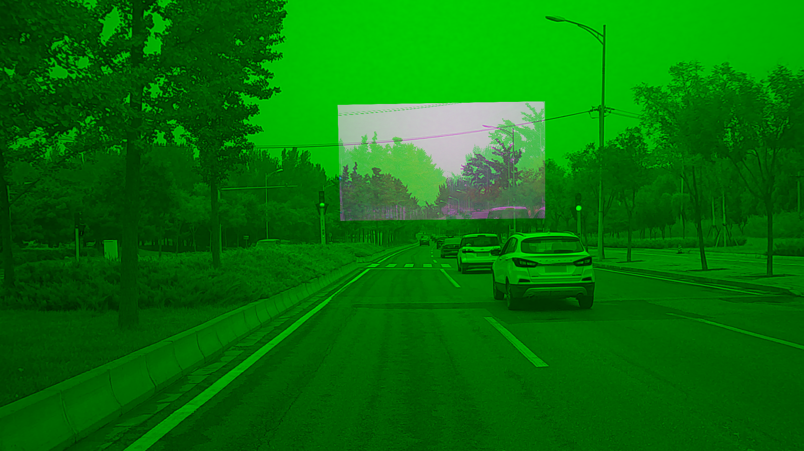
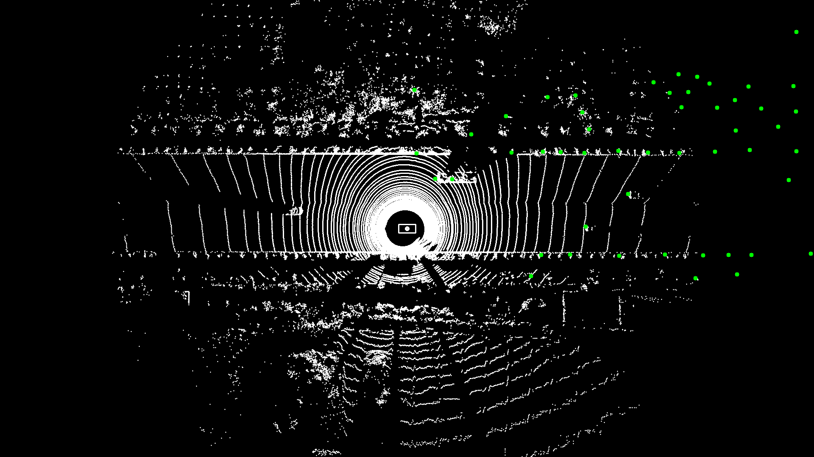

# 感知设备标定
## 前提条件
 - GPS、Localization模块被正确配置且能正常启动
 - 实现了循迹
 - 正确完成了感知设备集成
 
## 准备工作
  
 -  下载[multi-lidar-gnss标定工具](https://apollocache.blob.core.windows.net/apollo-cache/multi_lidar_gnss_calibrator_and_doc.zip)、[传感器标定工具](https://github.com/ApolloAuto/apollo/releases/download/v2.0.0/calibration.tar.gz)并将文件提取到`modules /calibration`目录下，目录结构如下所示：



|工具目录名称 | 工具作用|  
|---|---|
| exporter |   从bag文件中提取odometry、pointcloud数据 |
| lidar_gnss_calibrator |   根据提取的odometry、pointcloud数据，生成lidar-imu的标定结果| 
| camera_camera_calibrator  |  camera-camera标定工具 |
|    lidar_camera_calibrator   |  lidar-camera标定工具|
| radar_camera_calibrator   |  radar-camera标定工具 |
|    radar_lidar_visualizer  |  radar标定结果可视化工具|

## 进行传感器标定之前的说明
介绍一些与传感器标定相关的知识，希望用户先对这些知识点理解后再进行传感器的标定。

### ch目录文件结构说明
传感器的外参文件、内参文件存储在`modules/calibration/data/ch`目录下，标定的目的就是为了获得传感器的外参、内参文件。
标定相关目录的作用如下表所示：

| 目录名称  | 作用  |
|---|---|
| camera_params  | 存放摄像头内外参文件  | 
|init_params	|	存放初始化外参文件|
|radar_params | 存放radar外参文件|
|velodyne_params	|	存放lidar标定文件|

标定相关文件的作用如下表所示：

| 目录名称  | 作用  |
|---|---|
| long_camera_extrinsics.yaml|长焦摄像头外参文件|
|	long_camera_intrinsics.yaml|长焦摄像头内参文件	|
|short_camera_extrinsics.yaml	|短焦摄像头外参文件	|
|	short_camera_intrinsics.yaml|短焦摄像头内参文件	|
|long_camera_extrinsics.yaml_init	|	长焦摄像头初始化外参文件|
|	radar_extrinsics.yaml_init|	 radar初始化外参文件  |
|	short_camera_extrinsics.yaml_init|	短焦摄像头初始化外参文件|
|radar_extrinsics.yaml	|	radar外参文件|
|VLP16_calibration.yaml	|lidar内参标定文件(厂商提供)	|
|velodyne16_height.yaml	|	lidar到地面高度文件|
|velodyne16_novatel_extrinsics_example.yaml		|	lidar外参文件|

### yaml外参文件格式解析
ros使用yaml文件来描述两个传感器之间的位置、姿态的关系，上文中提到的`.yaml`、`.yaml_init`文件均采用相同的格式，这里以`short_camera_extrinsics.yaml`文件为例对外参文件格式进行说明：
```
	header:
	  seq: 0
	  frame_id: Velodyne16
	  stamp:
	    secs: 0
	    nsecs: 0
	child_frame_id: short_camera
	transform:
	  rotation:
	    z: -0.4753745911796197
	    y: 0.5034432392822331
	    x: -0.5043470074890593
	    w: 0.5159437943406748
	  translation:
	    x: 0.7608883414172971
	    y: 0.3774716827859863
	    z: -0.2866475203991122
```	
其中：`frame_id: Velodyne16`代表以坐标系`Velodyne16`为基坐标系，`child_frame_id: short_camera`代表以坐标系`short_camera`为子坐标系，`rotation`、`translation`分别代表从基坐标系变换到子坐标系要进行的旋转变换、平移变换。

### 各传感器坐标系的定义及初始化外参文件的配置

 - 需要进行标定的传感器包括 IMU、Lidar、Camera、Radar的初始化坐标系定义如下图所示：

 

### 传感器标定的相关脚本

 - 在进行传感器标定时，需要向传感器提供相应的`topic`，大部分`topic`都可以由传感器直接提供，但由于GNSS设备的限制，`/apollo/sensor/gnss/odometry`、`/apollo/sensor/gnss/ins_stat`这两个`topic`不能由GNSS设备直接给出，需要借助`/apollo/modules/tools/sensor_calibration/`下的两个脚本工具。在`localization`模块正常启动且输出`/apollo/localization/pose`数据时，分别执行`python modules/tools/sensor_calibration/ins_stat_publisher.py`、`python modules/tools/sensor_calibration/odom_publisher.py`两个命令，便可以分别产生`/apollo/sensor/gnss/ins_stat`、`/apollo/sensor/gnss/odometry`这两个`topic`。
 - 注意，在执行`sensor_calibration/ins_stat_publisher.py`脚本前，请务必检查`/apollo/sensor/gnss/best_pose`中GPS信号质量，确保GPS信号质量为`NARROW_INT`时，才可以使用`ins_stat_publisher.py`脚本。


  
## 修改配置文件：
|  修改文件    |     修改内容|
|---|---|
|    global_flagfile.txt     | 添加`--localization_tf2_child_frame_id=novatel` |
| global_flagfile.txt  | 添加 `--pointcloud_raw_topic=/apollo/sensor/velodyne16/PointCloud2`|
| global_flagfile.txt  | 添加 `--velodyne_raw_topic=/apollo/sensor/velodyne16/VelodyneScanUnified`|
|global_flagfile.txt   |添加`--pointcloud_topic=/apollo/sensor/velodyne16/compensator/PointCloud2` |
|localization.conf     |修改`pointcloud_topic`内容为 `/apollo/sensor/velodyne16/compensator/PointCloud2`|
| localization.conf    | 确认`enable_lidar_localization`为`false`;所有传感器标定完成后，需要再改为`true`|
|localization.conf     | 根据实际修改`lidar_height_default`参数|
|localization.conf     |根据实际修改`local_utm_zone_id`参数|
|localization.conf | 根据IMU到天线的位置实际修改`imu_to_ant_offset_x`参数|
|localization.conf| 根据实际修改`imu_to_ant_offset_y`参数|
|localization.conf| 根据实际修改`imu_to_ant_offset_z`参数|
|localization.conf| 根据实际修改`imu_to_ant_offset_ux`参数|
|localization.conf| 根据实际修改`imu_to_ant_offset_uy`参数|
|localization.conf| 根据实际修改`imu_to_ant_offset_uz`参数|

## Lidar-IMU的标定

### 参考文档：[multiple_lidar_gnss_calibration_guide_cn.md](https://github.com/ApolloAuto/apollo/blob/r3.0.0/docs/quickstart/multiple_lidar_gnss_calibration_guide_cn.md) 
Lidar-IMU标定流程图如下图所示：



### 录制bag包
进行Lidar-IMU的标定，需要录制包含传感器信息的bag包作为数据输入，所需的`topic`及`topic`频率如下表所示。

| 传感器       | Topic名称                                  | Topic发送频率（Hz） |
| --------- | ---------------------------------------- | ------------- |
| VLP-16    |  /apollo/sensor/velodyne16/PointCloud2   | 10            |
| INS       | /apollo/sensor/gnss/odometry             | 100           |

录制bag时，以8字形轨迹控制车辆，缓慢行驶，并使转弯半径尽量小 。行驶的时长3分钟即可，但要保证标定数据至少包含一个完整的8字，如下图所示。



### 配置`export_config.yaml`文件
 - 将`/apollo/modules/calibration/exporter/conf`目录下的`export_config.yaml`文件修改为如下内容：
 - 将录制的包含传感器信息的bag包存储到 `/apollo/data/bag/calibration/`目录下

```
bag_path: "/apollo/data/bag/calibration/"         #录制的bag包位置
dump_dir: "/apollo/data/bag/calibration/export/"  #从bag包提取出的文件存储路径
topics:
    - /apollo/sensor/gnss/odometry:
        type: ApolloOdometry
    - /apollo/sensor/velodyne16/PointCloud2:
        type: PointCloud2
```
### 处理bag包，获得传感器数据
在docker环境内执行如下指令，处理bag包，获得传感器数据：
```
budaoshi@in_dev_docker:/apollo$ /apollo/modules/calibration/exporter/export_msgs --config /apollo/modules/calibration/exporter/conf/export_config.yaml
```
其中：`/apollo/modules/calibration/exporter/export_msgs`为标定工具中可执行文件`export_msgs`的绝对路径；`/apollo/modules/calibration/exporter/conf/export_config.yaml`为上文中修改的配置文件的绝对路径，执行成功后，会在上文中配置的`dump_dir`目录中生成从bag中提取的数据文件，如下图所示：



### 配置`multi_lidar_gnss_calibrator_config.yaml`文件
将`/apollo/modules/calibration/lidar_gnss_calibrator/conf`目录下的`multi_lidar_gnss_calibrator_config.yaml`文件的内容修改为如下的形式：
```
data:
    odometry: "/apollo/data/bag/calibration/export/multi_lidar_gnss/_apollo_sensor_gnss_odometry/odometry"
    lidars: 
        - velodyne16: 
            path: "/apollo/data/bag/calibration/export/multi_lidar_gnss/_apollo_sensor_velodyne16_PointCloud2/"
    result: "/apollo/data/bag/calibration/export/multi_lidar_gnss/result/"
calibration:
    init_extrinsics:
        velodyne16:
            translation:    
                x: 0.0
                y: 1.77 
                z: 1.1
            rotation:
                x: 0.183014 
                y: -0.183014 
                z: 0.683008 
                w: 0.683008
    steps: 
        - source_lidars: ["velodyne16"]
          target_lidars: ["velodyne16"]
          lidar_type: "multiple"
          fix_target_lidars: false
          fix_z: true
          iteration: 3
        - source_lidars: ["velodyne16"]
          target_lidars: ["velodyne16"]
          lidar_type: "multiple"
          fix_target_lidars: false
          fix_z: true
          iteration: 3
```
注:校准部分提供了外部信息的初始猜测。所有的外部信息都是从激光雷达到GNSS，这意味着这种变换将激光雷达坐标系中定义的点的坐标映射到GNSS坐标系中定义的这一点的坐标。初始猜测要求旋转角度误差小于5度，平移误差小于0.1米。
### 执行标定
执行如下命令，进行Lidar-IMU的标定,得到标定结果
```
budaoshi@in_dev_docker:/apollo$ /apollo/modules/calibration/lidar_gnss_calibrator/multi_lidar_gnss_calibrator --config /apollo/modules/calibration/lidar_gnss_calibrator/conf/multi_lidar_gnss_calibrator_config.yaml
```


### 标定结果校验
Lidar-IMU标定结果验证参考：[multiple_lidar_gnss_calibration_guide_cn.md](https://github.com/ApolloAuto/apollo/blob/r3.0.0/docs/quickstart/multiple_lidar_gnss_calibration_guide_cn.md)

## Camera-Camera标定
###  相机内参文件
内参包含相机的焦距、主点和畸变系数等信息，可以通过一些成熟的相机标定工具来获得，例如 [ROS Camera Calibration Tools](http://wiki.ros.org/camera_calibration/Tutorials/MonocularCalibration) 和 [Camera Calibration Toolbox for Matlab](http://www.vision.caltech.edu/bouguetj/calib_doc/)。内参标定完成后，需将结果转换为 `.yaml` 格式的文件。下面是一个正确的内参文件样例：

```
  header: 
    seq: 0
    stamp: 
      secs: 0
      nsecs: 0
    frame_id: short_camera
  height: 1080
  width: 1920
  distortion_model: plumb_bob
  D: [-0.535253, 0.259291, 0.004276, -0.000503, 0.0]
  K: [1959.678185, 0.0, 1003.592207, 0.0, 1953.786100, 507.820634, 0.0, 0.0, 1.0]
  R: [1.0, 0.0, 0.0, 0.0, 1.0, 0.0, 0.0, 0.0, 1.0]
  P: [1665.387817, 0.0, 1018.703332, 0.0, 0.0, 1867.912842, 506.628623, 0.0, 0.0, 0.0, 1.0, 0.0]
  binning_x: 0
  binning_y: 0
  roi: 
    x_offset: 0
    y_offset: 0
    height: 0
    width: 0
    do_rectify: False
```
标定后的内参文件，放置到形如`/apollo/modules/calibration/data/ch`的路径中，其中`ch`为车辆参数文件夹，用户根据自身情况选择，后文不再重复说明。	
我们建议每一只相机都需要单独进行内参标定，而不是使用统一的内参结果。这样可以提高外参标定的准确性。
### 配置`camera_camera_calibrator.conf`文件，配置形式如下所示：
```
##################################################################
# the long focus camera image topic name.
# type: string
# default: 
--long_image_topic=/apollo/sensor/camera/traffic/image_long

# the short focus camera image topic name.
# type: string
# default: 
--short_image_topic=/apollo/sensor/camera/traffic/image_short

# the odometry topic name.
# type: string
# default: 
--odometry_topic=/apollo/sensor/gnss/odometry

# the ins_stat topic name.
# type: string
# default:
--ins_stat_topic=/apollo/sensor/gnss/ins_stat

# the calibrated long focus camera intrinsics.
# type: string
# default: 
--long_camera_intrinsics_filename=/apollo/modules/calibration/data/ch/camera_params/long_camera_intrinsics.yaml

# the calibrated short focus camera intrinsics.
# type: string
# default: 
--short_camera_intrinsics_filename=/apollo/modules/calibration/data/ch/camera_params/short_camera_intrinsics.yaml

# the init camera-camera extrinsics.
# type: string
# default: 
--init_extrinsics_filename=/apollo/modules/calibration/data/ch/init_params/long_camera_extrinsics.yaml_init

# calibration result output path.
# type: string
# default: 
--output_path=/apollo/modules/calibration/data/ch

# max speed of car, unit: km/h
# type: double
# default: 20.0
--max_speed_kmh=20.0
```
### 配置初始化外参文件
用户需根据车辆实际情况，测量摄像头之间的初始化外参，并放修改`/apollo/modules/calibration/data/ch/init_params/long_camera_extrinsics.yaml_init` 文件。初始化外参文件的形式如下所示：
```

header:
  seq: 0
  stamp:
    secs: 0
    nsecs: 0
  frame_id: short_camera
child_frame_id: long_camera
transform:
  rotation:
    x: 0
    y: 0
    z: 0
    w: 1
  translation:
    x: -0.1
    y: 0
    z: 0

```
### 所需`topic`

| 传感器       | Topic名称                                 |Topic发送频率（Hz）|
| ------------ | ----------------------------------------- | ----------------- |
| Short_Camera | /apollo/sensor/camera/traffic/image_short | 9                 |
| Long_Camera  | /apollo/sensor/camera/traffic/image_long  | 9                 |
| INS          | /apollo/sensor/gnss/odometry              | 100               |
| INS          | /apollo/sensor/gnss/ins_stat              | 2                 |

### 修改摄像头Topic的频率
摄像头数据默认的发布频率为30HZ，在进行标定过程中，需要将频率修改为9HZ。修改方法如下：
- 关闭摄像头模块
- 分别将`modules/calibration/data/ch/camera_params/start_leopard.launch`、`modules/drivers/camera/launch/start_leopard.launch`两个文件中的`<arg name="frame_rate" default="30"/>`修改为`<arg name="frame_rate" default="9"/>`
- 执行如下命令，重新编译摄像头
```
  bash apollo.sh build_usbcam
``` 
- 启动摄像头模块，使用如下命令，查看摄像头数据发布频率是否修改成功
```
  rostopic hz /apollo/sensor/camera/traffic/image_short
  rostopic hz /apollo/sensor/camera/traffic/image_long
```

### 执行标定
执行如下命令，进行camera_camera的标定：

```
	cd /apollo/scripts
	bash sensor_calibration.sh camera_camera
```
### 输出内容
外参文件： 长焦相机到广角相机的外参文件。
验证参考图片：包括一张长焦相机图像、一张广角相机图像及一张长焦相机依据标定后的外参投影到广角相机的去畸变融合图像。
### 标定结果验证

 - 基本方法：根据长焦相机投影到短焦相机的融合图像进行判断，绿色通道为短焦相机图像，红色和蓝色通道是长焦投影后的图像，目视判断检验对齐情况。在融合图像中的融合区域，选择场景中距离较远处（50米以外）的景物进行对齐判断，能够重合则精度高，出现粉色或绿色重影（错位），则存在误差，当误差大于一定范围时（范围依据实际使用情况而定），标定失败，需重新标定（正常情况下，近处物体因受视差影响，在水平方向存在错位，且距离越近错位量越大，此为正常现象。垂直方向不受视差影响）。
 - 结果示例：如下图所示，图1为满足精度要求外参效果，图2为不满足精度要求的现象，请重新进行标定过程。




## lidar-camera	
### 配置`lidar_camera_calibrator.conf`文件，配置形式如下所示，用户根据实际情况修改：
```
##################################################################
# the camera image topic name.
# type: string
# default: 
--image_topic=/apollo/sensor/camera/traffic/image_short

# the lidar topic name.
# type: string
# default:
--lidar_topic=/apollo/sensor/velodyne16/compensator/PointCloud2

# the odometry topic name.
# type: string
# default: 
--odometry_topic=/apollo/sensor/gnss/odometry

# the ins_stat topic name.
# type: string
# default:
--ins_stat_topic=/apollo/sensor/gnss/ins_stat

# the calibrated camera intrinsics.
# type: string
# default: 
--camera_intrinsics_filename=/apollo/modules/calibration/data/ch/camera_params/short_camera_intrinsics.yaml

# the init lidar-camera extrinsics.
# type: string
# default: 
--init_extrinsics_filename=/apollo/modules/calibration/data/ch/init_params/short_camera_extrinsics.yaml_init

# calibration result output path.
# type: string
# default: 
--output_path=/apollo/modules/calibration/data/ch

# the number of data used to calibrate
# type: int32
# default: 30
--calib_stop_count=30

# the maximum vehicle speed for capturing data, unit: km/h
# type: double
# default: 5
--max_speed_kmh=5
```
### 配置初始化外参文件
用户需根据车辆实际情况，测量lidar到short_camera的初始化外参，并修改`/apollo/modules/calibration/data/ch/init_params/short_camera_extrinsics.yaml_init`文件。初始化外参文件的形式如下所示：
```
header:
  seq: 0
  stamp:
    secs: 0
    nsecs: 0
  frame_id: velodyne16
child_frame_id: short_camera
transform:
  rotation:
    y: -0.5
    x: 0.5
    w: -0.5
    z: 0.5
  translation:
    x: 0.67
    y: -0.1
    z: -0.6
```	
### 所需`topic`

| 传感器       | Topic名称                                 |Topic发送频率（Hz）|
| ------------ | ----------------------------------------- | ----------------- |
| Short_Camera | /apollo/sensor/camera/traffic/image_short | 9                 |
| LiDAR  | /apollo/sensor/velodyne16/compensator/PointCloud2  | 10             |
| INS          | /apollo/sensor/gnss/odometry              | 100               |
| INS          | /apollo/sensor/gnss/ins_stat              | 2                 |

### 执行标定
执行如下命令，进行lidar_camera的标定：

```
	cd /apollo/scripts
	bash sensor_calibration.sh lidar_camera
```
### 输出内容
外参文件：相机到多线激光雷达的外参文件。
验证参考图片：两张激光雷达点云利用标定结果外参投影到相机图像上的融合图像，分别是依据点云深度渲染的融合图像，和依据点云反射值渲染的融合图像。
### 标定结果验证

 - 基本方法：在产生的点云投影图像内，可寻找其中具有明显边缘的物体和标志物，查看其边缘轮廓对齐情况。如果50米以内的目标，点云边缘和图像边缘能够重合，则可以证明标定结果的精度很高。反之，若出现错位现象，则说明标定结果存在误差。当误差大于一定范围时（范围依据实际使用情况而定），该外参不可用。
 - 结果示例：如下图所示，图1为准确外参的点云投影效果，图2为有偏差外参的点云投影效果


## Radar-Camera标定
### 配置`radar_camera_calibrator.conf`文件，配置形式如下所示，用户根据实际情况修改：
```
##################################################################
# the camera image topic name.
# type: string
# default: 
--image_topic=/apollo/sensor/camera/traffic/image_short

# the odometry topic name.
# type: string
# default: 
--odometry_topic=/apollo/sensor/gnss/odometry

# the ins_stat topic name.
# type: string
# default:
--ins_stat_topic=/apollo/sensor/gnss/ins_stat

# the calibrated camera intrinsics.
# type: string
# default: 
--camera_intrinsics_filename=/apollo/modules/calibration/data/ch/camera_params/short_camera_intrinsics.yaml

# the init radar-camera extrinsics.
# type: string
# default: 
--init_extrinsics_filename=/apollo/modules/calibration/data/ch/init_params/radar_extrinsics.yaml_init

# calibration result output path.
# type: string
# default: 
--output_path=/apollo/modules/calibration/data/ch/

# max speed of car, unit: km/h
# type: double
# default: 5.0
--max_speed_kmh=5.0
```
### 配置初始化外参文件
用户需根据车辆实际情况，测量radar到short_camera的初始化外参，并修改`/apollo/modules/calibration/data/ch/init_params/radar_extrinsics.yaml_init`文件。初始化外参文件的形式如下所示：
```
header:
  seq: 0
  stamp:
    nsecs: 0
    secs: 0
  frame_id: short_camera
child_frame_id: radar
transform:
  rotation:
    x: 0.5
    y: -0.5
    z: 0.5
    w: 0.5
  translation:
    x: -0.1
    y: 0.26
    z: 0.11
```
### 所需`topic`

| 传感器       | Topic名称                                 |Topic发送频率（Hz）|
| ------------ | ----------------------------------------- | ----------------- |
| Short_Camera | /apollo/sensor/camera/traffic/image_short | 9                 |
| INS          | /apollo/sensor/gnss/odometry              | 100               |
| INS          | /apollo/sensor/gnss/ins_stat              | 2                 |
| Radar        | /apollo/sensor/conti_radar                |     13               |   
### 执行标定
执行如下命令，进行lidar_camera的标定：

```
	cd /apollo/scripts
	bash sensor_calibration.sh radar_camera
```
### 输出内容
外参文件：毫米波雷达到短焦相机的外参文件。
验证参考图片：将毫米波雷达投影到激光雷达坐标系的结果，需运行 radar_lidar_visualizer 工具
### 标定结果验证

 - 基本方法：为了更好地验证毫米波雷达与相机间外参的标定结果，引入激光雷达作为桥梁，通过同一系统中毫米波雷达与相机的外参和相机与激光雷达的外参，计算得到毫米波雷达与激光雷达的外参，将毫米波雷达数据投影到激光雷达坐标系中与激光点云进行融合，并画出相应的鸟瞰图进行辅助验证。在融合图像中，白色点为激光雷达点云，绿色实心圆为毫米波雷达目标，通过图中毫米波雷达目标是否与激光雷达检测目标是否重合匹配进行判断，如果大部分目标均能对应匹配，则满足精度要求，否则不满足，需重新标定。
 - 结果示例：如下图所示，图1为满足精度要求外参效果，图2为不满足精度要求外参效果。




## 标定完成后，ch目录的文件结构如下图所示：

