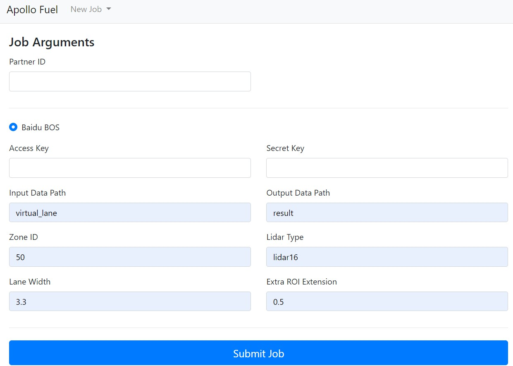
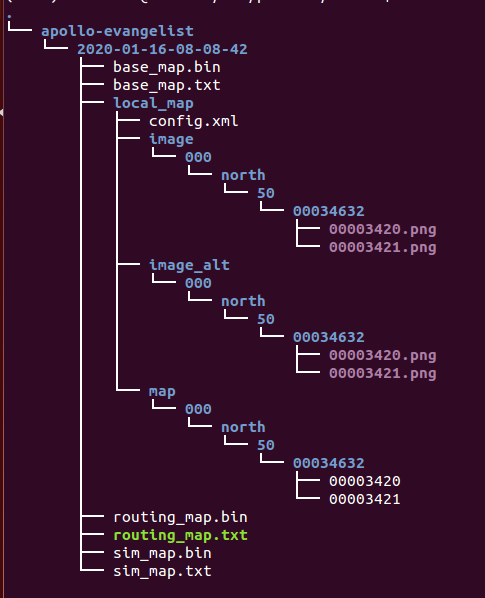

# 封闭园区自动驾驶-虚拟车道线的制作

## 前提条件

 - 完成了[激光雷达感知设备标定](Lidar_Based_Auto_Driving--Sensor_Calibration_cn.md)
 
## 主要步骤

- 虚拟车道线数据包录制

- 使用虚拟车道线云服务生成虚拟车道线地图

## 虚拟车道线数据包录制

将想要自动驾驶的区域提前按要求录制数据包，作为后面生成虚拟车道线的输入数据。

- 需要的channel信息如下所示：

|序号 | topic | 
|---|---|
|1|/apollo/localization/pose | 
|2|/apollo/sensor/gnss/odometry|
|3|/apollo/sensor/gnss/ins_stat|
|4|/apollo/sensor/lidar16/compensator/PointCloud2|

为获取上述`channel`，需要启动`GPS`、`Localization`、`Velodyne`三个模块，`GPS`、`Localization`模块的启动请参考定位模块配置文档，`Velodyne`模块的启动请参考感知传感器集成文档。由于GNSS设备的限制，`/apollo/sensor/gnss/odometry`、`/apollo/sensor/gnss/ins_stat`这两个`channel`不能由GNSS设备直接给出，需要借助`/apollo/modules/tools/sensor_calibration/`下的两个脚本工具。在`localization`模块正常启动且输出`/apollo/localization/pose`数据时，在不同终端分别执行`python modules/tools/sensor_calibration/ins_stat_publisher.py`、`python modules/tools/sensor_calibration/odom_publisher.py`两个命令，便可以分别产生`/apollo/sensor/gnss/ins_stat`、`/apollo/sensor/gnss/odometry`这两个`channel`。

**注意**：在执行`sensor_calibration/ins_stat_publisher.py`脚本前，请务必检查`/apollo/sensor/gnss/best_pose`中GPS信号质量，确保GPS信号质量为`NARROW_INT`时，才可以使用`ins_stat_publisher.py`脚本。在录制数据前，应首先确保`modules/localization/conf/localization.conf`文件中的`enable_lidar_localization`设置为`false`，待地图制作完成后如果需要msf定位，再修改为true。

## 使用虚拟车道线云服务生成虚拟车道线

### 1. 上传数据至BOS

在BOS bucket中新建目录virtual_lane，作为后续云标定服务读取数据的`Input Data Path`，把前面录制的数据包以及lidar_GNSS外参文件拷贝至该目录。目录结构如图所示：

### 2. 提交虚拟车道线生成任务

打开apollo虚拟车道线云服务页面，如下图所示：

在New Job下拉框中选择Virtual Lane Generation选项，填写Partner ID、Access Key、Secret Key、Input Data Path（在本例中为"virtual_lane"）、Output Data Path（地图生成路径此例中为"result"）、Zone ID（根据当地实际情况填写，本例中所在地方为北京应填50）、Lidar Type（是配置的/apollo/sensor/lidar16/compensator/PointCloud2这个channel的雷达类型，此例中是lidar16），最后点击Submit Job按钮提交。
**注意**：bos需要有写权限。

### 3. 获取虚拟车道线并添加到apollo中

任务完成后，将在注册的邮箱中收到一封邮件：

如果邮件内容为上图所示则表示虚拟车道线成功生成，查看bos上的Output Data Path（此例中为result），此path的目录结构如下图所示：

将上图中的2020-01-16-08-08-42整个文件夹拷贝到/apollo/modules/data/下，重命名为自己的地图名字（例如gongyuan），重启DreamView即可在地图下拉框中看到自己刚添加的地图。
